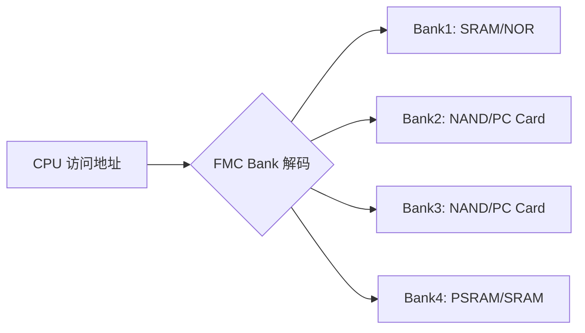

# 第十章 FMC介绍及应用

## 1. FMC 简介

FMC（Flexible Memory Controller，灵活存储控制器）是 STM32H750VBT6 中用于**扩展外部存储器**的高性能外设，支持 **SRAM、PSRAM、NOR Flash、NAND Flash** 以及 **LCD 显示控制器**（FSMC 兼容模式）。通过 FMC，STM32H7 可以连接大容量外部存储器，满足 **图形显示、数据缓存、固件存储** 等高带宽、大容量需求，是工业 HMI（人机界面）、数据采集系统、嵌入式 UI 的关键接口。

> 🔍 **核心定位**：
> 
> - **FMC ≠ 内部 Flash/SRAM**，而是**外部存储器的“桥梁”**
> - 类似 PC 的内存控制器，但专为嵌入式设计
> - 支持 **同步（SDRAM）** 和 **异步（SRAM/NOR）** 接口
> - 最高带宽可达 **~100 MB/s**（16-bit 数据总线，100 MHz 时钟）

---

### 1.1 FMC 核心特性（STM32H750VBT6）

| **特性**     | **参数**                                    | **说明**                   | **应用场景** |
| ---------- | ----------------------------------------- | ------------------------ | -------- |
| **支持类型**   | SRAM/PSRAM, NOR/OneNAND, NAND, SDRAM, LCD | 多种存储器协议兼容                | 灵活系统设计   |
| **地址宽度**   | 28-bit（256 MB 地址空间）                       | 可分 4 个 Bank              | 多设备挂载    |
| **数据宽度**   | 8-bit / 16-bit                            | 8-bit：节省引脚<br>16-bit：高带宽 | 根据外设选择   |
| **时钟源**    | FMCCLK（最高 200 MHz）                        | 由 HCLK3 分频得到             | 高速访问     |
| **同步模式**   | SDRAM 支持 CL=2/3，Burst Read/Write          | 类似 DDR SDRAM 控制器         | 大数据缓存    |
| **异步模式**   | 可配置读/写时序（ADDSET, DATAST 等）                | 支持慢速器件（如 70ns SRAM）      | 兼容旧设备    |
| **LCD 控制** | 8080/6800 并行接口                            | 直接驱动 RGB LCD             | HMI 显示   |
| **DMA 支持** | 可与 DMA2D（图形加速）协同                          | 实现零 CPU 开销的图像传输          | 图形界面     |

📌 **STM32H750VBT6 专属优势**：

- **双时钟域**：FMC 运行在 **HCLK3（最高 200 MHz）**，独立于 CPU 主频
- **Bank 架构**：4 个 Bank，支持同时挂载不同类型存储器
- **PSRAM 支持**：低功耗、高密度，替代 SDRAM 的理想选择
- **ECC 支持**（NAND/SDRAM）：错误校正码，提升数据可靠性

---

### 1.2 FMC 架构与工作原理

#### 1.2.1 FMC 存储器映射



- **地址映射表**：

| **Bank** | **基地址**      | **对应信号** | **典型外设**         |
| -------- | ------------ | -------- | ---------------- |
| Bank1    | `0x60000000` | `NE1`    | NOR Flash, SRAM  |
| Bank2    | `0x70000000` | `NE2`    | NAND Flash       |
| Bank3    | `0x80000000` | `NE3`    | NAND Flash       |
| Bank4    | `0x90000000` | `NE4`    | PSRAM, SRAM, LCD |

> ✅ **访问方式**：  
> 直接通过指针访问映射地址，无需驱动函数：
> 
> ```c
> uint16_t *lcd_reg = (uint16_t*)0x60000000;
> *lcd_reg = cmd; // 写 LCD 命令
> ```

#### 1.2.2 异步访问时序（SRAM/NOR）

- **关键时序参数**（通过 `FMC_BTRx` 配置）：
  
  - `ADDSET`：地址建立时间（1–15 HCLK 周期）
  - `DATAST`：数据保持时间（1–255 HCLK 周期）
  - `BUSTURN`：总线释放时间（仅复用总线）

- **时序计算示例**（16-bit SRAM，访问时间 70ns）：
  
  - `HCLK3 = 100 MHz` → `T=10ns`
  - 要求 `DATAST ≥ 7` → `DATAST=7` → `7×10ns = 70ns`

#### 1.2.3 同步模式（SDRAM）

- **初始化流程**：
  
  1. 配置时钟（`SDCLK = 100 MHz`）
  2. 发送 **NOP 命令**（等待电源稳定）
  3. 发送 **预充电（Precharge All）**
  4. 发送 **自动刷新（Auto Refresh）** ×2
  5. 配置 **模式寄存器（Mode Register Set）**
  6. 正常读写

- **关键参数**：
  
  - `TRCD`：行地址到列地址延迟（2–3 周期）
  - `TRP`：预充电延迟（2–3 周期）
  - `TWR`：写恢复时间（≥ 1 周期）
  - `CL`：CAS 延迟（2 或 3）

---

### 1.3 关键寄存器与配置流程

#### 1.3.1 FMC 主要寄存器组

| **寄存器**   | **功能**          | **配置对象** |
| --------- | --------------- | -------- |
| `BANK1_R` | SRAM/NOR 控制     | Bank1    |
| `SDRAM_R` | SDRAM 控制        | Bank1/2  |
| `PCR2/3`  | NAND/PC Card 控制 | Bank2/3  |
| `BWTRx`   | 写时序寄存器          | 异步写操作    |
| `SDTRx`   | SDRAM 时序        | SDRAM 访问 |
| `SDCMR`   | SDRAM 命令寄存器     | 发送控制命令   |

#### 1.3.2 配置步骤（Bank4 接 PSRAM）

```c
// 1. 使能 FMC 时钟
RCC->AHB3ENR |= RCC_AHB3ENR_FMCEN;

// 2. GPIO 配置（地址/数据/控制线）
// 以 16-bit 模式为例：A0-A18, D0-D15, NE4, NOE, NWE
// PA0, PA1, PA2... 配置为 AF12 (FMC)
// 示例：PA0 (A0)
GPIOA->MODER  |= GPIO_MODER_MODER0_1;  // AF
GPIOA->OTYPER &= ~GPIO_OTYPER_OT0;    // 推挽
GPIOA->OSPEEDR|= GPIO_OSPEEDER_OSPEED0; // 高速
GPIOA->AFR[0] |= 12 << 0;             // AF12 = FMC

// ... 配置所有 FMC 引脚（共 30+ 个）

// 3. 配置 FMC Bank4（PSRAM，16-bit，异步）
FMC_Bank1_R->BTCR[4] = 
       FMC_BTR1_ADDSET_2        // 地址建立时间 = 3 HCLK
     | FMC_BTR1_DATAST_5        // 数据保持 = 32 HCLK (320ns @ 100MHz)
     | FMC_BTR1_BUSTURN_2       // 总线释放 = 3 HCLK
     | FMC_BTR1_DATAHLD_1       // 数据保持时间 = 2 HCLK
     | FMC_BTR1_MBKEN           // 使能 Bank
     | FMC_BTR1_MWID_0          // 16-bit 数据宽度
     | FMC_BTR1_MTYP_0;         // 异步 SRAM/PSRAM

// 4. 配置写时序（可选，若与读不同）
FMC_Bank1_W->BWTR[4] = 
       FMC_BWTR1_ADDSET_2
     | FMC_BWTR1_DATAST_5
     | FMC_BWTR1_MBKEN
     | FMC_BWTR1_MWID_0
     | FMC_BWTR1_MTYP_0;

// 5. 访问 PSRAM（直接指针）
uint16_t *psram = (uint16_t*)0x90000000;
psram[0] = 0x1234;
```

#### 1.3.3 HAL 库配置（PSRAM）

```c
FMC_NORSRAM_TimingTypeDef Timing;
FMC_NORSRAM_InitTypeDef Init;

// 时序配置
Timing.AddressSetupTime = 3;
Timing.DataSetupTime = 32;
Timing.BusTurnAroundDuration = 3;
Timing.CLKDivision = 1;
Timing.DataLatency = 0;
Timing.AccessMode = FMC_ACCESS_MODE_A;

// 初始化 Bank4
Init.NSBank = FMC_NORSRAM_BANK4;
Init.DataAddressMux = FMC_DATA_ADDRESS_MUX_DISABLE;
Init.MemoryType = FMC_MEMORY_TYPE_PSRAM;
Init.MemoryDataWidth = FMC_NORSRAM_MEM_BUS_WIDTH_16;
Init.BurstAccessMode = FMC_BURST_ACCESS_MODE_DISABLE;
Init.WaitSignalPolarity = FMC_WAIT_SIGNAL_POLARITY_LOW;
Init.ExtendedMode = FMC_EXTENDED_MODE_DISABLE;
Init.AsynchronousWait = FMC_ASYNCHRONOUS_WAIT_DISABLE;
Init.WriteOperation = FMC_WRITE_OPERATION_ENABLE;
Init.WaitSignalActive = FMC_WAIT_TIMING_BEFORE_WS;
Init.WriteBurst = FMC_WRITE_BURST_DISABLE;
Init.ContinuousClock = FMC_CONTINUOUS_CLOCK_SYNC_ONLY;

HAL_SRAM_Init(&hsram, &Init, &Timing);
```

## 2. FMC使用示例-STM32IDE

### 2.1 STM32Cube配置


### 2.2 用户代码

```c
#ifndef __LCD_H
#define __LCD_H

#include "stdlib.h"
#include "main.h"

/******************************************************************************************/
/* LCD RST/WR/RD/BL/CS/RS 引脚 定义
 * LCD_D0~D15,由于引脚太多,就不在这里定义了,直接在lcd_init里面修改.所以在移植的时候,除了改
 * 这6个IO口, 还得改lcd_init里面的D0~D15所在的IO口.
 */

/* RESET 和系统复位脚共用 所以这里不用定义 RESET引脚 */
//#define LCD_RST_GPIO_PORT               GPIOX
//#define LCD_RST_GPIO_PIN                GPIO_PIN_X
//#define LCD_RST_GPIO_CLK_ENABLE()       do{ __HAL_RCC_GPIOx_CLK_ENABLE(); }while(0)   /* 所在IO口时钟使能 */

#define LCD_WR_GPIO_PORT                GPIOD
#define LCD_WR_GPIO_PIN                 GPIO_PIN_5
#define LCD_WR_GPIO_CLK_ENABLE()        do{ __HAL_RCC_GPIOD_CLK_ENABLE(); }while(0)   /* 所在IO口时钟使能 */

#define LCD_RD_GPIO_PORT                GPIOD
#define LCD_RD_GPIO_PIN                 GPIO_PIN_4
#define LCD_RD_GPIO_CLK_ENABLE()        do{ __HAL_RCC_GPIOD_CLK_ENABLE(); }while(0)   /* 所在IO口时钟使能 */

#define LCD_BL_GPIO_PORT                GPIOB
#define LCD_BL_GPIO_PIN                 GPIO_PIN_5
#define LCD_BL_GPIO_CLK_ENABLE()        do{ __HAL_RCC_GPIOB_CLK_ENABLE(); }while(0)   /* 所在IO口时钟使能 */

/* LCD_CS(需要根据LCD_FMC_NEX设置正确的IO口) 和 LCD_RS(需要根据LCD_FMC_AX设置正确的IO口) 引脚 定义 */
#define LCD_CS_GPIO_PORT                GPIOD
#define LCD_CS_GPIO_PIN                 GPIO_PIN_7
#define LCD_CS_GPIO_CLK_ENABLE()        do{ __HAL_RCC_GPIOD_CLK_ENABLE(); }while(0)   /* 所在IO口时钟使能 */

#define LCD_RS_GPIO_PORT                GPIOE
#define LCD_RS_GPIO_PIN                 GPIO_PIN_3
#define LCD_RS_GPIO_CLK_ENABLE()        do{ __HAL_RCC_GPIOE_CLK_ENABLE(); }while(0)   /* 所在IO口时钟使能 */

/* FMC相关参数 定义
 * 注意: 我们默认是通过FMC块1来连接LCD, 块1有4个片选: FMC_NE1~4
 *
 * 修改LCD_FMC_NEX, 对应的LCD_CS_GPIO相关设置也得改
 * 修改LCD_FMC_AX , 对应的LCD_RS_GPIO相关设置也得改
 */
#define LCD_FMC_NEX         1               /* 使用FMC_NE1接LCD_CS,取值范围只能是: 1~4 */
#define LCD_FMC_AX          19              /* 使用FMC_A19接LCD_RS,取值范围是: 0 ~ 25 */

/******************************************************************************************/

/* LCD重要参数集 */
typedef struct
{
    uint16_t width;     /* LCD 宽度 */
    uint16_t height;    /* LCD 高度 */
    uint16_t id;        /* LCD ID */
    uint8_t dir;        /* 横屏还是竖屏控制：0，竖屏；1，横屏。 */
    uint16_t wramcmd;   /* 开始写gram指令 */
    uint16_t setxcmd;   /* 设置x坐标指令 */
    uint16_t setycmd;   /* 设置y坐标指令 */
} _lcd_dev;

/* LCD参数 */
extern _lcd_dev lcddev; /* 管理LCD重要参数 */

/* LCD的画笔颜色和背景色 */
extern uint32_t  g_point_color;     /* 默认红色 */
extern uint32_t  g_back_color;      /* 背景颜色.默认为白色 */

/* LCD背光控制 */
#define LCD_BL(x)   do{ x ? \
                        HAL_GPIO_WritePin(LCD_BL_GPIO_PORT, LCD_BL_GPIO_PIN, GPIO_PIN_SET) : \
                        HAL_GPIO_WritePin(LCD_BL_GPIO_PORT, LCD_BL_GPIO_PIN, GPIO_PIN_RESET); \
                    }while(0)

/* LCD地址结构体 */
typedef struct
{
    volatile uint16_t LCD_REG;
    volatile uint16_t LCD_RAM;
} LCD_TypeDef;


/* LCD_BASE的详细解算方法:
 * 我们一般使用FMC的块1(BANK1)来驱动TFTLCD液晶屏(MCU屏), 块1地址范围总大小为256MB,均分成4块:
 * 存储块1(FMC_NE1)地址范围: 0X6000 0000 ~ 0X63FF FFFF
 * 存储块2(FMC_NE2)地址范围: 0X6400 0000 ~ 0X67FF FFFF
 * 存储块3(FMC_NE3)地址范围: 0X6800 0000 ~ 0X6BFF FFFF
 * 存储块4(FMC_NE4)地址范围: 0X6C00 0000 ~ 0X6FFF FFFF
 *
 * 我们需要根据硬件连接方式选择合适的片选(连接LCD_CS)和地址线(连接LCD_RS)
 * H750开发板使用FMC_NE1连接LCD_CS, FMC_A19连接LCD_RS ,16位数据线,计算方法如下:
 * 首先FMC_NE1的基地址为: 0X6000 0000;     NEx的基址为(x=1/2/3/4): 0X6000 0000 + (0X400 0000 * (x - 1))
 * FMC_A19对应地址值: 2^19 * 2 = 0X100000; FMC_Ay对应的地址为(y=0~25): 2^y * 2
 *
 * LCD->LCD_REG,对应LCD_RS = 0(LCD寄存器); LCD->LCD_RAM,对应LCD_RS = 1(LCD数据)
 * 则 LCD->LCD_RAM的地址为:  0X6000 0000 + 2^19 * 2 = 0X6010 0000
 *    LCD->LCD_REG的地址可以为 LCD->LCD_RAM之外的任意地址.
 * 由于我们使用结构体管理LCD_REG 和 LCD_RAM(REG在前,RAM在后,均为16位数据宽度)
 * 因此 结构体的基地址(LCD_BASE) = LCD_RAM - 2 = 0X6010 0000 -2
 *
 * 更加通用的计算公式为((片选脚FMC_NEx)x=1/2/3/4, (RS接地址线FMC_Ay)y=0~25):
 *          LCD_BASE = (0X6000 0000 + (0X400 0000 * (x - 1))) | (2^y * 2 -2)
 *          等效于(使用移位操作)
 *          LCD_BASE = (0X6000 0000 + (0X400 0000 * (x - 1))) | ((1 << y) * 2 -2)
 */
#define LCD_BASE        (uint32_t)((0X60000000 + (0X4000000 * (LCD_FMC_NEX - 1))) | (((1 << LCD_FMC_AX) * 2) -2))
#define LCD             ((LCD_TypeDef *) LCD_BASE)

/******************************************************************************************/
/* LCD扫描方向和颜色 定义 */

/* 扫描方向定义 */
#define L2R_U2D         0           /* 从左到右,从上到下 */
#define L2R_D2U         1           /* 从左到右,从下到上 */
#define R2L_U2D         2           /* 从右到左,从上到下 */
#define R2L_D2U         3           /* 从右到左,从下到上 */

#define U2D_L2R         4           /* 从上到下,从左到右 */
#define U2D_R2L         5           /* 从上到下,从右到左 */
#define D2U_L2R         6           /* 从下到上,从左到右 */
#define D2U_R2L         7           /* 从下到上,从右到左 */

#define DFT_SCAN_DIR    L2R_U2D     /* 默认的扫描方向 */

/* 常用画笔颜色 */
#define WHITE           0xFFFF      /* 白色 */
#define BLACK           0x0000      /* 黑色 */
#define RED             0xF800      /* 红色 */
#define GREEN           0x07E0      /* 绿色 */
#define BLUE            0x001F      /* 蓝色 */
#define MAGENTA         0XF81F      /* 品红色/紫红色 = BLUE + RED */
#define YELLOW          0XFFE0      /* 黄色 = GREEN + RED */
#define CYAN            0X07FF      /* 青色 = GREEN + BLUE */

/* 非常用颜色 */
#define BROWN           0XBC40      /* 棕色 */
#define BRRED           0XFC07      /* 棕红色 */
#define GRAY            0X8430      /* 灰色 */
#define DARKBLUE        0X01CF      /* 深蓝色 */
#define LIGHTBLUE       0X7D7C      /* 浅蓝色 */
#define GRAYBLUE        0X5458      /* 灰蓝色 */
#define LIGHTGREEN      0X841F      /* 浅绿色 */
#define LGRAY           0XC618      /* 浅灰色(PANNEL),窗体背景色 */
#define LGRAYBLUE       0XA651      /* 浅灰蓝色(中间层颜色) */
#define LBBLUE          0X2B12      /* 浅棕蓝色(选择条目的反色) */

/******************************************************************************************/
/* SSD1963相关配置参数(一般不用改) */

/* LCD分辨率设置 */
#define SSD_HOR_RESOLUTION      800     /* LCD水平分辨率 */
#define SSD_VER_RESOLUTION      480     /* LCD垂直分辨率 */

/* LCD驱动参数设置 */
#define SSD_HOR_PULSE_WIDTH     1       /* 水平脉宽 */
#define SSD_HOR_BACK_PORCH      46      /* 水平前廊 */
#define SSD_HOR_FRONT_PORCH     210     /* 水平后廊 */

#define SSD_VER_PULSE_WIDTH     1       /* 垂直脉宽 */
#define SSD_VER_BACK_PORCH      23      /* 垂直前廊 */
#define SSD_VER_FRONT_PORCH     22      /* 垂直前廊 */

/* 如下几个参数，自动计算 */
#define SSD_HT          (SSD_HOR_RESOLUTION + SSD_HOR_BACK_PORCH + SSD_HOR_FRONT_PORCH)
#define SSD_HPS         (SSD_HOR_BACK_PORCH)
#define SSD_VT          (SSD_VER_RESOLUTION + SSD_VER_BACK_PORCH + SSD_VER_FRONT_PORCH)
#define SSD_VPS         (SSD_VER_BACK_PORCH)

/******************************************************************************************/
/* 函数声明 */
void lcd_ex_st7789_reginit(void);
void lcd_ex_ili9341_reginit(void);
void lcd_ex_nt35310_reginit(void);
void lcd_ex_st7796_reginit(void);
void lcd_ex_nt35510_reginit(void);
void lcd_ex_ili9806_reginit(void);
void lcd_ex_ssd1963_reginit(void);

void lcd_wr_data(volatile uint16_t data);           /* LCD写数据 */
void lcd_wr_regno(volatile uint16_t regno);         /* LCD写寄存器编号/地址 */
void lcd_write_reg(uint16_t regno, uint16_t data);  /* LCD写寄存器的值 */


void lcd_init(void);        /* 初始化LCD */
void lcd_display_on(void);  /* 开显示 */
void lcd_display_off(void); /* 关显示 */
void lcd_scan_dir(uint8_t dir);         /* 设置屏扫描方向 */
void lcd_display_dir(uint8_t dir);      /* 设置屏幕显示方向 */
void lcd_ssd_backlight_set(uint8_t pwm);    /* SSD1963 背光控制 */

void lcd_write_ram_prepare(void);               /* 准备些GRAM */
void lcd_set_cursor(uint16_t x, uint16_t y);    /* 设置光标 */
uint32_t lcd_read_point(uint16_t x, uint16_t y);/* 读点  */
void lcd_draw_point(uint16_t x, uint16_t y, uint32_t color);/* 画点 */

void lcd_clear(uint16_t color);     /* LCD清屏 */
void lcd_fill_circle(uint16_t x, uint16_t y, uint16_t r, uint16_t color);                   /* 填充实心圆 */
void lcd_draw_circle(uint16_t x0, uint16_t y0, uint8_t r, uint16_t color);                  /* 画圆 */
void lcd_draw_hline(uint16_t x, uint16_t y, uint16_t len, uint16_t color);                  /* 画水平线 */
void lcd_set_window(uint16_t sx, uint16_t sy, uint16_t width, uint16_t height);             /* 设置窗口 */
void lcd_fill(uint16_t sx, uint16_t sy, uint16_t ex, uint16_t ey, uint32_t color);          /* 纯色填充矩形 */
void lcd_color_fill(uint16_t sx, uint16_t sy, uint16_t ex, uint16_t ey, uint16_t *color);   /* 彩色填充矩形 */
void lcd_draw_line(uint16_t x1, uint16_t y1, uint16_t x2, uint16_t y2, uint16_t color);     /* 画直线 */
void lcd_draw_rectangle(uint16_t x1, uint16_t y1, uint16_t x2, uint16_t y2, uint16_t color);/* 画矩形 */


void lcd_show_char(uint16_t x, uint16_t y, char chr, uint8_t size, uint8_t mode, uint16_t color);                       /* 显示一个字符 */
void lcd_show_num(uint16_t x, uint16_t y, uint32_t num, uint8_t len, uint8_t size, uint16_t color);                     /* 显示数字 */
void lcd_show_xnum(uint16_t x, uint16_t y, uint32_t num, uint8_t len, uint8_t size, uint8_t mode, uint16_t color);      /* 扩展显示数字 */
void lcd_show_string(uint16_t x, uint16_t y, uint16_t width, uint16_t height, uint8_t size, char *p, uint16_t color);   /* 显示字符串 */


#endif

```

```c
#include "stdlib.h"
#include "fmc.h"
#include "lcdfont.h"
#include "usart.h"
#include <stdio.h>

SRAM_HandleTypeDef g_sram_handle;    /* SRAM句柄(用于控制LCD) */

/* LCD的画笔颜色和背景色 */
uint32_t g_point_color = 0XF800;    /* 画笔颜色 */
uint32_t g_back_color  = 0XFFFF;    /* 背景色 */

/* 管理LCD重要参数 */
_lcd_dev lcddev;


/**
 * @brief       LCD写数据
 * @param       data: 要写入的数据
 * @retval      无
 */
void lcd_wr_data(volatile uint16_t data)
{
    data = data;            /* 使用-O2优化的时候,必须插入的延时 */
    LCD->LCD_RAM = data;
}

/**
 * @brief       LCD写寄存器编号/地址函数
 * @param       regno: 寄存器编号/地址
 * @retval      无
 */
void lcd_wr_regno(volatile uint16_t regno)
{
    regno = regno;          /* 使用-O2优化的时候,必须插入的延时 */
    LCD->LCD_REG = regno;   /* 写入要写的寄存器序号 */
}

/**
 * @brief       LCD写寄存器
 * @param       regno:寄存器编号/地址
 * @param       data:要写入的数据
 * @retval      无
 */
void lcd_write_reg(uint16_t regno, uint16_t data)
{
    LCD->LCD_REG = regno;   /* 写入要写的寄存器序号 */
    LCD->LCD_RAM = data;    /* 写入数据 */
}

/**
 * @brief       LCD延时函数,仅用于部分在mdk -O1时间优化时需要设置的地方
 * @param       t:延时的数值
 * @retval      无
 */
static void lcd_opt_delay(uint32_t i)
{
    while (i--);
}

/**
 * @brief       LCD读数据
 * @param       无
 * @retval      读取到的数据
 */
static uint16_t lcd_rd_data(void)
{
    volatile uint16_t ram;  /* 防止被优化 */
    lcd_opt_delay(2);
    ram = LCD->LCD_RAM;
    return ram;
}

/**
 * @brief       准备写GRAM
 * @param       无
 * @retval      无
 */
void lcd_write_ram_prepare(void)
{
    LCD->LCD_REG = lcddev.wramcmd;
}

/**
 * @brief       读取个某点的颜色值
 * @param       x,y:坐标
 * @retval      此点的颜色(32位颜色,方便兼容LTDC)
 */
uint32_t lcd_read_point(uint16_t x, uint16_t y)
{
    uint16_t r = 0, g = 0, b = 0;

    if (x >= lcddev.width || y >= lcddev.height)return 0;   /* 超过了范围,直接返回 */

    lcd_set_cursor(x, y);       /* 设置坐标 */

    if (lcddev.id == 0X5510)
    {
        lcd_wr_regno(0X2E00);   /* 5510 发送读GRAM指令 */
    }
    else
    {
        lcd_wr_regno(0X2E);     /* 9341/5310/1963/7789/7796/9806 等发送读GRAM指令 */
    }

    r = lcd_rd_data();          /* 假读(dummy read) */

    if (lcddev.id == 0x1963)
    {
        return r;               /* 1963直接读就可以 */
    }

    r = lcd_rd_data();          /* 实际坐标颜色 */

    if (lcddev.id == 0x7796)    /* 7796 一次读取一个像素值 */
    {
        return r;
    }

    /* ILI9341/NT35310/NT35510/ST7789/ILI9806 要分2次读出 */
    b = lcd_rd_data();
    g = r & 0XFF;       /* 对于 9341/5310/5510/7789/9806, 第一次读取的是RG的值,R在前,G在后,各占8位 */
    g <<= 8;
    return (((r >> 11) << 11) | ((g >> 10) << 5) | (b >> 11));  /* 9341/5310/5510/7789/9806 需要公式转换一下 */
}

/**
 * @brief       LCD开启显示
 * @param       无
 * @retval      无
 */
void lcd_display_on(void)
{
    if (lcddev.id == 0X5510)
    {
        lcd_wr_regno(0X2900);   /* 开启显示 */
    }
    else    /* 9341/5310/1963/7789/7796/9806 等发送开启显示指令 */
    {
        lcd_wr_regno(0X29);     /* 开启显示 */
    }
}

/**
 * @brief       LCD关闭显示
 * @param       无
 * @retval      无
 */
void lcd_display_off(void)
{
    if (lcddev.id == 0X5510)
    {
        lcd_wr_regno(0X2800);   /* 关闭显示 */
    }
    else    /* 9341/5310/1963/7789/7796/9806 等发送关闭显示指令 */
    {
        lcd_wr_regno(0X28);     /* 关闭显示 */
    }
}

/**
 * @brief       设置光标位置(对RGB屏无效)
 * @param       x,y: 坐标
 * @retval      无
 */
void lcd_set_cursor(uint16_t x, uint16_t y)
{
    if (lcddev.id == 0X1963)
    {
        if (lcddev.dir == 0)    /* 竖屏模式, x坐标需要变换 */
        {
            x = lcddev.width - 1 - x;
            lcd_wr_regno(lcddev.setxcmd);
            lcd_wr_data(0);
            lcd_wr_data(0);
            lcd_wr_data(x >> 8);
            lcd_wr_data(x & 0XFF);
        }
        else                    /* 横屏模式 */
        {
            lcd_wr_regno(lcddev.setxcmd);
            lcd_wr_data(x >> 8);
            lcd_wr_data(x & 0XFF);
            lcd_wr_data((lcddev.width - 1) >> 8);
            lcd_wr_data((lcddev.width - 1) & 0XFF);
        }

        lcd_wr_regno(lcddev.setycmd);
        lcd_wr_data(y >> 8);
        lcd_wr_data(y & 0XFF);
        lcd_wr_data((lcddev.height - 1) >> 8);
        lcd_wr_data((lcddev.height - 1) & 0XFF);

    }
    else if (lcddev.id == 0X5510)
    {
        lcd_wr_regno(lcddev.setxcmd);
        lcd_wr_data(x >> 8);
        lcd_wr_regno(lcddev.setxcmd + 1);
        lcd_wr_data(x & 0XFF);
        lcd_wr_regno(lcddev.setycmd);
        lcd_wr_data(y >> 8);
        lcd_wr_regno(lcddev.setycmd + 1);
        lcd_wr_data(y & 0XFF);
    }
    else    /* 9341/5310/7789/7796/9806 等 设置坐标 */
    {
        lcd_wr_regno(lcddev.setxcmd);
        lcd_wr_data(x >> 8);
        lcd_wr_data(x & 0XFF);
        lcd_wr_regno(lcddev.setycmd);
        lcd_wr_data(y >> 8);
        lcd_wr_data(y & 0XFF);
    }
}

/**
 * @brief       设置LCD的自动扫描方向(对RGB屏无效)
 *   @note
 *              9341/5310/5510/1963/7789/7796/9806等IC已经实际测试
 *              注意:其他函数可能会受到此函数设置的影响(尤其是9341),
 *              所以,一般设置为L2R_U2D即可,如果设置为其他扫描方式,可能导致显示不正常.
 *
 * @param       dir:0~7,代表8个方向(具体定义见lcd.h)
 * @retval      无
 */
void lcd_scan_dir(uint8_t dir)
{
    uint16_t regval = 0;
    uint16_t dirreg = 0;
    uint16_t temp;

    /* 横屏时，对1963不改变扫描方向, 其他IC改变扫描方向！竖屏时1963改变方向, 其他IC不改变扫描方向 */
    if ((lcddev.dir == 1 && lcddev.id != 0X1963) || (lcddev.dir == 0 && lcddev.id == 0X1963))
    {
        switch (dir)   /* 方向转换 */
        {
            case 0:
                dir = 6;
                break;

            case 1:
                dir = 7;
                break;

            case 2:
                dir = 4;
                break;

            case 3:
                dir = 5;
                break;

            case 4:
                dir = 1;
                break;

            case 5:
                dir = 0;
                break;

            case 6:
                dir = 3;
                break;

            case 7:
                dir = 2;
                break;
        }
    }

    /* 根据扫描方式 设置 0X36/0X3600 寄存器 bit 5,6,7 位的值 */
    switch (dir)
    {
        case L2R_U2D:/* 从左到右,从上到下 */
            regval |= (0 << 7) | (0 << 6) | (0 << 5);
            break;

        case L2R_D2U:/* 从左到右,从下到上 */
            regval |= (1 << 7) | (0 << 6) | (0 << 5);
            break;

        case R2L_U2D:/* 从右到左,从上到下 */
            regval |= (0 << 7) | (1 << 6) | (0 << 5);
            break;

        case R2L_D2U:/* 从右到左,从下到上 */
            regval |= (1 << 7) | (1 << 6) | (0 << 5);
            break;

        case U2D_L2R:/* 从上到下,从左到右 */
            regval |= (0 << 7) | (0 << 6) | (1 << 5);
            break;

        case U2D_R2L:/* 从上到下,从右到左 */
            regval |= (0 << 7) | (1 << 6) | (1 << 5);
            break;

        case D2U_L2R:/* 从下到上,从左到右 */
            regval |= (1 << 7) | (0 << 6) | (1 << 5);
            break;

        case D2U_R2L:/* 从下到上,从右到左 */
            regval |= (1 << 7) | (1 << 6) | (1 << 5);
            break;
    }

    dirreg = 0X36;  /* 对绝大部分驱动IC, 由0X36寄存器控制 */

    if (lcddev.id == 0X5510)
    {
        dirreg = 0X3600;    /* 对于5510, 和其他驱动ic的寄存器有差异 */
    }

    /* 9341 & 7789 & 7796 要设置BGR位 */
    if (lcddev.id == 0X9341 || lcddev.id == 0X7789 || lcddev.id == 0x7796)
    {
        regval |= 0X08;
    }

    lcd_write_reg(dirreg, regval);

    if (lcddev.id != 0X1963)   /* 1963不做坐标处理 */
    {
        if (regval & 0X20)
        {
            if (lcddev.width < lcddev.height)   /* 交换X,Y */
            {
                temp = lcddev.width;
                lcddev.width = lcddev.height;
                lcddev.height = temp;
            }
        }
        else
        {
            if (lcddev.width > lcddev.height)   /* 交换X,Y */
            {
                temp = lcddev.width;
                lcddev.width = lcddev.height;
                lcddev.height = temp;
            }
        }
    }

    /* 设置显示区域(开窗)大小 */
    if (lcddev.id == 0X5510)
    {
        lcd_wr_regno(lcddev.setxcmd);
        lcd_wr_data(0);
        lcd_wr_regno(lcddev.setxcmd + 1);
        lcd_wr_data(0);
        lcd_wr_regno(lcddev.setxcmd + 2);
        lcd_wr_data((lcddev.width - 1) >> 8);
        lcd_wr_regno(lcddev.setxcmd + 3);
        lcd_wr_data((lcddev.width - 1) & 0XFF);
        lcd_wr_regno(lcddev.setycmd);
        lcd_wr_data(0);
        lcd_wr_regno(lcddev.setycmd + 1);
        lcd_wr_data(0);
        lcd_wr_regno(lcddev.setycmd + 2);
        lcd_wr_data((lcddev.height - 1) >> 8);
        lcd_wr_regno(lcddev.setycmd + 3);
        lcd_wr_data((lcddev.height - 1) & 0XFF);
    }
    else
    {
        lcd_wr_regno(lcddev.setxcmd);
        lcd_wr_data(0);
        lcd_wr_data(0);
        lcd_wr_data((lcddev.width - 1) >> 8);
        lcd_wr_data((lcddev.width - 1) & 0XFF);
        lcd_wr_regno(lcddev.setycmd);
        lcd_wr_data(0);
        lcd_wr_data(0);
        lcd_wr_data((lcddev.height - 1) >> 8);
        lcd_wr_data((lcddev.height - 1) & 0XFF);
    }
}

/**
 * @brief       画点
 * @param       x,y: 坐标
 * @param       color: 点的颜色(32位颜色,方便兼容LTDC)
 * @retval      无
 */
void lcd_draw_point(uint16_t x, uint16_t y, uint32_t color)
{
    lcd_set_cursor(x, y);       /* 设置光标位置 */
    lcd_write_ram_prepare();    /* 开始写入GRAM */
    LCD->LCD_RAM = color;
}

/**
 * @brief       SSD1963背光亮度设置函数
 * @param       pwm: 背光等级,0~100.越大越亮.
 * @retval      无
 */
void lcd_ssd_backlight_set(uint8_t pwm)
{
    lcd_wr_regno(0xBE);         /* 配置PWM输出 */
    lcd_wr_data(0x05);          /* 1设置PWM频率 */
    lcd_wr_data(pwm * 2.55);    /* 2设置PWM占空比 */
    lcd_wr_data(0x01);          /* 3设置C */
    lcd_wr_data(0xFF);          /* 4设置D */
    lcd_wr_data(0x00);          /* 5设置E */
    lcd_wr_data(0x00);          /* 6设置F */
}

/**
 * @brief       设置LCD显示方向
 * @param       dir:0,竖屏; 1,横屏
 * @retval      无
 */
void lcd_display_dir(uint8_t dir)
{
    lcddev.dir = dir;   /* 竖屏/横屏 */

    if (dir == 0)       /* 竖屏 */
    {
        lcddev.width = 240;
        lcddev.height = 320;

        if (lcddev.id == 0x5510)
        {
            lcddev.wramcmd = 0X2C00;
            lcddev.setxcmd = 0X2A00;
            lcddev.setycmd = 0X2B00;
            lcddev.width = 480;
            lcddev.height = 800;
        }
        else if (lcddev.id == 0X1963)
        {
            lcddev.wramcmd = 0X2C;  /* 设置写入GRAM的指令 */
            lcddev.setxcmd = 0X2B;  /* 设置写X坐标指令 */
            lcddev.setycmd = 0X2A;  /* 设置写Y坐标指令 */
            lcddev.width = 480;     /* 设置宽度480 */
            lcddev.height = 800;    /* 设置高度800 */
        }
        else   /* 其他IC, 包括: 9341 / 5310 / 7789 / 7796 / 9806 等IC */
        {
            lcddev.wramcmd = 0X2C;
            lcddev.setxcmd = 0X2A;
            lcddev.setycmd = 0X2B;
        }

        if (lcddev.id == 0X5310 || lcddev.id == 0x7796)     /* 如果是5310/7796 则表示是 320*480分辨率 */
        {
            lcddev.width = 320;
            lcddev.height = 480;
        }

        if (lcddev.id == 0X9806)    /* 如果是9806 则表示是 480*800 分辨率 */
        {
            lcddev.width = 480;
            lcddev.height = 800;
        }
    }
    else                /* 横屏 */
    {
        lcddev.width = 320;         /* 默认宽度 */
        lcddev.height = 240;        /* 默认高度 */

        if (lcddev.id == 0x5510)
        {
            lcddev.wramcmd = 0X2C00;
            lcddev.setxcmd = 0X2A00;
            lcddev.setycmd = 0X2B00;
            lcddev.width = 800;
            lcddev.height = 480;
        }
        else if (lcddev.id == 0X1963 || lcddev.id == 0x9806)
        {
            lcddev.wramcmd = 0X2C;  /* 设置写入GRAM的指令 */
            lcddev.setxcmd = 0X2A;  /* 设置写X坐标指令 */
            lcddev.setycmd = 0X2B;  /* 设置写Y坐标指令 */
            lcddev.width = 800;     /* 设置宽度800 */
            lcddev.height = 480;    /* 设置高度480 */
        }
        else   /* 其他IC, 包括: 9341 / 5310 / 7789 / 7796 等IC */
        {
            lcddev.wramcmd = 0X2C;
            lcddev.setxcmd = 0X2A;
            lcddev.setycmd = 0X2B;
        }

        if (lcddev.id == 0X5310 || lcddev.id == 0x7796)     /* 如果是5310/7796 则表示是 320*480分辨率 */
        {
            lcddev.width = 480;
            lcddev.height = 320;
        }
    }

    lcd_scan_dir(DFT_SCAN_DIR);     /* 默认扫描方向 */
}

/**
 * @brief       设置窗口(对RGB屏无效),并自动设置画点坐标到窗口左上角(sx,sy).
 * @param       sx,sy:窗口起始坐标(左上角)
 * @param       width,height:窗口宽度和高度,必须大于0!!
 *   @note      窗体大小:width*height.
 *
 * @retval      无
 */
void lcd_set_window(uint16_t sx, uint16_t sy, uint16_t width, uint16_t height)
{
    uint16_t twidth, theight;
    twidth = sx + width - 1;
    theight = sy + height - 1;

    if (lcddev.id == 0X1963 && lcddev.dir != 1)    /* 1963竖屏特殊处理 */
    {
        sx = lcddev.width - width - sx;
        height = sy + height - 1;
        lcd_wr_regno(lcddev.setxcmd);
        lcd_wr_data(sx >> 8);
        lcd_wr_data(sx & 0XFF);
        lcd_wr_data((sx + width - 1) >> 8);
        lcd_wr_data((sx + width - 1) & 0XFF);
        lcd_wr_regno(lcddev.setycmd);
        lcd_wr_data(sy >> 8);
        lcd_wr_data(sy & 0XFF);
        lcd_wr_data(height >> 8);
        lcd_wr_data(height & 0XFF);
    }
    else if (lcddev.id == 0X5510)
    {
        lcd_wr_regno(lcddev.setxcmd);
        lcd_wr_data(sx >> 8);
        lcd_wr_regno(lcddev.setxcmd + 1);
        lcd_wr_data(sx & 0XFF);
        lcd_wr_regno(lcddev.setxcmd + 2);
        lcd_wr_data(twidth >> 8);
        lcd_wr_regno(lcddev.setxcmd + 3);
        lcd_wr_data(twidth & 0XFF);
        lcd_wr_regno(lcddev.setycmd);
        lcd_wr_data(sy >> 8);
        lcd_wr_regno(lcddev.setycmd + 1);
        lcd_wr_data(sy & 0XFF);
        lcd_wr_regno(lcddev.setycmd + 2);
        lcd_wr_data(theight >> 8);
        lcd_wr_regno(lcddev.setycmd + 3);
        lcd_wr_data(theight & 0XFF);
    }
    else    /* 9341/5310/7789/1963/7796/9806横屏 等 设置窗口 */
    {
        lcd_wr_regno(lcddev.setxcmd);
        lcd_wr_data(sx >> 8);
        lcd_wr_data(sx & 0XFF);
        lcd_wr_data(twidth >> 8);
        lcd_wr_data(twidth & 0XFF);
        lcd_wr_regno(lcddev.setycmd);
        lcd_wr_data(sy >> 8);
        lcd_wr_data(sy & 0XFF);
        lcd_wr_data(theight >> 8);
        lcd_wr_data(theight & 0XFF);
    }
}

/**
 * @brief       SRAM底层驱动，时钟使能，引脚分配
 * @note        此函数会被HAL_SRAM_Init()调用
 * @param       hsram:SRAM句柄
 * @retval      无
 */
void HAL_SRAM_MspInit(SRAM_HandleTypeDef *hsram)
{
    GPIO_InitTypeDef gpio_init_struct;

    __HAL_RCC_FMC_CLK_ENABLE();         /* 使能FMC时钟 */
    __HAL_RCC_GPIOD_CLK_ENABLE();       /* 使能GPIOD时钟 */
    __HAL_RCC_GPIOE_CLK_ENABLE();       /* 使能GPIOE时钟 */

    /* 初始化PD0,1,8,9,10,14,15 */
    gpio_init_struct.Pin = GPIO_PIN_0 | GPIO_PIN_1 | GPIO_PIN_8 \
                           | GPIO_PIN_9 | GPIO_PIN_10 | GPIO_PIN_14 | GPIO_PIN_15;
    gpio_init_struct.Mode = GPIO_MODE_AF_PP;                  /* 推挽复用 */
    gpio_init_struct.Pull = GPIO_PULLUP;                      /* 上拉 */
    gpio_init_struct.Speed = GPIO_SPEED_FREQ_VERY_HIGH;       /* 高速 */
    gpio_init_struct.Alternate = GPIO_AF12_FMC;               /* 复用为FMC */
    HAL_GPIO_Init(GPIOD, &gpio_init_struct);                  /* 初始化 */

    /* 初始化PE7,8,9,10,11,12,13,14,15 */
    gpio_init_struct.Pin = GPIO_PIN_7 | GPIO_PIN_8 | GPIO_PIN_9 | GPIO_PIN_10 \
                           | GPIO_PIN_11 | GPIO_PIN_12 | GPIO_PIN_13 | GPIO_PIN_14 | GPIO_PIN_15;
    HAL_GPIO_Init(GPIOE, &gpio_init_struct);
}

/**
 * @brief       初始化LCD
 *   @note      该初始化函数可以初始化各种型号的LCD(详见本.c文件最前面的描述)
 *
 * @param       无
 * @retval      无
 */
void lcd_init(void)
{
    GPIO_InitTypeDef gpio_init_struct;
    FMC_NORSRAM_TimingTypeDef fmc_read_handle;
    FMC_NORSRAM_TimingTypeDef fmc_write_handle;

    LCD_CS_GPIO_CLK_ENABLE();   /* LCD_CS脚时钟使能 */
    LCD_WR_GPIO_CLK_ENABLE();   /* LCD_WR脚时钟使能 */
    LCD_RD_GPIO_CLK_ENABLE();   /* LCD_RD脚时钟使能 */
    LCD_RS_GPIO_CLK_ENABLE();   /* LCD_RS脚时钟使能 */
    LCD_BL_GPIO_CLK_ENABLE();   /* LCD_BL脚时钟使能 */

    gpio_init_struct.Pin = LCD_CS_GPIO_PIN;
    gpio_init_struct.Mode = GPIO_MODE_AF_PP;                /* 推挽复用 */
    gpio_init_struct.Pull = GPIO_PULLUP;                    /* 上拉 */
    gpio_init_struct.Speed = GPIO_SPEED_FREQ_VERY_HIGH;     /* 高速 */
    gpio_init_struct.Alternate = GPIO_AF12_FMC;             /* 复用为FMC */
    HAL_GPIO_Init(LCD_CS_GPIO_PORT, &gpio_init_struct);     /* 初始化LCD_CS引脚 */

    gpio_init_struct.Pin = LCD_WR_GPIO_PIN;
    HAL_GPIO_Init(LCD_WR_GPIO_PORT, &gpio_init_struct);     /* 初始化LCD_WR引脚 */

    gpio_init_struct.Pin = LCD_RD_GPIO_PIN;
    HAL_GPIO_Init(LCD_RD_GPIO_PORT, &gpio_init_struct);     /* 初始化LCD_RD引脚 */

    gpio_init_struct.Pin = LCD_RS_GPIO_PIN;
    HAL_GPIO_Init(LCD_RS_GPIO_PORT, &gpio_init_struct);     /* 初始化LCD_RS引脚 */

    gpio_init_struct.Pin = LCD_BL_GPIO_PIN;
    gpio_init_struct.Mode = GPIO_MODE_OUTPUT_PP;            /* 推挽输出 */
    HAL_GPIO_Init(LCD_BL_GPIO_PORT, &gpio_init_struct);     /* LCD_BL引脚模式设置(推挽输出) */

    g_sram_handle.Instance = FMC_NORSRAM_DEVICE;
    g_sram_handle.Extended = FMC_NORSRAM_EXTENDED_DEVICE;

    g_sram_handle.Init.NSBank = FMC_NORSRAM_BANK1;                        /* 使用NE1 */
    g_sram_handle.Init.DataAddressMux = FMC_DATA_ADDRESS_MUX_DISABLE;     /* 不复用数据线 */
    g_sram_handle.Init.MemoryType = FMC_MEMORY_TYPE_SRAM;                 /* SRAM */
    g_sram_handle.Init.MemoryDataWidth = FMC_NORSRAM_MEM_BUS_WIDTH_16;    /* 16位数据宽度 */
    g_sram_handle.Init.BurstAccessMode = FMC_BURST_ACCESS_MODE_DISABLE;   /* 是否使能突发访问,仅对同步突发存储器有效,此处未用到 */
    g_sram_handle.Init.WaitSignalPolarity = FMC_WAIT_SIGNAL_POLARITY_LOW; /* 等待信号的极性,仅在突发模式访问下有用 */
    g_sram_handle.Init.WaitSignalActive = FMC_WAIT_TIMING_BEFORE_WS;      /* 存储器是在等待周期之前的一个时钟周期还是等待周期期间使能NWAIT */
    g_sram_handle.Init.WriteOperation = FMC_WRITE_OPERATION_ENABLE;       /* 存储器写使能 */
    g_sram_handle.Init.WaitSignal = FMC_WAIT_SIGNAL_DISABLE;              /* 等待使能位,此处未用到 */
    g_sram_handle.Init.ExtendedMode = FMC_EXTENDED_MODE_ENABLE;           /* 读写使用不同的时序 */
    g_sram_handle.Init.AsynchronousWait = FMC_ASYNCHRONOUS_WAIT_DISABLE;  /* 是否使能同步传输模式下的等待信号,此处未用到 */
    g_sram_handle.Init.WriteBurst = FMC_WRITE_BURST_DISABLE;              /* 禁止突发写 */
    g_sram_handle.Init.ContinuousClock = FMC_CONTINUOUS_CLOCK_SYNC_ASYNC;

    /* FMC读时序控制寄存器 */
    fmc_read_handle.AddressSetupTime = 0x0F;            /* 地址建立时间(ADDSET)为15个fmc_ker_ck 1/220M=4.5ns*15=67.5ns */
    fmc_read_handle.AddressHoldTime = 0x00;
    fmc_read_handle.DataSetupTime = 0x4E;               /* 数据保存时间(DATAST)为78个fmc_ker_ck=4.5*78=351ns */
                                                        /* 因为液晶驱动IC的读数据的时候，速度不能太快,尤其是个别奇葩芯片 */
    fmc_read_handle.AccessMode = FMC_ACCESS_MODE_A;     /* 模式A */
    /* FMC写时序控制寄存器 */
    fmc_write_handle.AddressSetupTime = 0x0F;           /* 地址建立时间(ADDSET)为15个fmc_ker_ck=67.5ns */
    fmc_write_handle.AddressHoldTime = 0x00;
    fmc_write_handle.DataSetupTime = 0x0F;              /* 数据保存时间(DATAST)为15个fmc_ker_ck=67.5ns */
                                                        /* 15个fmc_ker_ck（fmc_ker_ck=220Mhz）,某些液晶驱动IC的写信号脉宽，最少也得50ns。 */
    fmc_write_handle.AccessMode = FMC_ACCESS_MODE_A;    /* 模式A */

    HAL_SRAM_Init(&g_sram_handle, &fmc_read_handle, &fmc_write_handle);
    delay_ms(50);        /* 初始化FMC后,必须等待一定时间才能开始初始化 */

    /* 尝试9341 ID的读取 */
    lcd_wr_regno(0XD3);
    lcddev.id = lcd_rd_data();  /* dummy read */
    lcddev.id = lcd_rd_data();  /* 读到0X00 */
    lcddev.id = lcd_rd_data();  /* 读取0X93 */
    lcddev.id <<= 8;
    lcddev.id |= lcd_rd_data(); /* 读取0X41 */

    if (lcddev.id != 0X9341)    /* 不是 9341 , 尝试看看是不是 ST7789 */
    {
        lcd_wr_regno(0X04);
        lcddev.id = lcd_rd_data();      /* dummy read */
        lcddev.id = lcd_rd_data();      /* 读到0X85 */
        lcddev.id = lcd_rd_data();      /* 读取0X85 */
        lcddev.id <<= 8;
        lcddev.id |= lcd_rd_data();     /* 读取0X52 */

        if (lcddev.id == 0X8552)        /* 将8552的ID转换成7789 */
        {
            lcddev.id = 0x7789;
        }

        if (lcddev.id != 0x7789)        /* 也不是ST7789, 尝试是不是 NT35310 */
        {
            lcd_wr_regno(0xD4);
            lcddev.id = lcd_rd_data();  /* dummy read */
            lcddev.id = lcd_rd_data();  /* 读回0x01 */
            lcddev.id = lcd_rd_data();  /* 读回0x53 */
            lcddev.id <<= 8;
            lcddev.id |= lcd_rd_data(); /* 这里读回0x10 */

            if (lcddev.id != 0x5310)    /* 也不是NT35310,尝试看看是不是ST7796 */
            {
                lcd_wr_regno(0XD3);
                lcddev.id = lcd_rd_data();  /* dummy read */
                lcddev.id = lcd_rd_data();  /* 读到0X00 */
                lcddev.id = lcd_rd_data();  /* 读取0X77 */
                lcddev.id <<= 8;
                lcddev.id |= lcd_rd_data(); /* 读取0X96 */

                if (lcddev.id != 0x7796)    /* 也不是ST7796,尝试看看是不是NT35510 */
                {
                    /* 发送密钥（厂家提供） */
                    lcd_write_reg(0xF000, 0x0055);
                    lcd_write_reg(0xF001, 0x00AA);
                    lcd_write_reg(0xF002, 0x0052);
                    lcd_write_reg(0xF003, 0x0008);
                    lcd_write_reg(0xF004, 0x0001);

                    lcd_wr_regno(0xC500);       /* 读取ID低八位 */
                    lcddev.id = lcd_rd_data();  /* 读回0x55 */
                    lcddev.id <<= 8;

                    lcd_wr_regno(0xC501);       /* 读取ID高八位 */
                    lcddev.id |= lcd_rd_data(); /* 读回0x10 */

                    delay_ms(5);                /* 等待5ms, 因为0XC501指令对1963来说就是软件复位指令, 等待5ms让1963复位完成再操作 */

                    if (lcddev.id != 0x5510)    /* 也不是NT5510,尝试看看是不是ILI9806 */
                    {
                        lcd_wr_regno(0XD3);
                        lcddev.id = lcd_rd_data();  /* dummy read */
                        lcddev.id = lcd_rd_data();  /* 读回0X00 */
                        lcddev.id = lcd_rd_data();  /* 读回0X98 */
                        lcddev.id <<= 8;
                        lcddev.id |= lcd_rd_data(); /* 读回0X06 */

                        if (lcddev.id != 0x9806)    /* 也不是ILI9806,尝试看看是不是SSD1963 */
                        {
                            lcd_wr_regno(0xA1);
                            lcddev.id = lcd_rd_data();
                            lcddev.id = lcd_rd_data();  /* 读回0x57 */
                            lcddev.id <<= 8;
                            lcddev.id |= lcd_rd_data(); /* 读回0x61 */

                            if (lcddev.id == 0x5761) lcddev.id = 0x1963; /* SSD1963读回的ID是5761H,为方便区分,我们强制设置为1963 */
                        }
                    }
                }
            }
        }
    }

    /* 特别注意, 如果在main函数里面屏蔽串口1初始化, 则会卡死在printf
     * 里面(卡死在f_putc函数), 所以, 必须初始化串口1, 或者屏蔽掉下面
     * 这行 printf 语句 !!!!!!!
     */
    printf("LCD ID:%x\r\n", lcddev.id); /* 打印LCD ID */

    if (lcddev.id == 0X7789)
    {
        lcd_ex_st7789_reginit();    /* 执行ST7789初始化 */
    }
    else if (lcddev.id == 0X9341)
    {
        lcd_ex_ili9341_reginit();   /* 执行ILI9341初始化 */
    }
    else if (lcddev.id == 0x5310)
    {
        lcd_ex_nt35310_reginit();   /* 执行NT35310初始化 */
    }
    else if (lcddev.id == 0x7796)
    {
        lcd_ex_st7796_reginit();    /* 执行ST7796初始化 */
    }
    else if (lcddev.id == 0x5510)
    {
        lcd_ex_nt35510_reginit();   /* 执行NT35510初始化 */
    }
    else if (lcddev.id == 0x9806)
    {
        lcd_ex_ili9806_reginit();   /* 执行ILI9806初始化 */
    }
    else if (lcddev.id == 0x1963)
    {
        lcd_ex_ssd1963_reginit();   /* 执行SSD1963初始化 */
        lcd_ssd_backlight_set(100); /* 背光设置为最亮 */
    }

    /* 由于不同屏幕的写时序不同，这里的时序可以根据自己的屏幕进行修改
      （若插上长排线对时序也会有影响，需要自己根据情况修改） */
    /* 初始化完成以后,提速 */
    if (lcddev.id == 0X7789)
    {
        /* 重新配置写时序控制寄存器的时序 */
        fmc_write_handle.AddressSetupTime = 5;
        fmc_write_handle.DataSetupTime = 5;
        FMC_NORSRAM_Extended_Timing_Init(g_sram_handle.Extended, &fmc_write_handle, g_sram_handle.Init.NSBank, g_sram_handle.Init.ExtendedMode);
    }
    else if (lcddev.id == 0X9341 || lcddev.id == 0x5310 || lcddev.id == 0x7796)
    {
        /* 重新配置写时序控制寄存器的时序 */
        fmc_write_handle.AddressSetupTime = 3;
        fmc_write_handle.DataSetupTime = 3;
        FMC_NORSRAM_Extended_Timing_Init(g_sram_handle.Extended, &fmc_write_handle, g_sram_handle.Init.NSBank, g_sram_handle.Init.ExtendedMode);
    }
    else if (lcddev.id == 0X1963|| lcddev.id == 0x9806|| lcddev.id == 0x5510)
    {
        /* 重新配置写时序控制寄存器的时序 */
        fmc_write_handle.AddressSetupTime = 2;
        fmc_write_handle.DataSetupTime = 2;
        FMC_NORSRAM_Extended_Timing_Init(g_sram_handle.Extended, &fmc_write_handle, g_sram_handle.Init.NSBank, g_sram_handle.Init.ExtendedMode);
    }

    lcd_display_dir(0); /* 默认为竖屏 */
    LCD_BL(1);          /* 点亮背光 */
    lcd_clear(WHITE);
}

/**
 * @brief       清屏函数
 * @param       color: 要清屏的颜色
 * @retval      无
 */
void lcd_clear(uint16_t color)
{
    uint32_t index = 0;
    uint32_t totalpoint = lcddev.width;
    totalpoint *= lcddev.height;    /* 得到总点数 */
    lcd_set_cursor(0x00, 0x0000);   /* 设置光标位置 */
    lcd_write_ram_prepare();        /* 开始写入GRAM */

    for (index = 0; index < totalpoint; index++)
    {
        LCD->LCD_RAM = color;
    }
}

/**
 * @brief       在指定区域内填充单个颜色
 * @param       (sx,sy),(ex,ey):填充矩形对角坐标,区域大小为:(ex - sx + 1) * (ey - sy + 1)
 * @param       color:要填充的颜色(32位颜色,方便兼容LTDC)
 * @retval      无
 */
void lcd_fill(uint16_t sx, uint16_t sy, uint16_t ex, uint16_t ey, uint32_t color)
{
    uint16_t i, j;
    uint16_t xlen = 0;
    xlen = ex - sx + 1;

    for (i = sy; i <= ey; i++)
    {
        lcd_set_cursor(sx, i);      /* 设置光标位置 */
        lcd_write_ram_prepare();    /* 开始写入GRAM */

        for (j = 0; j < xlen; j++)
        {
            LCD->LCD_RAM = color;   /* 显示颜色 */
        }
    }
}

/**
 * @brief       在指定区域内填充指定颜色块
 * @param       (sx,sy),(ex,ey):填充矩形对角坐标,区域大小为:(ex - sx + 1) * (ey - sy + 1)
 * @param       color: 要填充的颜色数组首地址
 * @retval      无
 */
void lcd_color_fill(uint16_t sx, uint16_t sy, uint16_t ex, uint16_t ey, uint16_t *color)
{
    uint16_t height, width;
    uint16_t i, j;
    width = ex - sx + 1;            /* 得到填充的宽度 */
    height = ey - sy + 1;           /* 高度 */

    for (i = 0; i < height; i++)
    {
        lcd_set_cursor(sx, sy + i); /* 设置光标位置 */
        lcd_write_ram_prepare();    /* 开始写入GRAM */

        for (j = 0; j < width; j++)
        {
            LCD->LCD_RAM = color[i * width + j]; /* 写入数据 */
        }
    }
}

/**
 * @brief       画线
 * @param       x1,y1: 起点坐标
 * @param       x2,y2: 终点坐标
 * @param       color: 线的颜色
 * @retval      无
 */
void lcd_draw_line(uint16_t x1, uint16_t y1, uint16_t x2, uint16_t y2, uint16_t color)
{
    uint16_t t;
    int xerr = 0, yerr = 0, delta_x, delta_y, distance;
    int incx, incy, row, col;
    delta_x = x2 - x1;          /* 计算坐标增量 */
    delta_y = y2 - y1;
    row = x1;
    col = y1;

    if (delta_x > 0)incx = 1;   /* 设置单步方向 */
    else if (delta_x == 0)incx = 0; /* 垂直线 */
    else
    {
        incx = -1;
        delta_x = -delta_x;
    }

    if (delta_y > 0)incy = 1;
    else if (delta_y == 0)incy = 0; /* 水平线 */
    else
    {
        incy = -1;
        delta_y = -delta_y;
    }

    if ( delta_x > delta_y)distance = delta_x;  /* 选取基本增量坐标轴 */
    else distance = delta_y;

    for (t = 0; t <= distance + 1; t++ )   /* 画线输出 */
    {
        lcd_draw_point(row, col, color); /* 画点 */
        xerr += delta_x ;
        yerr += delta_y ;

        if (xerr > distance)
        {
            xerr -= distance;
            row += incx;
        }

        if (yerr > distance)
        {
            yerr -= distance;
            col += incy;
        }
    }
}

/**
 * @brief       画水平线
 * @param       x,y: 起点坐标
 * @param       len  : 线长度
 * @param       color: 矩形的颜色
 * @retval      无
 */
void lcd_draw_hline(uint16_t x, uint16_t y, uint16_t len, uint16_t color)
{
    if ((len == 0) || (x > lcddev.width) || (y > lcddev.height))return;

    lcd_fill(x, y, x + len - 1, y, color);
}

/**
 * @brief       画矩形
 * @param       x1,y1: 起点坐标
 * @param       x2,y2: 终点坐标
 * @param       color: 矩形的颜色
 * @retval      无
 */
void lcd_draw_rectangle(uint16_t x1, uint16_t y1, uint16_t x2, uint16_t y2, uint16_t color)
{
    lcd_draw_line(x1, y1, x2, y1, color);
    lcd_draw_line(x1, y1, x1, y2, color);
    lcd_draw_line(x1, y2, x2, y2, color);
    lcd_draw_line(x2, y1, x2, y2, color);
}

/**
 * @brief       画圆
 * @param       x,y  : 圆中心坐标
 * @param       r    : 半径
 * @param       color: 圆的颜色
 * @retval      无
 */
void lcd_draw_circle(uint16_t x0, uint16_t y0, uint8_t r, uint16_t color)
{
    int a, b;
    int di;
    a = 0;
    b = r;
    di = 3 - (r << 1);       /* 判断下个点位置的标志 */

    while (a <= b)
    {
        lcd_draw_point(x0 + a, y0 - b, color);  /* 5 */
        lcd_draw_point(x0 + b, y0 - a, color);  /* 0 */
        lcd_draw_point(x0 + b, y0 + a, color);  /* 4 */
        lcd_draw_point(x0 + a, y0 + b, color);  /* 6 */
        lcd_draw_point(x0 - a, y0 + b, color);  /* 1 */
        lcd_draw_point(x0 - b, y0 + a, color);
        lcd_draw_point(x0 - a, y0 - b, color);  /* 2 */
        lcd_draw_point(x0 - b, y0 - a, color);  /* 7 */
        a++;

        /* 使用Bresenham算法画圆 */
        if (di < 0)
        {
            di += 4 * a + 6;
        }
        else
        {
            di += 10 + 4 * (a - b);
            b--;
        }
    }
}

/**
 * @brief       填充实心圆
 * @param       x,y: 圆中心坐标
 * @param       r    : 半径
 * @param       color: 圆的颜色
 * @retval      无
 */
void lcd_fill_circle(uint16_t x, uint16_t y, uint16_t r, uint16_t color)
{
    uint32_t i;
    uint32_t imax = ((uint32_t)r * 707) / 1000 + 1;
    uint32_t sqmax = (uint32_t)r * (uint32_t)r + (uint32_t)r / 2;
    uint32_t xr = r;

    lcd_draw_hline(x - r, y, 2 * r, color);

    for (i = 1; i <= imax; i++)
    {
        if ((i * i + xr * xr) > sqmax)
        {
            /* draw lines from outside */
            if (xr > imax)
            {
                lcd_draw_hline (x - i + 1, y + xr, 2 * (i - 1), color);
                lcd_draw_hline (x - i + 1, y - xr, 2 * (i - 1), color);
            }

            xr--;
        }

        /* draw lines from inside (center) */
        lcd_draw_hline(x - xr, y + i, 2 * xr, color);
        lcd_draw_hline(x - xr, y - i, 2 * xr, color);
    }
}

/**
 * @brief       在指定位置显示一个字符
 * @param       x,y  : 坐标
 * @param       chr  : 要显示的字符:" "--->"~"
 * @param       size : 字体大小 12/16/24/32
 * @param       mode : 叠加方式(1); 非叠加方式(0);
 * @param       color : 字符的颜色;
 * @retval      无
 */
void lcd_show_char(uint16_t x, uint16_t y, char chr, uint8_t size, uint8_t mode, uint16_t color)
{
    uint8_t temp, t1, t;
    uint16_t y0 = y;
    uint8_t csize = 0;
    uint8_t *pfont = 0;

    csize = (size / 8 + ((size % 8) ? 1 : 0)) * (size / 2); /* 得到字体一个字符对应点阵集所占的字节数 */
    chr = chr - ' ';    /* 得到偏移后的值（ASCII字库是从空格开始取模，所以-' '就是对应字符的字库） */

    switch (size)
    {
        case 12:
            pfont = (uint8_t *)asc2_1206[chr];  /* 调用1206字体 */
            break;

        case 16:
            pfont = (uint8_t *)asc2_1608[chr];  /* 调用1608字体 */
            break;

        case 24:
            pfont = (uint8_t *)asc2_2412[chr];  /* 调用2412字体 */
            break;

        case 32:
            pfont = (uint8_t *)asc2_3216[chr];  /* 调用3216字体 */
            break;

        default:
            return ;
    }

    for (t = 0; t < csize; t++)
    {
        temp = pfont[t];    /* 获取字符的点阵数据 */

        for (t1 = 0; t1 < 8; t1++)   /* 一个字节8个点 */
        {
            if (temp & 0x80)        /* 有效点,需要显示 */
            {
                lcd_draw_point(x, y, color);        /* 画点出来,要显示这个点 */
            }
            else if (mode == 0)     /* 无效点,不显示 */
            {
                lcd_draw_point(x, y, g_back_color); /* 画背景色,相当于这个点不显示(注意背景色由全局变量控制) */
            }

            temp <<= 1; /* 移位, 以便获取下一个位的状态 */
            y++;

            if (y >= lcddev.height)return;  /* 超区域了 */

            if ((y - y0) == size)   /* 显示完一列了? */
            {
                y = y0; /* y坐标复位 */
                x++;    /* x坐标递增 */

                if (x >= lcddev.width)return;   /* x坐标超区域了 */

                break;
            }
        }
    }
}

/**
 * @brief       平方函数, m^n
 * @param       m: 底数
 * @param       n: 指数
 * @retval      m的n次方
 */
static uint32_t lcd_pow(uint8_t m, uint8_t n)
{
    uint32_t result = 1;

    while (n--)result *= m;

    return result;
}

/**
 * @brief       显示len个数字
 * @param       x,y : 起始坐标
 * @param       num : 数值(0 ~ 2^32)
 * @param       len : 显示数字的位数
 * @param       size: 选择字体 12/16/24/32
 * @param       color : 数字的颜色;
 * @retval      无
 */
void lcd_show_num(uint16_t x, uint16_t y, uint32_t num, uint8_t len, uint8_t size, uint16_t color)
{
    uint8_t t, temp;
    uint8_t enshow = 0;

    for (t = 0; t < len; t++)   /* 按总显示位数循环 */
    {
        temp = (num / lcd_pow(10, len - t - 1)) % 10;   /* 获取对应位的数字 */

        if (enshow == 0 && t < (len - 1))   /* 没有使能显示,且还有位要显示 */
        {
            if (temp == 0)
            {
                lcd_show_char(x + (size / 2)*t, y, ' ', size, 0, color);/* 显示空格,占位 */
                continue;   /* 继续下个一位 */
            }
            else
            {
                enshow = 1; /* 使能显示 */
            }

        }

        lcd_show_char(x + (size / 2)*t, y, temp + '0', size, 0, color); /* 显示字符 */
    }
}

/**
 * @brief       扩展显示len个数字(高位是0也显示)
 * @param       x,y : 起始坐标
 * @param       num : 数值(0 ~ 2^32)
 * @param       len : 显示数字的位数
 * @param       size: 选择字体 12/16/24/32
 * @param       mode: 显示模式
 *              [7]:0,不填充;1,填充0.
 *              [6:1]:保留
 *              [0]:0,非叠加显示;1,叠加显示.
 * @param       color : 数字的颜色;
 * @retval      无
 */
void lcd_show_xnum(uint16_t x, uint16_t y, uint32_t num, uint8_t len, uint8_t size, uint8_t mode, uint16_t color)
{
    uint8_t t, temp;
    uint8_t enshow = 0;

    for (t = 0; t < len; t++)   /* 按总显示位数循环 */
    {
        temp = (num / lcd_pow(10, len - t - 1)) % 10;    /* 获取对应位的数字 */

        if (enshow == 0 && t < (len - 1))   /* 没有使能显示,且还有位要显示 */
        {
            if (temp == 0)
            {
                if (mode & 0X80)   /* 高位需要填充0 */
                {
                    lcd_show_char(x + (size / 2)*t, y, '0', size, mode & 0X01, color);  /* 用0占位 */
                }
                else
                {
                    lcd_show_char(x + (size / 2)*t, y, ' ', size, mode & 0X01, color);  /* 用空格占位 */
                }

                continue;
            }
            else
            {
                enshow = 1; /* 使能显示 */
            }

        }

        lcd_show_char(x + (size / 2)*t, y, temp + '0', size, mode & 0X01, color);
    }
}

/**
 * @brief       显示字符串
 * @param       x,y         : 起始坐标
 * @param       width,height: 区域大小
 * @param       size        : 选择字体 12/16/24/32
 * @param       p           : 字符串首地址
 * @param       color       : 字符串的颜色;
 * @retval      无
 */
void lcd_show_string(uint16_t x, uint16_t y, uint16_t width, uint16_t height, uint8_t size, char *p, uint16_t color)
{
    uint8_t x0 = x;
    width += x;
    height += y;

    while ((*p <= '~') && (*p >= ' '))   /* 判断是不是非法字符! */
    {
        if (x >= width)
        {
            x = x0;
            y += size;
        }

        if (y >= height)break;  /* 退出 */

        lcd_show_char(x, y, *p, size, 0, color);
        x += size / 2;
        p++;
    }
}

/**
 * @brief       ST7789 寄存器初始化代码
 * @param       无
 * @retval      无
 */
void lcd_ex_st7789_reginit(void)
{
    lcd_wr_regno(0x11);

    delay_ms(120);

    lcd_wr_regno(0x36);
    lcd_wr_data(0x00);


    lcd_wr_regno(0x3A);
    lcd_wr_data(0X05);

    lcd_wr_regno(0xB2);
    lcd_wr_data(0x0C);
    lcd_wr_data(0x0C);
    lcd_wr_data(0x00);
    lcd_wr_data(0x33);
    lcd_wr_data(0x33);

    lcd_wr_regno(0xB7);
    lcd_wr_data(0x35);

    lcd_wr_regno(0xBB); /* vcom */
    lcd_wr_data(0x32);  /* 30 */

    lcd_wr_regno(0xC0);
    lcd_wr_data(0x0C);

    lcd_wr_regno(0xC2);
    lcd_wr_data(0x01);

    lcd_wr_regno(0xC3); /* vrh */
    lcd_wr_data(0x10);  /* 17 0D */

    lcd_wr_regno(0xC4); /* vdv */
    lcd_wr_data(0x20);  /* 20 */

    lcd_wr_regno(0xC6);
    lcd_wr_data(0x0f);

    lcd_wr_regno(0xD0);
    lcd_wr_data(0xA4);
    lcd_wr_data(0xA1);

    lcd_wr_regno(0xE0); /* Set Gamma  */
    lcd_wr_data(0xd0);
    lcd_wr_data(0x00);
    lcd_wr_data(0x02);
    lcd_wr_data(0x07);
    lcd_wr_data(0x0a);
    lcd_wr_data(0x28);
    lcd_wr_data(0x32);
    lcd_wr_data(0X44);
    lcd_wr_data(0x42);
    lcd_wr_data(0x06);
    lcd_wr_data(0x0e);
    lcd_wr_data(0x12);
    lcd_wr_data(0x14);
    lcd_wr_data(0x17);


    lcd_wr_regno(0XE1);  /* Set Gamma */
    lcd_wr_data(0xd0);
    lcd_wr_data(0x00);
    lcd_wr_data(0x02);
    lcd_wr_data(0x07);
    lcd_wr_data(0x0a);
    lcd_wr_data(0x28);
    lcd_wr_data(0x31);
    lcd_wr_data(0x54);
    lcd_wr_data(0x47);
    lcd_wr_data(0x0e);
    lcd_wr_data(0x1c);
    lcd_wr_data(0x17);
    lcd_wr_data(0x1b);
    lcd_wr_data(0x1e);


    lcd_wr_regno(0x2A);
    lcd_wr_data(0x00);
    lcd_wr_data(0x00);
    lcd_wr_data(0x00);
    lcd_wr_data(0xef);

    lcd_wr_regno(0x2B);
    lcd_wr_data(0x00);
    lcd_wr_data(0x00);
    lcd_wr_data(0x01);
    lcd_wr_data(0x3f);

    lcd_wr_regno(0x29); /* display on */
}

/**
 * @brief       ILI9341寄存器初始化代码
 * @param       无
 * @retval      无
 */
void lcd_ex_ili9341_reginit(void)
{
    lcd_wr_regno(0xCF);
    lcd_wr_data(0x00);
    lcd_wr_data(0xC1);
    lcd_wr_data(0X30);
    lcd_wr_regno(0xED);
    lcd_wr_data(0x64);
    lcd_wr_data(0x03);
    lcd_wr_data(0X12);
    lcd_wr_data(0X81);
    lcd_wr_regno(0xE8);
    lcd_wr_data(0x85);
    lcd_wr_data(0x10);
    lcd_wr_data(0x7A);
    lcd_wr_regno(0xCB);
    lcd_wr_data(0x39);
    lcd_wr_data(0x2C);
    lcd_wr_data(0x00);
    lcd_wr_data(0x34);
    lcd_wr_data(0x02);
    lcd_wr_regno(0xF7);
    lcd_wr_data(0x20);
    lcd_wr_regno(0xEA);
    lcd_wr_data(0x00);
    lcd_wr_data(0x00);
    lcd_wr_regno(0xC0); /* Power control */
    lcd_wr_data(0x1B);  /* VRH[5:0] */
    lcd_wr_regno(0xC1); /* Power control */
    lcd_wr_data(0x01);  /* SAP[2:0];BT[3:0] */
    lcd_wr_regno(0xC5); /* VCM control */
    lcd_wr_data(0x30);  /* 3F */
    lcd_wr_data(0x30);  /* 3C */
    lcd_wr_regno(0xC7); /* VCM control2 */
    lcd_wr_data(0XB7);
    lcd_wr_regno(0x36); /*  Memory Access Control */
    lcd_wr_data(0x48);
    lcd_wr_regno(0x3A);
    lcd_wr_data(0x55);
    lcd_wr_regno(0xB1);
    lcd_wr_data(0x00);
    lcd_wr_data(0x1A);
    lcd_wr_regno(0xB6); /*  Display Function Control */
    lcd_wr_data(0x0A);
    lcd_wr_data(0xA2);
    lcd_wr_regno(0xF2); /*  3Gamma Function Disable */
    lcd_wr_data(0x00);
    lcd_wr_regno(0x26); /* Gamma curve selected */
    lcd_wr_data(0x01);
    lcd_wr_regno(0xE0); /* Set Gamma */
    lcd_wr_data(0x0F);
    lcd_wr_data(0x2A);
    lcd_wr_data(0x28);
    lcd_wr_data(0x08);
    lcd_wr_data(0x0E);
    lcd_wr_data(0x08);
    lcd_wr_data(0x54);
    lcd_wr_data(0XA9);
    lcd_wr_data(0x43);
    lcd_wr_data(0x0A);
    lcd_wr_data(0x0F);
    lcd_wr_data(0x00);
    lcd_wr_data(0x00);
    lcd_wr_data(0x00);
    lcd_wr_data(0x00);
    lcd_wr_regno(0XE1);    /* Set Gamma */
    lcd_wr_data(0x00);
    lcd_wr_data(0x15);
    lcd_wr_data(0x17);
    lcd_wr_data(0x07);
    lcd_wr_data(0x11);
    lcd_wr_data(0x06);
    lcd_wr_data(0x2B);
    lcd_wr_data(0x56);
    lcd_wr_data(0x3C);
    lcd_wr_data(0x05);
    lcd_wr_data(0x10);
    lcd_wr_data(0x0F);
    lcd_wr_data(0x3F);
    lcd_wr_data(0x3F);
    lcd_wr_data(0x0F);
    lcd_wr_regno(0x2B);
    lcd_wr_data(0x00);
    lcd_wr_data(0x00);
    lcd_wr_data(0x01);
    lcd_wr_data(0x3f);
    lcd_wr_regno(0x2A);
    lcd_wr_data(0x00);
    lcd_wr_data(0x00);
    lcd_wr_data(0x00);
    lcd_wr_data(0xef);
    lcd_wr_regno(0x11); /* Exit Sleep */
    delay_ms(120);
    lcd_wr_regno(0x29); /* display on */
 }


/**
 * @brief       NT35310寄存器初始化代码
 * @param       无
 * @retval      无
 */
void lcd_ex_nt35310_reginit(void)
{
    lcd_wr_regno(0xED);
    lcd_wr_data(0x01);
    lcd_wr_data(0xFE);

    lcd_wr_regno(0xEE);
    lcd_wr_data(0xDE);
    lcd_wr_data(0x21);

    lcd_wr_regno(0xF1);
    lcd_wr_data(0x01);
    lcd_wr_regno(0xDF);
    lcd_wr_data(0x10);

    /* VCOMvoltage */
    lcd_wr_regno(0xC4);
    lcd_wr_data(0x8F);  /* 5f */

    lcd_wr_regno(0xC6);
    lcd_wr_data(0x00);
    lcd_wr_data(0xE2);
    lcd_wr_data(0xE2);
    lcd_wr_data(0xE2);
    lcd_wr_regno(0xBF);
    lcd_wr_data(0xAA);

    lcd_wr_regno(0xB0);
    lcd_wr_data(0x0D);
    lcd_wr_data(0x00);
    lcd_wr_data(0x0D);
    lcd_wr_data(0x00);
    lcd_wr_data(0x11);
    lcd_wr_data(0x00);
    lcd_wr_data(0x19);
    lcd_wr_data(0x00);
    lcd_wr_data(0x21);
    lcd_wr_data(0x00);
    lcd_wr_data(0x2D);
    lcd_wr_data(0x00);
    lcd_wr_data(0x3D);
    lcd_wr_data(0x00);
    lcd_wr_data(0x5D);
    lcd_wr_data(0x00);
    lcd_wr_data(0x5D);
    lcd_wr_data(0x00);

    lcd_wr_regno(0xB1);
    lcd_wr_data(0x80);
    lcd_wr_data(0x00);
    lcd_wr_data(0x8B);
    lcd_wr_data(0x00);
    lcd_wr_data(0x96);
    lcd_wr_data(0x00);

    lcd_wr_regno(0xB2);
    lcd_wr_data(0x00);
    lcd_wr_data(0x00);
    lcd_wr_data(0x02);
    lcd_wr_data(0x00);
    lcd_wr_data(0x03);
    lcd_wr_data(0x00);

    lcd_wr_regno(0xB3);
    lcd_wr_data(0x00);
    lcd_wr_data(0x00);
    lcd_wr_data(0x00);
    lcd_wr_data(0x00);
    lcd_wr_data(0x00);
    lcd_wr_data(0x00);
    lcd_wr_data(0x00);
    lcd_wr_data(0x00);
    lcd_wr_data(0x00);
    lcd_wr_data(0x00);
    lcd_wr_data(0x00);
    lcd_wr_data(0x00);
    lcd_wr_data(0x00);
    lcd_wr_data(0x00);
    lcd_wr_data(0x00);
    lcd_wr_data(0x00);
    lcd_wr_data(0x00);
    lcd_wr_data(0x00);
    lcd_wr_data(0x00);
    lcd_wr_data(0x00);
    lcd_wr_data(0x00);
    lcd_wr_data(0x00);
    lcd_wr_data(0x00);
    lcd_wr_data(0x00);

    lcd_wr_regno(0xB4);
    lcd_wr_data(0x8B);
    lcd_wr_data(0x00);
    lcd_wr_data(0x96);
    lcd_wr_data(0x00);
    lcd_wr_data(0xA1);
    lcd_wr_data(0x00);

    lcd_wr_regno(0xB5);
    lcd_wr_data(0x02);
    lcd_wr_data(0x00);
    lcd_wr_data(0x03);
    lcd_wr_data(0x00);
    lcd_wr_data(0x04);
    lcd_wr_data(0x00);

    lcd_wr_regno(0xB6);
    lcd_wr_data(0x00);
    lcd_wr_data(0x00);

    lcd_wr_regno(0xB7);
    lcd_wr_data(0x00);
    lcd_wr_data(0x00);
    lcd_wr_data(0x3F);
    lcd_wr_data(0x00);
    lcd_wr_data(0x5E);
    lcd_wr_data(0x00);
    lcd_wr_data(0x64);
    lcd_wr_data(0x00);
    lcd_wr_data(0x8C);
    lcd_wr_data(0x00);
    lcd_wr_data(0xAC);
    lcd_wr_data(0x00);
    lcd_wr_data(0xDC);
    lcd_wr_data(0x00);
    lcd_wr_data(0x70);
    lcd_wr_data(0x00);
    lcd_wr_data(0x90);
    lcd_wr_data(0x00);
    lcd_wr_data(0xEB);
    lcd_wr_data(0x00);
    lcd_wr_data(0xDC);
    lcd_wr_data(0x00);

    lcd_wr_regno(0xB8);
    lcd_wr_data(0x00);
    lcd_wr_data(0x00);
    lcd_wr_data(0x00);
    lcd_wr_data(0x00);
    lcd_wr_data(0x00);
    lcd_wr_data(0x00);
    lcd_wr_data(0x00);
    lcd_wr_data(0x00);

    lcd_wr_regno(0xBA);
    lcd_wr_data(0x24);
    lcd_wr_data(0x00);
    lcd_wr_data(0x00);
    lcd_wr_data(0x00);

    lcd_wr_regno(0xC1);
    lcd_wr_data(0x20);
    lcd_wr_data(0x00);
    lcd_wr_data(0x54);
    lcd_wr_data(0x00);
    lcd_wr_data(0xFF);
    lcd_wr_data(0x00);

    lcd_wr_regno(0xC2);
    lcd_wr_data(0x0A);
    lcd_wr_data(0x00);
    lcd_wr_data(0x04);
    lcd_wr_data(0x00);

    lcd_wr_regno(0xC3);
    lcd_wr_data(0x3C);
    lcd_wr_data(0x00);
    lcd_wr_data(0x3A);
    lcd_wr_data(0x00);
    lcd_wr_data(0x39);
    lcd_wr_data(0x00);
    lcd_wr_data(0x37);
    lcd_wr_data(0x00);
    lcd_wr_data(0x3C);
    lcd_wr_data(0x00);
    lcd_wr_data(0x36);
    lcd_wr_data(0x00);
    lcd_wr_data(0x32);
    lcd_wr_data(0x00);
    lcd_wr_data(0x2F);
    lcd_wr_data(0x00);
    lcd_wr_data(0x2C);
    lcd_wr_data(0x00);
    lcd_wr_data(0x29);
    lcd_wr_data(0x00);
    lcd_wr_data(0x26);
    lcd_wr_data(0x00);
    lcd_wr_data(0x24);
    lcd_wr_data(0x00);
    lcd_wr_data(0x24);
    lcd_wr_data(0x00);
    lcd_wr_data(0x23);
    lcd_wr_data(0x00);
    lcd_wr_data(0x3C);
    lcd_wr_data(0x00);
    lcd_wr_data(0x36);
    lcd_wr_data(0x00);
    lcd_wr_data(0x32);
    lcd_wr_data(0x00);
    lcd_wr_data(0x2F);
    lcd_wr_data(0x00);
    lcd_wr_data(0x2C);
    lcd_wr_data(0x00);
    lcd_wr_data(0x29);
    lcd_wr_data(0x00);
    lcd_wr_data(0x26);
    lcd_wr_data(0x00);
    lcd_wr_data(0x24);
    lcd_wr_data(0x00);
    lcd_wr_data(0x24);
    lcd_wr_data(0x00);
    lcd_wr_data(0x23);
    lcd_wr_data(0x00);

    lcd_wr_regno(0xC4);
    lcd_wr_data(0x62);
    lcd_wr_data(0x00);
    lcd_wr_data(0x05);
    lcd_wr_data(0x00);
    lcd_wr_data(0x84);
    lcd_wr_data(0x00);
    lcd_wr_data(0xF0);
    lcd_wr_data(0x00);
    lcd_wr_data(0x18);
    lcd_wr_data(0x00);
    lcd_wr_data(0xA4);
    lcd_wr_data(0x00);
    lcd_wr_data(0x18);
    lcd_wr_data(0x00);
    lcd_wr_data(0x50);
    lcd_wr_data(0x00);
    lcd_wr_data(0x0C);
    lcd_wr_data(0x00);
    lcd_wr_data(0x17);
    lcd_wr_data(0x00);
    lcd_wr_data(0x95);
    lcd_wr_data(0x00);
    lcd_wr_data(0xF3);
    lcd_wr_data(0x00);
    lcd_wr_data(0xE6);
    lcd_wr_data(0x00);

    lcd_wr_regno(0xC5);
    lcd_wr_data(0x32);
    lcd_wr_data(0x00);
    lcd_wr_data(0x44);
    lcd_wr_data(0x00);
    lcd_wr_data(0x65);
    lcd_wr_data(0x00);
    lcd_wr_data(0x76);
    lcd_wr_data(0x00);
    lcd_wr_data(0x88);
    lcd_wr_data(0x00);

    lcd_wr_regno(0xC6);
    lcd_wr_data(0x20);
    lcd_wr_data(0x00);
    lcd_wr_data(0x17);
    lcd_wr_data(0x00);
    lcd_wr_data(0x01);
    lcd_wr_data(0x00);

    lcd_wr_regno(0xC7);
    lcd_wr_data(0x00);
    lcd_wr_data(0x00);
    lcd_wr_data(0x00);
    lcd_wr_data(0x00);

    lcd_wr_regno(0xC8);
    lcd_wr_data(0x00);
    lcd_wr_data(0x00);
    lcd_wr_data(0x00);
    lcd_wr_data(0x00);

    lcd_wr_regno(0xC9);
    lcd_wr_data(0x00);
    lcd_wr_data(0x00);
    lcd_wr_data(0x00);
    lcd_wr_data(0x00);
    lcd_wr_data(0x00);
    lcd_wr_data(0x00);
    lcd_wr_data(0x00);
    lcd_wr_data(0x00);
    lcd_wr_data(0x00);
    lcd_wr_data(0x00);
    lcd_wr_data(0x00);
    lcd_wr_data(0x00);
    lcd_wr_data(0x00);
    lcd_wr_data(0x00);
    lcd_wr_data(0x00);
    lcd_wr_data(0x00);

    lcd_wr_regno(0xE0);
    lcd_wr_data(0x16);
    lcd_wr_data(0x00);
    lcd_wr_data(0x1C);
    lcd_wr_data(0x00);
    lcd_wr_data(0x21);
    lcd_wr_data(0x00);
    lcd_wr_data(0x36);
    lcd_wr_data(0x00);
    lcd_wr_data(0x46);
    lcd_wr_data(0x00);
    lcd_wr_data(0x52);
    lcd_wr_data(0x00);
    lcd_wr_data(0x64);
    lcd_wr_data(0x00);
    lcd_wr_data(0x7A);
    lcd_wr_data(0x00);
    lcd_wr_data(0x8B);
    lcd_wr_data(0x00);
    lcd_wr_data(0x99);
    lcd_wr_data(0x00);
    lcd_wr_data(0xA8);
    lcd_wr_data(0x00);
    lcd_wr_data(0xB9);
    lcd_wr_data(0x00);
    lcd_wr_data(0xC4);
    lcd_wr_data(0x00);
    lcd_wr_data(0xCA);
    lcd_wr_data(0x00);
    lcd_wr_data(0xD2);
    lcd_wr_data(0x00);
    lcd_wr_data(0xD9);
    lcd_wr_data(0x00);
    lcd_wr_data(0xE0);
    lcd_wr_data(0x00);
    lcd_wr_data(0xF3);
    lcd_wr_data(0x00);

    lcd_wr_regno(0xE1);
    lcd_wr_data(0x16);
    lcd_wr_data(0x00);
    lcd_wr_data(0x1C);
    lcd_wr_data(0x00);
    lcd_wr_data(0x22);
    lcd_wr_data(0x00);
    lcd_wr_data(0x36);
    lcd_wr_data(0x00);
    lcd_wr_data(0x45);
    lcd_wr_data(0x00);
    lcd_wr_data(0x52);
    lcd_wr_data(0x00);
    lcd_wr_data(0x64);
    lcd_wr_data(0x00);
    lcd_wr_data(0x7A);
    lcd_wr_data(0x00);
    lcd_wr_data(0x8B);
    lcd_wr_data(0x00);
    lcd_wr_data(0x99);
    lcd_wr_data(0x00);
    lcd_wr_data(0xA8);
    lcd_wr_data(0x00);
    lcd_wr_data(0xB9);
    lcd_wr_data(0x00);
    lcd_wr_data(0xC4);
    lcd_wr_data(0x00);
    lcd_wr_data(0xCA);
    lcd_wr_data(0x00);
    lcd_wr_data(0xD2);
    lcd_wr_data(0x00);
    lcd_wr_data(0xD8);
    lcd_wr_data(0x00);
    lcd_wr_data(0xE0);
    lcd_wr_data(0x00);
    lcd_wr_data(0xF3);
    lcd_wr_data(0x00);

    lcd_wr_regno(0xE2);
    lcd_wr_data(0x05);
    lcd_wr_data(0x00);
    lcd_wr_data(0x0B);
    lcd_wr_data(0x00);
    lcd_wr_data(0x1B);
    lcd_wr_data(0x00);
    lcd_wr_data(0x34);
    lcd_wr_data(0x00);
    lcd_wr_data(0x44);
    lcd_wr_data(0x00);
    lcd_wr_data(0x4F);
    lcd_wr_data(0x00);
    lcd_wr_data(0x61);
    lcd_wr_data(0x00);
    lcd_wr_data(0x79);
    lcd_wr_data(0x00);
    lcd_wr_data(0x88);
    lcd_wr_data(0x00);
    lcd_wr_data(0x97);
    lcd_wr_data(0x00);
    lcd_wr_data(0xA6);
    lcd_wr_data(0x00);
    lcd_wr_data(0xB7);
    lcd_wr_data(0x00);
    lcd_wr_data(0xC2);
    lcd_wr_data(0x00);
    lcd_wr_data(0xC7);
    lcd_wr_data(0x00);
    lcd_wr_data(0xD1);
    lcd_wr_data(0x00);
    lcd_wr_data(0xD6);
    lcd_wr_data(0x00);
    lcd_wr_data(0xDD);
    lcd_wr_data(0x00);
    lcd_wr_data(0xF3);
    lcd_wr_data(0x00);
    lcd_wr_regno(0xE3);
    lcd_wr_data(0x05);
    lcd_wr_data(0x00);
    lcd_wr_data(0xA);
    lcd_wr_data(0x00);
    lcd_wr_data(0x1C);
    lcd_wr_data(0x00);
    lcd_wr_data(0x33);
    lcd_wr_data(0x00);
    lcd_wr_data(0x44);
    lcd_wr_data(0x00);
    lcd_wr_data(0x50);
    lcd_wr_data(0x00);
    lcd_wr_data(0x62);
    lcd_wr_data(0x00);
    lcd_wr_data(0x78);
    lcd_wr_data(0x00);
    lcd_wr_data(0x88);
    lcd_wr_data(0x00);
    lcd_wr_data(0x97);
    lcd_wr_data(0x00);
    lcd_wr_data(0xA6);
    lcd_wr_data(0x00);
    lcd_wr_data(0xB7);
    lcd_wr_data(0x00);
    lcd_wr_data(0xC2);
    lcd_wr_data(0x00);
    lcd_wr_data(0xC7);
    lcd_wr_data(0x00);
    lcd_wr_data(0xD1);
    lcd_wr_data(0x00);
    lcd_wr_data(0xD5);
    lcd_wr_data(0x00);
    lcd_wr_data(0xDD);
    lcd_wr_data(0x00);
    lcd_wr_data(0xF3);
    lcd_wr_data(0x00);

    lcd_wr_regno(0xE4);
    lcd_wr_data(0x01);
    lcd_wr_data(0x00);
    lcd_wr_data(0x01);
    lcd_wr_data(0x00);
    lcd_wr_data(0x02);
    lcd_wr_data(0x00);
    lcd_wr_data(0x2A);
    lcd_wr_data(0x00);
    lcd_wr_data(0x3C);
    lcd_wr_data(0x00);
    lcd_wr_data(0x4B);
    lcd_wr_data(0x00);
    lcd_wr_data(0x5D);
    lcd_wr_data(0x00);
    lcd_wr_data(0x74);
    lcd_wr_data(0x00);
    lcd_wr_data(0x84);
    lcd_wr_data(0x00);
    lcd_wr_data(0x93);
    lcd_wr_data(0x00);
    lcd_wr_data(0xA2);
    lcd_wr_data(0x00);
    lcd_wr_data(0xB3);
    lcd_wr_data(0x00);
    lcd_wr_data(0xBE);
    lcd_wr_data(0x00);
    lcd_wr_data(0xC4);
    lcd_wr_data(0x00);
    lcd_wr_data(0xCD);
    lcd_wr_data(0x00);
    lcd_wr_data(0xD3);
    lcd_wr_data(0x00);
    lcd_wr_data(0xDD);
    lcd_wr_data(0x00);
    lcd_wr_data(0xF3);
    lcd_wr_data(0x00);
    lcd_wr_regno(0xE5);
    lcd_wr_data(0x00);
    lcd_wr_data(0x00);
    lcd_wr_data(0x00);
    lcd_wr_data(0x00);
    lcd_wr_data(0x02);
    lcd_wr_data(0x00);
    lcd_wr_data(0x29);
    lcd_wr_data(0x00);
    lcd_wr_data(0x3C);
    lcd_wr_data(0x00);
    lcd_wr_data(0x4B);
    lcd_wr_data(0x00);
    lcd_wr_data(0x5D);
    lcd_wr_data(0x00);
    lcd_wr_data(0x74);
    lcd_wr_data(0x00);
    lcd_wr_data(0x84);
    lcd_wr_data(0x00);
    lcd_wr_data(0x93);
    lcd_wr_data(0x00);
    lcd_wr_data(0xA2);
    lcd_wr_data(0x00);
    lcd_wr_data(0xB3);
    lcd_wr_data(0x00);
    lcd_wr_data(0xBE);
    lcd_wr_data(0x00);
    lcd_wr_data(0xC4);
    lcd_wr_data(0x00);
    lcd_wr_data(0xCD);
    lcd_wr_data(0x00);
    lcd_wr_data(0xD3);
    lcd_wr_data(0x00);
    lcd_wr_data(0xDC);
    lcd_wr_data(0x00);
    lcd_wr_data(0xF3);
    lcd_wr_data(0x00);

    lcd_wr_regno(0xE6);
    lcd_wr_data(0x11);
    lcd_wr_data(0x00);
    lcd_wr_data(0x34);
    lcd_wr_data(0x00);
    lcd_wr_data(0x56);
    lcd_wr_data(0x00);
    lcd_wr_data(0x76);
    lcd_wr_data(0x00);
    lcd_wr_data(0x77);
    lcd_wr_data(0x00);
    lcd_wr_data(0x66);
    lcd_wr_data(0x00);
    lcd_wr_data(0x88);
    lcd_wr_data(0x00);
    lcd_wr_data(0x99);
    lcd_wr_data(0x00);
    lcd_wr_data(0xBB);
    lcd_wr_data(0x00);
    lcd_wr_data(0x99);
    lcd_wr_data(0x00);
    lcd_wr_data(0x66);
    lcd_wr_data(0x00);
    lcd_wr_data(0x55);
    lcd_wr_data(0x00);
    lcd_wr_data(0x55);
    lcd_wr_data(0x00);
    lcd_wr_data(0x45);
    lcd_wr_data(0x00);
    lcd_wr_data(0x43);
    lcd_wr_data(0x00);
    lcd_wr_data(0x44);
    lcd_wr_data(0x00);

    lcd_wr_regno(0xE7);
    lcd_wr_data(0x32);
    lcd_wr_data(0x00);
    lcd_wr_data(0x55);
    lcd_wr_data(0x00);
    lcd_wr_data(0x76);
    lcd_wr_data(0x00);
    lcd_wr_data(0x66);
    lcd_wr_data(0x00);
    lcd_wr_data(0x67);
    lcd_wr_data(0x00);
    lcd_wr_data(0x67);
    lcd_wr_data(0x00);
    lcd_wr_data(0x87);
    lcd_wr_data(0x00);
    lcd_wr_data(0x99);
    lcd_wr_data(0x00);
    lcd_wr_data(0xBB);
    lcd_wr_data(0x00);
    lcd_wr_data(0x99);
    lcd_wr_data(0x00);
    lcd_wr_data(0x77);
    lcd_wr_data(0x00);
    lcd_wr_data(0x44);
    lcd_wr_data(0x00);
    lcd_wr_data(0x56);
    lcd_wr_data(0x00);
    lcd_wr_data(0x23);
    lcd_wr_data(0x00);
    lcd_wr_data(0x33);
    lcd_wr_data(0x00);
    lcd_wr_data(0x45);
    lcd_wr_data(0x00);

    lcd_wr_regno(0xE8);
    lcd_wr_data(0x00);
    lcd_wr_data(0x00);
    lcd_wr_data(0x99);
    lcd_wr_data(0x00);
    lcd_wr_data(0x87);
    lcd_wr_data(0x00);
    lcd_wr_data(0x88);
    lcd_wr_data(0x00);
    lcd_wr_data(0x77);
    lcd_wr_data(0x00);
    lcd_wr_data(0x66);
    lcd_wr_data(0x00);
    lcd_wr_data(0x88);
    lcd_wr_data(0x00);
    lcd_wr_data(0xAA);
    lcd_wr_data(0x00);
    lcd_wr_data(0xBB);
    lcd_wr_data(0x00);
    lcd_wr_data(0x99);
    lcd_wr_data(0x00);
    lcd_wr_data(0x66);
    lcd_wr_data(0x00);
    lcd_wr_data(0x55);
    lcd_wr_data(0x00);
    lcd_wr_data(0x55);
    lcd_wr_data(0x00);
    lcd_wr_data(0x44);
    lcd_wr_data(0x00);
    lcd_wr_data(0x44);
    lcd_wr_data(0x00);
    lcd_wr_data(0x55);
    lcd_wr_data(0x00);

    lcd_wr_regno(0xE9);
    lcd_wr_data(0xAA);
    lcd_wr_data(0x00);
    lcd_wr_data(0x00);
    lcd_wr_data(0x00);

    lcd_wr_regno(0x00);
    lcd_wr_data(0xAA);

    lcd_wr_regno(0xCF);
    lcd_wr_data(0x00);
    lcd_wr_data(0x00);
    lcd_wr_data(0x00);
    lcd_wr_data(0x00);
    lcd_wr_data(0x00);
    lcd_wr_data(0x00);
    lcd_wr_data(0x00);
    lcd_wr_data(0x00);
    lcd_wr_data(0x00);
    lcd_wr_data(0x00);
    lcd_wr_data(0x00);
    lcd_wr_data(0x00);
    lcd_wr_data(0x00);
    lcd_wr_data(0x00);
    lcd_wr_data(0x00);
    lcd_wr_data(0x00);
    lcd_wr_data(0x00);

    lcd_wr_regno(0xF0);
    lcd_wr_data(0x00);
    lcd_wr_data(0x50);
    lcd_wr_data(0x00);
    lcd_wr_data(0x00);
    lcd_wr_data(0x00);

    lcd_wr_regno(0xF3);
    lcd_wr_data(0x00);

    lcd_wr_regno(0xF9);
    lcd_wr_data(0x06);
    lcd_wr_data(0x10);
    lcd_wr_data(0x29);
    lcd_wr_data(0x00);

    lcd_wr_regno(0x3A);
    lcd_wr_data(0x55);  /* 66 */

    lcd_wr_regno(0x11);
    delay_ms(100);
    lcd_wr_regno(0x29);
    lcd_wr_regno(0x35);
    lcd_wr_data(0x00);

    lcd_wr_regno(0x51);
    lcd_wr_data(0xFF);
    lcd_wr_regno(0x53);
    lcd_wr_data(0x2C);
    lcd_wr_regno(0x55);
    lcd_wr_data(0x82);
    lcd_wr_regno(0x2c);
}

/**
 * @brief       ST7796寄存器初始化代码
 * @param       无
 * @retval      无
 */
void lcd_ex_st7796_reginit(void)
{
    lcd_wr_regno(0x11);

    delay_ms(120);

    lcd_wr_regno(0x36); /* Memory Data Access Control MY,MX~~ */
    lcd_wr_data(0x48);

    lcd_wr_regno(0x3A);
    lcd_wr_data(0x55);

    lcd_wr_regno(0xF0);
    lcd_wr_data(0xC3);

    lcd_wr_regno(0xF0);
    lcd_wr_data(0x96);

    lcd_wr_regno(0xB4);
    lcd_wr_data(0x01);

    lcd_wr_regno(0xB6); /* Display Function Control */
    lcd_wr_data(0x0A);
    lcd_wr_data(0xA2);

    lcd_wr_regno(0xB7);
    lcd_wr_data(0xC6);

    lcd_wr_regno(0xB9);
    lcd_wr_data(0x02);
    lcd_wr_data(0xE0);

    lcd_wr_regno(0xC0);
    lcd_wr_data(0x80);
    lcd_wr_data(0x16);

    lcd_wr_regno(0xC1);
    lcd_wr_data(0x19);

    lcd_wr_regno(0xC2);
    lcd_wr_data(0xA7);

    lcd_wr_regno(0xC5);
    lcd_wr_data(0x16);

    lcd_wr_regno(0xE8);
    lcd_wr_data(0x40);
    lcd_wr_data(0x8A);
    lcd_wr_data(0x00);
    lcd_wr_data(0x00);
    lcd_wr_data(0x29);
    lcd_wr_data(0x19);
    lcd_wr_data(0xA5);
    lcd_wr_data(0x33);

    lcd_wr_regno(0xE0);
    lcd_wr_data(0xF0);
    lcd_wr_data(0x07);
    lcd_wr_data(0x0D);
    lcd_wr_data(0x04);
    lcd_wr_data(0x05);
    lcd_wr_data(0x14);
    lcd_wr_data(0x36);
    lcd_wr_data(0x54);
    lcd_wr_data(0x4C);
    lcd_wr_data(0x38);
    lcd_wr_data(0x13);
    lcd_wr_data(0x14);
    lcd_wr_data(0x2E);
    lcd_wr_data(0x34);

    lcd_wr_regno(0xE1);
    lcd_wr_data(0xF0);
    lcd_wr_data(0x10);
    lcd_wr_data(0x14);
    lcd_wr_data(0x0E);
    lcd_wr_data(0x0C);
    lcd_wr_data(0x08);
    lcd_wr_data(0x35);
    lcd_wr_data(0x44);
    lcd_wr_data(0x4C);
    lcd_wr_data(0x26);
    lcd_wr_data(0x10);
    lcd_wr_data(0x12);
    lcd_wr_data(0x2C);
    lcd_wr_data(0x32);

    lcd_wr_regno(0xF0);
    lcd_wr_data(0x3C);

    lcd_wr_regno(0xF0);
    lcd_wr_data(0x69);

    delay_ms(120);

    lcd_wr_regno(0x21);
    lcd_wr_regno(0x29);
}

/**
 * @brief       NT35510寄存器初始化代码
 * @param       无
 * @retval      无
 */
void lcd_ex_nt35510_reginit(void)
{
    lcd_write_reg(0xF000, 0x55);
    lcd_write_reg(0xF001, 0xAA);
    lcd_write_reg(0xF002, 0x52);
    lcd_write_reg(0xF003, 0x08);
    lcd_write_reg(0xF004, 0x01);
    /* AVDD Set AVDD 5.2V */
    lcd_write_reg(0xB000, 0x0D);
    lcd_write_reg(0xB001, 0x0D);
    lcd_write_reg(0xB002, 0x0D);
    /* AVDD ratio */
    lcd_write_reg(0xB600, 0x34);
    lcd_write_reg(0xB601, 0x34);
    lcd_write_reg(0xB602, 0x34);
    /* AVEE -5.2V */
    lcd_write_reg(0xB100, 0x0D);
    lcd_write_reg(0xB101, 0x0D);
    lcd_write_reg(0xB102, 0x0D);
    /* AVEE ratio */
    lcd_write_reg(0xB700, 0x34);
    lcd_write_reg(0xB701, 0x34);
    lcd_write_reg(0xB702, 0x34);
    /* VCL -2.5V */
    lcd_write_reg(0xB200, 0x00);
    lcd_write_reg(0xB201, 0x00);
    lcd_write_reg(0xB202, 0x00);
    /* VCL ratio */
    lcd_write_reg(0xB800, 0x24);
    lcd_write_reg(0xB801, 0x24);
    lcd_write_reg(0xB802, 0x24);
    /* VGH 15V (Free pump) */
    lcd_write_reg(0xBF00, 0x01);
    lcd_write_reg(0xB300, 0x0F);
    lcd_write_reg(0xB301, 0x0F);
    lcd_write_reg(0xB302, 0x0F);
    /* VGH ratio */
    lcd_write_reg(0xB900, 0x34);
    lcd_write_reg(0xB901, 0x34);
    lcd_write_reg(0xB902, 0x34);
    /* VGL_REG -10V */
    lcd_write_reg(0xB500, 0x08);
    lcd_write_reg(0xB501, 0x08);
    lcd_write_reg(0xB502, 0x08);
    lcd_write_reg(0xC200, 0x03);
    /* VGLX ratio */
    lcd_write_reg(0xBA00, 0x24);
    lcd_write_reg(0xBA01, 0x24);
    lcd_write_reg(0xBA02, 0x24);
    /* VGMP/VGSP 4.5V/0V */
    lcd_write_reg(0xBC00, 0x00);
    lcd_write_reg(0xBC01, 0x78);
    lcd_write_reg(0xBC02, 0x00);
    /* VGMN/VGSN -4.5V/0V */
    lcd_write_reg(0xBD00, 0x00);
    lcd_write_reg(0xBD01, 0x78);
    lcd_write_reg(0xBD02, 0x00);
    /* VCOM */
    lcd_write_reg(0xBE00, 0x00);
    lcd_write_reg(0xBE01, 0x64);
    /* Gamma Setting */
    lcd_write_reg(0xD100, 0x00);
    lcd_write_reg(0xD101, 0x33);
    lcd_write_reg(0xD102, 0x00);
    lcd_write_reg(0xD103, 0x34);
    lcd_write_reg(0xD104, 0x00);
    lcd_write_reg(0xD105, 0x3A);
    lcd_write_reg(0xD106, 0x00);
    lcd_write_reg(0xD107, 0x4A);
    lcd_write_reg(0xD108, 0x00);
    lcd_write_reg(0xD109, 0x5C);
    lcd_write_reg(0xD10A, 0x00);
    lcd_write_reg(0xD10B, 0x81);
    lcd_write_reg(0xD10C, 0x00);
    lcd_write_reg(0xD10D, 0xA6);
    lcd_write_reg(0xD10E, 0x00);
    lcd_write_reg(0xD10F, 0xE5);
    lcd_write_reg(0xD110, 0x01);
    lcd_write_reg(0xD111, 0x13);
    lcd_write_reg(0xD112, 0x01);
    lcd_write_reg(0xD113, 0x54);
    lcd_write_reg(0xD114, 0x01);
    lcd_write_reg(0xD115, 0x82);
    lcd_write_reg(0xD116, 0x01);
    lcd_write_reg(0xD117, 0xCA);
    lcd_write_reg(0xD118, 0x02);
    lcd_write_reg(0xD119, 0x00);
    lcd_write_reg(0xD11A, 0x02);
    lcd_write_reg(0xD11B, 0x01);
    lcd_write_reg(0xD11C, 0x02);
    lcd_write_reg(0xD11D, 0x34);
    lcd_write_reg(0xD11E, 0x02);
    lcd_write_reg(0xD11F, 0x67);
    lcd_write_reg(0xD120, 0x02);
    lcd_write_reg(0xD121, 0x84);
    lcd_write_reg(0xD122, 0x02);
    lcd_write_reg(0xD123, 0xA4);
    lcd_write_reg(0xD124, 0x02);
    lcd_write_reg(0xD125, 0xB7);
    lcd_write_reg(0xD126, 0x02);
    lcd_write_reg(0xD127, 0xCF);
    lcd_write_reg(0xD128, 0x02);
    lcd_write_reg(0xD129, 0xDE);
    lcd_write_reg(0xD12A, 0x02);
    lcd_write_reg(0xD12B, 0xF2);
    lcd_write_reg(0xD12C, 0x02);
    lcd_write_reg(0xD12D, 0xFE);
    lcd_write_reg(0xD12E, 0x03);
    lcd_write_reg(0xD12F, 0x10);
    lcd_write_reg(0xD130, 0x03);
    lcd_write_reg(0xD131, 0x33);
    lcd_write_reg(0xD132, 0x03);
    lcd_write_reg(0xD133, 0x6D);
    lcd_write_reg(0xD200, 0x00);
    lcd_write_reg(0xD201, 0x33);
    lcd_write_reg(0xD202, 0x00);
    lcd_write_reg(0xD203, 0x34);
    lcd_write_reg(0xD204, 0x00);
    lcd_write_reg(0xD205, 0x3A);
    lcd_write_reg(0xD206, 0x00);
    lcd_write_reg(0xD207, 0x4A);
    lcd_write_reg(0xD208, 0x00);
    lcd_write_reg(0xD209, 0x5C);
    lcd_write_reg(0xD20A, 0x00);

    lcd_write_reg(0xD20B, 0x81);
    lcd_write_reg(0xD20C, 0x00);
    lcd_write_reg(0xD20D, 0xA6);
    lcd_write_reg(0xD20E, 0x00);
    lcd_write_reg(0xD20F, 0xE5);
    lcd_write_reg(0xD210, 0x01);
    lcd_write_reg(0xD211, 0x13);
    lcd_write_reg(0xD212, 0x01);
    lcd_write_reg(0xD213, 0x54);
    lcd_write_reg(0xD214, 0x01);
    lcd_write_reg(0xD215, 0x82);
    lcd_write_reg(0xD216, 0x01);
    lcd_write_reg(0xD217, 0xCA);
    lcd_write_reg(0xD218, 0x02);
    lcd_write_reg(0xD219, 0x00);
    lcd_write_reg(0xD21A, 0x02);
    lcd_write_reg(0xD21B, 0x01);
    lcd_write_reg(0xD21C, 0x02);
    lcd_write_reg(0xD21D, 0x34);
    lcd_write_reg(0xD21E, 0x02);
    lcd_write_reg(0xD21F, 0x67);
    lcd_write_reg(0xD220, 0x02);
    lcd_write_reg(0xD221, 0x84);
    lcd_write_reg(0xD222, 0x02);
    lcd_write_reg(0xD223, 0xA4);
    lcd_write_reg(0xD224, 0x02);
    lcd_write_reg(0xD225, 0xB7);
    lcd_write_reg(0xD226, 0x02);
    lcd_write_reg(0xD227, 0xCF);
    lcd_write_reg(0xD228, 0x02);
    lcd_write_reg(0xD229, 0xDE);
    lcd_write_reg(0xD22A, 0x02);
    lcd_write_reg(0xD22B, 0xF2);
    lcd_write_reg(0xD22C, 0x02);
    lcd_write_reg(0xD22D, 0xFE);
    lcd_write_reg(0xD22E, 0x03);
    lcd_write_reg(0xD22F, 0x10);
    lcd_write_reg(0xD230, 0x03);
    lcd_write_reg(0xD231, 0x33);
    lcd_write_reg(0xD232, 0x03);
    lcd_write_reg(0xD233, 0x6D);
    lcd_write_reg(0xD300, 0x00);
    lcd_write_reg(0xD301, 0x33);
    lcd_write_reg(0xD302, 0x00);
    lcd_write_reg(0xD303, 0x34);
    lcd_write_reg(0xD304, 0x00);
    lcd_write_reg(0xD305, 0x3A);
    lcd_write_reg(0xD306, 0x00);
    lcd_write_reg(0xD307, 0x4A);
    lcd_write_reg(0xD308, 0x00);
    lcd_write_reg(0xD309, 0x5C);
    lcd_write_reg(0xD30A, 0x00);

    lcd_write_reg(0xD30B, 0x81);
    lcd_write_reg(0xD30C, 0x00);
    lcd_write_reg(0xD30D, 0xA6);
    lcd_write_reg(0xD30E, 0x00);
    lcd_write_reg(0xD30F, 0xE5);
    lcd_write_reg(0xD310, 0x01);
    lcd_write_reg(0xD311, 0x13);
    lcd_write_reg(0xD312, 0x01);
    lcd_write_reg(0xD313, 0x54);
    lcd_write_reg(0xD314, 0x01);
    lcd_write_reg(0xD315, 0x82);
    lcd_write_reg(0xD316, 0x01);
    lcd_write_reg(0xD317, 0xCA);
    lcd_write_reg(0xD318, 0x02);
    lcd_write_reg(0xD319, 0x00);
    lcd_write_reg(0xD31A, 0x02);
    lcd_write_reg(0xD31B, 0x01);
    lcd_write_reg(0xD31C, 0x02);
    lcd_write_reg(0xD31D, 0x34);
    lcd_write_reg(0xD31E, 0x02);
    lcd_write_reg(0xD31F, 0x67);
    lcd_write_reg(0xD320, 0x02);
    lcd_write_reg(0xD321, 0x84);
    lcd_write_reg(0xD322, 0x02);
    lcd_write_reg(0xD323, 0xA4);
    lcd_write_reg(0xD324, 0x02);
    lcd_write_reg(0xD325, 0xB7);
    lcd_write_reg(0xD326, 0x02);
    lcd_write_reg(0xD327, 0xCF);
    lcd_write_reg(0xD328, 0x02);
    lcd_write_reg(0xD329, 0xDE);
    lcd_write_reg(0xD32A, 0x02);
    lcd_write_reg(0xD32B, 0xF2);
    lcd_write_reg(0xD32C, 0x02);
    lcd_write_reg(0xD32D, 0xFE);
    lcd_write_reg(0xD32E, 0x03);
    lcd_write_reg(0xD32F, 0x10);
    lcd_write_reg(0xD330, 0x03);
    lcd_write_reg(0xD331, 0x33);
    lcd_write_reg(0xD332, 0x03);
    lcd_write_reg(0xD333, 0x6D);
    lcd_write_reg(0xD400, 0x00);
    lcd_write_reg(0xD401, 0x33);
    lcd_write_reg(0xD402, 0x00);
    lcd_write_reg(0xD403, 0x34);
    lcd_write_reg(0xD404, 0x00);
    lcd_write_reg(0xD405, 0x3A);
    lcd_write_reg(0xD406, 0x00);
    lcd_write_reg(0xD407, 0x4A);
    lcd_write_reg(0xD408, 0x00);
    lcd_write_reg(0xD409, 0x5C);
    lcd_write_reg(0xD40A, 0x00);
    lcd_write_reg(0xD40B, 0x81);

    lcd_write_reg(0xD40C, 0x00);
    lcd_write_reg(0xD40D, 0xA6);
    lcd_write_reg(0xD40E, 0x00);
    lcd_write_reg(0xD40F, 0xE5);
    lcd_write_reg(0xD410, 0x01);
    lcd_write_reg(0xD411, 0x13);
    lcd_write_reg(0xD412, 0x01);
    lcd_write_reg(0xD413, 0x54);
    lcd_write_reg(0xD414, 0x01);
    lcd_write_reg(0xD415, 0x82);
    lcd_write_reg(0xD416, 0x01);
    lcd_write_reg(0xD417, 0xCA);
    lcd_write_reg(0xD418, 0x02);
    lcd_write_reg(0xD419, 0x00);
    lcd_write_reg(0xD41A, 0x02);
    lcd_write_reg(0xD41B, 0x01);
    lcd_write_reg(0xD41C, 0x02);
    lcd_write_reg(0xD41D, 0x34);
    lcd_write_reg(0xD41E, 0x02);
    lcd_write_reg(0xD41F, 0x67);
    lcd_write_reg(0xD420, 0x02);
    lcd_write_reg(0xD421, 0x84);
    lcd_write_reg(0xD422, 0x02);
    lcd_write_reg(0xD423, 0xA4);
    lcd_write_reg(0xD424, 0x02);
    lcd_write_reg(0xD425, 0xB7);
    lcd_write_reg(0xD426, 0x02);
    lcd_write_reg(0xD427, 0xCF);
    lcd_write_reg(0xD428, 0x02);
    lcd_write_reg(0xD429, 0xDE);
    lcd_write_reg(0xD42A, 0x02);
    lcd_write_reg(0xD42B, 0xF2);
    lcd_write_reg(0xD42C, 0x02);
    lcd_write_reg(0xD42D, 0xFE);
    lcd_write_reg(0xD42E, 0x03);
    lcd_write_reg(0xD42F, 0x10);
    lcd_write_reg(0xD430, 0x03);
    lcd_write_reg(0xD431, 0x33);
    lcd_write_reg(0xD432, 0x03);
    lcd_write_reg(0xD433, 0x6D);
    lcd_write_reg(0xD500, 0x00);
    lcd_write_reg(0xD501, 0x33);
    lcd_write_reg(0xD502, 0x00);
    lcd_write_reg(0xD503, 0x34);
    lcd_write_reg(0xD504, 0x00);
    lcd_write_reg(0xD505, 0x3A);
    lcd_write_reg(0xD506, 0x00);
    lcd_write_reg(0xD507, 0x4A);
    lcd_write_reg(0xD508, 0x00);
    lcd_write_reg(0xD509, 0x5C);
    lcd_write_reg(0xD50A, 0x00);
    lcd_write_reg(0xD50B, 0x81);

    lcd_write_reg(0xD50C, 0x00);
    lcd_write_reg(0xD50D, 0xA6);
    lcd_write_reg(0xD50E, 0x00);
    lcd_write_reg(0xD50F, 0xE5);
    lcd_write_reg(0xD510, 0x01);
    lcd_write_reg(0xD511, 0x13);
    lcd_write_reg(0xD512, 0x01);
    lcd_write_reg(0xD513, 0x54);
    lcd_write_reg(0xD514, 0x01);
    lcd_write_reg(0xD515, 0x82);
    lcd_write_reg(0xD516, 0x01);
    lcd_write_reg(0xD517, 0xCA);
    lcd_write_reg(0xD518, 0x02);
    lcd_write_reg(0xD519, 0x00);
    lcd_write_reg(0xD51A, 0x02);
    lcd_write_reg(0xD51B, 0x01);
    lcd_write_reg(0xD51C, 0x02);
    lcd_write_reg(0xD51D, 0x34);
    lcd_write_reg(0xD51E, 0x02);
    lcd_write_reg(0xD51F, 0x67);
    lcd_write_reg(0xD520, 0x02);
    lcd_write_reg(0xD521, 0x84);
    lcd_write_reg(0xD522, 0x02);
    lcd_write_reg(0xD523, 0xA4);
    lcd_write_reg(0xD524, 0x02);
    lcd_write_reg(0xD525, 0xB7);
    lcd_write_reg(0xD526, 0x02);
    lcd_write_reg(0xD527, 0xCF);
    lcd_write_reg(0xD528, 0x02);
    lcd_write_reg(0xD529, 0xDE);
    lcd_write_reg(0xD52A, 0x02);
    lcd_write_reg(0xD52B, 0xF2);
    lcd_write_reg(0xD52C, 0x02);
    lcd_write_reg(0xD52D, 0xFE);
    lcd_write_reg(0xD52E, 0x03);
    lcd_write_reg(0xD52F, 0x10);
    lcd_write_reg(0xD530, 0x03);
    lcd_write_reg(0xD531, 0x33);
    lcd_write_reg(0xD532, 0x03);
    lcd_write_reg(0xD533, 0x6D);
    lcd_write_reg(0xD600, 0x00);
    lcd_write_reg(0xD601, 0x33);
    lcd_write_reg(0xD602, 0x00);
    lcd_write_reg(0xD603, 0x34);
    lcd_write_reg(0xD604, 0x00);
    lcd_write_reg(0xD605, 0x3A);
    lcd_write_reg(0xD606, 0x00);
    lcd_write_reg(0xD607, 0x4A);
    lcd_write_reg(0xD608, 0x00);
    lcd_write_reg(0xD609, 0x5C);
    lcd_write_reg(0xD60A, 0x00);
    lcd_write_reg(0xD60B, 0x81);

    lcd_write_reg(0xD60C, 0x00);
    lcd_write_reg(0xD60D, 0xA6);
    lcd_write_reg(0xD60E, 0x00);
    lcd_write_reg(0xD60F, 0xE5);
    lcd_write_reg(0xD610, 0x01);
    lcd_write_reg(0xD611, 0x13);
    lcd_write_reg(0xD612, 0x01);
    lcd_write_reg(0xD613, 0x54);
    lcd_write_reg(0xD614, 0x01);
    lcd_write_reg(0xD615, 0x82);
    lcd_write_reg(0xD616, 0x01);
    lcd_write_reg(0xD617, 0xCA);
    lcd_write_reg(0xD618, 0x02);
    lcd_write_reg(0xD619, 0x00);
    lcd_write_reg(0xD61A, 0x02);
    lcd_write_reg(0xD61B, 0x01);
    lcd_write_reg(0xD61C, 0x02);
    lcd_write_reg(0xD61D, 0x34);
    lcd_write_reg(0xD61E, 0x02);
    lcd_write_reg(0xD61F, 0x67);
    lcd_write_reg(0xD620, 0x02);
    lcd_write_reg(0xD621, 0x84);
    lcd_write_reg(0xD622, 0x02);
    lcd_write_reg(0xD623, 0xA4);
    lcd_write_reg(0xD624, 0x02);
    lcd_write_reg(0xD625, 0xB7);
    lcd_write_reg(0xD626, 0x02);
    lcd_write_reg(0xD627, 0xCF);
    lcd_write_reg(0xD628, 0x02);
    lcd_write_reg(0xD629, 0xDE);
    lcd_write_reg(0xD62A, 0x02);
    lcd_write_reg(0xD62B, 0xF2);
    lcd_write_reg(0xD62C, 0x02);
    lcd_write_reg(0xD62D, 0xFE);
    lcd_write_reg(0xD62E, 0x03);
    lcd_write_reg(0xD62F, 0x10);
    lcd_write_reg(0xD630, 0x03);
    lcd_write_reg(0xD631, 0x33);
    lcd_write_reg(0xD632, 0x03);
    lcd_write_reg(0xD633, 0x6D);
    /* LV2 Page 0 enable */
    lcd_write_reg(0xF000, 0x55);
    lcd_write_reg(0xF001, 0xAA);
    lcd_write_reg(0xF002, 0x52);
    lcd_write_reg(0xF003, 0x08);
    lcd_write_reg(0xF004, 0x00);
    /* Display control */
    lcd_write_reg(0xB100, 0xCC);
    lcd_write_reg(0xB101, 0x00);
    /* Source hold time */
    lcd_write_reg(0xB600, 0x05);
    /* Gate EQ control */
    lcd_write_reg(0xB700, 0x70);
    lcd_write_reg(0xB701, 0x70);
    /* Source EQ control (Mode 2) */
    lcd_write_reg(0xB800, 0x01);
    lcd_write_reg(0xB801, 0x03);
    lcd_write_reg(0xB802, 0x03);
    lcd_write_reg(0xB803, 0x03);
    /* Inversion mode (2-dot) */
    lcd_write_reg(0xBC00, 0x02);
    lcd_write_reg(0xBC01, 0x00);
    lcd_write_reg(0xBC02, 0x00);
    /* Timing control 4H w/ 4-delay */
    lcd_write_reg(0xC900, 0xD0);
    lcd_write_reg(0xC901, 0x02);
    lcd_write_reg(0xC902, 0x50);
    lcd_write_reg(0xC903, 0x50);
    lcd_write_reg(0xC904, 0x50);
    lcd_write_reg(0x3500, 0x00);
    lcd_write_reg(0x3A00, 0x55); /* 16-bit/pixel */
    lcd_wr_regno(0x1100);
    delay_us(120);
    lcd_wr_regno(0x2900);
}

/**
 * @brief       ILI9806寄存器初始化代码
 * @param       无
 * @retval      无
 */
void lcd_ex_ili9806_reginit(void)
{
    lcd_wr_regno(0xFF); /* EXTC Command Set enable register */
    lcd_wr_data(0xFF);
    lcd_wr_data(0x98);
    lcd_wr_data(0x06);

    lcd_wr_regno(0xBC); /* GIP 1 */
    lcd_wr_data(0x01);
    lcd_wr_data(0x0F);
    lcd_wr_data(0x61);
    lcd_wr_data(0xFF);
    lcd_wr_data(0x01);
    lcd_wr_data(0x01);
    lcd_wr_data(0x0B);
    lcd_wr_data(0x10);
    lcd_wr_data(0x37);
    lcd_wr_data(0x63);
    lcd_wr_data(0xFF);
    lcd_wr_data(0xFF);
    lcd_wr_data(0x01);
    lcd_wr_data(0x01);
    lcd_wr_data(0x00);
    lcd_wr_data(0x00);
    lcd_wr_data(0xFF);
    lcd_wr_data(0x52);
    lcd_wr_data(0x01);
    lcd_wr_data(0x00);
    lcd_wr_data(0x40);

    lcd_wr_regno(0xBD); /* GIP 2 */
    lcd_wr_data(0x01);
    lcd_wr_data(0x23);
    lcd_wr_data(0x45);
    lcd_wr_data(0x67);
    lcd_wr_data(0x01);
    lcd_wr_data(0x23);
    lcd_wr_data(0x45);
    lcd_wr_data(0x67);

    lcd_wr_regno(0xBE); /* GIP 3 */
    lcd_wr_data(0x00);
    lcd_wr_data(0x01);
    lcd_wr_data(0xAB);
    lcd_wr_data(0x60);
    lcd_wr_data(0x22);
    lcd_wr_data(0x22);
    lcd_wr_data(0x22);
    lcd_wr_data(0x22);
    lcd_wr_data(0x22);

    lcd_wr_regno(0xC7); /* VCOM Control */
    lcd_wr_data(0x36);

    lcd_wr_regno(0xED); /* EN_volt_reg VGMP / VGMN /VGSP / VGSN voltage to output */
    lcd_wr_data(0x7F);
    lcd_wr_data(0x0F);

    lcd_wr_regno(0XC0); /* Power Control 1 Setting AVDD / AVEE / VGH / VGL */
    lcd_wr_data(0x0F);
    lcd_wr_data(0x0B);
    lcd_wr_data(0x0A);  /* VGH 15V,VGLO-10V */

    lcd_wr_regno(0XFC); /* AVDD / AVEE generated by internal pumping. */
    lcd_wr_data(0x08);

    lcd_wr_regno(0XDF);
    lcd_wr_data(0x00);
    lcd_wr_data(0x00);
    lcd_wr_data(0x00);
    lcd_wr_data(0x00);
    lcd_wr_data(0x00);
    lcd_wr_data(0x20);

    lcd_wr_regno(0XF3); /* DVDD Voltage Setting */
    lcd_wr_data(0x74);

    lcd_wr_regno(0xB4); /* Inversion Type */
    lcd_wr_data(0x00);  /* 02 */
    lcd_wr_data(0x00);  /* 02 */
    lcd_wr_data(0x00);  /* 02 */

    lcd_wr_regno(0xF7); /* Resolution Control */
    lcd_wr_data(0x82);  /* 480*800 */

    lcd_wr_regno(0xB1); /* FRAME RATE Setting */
    lcd_wr_data(0x00);
    lcd_wr_data(0x13);
    lcd_wr_data(0x13);

    lcd_wr_regno(0XF2); /* CR_EQ_PC_SDT  #C0,06,40,28 */
    lcd_wr_data(0x80);
    lcd_wr_data(0x04);
    lcd_wr_data(0x40);
    lcd_wr_data(0x28);

    lcd_wr_regno(0XC1); /* Power Control 2  SD OP Bias_VRH1_VRH2_EXT_CPCK_SEL */
    lcd_wr_data(0x17);
    lcd_wr_data(0x88);  /* VGMP */
    lcd_wr_data(0x88);  /* VGMN */
    lcd_wr_data(0x20);

    lcd_wr_regno(0xE0); /* Positive Gamma Control */
    lcd_wr_data(0x00);  /* P1 */
    lcd_wr_data(0x0A);  /* P2 */
    lcd_wr_data(0x12);  /* P3 */
    lcd_wr_data(0x10);  /* P4 */
    lcd_wr_data(0x0E);  /* P5 */
    lcd_wr_data(0x20);  /* P6 */
    lcd_wr_data(0xCC);  /* P7 */
    lcd_wr_data(0x07);  /* P8 */
    lcd_wr_data(0x06);  /* P9 */
    lcd_wr_data(0x0B);  /* P10 */
    lcd_wr_data(0x0E);  /* P11 */
    lcd_wr_data(0x0F);  /* P12 */
    lcd_wr_data(0x0D);  /* P13 */
    lcd_wr_data(0x15);  /* P14 */
    lcd_wr_data(0x10);  /* P15 */
    lcd_wr_data(0x00);  /* P16 */

    lcd_wr_regno(0xE1); /* Negative Gamma Correction */
    lcd_wr_data(0x00);  /* P1 */
    lcd_wr_data(0x0B);  /* P2 */
    lcd_wr_data(0x13);  /* P3 */
    lcd_wr_data(0x0D);  /* P4 */
    lcd_wr_data(0x0E);  /* P5 */
    lcd_wr_data(0x1B);  /* P6 */
    lcd_wr_data(0x71);  /* P7 */
    lcd_wr_data(0x06);  /* P8 */
    lcd_wr_data(0x06);  /* P9 */
    lcd_wr_data(0x0A);  /* P10 */
    lcd_wr_data(0x0F);  /* P11 */
    lcd_wr_data(0x0E);  /* P12 */
    lcd_wr_data(0x0F);  /* P13 */
    lcd_wr_data(0x15);  /* P14 */
    lcd_wr_data(0x0C);  /* P15 */
    lcd_wr_data(0x00);  /* P16 */

    lcd_wr_regno(0x2a);
    lcd_wr_data(0x00);
    lcd_wr_data(0x00);
    lcd_wr_data(0x01);
    lcd_wr_data(0xdf);

    lcd_wr_regno(0x2b);
    lcd_wr_data(0x00);
    lcd_wr_data(0x00);
    lcd_wr_data(0x03);
    lcd_wr_data(0x1f);

    lcd_wr_regno(0x3A); /* Pixel Format */
    lcd_wr_data(0x55);

    lcd_wr_regno(0x36); /* Memory Access Control */
    lcd_wr_data(0x00);  /* 02-180 */

    lcd_wr_regno(0x11);
    delay_ms(120);
    lcd_wr_regno(0x29);
    delay_ms(20);
    lcd_wr_regno(0x2C);
}

/**
 * @brief       SSD1963寄存器初始化代码
 * @param       无
 * @retval      无
 */
void lcd_ex_ssd1963_reginit(void)
{
    lcd_wr_regno(0xE2); /* Set PLL with OSC = 10MHz (hardware),	Multiplier N = 35, 250MHz < VCO < 800MHz = OSC*(N+1), VCO = 300MHz */
    lcd_wr_data(0x1D);  /* 参数1 */
    lcd_wr_data(0x02);  /* 参数2 Divider M = 2, PLL = 300/(M+1) = 100MHz */
    lcd_wr_data(0x04);  /* 参数3 Validate M and N values */
    delay_us(100);
    lcd_wr_regno(0xE0); /*  Start PLL command */
    lcd_wr_data(0x01);  /*  enable PLL */
    delay_ms(10);
    lcd_wr_regno(0xE0); /*  Start PLL command again */
    lcd_wr_data(0x03);  /*  now, use PLL output as system clock */
    delay_ms(12);
    lcd_wr_regno(0x01); /* 软复位 */
    delay_ms(10);

    lcd_wr_regno(0xE6); /* 设置像素频率,33Mhz */
    lcd_wr_data(0x2F);
    lcd_wr_data(0xFF);
    lcd_wr_data(0xFF);

    lcd_wr_regno(0xB0); /* 设置LCD模式 */
    lcd_wr_data(0x20);  /* 24位模式 */
    lcd_wr_data(0x00);  /* TFT 模式 */

    lcd_wr_data((SSD_HOR_RESOLUTION - 1) >> 8); /* 设置LCD水平像素 */
    lcd_wr_data(SSD_HOR_RESOLUTION - 1);
    lcd_wr_data((SSD_VER_RESOLUTION - 1) >> 8); /* 设置LCD垂直像素 */
    lcd_wr_data(SSD_VER_RESOLUTION - 1);
    lcd_wr_data(0x00);  /* RGB序列 */

    lcd_wr_regno(0xB4); /* Set horizontal period */
    lcd_wr_data((SSD_HT - 1) >> 8);
    lcd_wr_data(SSD_HT - 1);
    lcd_wr_data(SSD_HPS >> 8);
    lcd_wr_data(SSD_HPS);
    lcd_wr_data(SSD_HOR_PULSE_WIDTH - 1);
    lcd_wr_data(0x00);
    lcd_wr_data(0x00);
    lcd_wr_data(0x00);
    lcd_wr_regno(0xB6); /* Set vertical perio */
    lcd_wr_data((SSD_VT - 1) >> 8);
    lcd_wr_data(SSD_VT - 1);
    lcd_wr_data(SSD_VPS >> 8);
    lcd_wr_data(SSD_VPS);
    lcd_wr_data(SSD_VER_FRONT_PORCH - 1);
    lcd_wr_data(0x00);
    lcd_wr_data(0x00);

    lcd_wr_regno(0xF0); /* 设置SSD1963与CPU接口为16bit */
    lcd_wr_data(0x03);  /* 16-bit(565 format) data for 16bpp */

    lcd_wr_regno(0x29); /* 开启显示 */
    /* 设置PWM输出  背光通过占空比可调 */
    lcd_wr_regno(0xD0); /* 设置自动白平衡DBC */
    lcd_wr_data(0x00);  /* disable */

    lcd_wr_regno(0xBE); /* 配置PWM输出 */
    lcd_wr_data(0x05);  /* 1设置PWM频率 */
    lcd_wr_data(0xFE);  /* 2设置PWM占空比 */
    lcd_wr_data(0x01);  /* 3设置C */
    lcd_wr_data(0x00);  /* 4设置D */
    lcd_wr_data(0x00);  /* 5设置E */
    lcd_wr_data(0x00);  /* 6设置F */

    lcd_wr_regno(0xB8); /* 设置GPIO配置 */
    lcd_wr_data(0x03);  /* 2个IO口设置成输出 */
    lcd_wr_data(0x01);  /* GPIO使用正常的IO功能 */
    lcd_wr_regno(0xBA);
    lcd_wr_data(0X01);  /* GPIO[1:0]=01,控制LCD方向 */
}


```

```c
#include "main.h"
#include "bsp_init.h"
#include "fmc.h"
#include <stdio.h>

void SystemClock_Config(void);

int main(void)
{
  uint8_t x = 0;
  uint8_t lcd_id[12];
  HAL_Init();
  SystemClock_Config();
  bsp_init();
  lcd_init();
  g_point_color = RED;
  sprintf((char *)lcd_id, "LCD ID:%04X", lcddev.id);
  while (1)
  {
      switch (x)
      {
          case 0:
              lcd_clear(WHITE);
              break;

          case 1:
              lcd_clear(BLACK);
              break;

          case 2:
              lcd_clear(BLUE);
              break;

          case 3:
              lcd_clear(RED);
              break;

          case 4:
              lcd_clear(MAGENTA);
              break;

          case 5:
              lcd_clear(GREEN);
              break;

          case 6:
              lcd_clear(CYAN);
              break;

          case 7:
              lcd_clear(YELLOW);
              break;

          case 8:
              lcd_clear(BRRED);
              break;

          case 9:
              lcd_clear(GRAY);
              break;

          case 10:
              lcd_clear(LGRAY);
              break;

          case 11:
              lcd_clear(BROWN);
              break;
      }

      lcd_show_string(10, 40, 240, 32, 32, "STM32", RED);
      lcd_show_string(10, 80, 240, 24, 24, "TFTLCD TEST", RED);
      lcd_show_string(10, 110, 240, 16, 16, "ATOM@ALIENTEK", RED);
      lcd_show_string(10, 130, 240, 16, 16, (char*)lcd_id, RED);  /* 显示LCD ID */
      x++;
      if (x == 12)x = 0;
      HAL_GPIO_TogglePin(LED_RED_Port,LED_RED_Pin);
      HAL_Delay(1000);
  }
}

/**
  * @brief System Clock Configuration
  * @retval None
  */
void SystemClock_Config(void)
{
  RCC_OscInitTypeDef RCC_OscInitStruct = {0};
  RCC_ClkInitTypeDef RCC_ClkInitStruct = {0};

  /** Supply configuration update enable
  */
  HAL_PWREx_ConfigSupply(PWR_LDO_SUPPLY);

  /** Configure the main internal regulator output voltage
  */
  __HAL_PWR_VOLTAGESCALING_CONFIG(PWR_REGULATOR_VOLTAGE_SCALE0);

  while(!__HAL_PWR_GET_FLAG(PWR_FLAG_VOSRDY)) {}

  /** Initializes the RCC Oscillators according to the specified parameters
  * in the RCC_OscInitTypeDef structure.
  */
  RCC_OscInitStruct.OscillatorType = RCC_OSCILLATORTYPE_HSE;
  RCC_OscInitStruct.HSEState = RCC_HSE_ON;
  RCC_OscInitStruct.PLL.PLLState = RCC_PLL_ON;
  RCC_OscInitStruct.PLL.PLLSource = RCC_PLLSOURCE_HSE;
  RCC_OscInitStruct.PLL.PLLM = 2;
  RCC_OscInitStruct.PLL.PLLN = 240;
  RCC_OscInitStruct.PLL.PLLP = 2;
  RCC_OscInitStruct.PLL.PLLQ = 2;
  RCC_OscInitStruct.PLL.PLLR = 2;
  RCC_OscInitStruct.PLL.PLLRGE = RCC_PLL1VCIRANGE_2;
  RCC_OscInitStruct.PLL.PLLVCOSEL = RCC_PLL1VCOWIDE;
  RCC_OscInitStruct.PLL.PLLFRACN = 0;
  if (HAL_RCC_OscConfig(&RCC_OscInitStruct) != HAL_OK)
  {
    Error_Handler();
  }

  /** Initializes the CPU, AHB and APB buses clocks
  */
  RCC_ClkInitStruct.ClockType = RCC_CLOCKTYPE_HCLK|RCC_CLOCKTYPE_SYSCLK
                              |RCC_CLOCKTYPE_PCLK1|RCC_CLOCKTYPE_PCLK2
                              |RCC_CLOCKTYPE_D3PCLK1|RCC_CLOCKTYPE_D1PCLK1;
  RCC_ClkInitStruct.SYSCLKSource = RCC_SYSCLKSOURCE_PLLCLK;
  RCC_ClkInitStruct.SYSCLKDivider = RCC_SYSCLK_DIV1;
  RCC_ClkInitStruct.AHBCLKDivider = RCC_HCLK_DIV2;
  RCC_ClkInitStruct.APB3CLKDivider = RCC_APB3_DIV2;
  RCC_ClkInitStruct.APB1CLKDivider = RCC_APB1_DIV2;
  RCC_ClkInitStruct.APB2CLKDivider = RCC_APB2_DIV2;
  RCC_ClkInitStruct.APB4CLKDivider = RCC_APB4_DIV2;

  if (HAL_RCC_ClockConfig(&RCC_ClkInitStruct, FLASH_LATENCY_4) != HAL_OK)
  {
    Error_Handler();
  }
}


/**
  * @brief  This function is executed in case of error occurrence.
  * @retval None
  */
void Error_Handler(void)
{
  /* USER CODE BEGIN Error_Handler_Debug */
  /* User can add his own implementation to report the HAL error return state */
  __disable_irq();
  while (1)
  {
  }
  /* USER CODE END Error_Handler_Debug */
}
#ifdef USE_FULL_ASSERT
/**
  * @brief  Reports the name of the source file and the source line number
  *         where the assert_param error has occurred.
  * @param  file: pointer to the source file name
  * @param  line: assert_param error line source number
  * @retval None
  */
void assert_failed(uint8_t *file, uint32_t line)
{
  /* USER CODE BEGIN 6 */
  /* User can add his own implementation to report the file name and line number,
     ex: printf("Wrong parameters value: file %s on line %d\r\n", file, line) */
  /* USER CODE END 6 */
}
#endif /* USE_FULL_ASSERT */

```

## 3. FMC相关函数总结（HAL库）

### 3.1 初始化与配置

- **核心配置流程**（四步关键操作）：
  
  1. **使能时钟**（FMC挂载D1域AHB3总线）
  2. **配置GPIO复用功能**（地址/数据/控制线）
  3. **初始化FMC参数**（SDRAM/NOR/SRAM/PSRAM）
  4. **使能FMC控制器**

- `HAL_SDRAM_Init(SDRAM_HandleTypeDef *hsdram, FMC_SDRAM_TimingTypeDef *Timing)`  
  初始化FMC SDRAM模式（以IS42S16400J-7BLI为例）：
  
  ```c
  // 1. 使能FMC时钟
  __HAL_RCC_FMC_CLK_ENABLE();
  
  // 2. 配置GPIO（关键引脚示例）
  GPIO_InitTypeDef GPIO_InitStruct = {0};
  GPIO_InitStruct.Pin = GPIO_PIN_0 | GPIO_PIN_1 | GPIO_PIN_5 | GPIO_PIN_12;  // A0-A2, A5, D12
  GPIO_InitStruct.Mode = GPIO_MODE_AF_PP;
  GPIO_InitStruct.Pull = GPIO_NOPULL;
  GPIO_InitStruct.Speed = GPIO_SPEED_FREQ_VERY_HIGH;
  GPIO_InitStruct.Alternate = GPIO_AF12_FMC;
  HAL_GPIO_Init(GPIOD, &GPIO_InitStruct);
  
  // 3. 配置SDRAM时序参数
  FMC_SDRAM_TimingTypeDef Timing = {0};
  Timing.LoadToActiveDelay = 2;      // TMRD: 15ns → 2 cycles @ 100MHz
  Timing.ExitSelfRefreshDelay = 7;   // TXSR: 70ns → 7 cycles
  Timing.SelfRefreshTime = 4;        // TRAS: 42ns → 4 cycles
  Timing.RowCycleDelay = 7;          // TRC: 70ns → 7 cycles
  Timing.WriteRecoveryTime = 2;      // TWR: 15ns → 2 cycles
  Timing.RPDelay = 2;                // TRP: 18ns → 2 cycles
  Timing.RCDDelay = 2;               // TRCD: 18ns → 2 cycles
  ```

- **`FMC_SDRAM_CommandTypeDef` 控制命令**：
  
  | **成员**                   | **说明** | **典型值**                      | **应用场景**      |
  | ------------------------ | ------ | ---------------------------- | ------------- |
  | `CommandMode`            | 命令类型   | `FMC_SDRAM_CMD_CLK_ENABLE`   | 上电初始化         |
  | `CommandTarget`          | 目标存储体  | `FMC_SDRAM_CMD_TARGET_BANK1` | Bank选择        |
  | `AutoRefreshNumber`      | 自刷新次数  | 1-15                         | 初始化阶段         |
  | `ModeRegisterDefinition` | 模式寄存器  | 0x220                        | CL=2, Burst=4 |

- **时序参数计算公式**（核心！）：
  
  ```c
  周期数 = ceil(时间(ns) × FMC时钟(MHz) / 1000)
  ```
  
  **H750 FMC时钟**：
  
  - 最高100MHz（受AHB3时钟限制）
  - 实际频率：`FMCCLK = HCLK / (AHB3_PRESC + 1)`

- **SDRAM模式寄存器配置**（关键）：
  
  ```c
  // IS42S16400J-7BLI 模式寄存器
  uint32_t mode_reg = (2 << 4) |    // CAS Latency = 2
                     (0 << 2) |     // Burst Type = Sequential
                     (2 << 0);      // Burst Length = 4
  
  FMC_SDRAM_CommandTypeDef cmd = {0};
  cmd.CommandMode = FMC_SDRAM_CMD_LOAD_MODE;
  cmd.CommandTarget = FMC_SDRAM_CMD_TARGET_BANK1;
  cmd.AutoRefreshNumber = 1;
  cmd.ModeRegisterDefinition = mode_reg;
  HAL_SDRAM_SendCommand(&hsdram, &cmd, 0x1000);  // 超时1000ms
  ```

### 3.2 FMC操作核心函数

- **SDRAM专用函数**：
  
  | **函数**                           | **原型**                               | **特点** | **应用场景** |
  | -------------------------------- | ------------------------------------ | ------ | -------- |
  | `HAL_SDRAM_Init()`               | `(hsdram, *Timing)`                  | 初始化配置  | 上电阶段     |
  | `HAL_SDRAM_SendCommand()`        | `(hsdram, *Command, Timeout)`        | 发送控制命令 | 模式设置     |
  | `HAL_SDRAM_ProgramRefreshRate()` | `(hsdram, RefreshCount)`             | 设置刷新率  | 动态调整     |
  | `HAL_SDRAM_Write_32Bit()`        | `(hsdram, Address, *pBuffer, Words)` | 32位写操作 | 数据传输     |
  | `HAL_SDRAM_Read_32Bit()`         | `(hsdram, Address, *pBuffer, Words)` | 32位读操作 | 数据读取     |
  | `HAL_SDRAM_Write_8Bit()`         | `(hsdram, Address, *pBuffer, Bytes)` | 8位写操作  | 字节操作     |
  | `HAL_SDRAM_Read_8Bit()`          | `(hsdram, Address, *pBuffer, Bytes)` | 8位读操作  | 字节读取     |

- **NOR/SRAM函数**：
  
  ```c
  // 初始化
  HAL_NOR_Init(&hnor, &Timing);
  HAL_SRAM_Init(&hsram, &Timing);
  
  // 读写操作
  HAL_NOR_Read(&hnor, (uint32_t*)0x60000000, buffer, 1024);
  HAL_SRAM_Write_16b(&hsram, (uint32_t*)0x60000000, data, 512);
  ```

- **地址映射关系**：
  
  | **存储类型**       | **基地址**    | **H750 Bank**      | **容量** |
  | -------------- | ---------- | ------------------ | ------ |
  | SDRAM Bank1    | 0xC0000000 | FMC_Bank1_SDRAM    | 32MB   |
  | SDRAM Bank2    | 0xD0000000 | FMC_Bank2_SDRAM    | 32MB   |
  | NOR/SRAM Bank1 | 0x60000000 | FMC_Bank1_NORSRAM1 | 64MB   |
  | NOR/SRAM Bank2 | 0x64000000 | FMC_Bank1_NORSRAM2 | 64MB   |

- **直接内存访问**：
  
  ```c
  // SDRAM可像普通内存一样访问
  uint32_t *sdram_ptr = (uint32_t*)0xC0000000;
  sdram_ptr[0] = 0x12345678;  // 直接写入SDRAM
  uint32_t data = sdram_ptr[100]; // 直接读取
  ```

### **3.3 高级功能与特性**

- **刷新机制控制**：
  
  ```c
  // 计算刷新计数器（7.8125μs刷新一次）
  uint32_t refresh_count = (uint32_t)((7.8125e-6) * fmc_clock_mhz * 1000000);
  HAL_SDRAM_ProgramRefreshRate(&hsdram, refresh_count);
  ```

- **低功耗模式**：
  
  ```c
  // 进入自刷新模式
  FMC_SDRAM_CommandTypeDef cmd = {0};
  cmd.CommandMode = FMC_SDRAM_CMD_SELF_REFRESH_MODE;
  cmd.CommandTarget = FMC_SDRAM_CMD_TARGET_BANK1;
  HAL_SDRAM_SendCommand(&hsdram, &cmd, 0x1000);
  
  // 退出自刷新模式
  cmd.CommandMode = FMC_SDRAM_CMD_NORMAL_MODE;
  HAL_SDRAM_SendCommand(&hsdram, &cmd, 0x1000);
  ```

- **多Bank交错访问**：
  
  ```c
  // 配置两个SDRAM Bank（提高带宽）
  hsdram.Instance = FMC_SDRAM_DEVICE;
  hsdram.Init.SDBank = FMC_SDRAM_BANK1;
  HAL_SDRAM_Init(&hsdram, &Timing1);
  
  hsdram.Init.SDBank = FMC_SDRAM_BANK2;
  HAL_SDRAM_Init(&hsdram, &Timing2);
  ```

- **DMA配合使用**：
  
  ```c
  // 配置DMA从SDRAM读取数据
  hdma_memtomem.Init.Direction = DMA_MEMORY_TO_MEMORY;
  hdma_memtomem.Init.PeriphInc = DMA_PINC_ENABLE;
  hdma_memtomem.Init.MemInc = DMA_MINC_ENABLE;
  
  // 启动DMA传输
  HAL_DMA_Start(&hdma_memtomem, 
                (uint32_t)0xC0000000,  // SDRAM地址
                (uint32_t)&buffer[0],  // 内存地址
                1024);
  ```

### **3.4 使用示例（完整流程）**

#### 3.4.1 示例1：SDRAM初始化与测试

```c
SDRAM_HandleTypeDef hsdram = {0};
FMC_SDRAM_TimingTypeDef Timing = {0};

// 1. 使能FMC时钟
__HAL_RCC_FMC_CLK_ENABLE();

// 2. 配置GPIO（完整引脚列表）
Configure_FMC_GPIO();  // 需配置所有FMC引脚

// 3. 配置SDRAM参数
hsdram.Instance = FMC_SDRAM_DEVICE;
hsdram.Init.SDBank = FMC_SDRAM_BANK1;
hsdram.Init.ColumnBitsNumber = FMC_SDRAM_COLUMN_BITS_NUM_9;
hsdram.Init.RowBitsNumber = FMC_SDRAM_ROW_BITS_NUM_12;
hsdram.Init.MemoryDataWidth = FMC_SDRAM_MEM_BUS_WIDTH_16;
hsdram.Init.InternalBankNumber = FMC_SDRAM_INTERN_BANKS_NUM_4;
hsdram.Init.CASLatency = FMC_SDRAM_CAS_LATENCY_2;
hsdram.Init.WriteProtection = FMC_SDRAM_WRITE_PROTECTION_DISABLE;
hsdram.Init.SDClockPeriod = FMC_SDRAM_CLOCK_PERIOD_2;
hsdram.Init.ReadBurst = FMC_SDRAM_RBURST_ENABLE;
hsdram.Init.ReadPipeDelay = FMC_SDRAM_RPIPE_DELAY_0;

// 4. 配置时序参数（100MHz FMC时钟）
Timing.LoadToActiveDelay = 2;
Timing.ExitSelfRefreshDelay = 7;
Timing.SelfRefreshTime = 4;
Timing.RowCycleDelay = 7;
Timing.WriteRecoveryTime = 2;
Timing.RPDelay = 2;
Timing.RCDDelay = 2;

// 5. 初始化SDRAM
if (HAL_SDRAM_Init(&hsdram, &Timing) != HAL_OK) {
    Error_Handler();
}

// 6. SDRAM初始化序列
SDRAM_Initialization_Sequence(&hsdram);

// 7. 测试SDRAM读写
uint32_t *sdram_base = (uint32_t*)0xC0000000;
for(uint32_t i = 0; i < 1024; i++) {
    sdram_base[i] = i;
}
for(uint32_t i = 0; i < 1024; i++) {
    if(sdram_base[i] != i) {
        SDRAM_Test_Fail();
    }
}

void SDRAM_Initialization_Sequence(SDRAM_HandleTypeDef *hsdram)
{
    FMC_SDRAM_CommandTypeDef cmd = {0};
    
    // 1. NOP命令
    cmd.CommandMode = FMC_SDRAM_CMD_CLK_ENABLE;
    cmd.CommandTarget = FMC_SDRAM_CMD_TARGET_BANK1;
    HAL_SDRAM_SendCommand(hsdram, &cmd, 0x1000);
    
    // 2. 延时100μs
    HAL_Delay(1);
    
    // 3. 预充电所有
    cmd.CommandMode = FMC_SDRAM_CMD_PALL;
    HAL_SDRAM_SendCommand(hsdram, &cmd, 0x1000);
    
    // 4. 自动刷新
    cmd.CommandMode = FMC_SDRAM_CMD_AUTOREFRESH_MODE;
    cmd.AutoRefreshNumber = 8;
    HAL_SDRAM_SendCommand(hsdram, &cmd, 0x1000);
    
    // 5. 加载模式寄存器
    cmd.CommandMode = FMC_SDRAM_CMD_LOAD_MODE;
    cmd.ModeRegisterDefinition = 0x220;  // CL=2, Burst=4
    HAL_SDRAM_SendCommand(hsdram, &cmd, 0x1000);
    
    // 6. 设置刷新率
    HAL_SDRAM_ProgramRefreshRate(hsdram, 0x50A);  // ~7.8μs
}
```

#### 3.4.2 示例2：外部SRAM读写操作

```c
SRAM_HandleTypeDef hsram = {0};
FMC_NORSRAM_TimingTypeDef Timing = {0};

// 1. 配置SRAM时序
Timing.AddressSetupTime = 3;
Timing.AddressHoldTime = 2;
Timing.DataSetupTime = 6;
Timing.BusTurnAroundDuration = 1;
Timing.CLKDivision = 2;
Timing.DataLatency = 2;
Timing.AccessMode = FMC_ACCESS_MODE_A;

// 2. 配置SRAM参数
hsram.Instance = FMC_NORSRAM_DEVICE;
hsram.Extended = FMC_NORSRAM_EXTENDED_DEVICE;
hsram.Init.NSBank = FMC_NORSRAM_BANK1;
hsram.Init.DataAddressMux = FMC_DATA_ADDRESS_MUX_DISABLE;
hsram.Init.MemoryType = FMC_MEMORY_TYPE_SRAM;
hsram.Init.MemoryDataWidth = FMC_NORSRAM_MEM_BUS_WIDTH_16;
hsram.Init.BurstAccessMode = FMC_BURST_ACCESS_MODE_DISABLE;
hsram.Init.WaitSignalPolarity = FMC_WAIT_SIGNAL_POLARITY_LOW;
hsram.Init.AsynchronousWait = FMC_ASYNCHRONOUS_WAIT_DISABLE;
hsram.Init.WriteBurst = FMC_WRITE_BURST_DISABLE;
hsram.Init.ContinuousClock = FMC_CONTINUOUS_CLOCK_SYNC_ONLY;

// 3. 初始化SRAM
HAL_SRAM_Init(&hsram, &Timing, &ExTiming);

// 4. 读写外部SRAM
uint16_t sram_data = 0xABCD;
uint16_t read_data = 0;
uint32_t sram_addr = 0x60000000;

HAL_SRAM_Write_16b(&hsram, sram_addr, &sram_data, 1);
HAL_SRAM_Read_16b(&hsram, sram_addr, &read_data, 1);
```

## 4. 关键注意事项

1. **时钟树陷阱**：
   
   - **H750特殊性**：
     
     ```c
     // FMC时钟 = HCLK / (AHB3_PRESC + 1)
     // 必须确保FMCCLK ≤ 100MHz
     RCC->D1CFGR |= RCC_D1CFGR_HPRE_DIV2;  // HCLK=200MHz
     RCC->D1CFGR |= RCC_D1CFGR_D1HPRE_DIV2; // AHB3=100MHz
     ```
   
   - **错误配置**：AHB3时钟超频 → SDRAM数据错误

2. **GPIO配置要点**：
   
   - **所有FMC引脚**必须配置为`GPIO_AF12_FMC`
   
   - **速度**：`GPIO_SPEED_FREQ_VERY_HIGH`
   
   - **类型**：`GPIO_MODE_AF_PP`（推挽）
   
   - **特殊引脚**：
     
     ```c
     // SDCKE/SDCLK需要特殊配置
     GPIO_InitStruct.Alternate = GPIO_AF12_FMC;
     GPIO_InitStruct.Pull = GPIO_NOPULL;
     ```

3. **SDRAM初始化序列**：
   
   | **步骤** | **命令**             | **延迟要求** | **H750实现**               |
   | ------ | ------------------ | -------- | ------------------------ |
   | 1      | NOP                | ≥200μs   | `HAL_Delay(1)`           |
   | 2      | Precharge All      |          | `FMC_SDRAM_CMD_PALL`     |
   | 3      | Auto Refresh       | 2次       | `AutoRefreshNumber=2`    |
   | 4      | Load Mode Register |          | `ModeRegisterDefinition` |

4. **刷新率计算**：
   
   - **标准**：每64ms刷新8192次 → 每7.8125μs一次
   
   - **H750计算**：
     
     ```c
     // FMC时钟=100MHz → 周期=10ns
     refresh_count = (7.8125e-6) / (10e-9) = 781.25 → 782
     HAL_SDRAM_ProgramRefreshRate(&hsdram, 782);
     ```

5. **低功耗模式影响**：
   
   | **模式**  | **FMC行为** | **H750处理** |
   | ------- | --------- | ---------- |
   | RUN     | 正常工作      |            |
   | SLEEP   | 继续运行      |            |
   | STOP0   | **暂停**    | 需进入自刷新模式   |
   | STOP1/2 | **关闭**    | SDRAM数据丢失  |
   | STANDBY | **关闭**    |            |

---

### 4.1 H750特有优化技巧

| **场景**      | **解决方案**          | **性能提升**  | **实现要点**                     |
| ----------- | ----------------- | --------- | ---------------------------- |
| **高速SDRAM** | 32位数据总线           | 带宽×2      | 配置`MemoryDataWidth=32`       |
| **零等待访问**   | 同步NOR模式           | 无需等待周期    | `BurstAccessMode=ENABLE`     |
| **低功耗待机**   | 自刷新模式             | 保持SDRAM数据 | `FMC_SDRAM_CMD_SELF_REFRESH` |
| **多存储器系统**  | Bank1+Bank2 SDRAM | 容量×2      | 交错访问提高带宽                     |

> **避坑指南**：
> 
> 1. **地址线连接陷阱**：
>    
>    - H750的A0对应SDRAM的A1（因为数据总线16位）
>    - **地址偏移**：CPU地址 `n` → SDRAM地址 `n/2`
> 
> 2. **时序参数验证**：
>    
>    - 使用示波器测量`tRC`/`tRP`等关键时序
>    - 在高温/低温环境下测试稳定性
> 
> 3. **电源设计要求**：
>    
>    - SDRAM需要独立的2.5V/1.25V电源（H750）
>    - 电源纹波 < 50mV，否则导致数据错误
> 
> 4. **H750布线建议**：
>    
>    - 所有FMC信号线长度匹配（±500mil）
>    - 使用地平面隔离信号层
>    - 关键信号（CLK, DQ）使用差分阻抗控制

---

### 4.2 FMC存储器类型对比表

```c
┌─────────────┬───────────────┬───────────────┬───────────────┬───────────────┐
│  存储类型   │   SDRAM       │   SRAM        │   PSRAM       │   NOR Flash   │
├─────────────┼───────────────┼───────────────┼───────────────┼───────────────┤
│ 数据总线    │ 8/16/32位     │ 8/16/32位     │ 8/16位        │ 8/16/32位     │
│ 访问速度    │ 100MHz        │ 100MHz        │ 100MHz        │ 80MHz         │
│ 是否需要    │ 需要刷新      │ 不需要        │ 需要刷新      │ 不需要        │
│ 刷新        │               │               │               │               │
├─────────────┼───────────────┼───────────────┼───────────────┼───────────────┤
│ 典型容量    │ 16MB-128MB    │ 256KB-16MB    │ 4MB-64MB      │ 2MB-128MB     │
│ 功耗        │ 中等          │ 高            │ 中等          │ 低            │
│ 成本        │ 低            │ 高            │ 中等          │ 中等          │
│ 应用场景    │ 图像缓冲      │ 高速缓存      │ 移动设备      │ 代码存储      │
│             │ 数据缓冲      │ 实时数据      │               │               │
└─────────────┴───────────────┴───────────────┴───────────────┴───────────────┘
```

---


