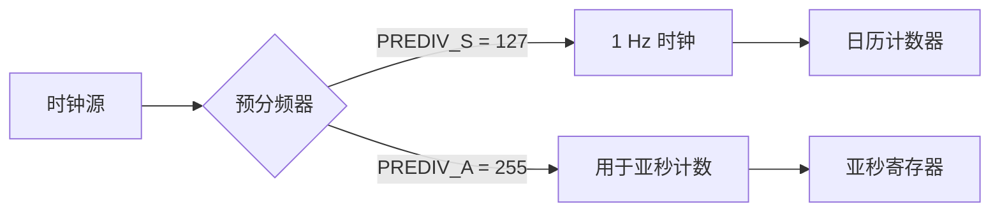

# 第十一章 RTC介绍及应用

## 1. RTC 简介

RTC（Real-Time Clock，实时时钟）是 STM32H750VBT6 中用于**提供日历和时钟功能**的低功耗外设，即使主电源关闭，只要 **V<sub>BAT</sub>**（备份电源）供电，RTC 仍能持续运行，实现 **年、月、日、时、分、秒** 的精确计时。RTC 是嵌入式系统中实现 **时间戳记录、定时唤醒、闹钟提醒** 等功能的核心组件，广泛应用于数据记录仪、智能电表、工业控制器等需要时间信息的场景。

> 🔍 **核心定位**：
> 
> - **RTC ≠ 系统滴答定时器**，而是**独立于 CPU 的“电子表”**
> - 支持 **BCD 编码**（Binary-Coded Decimal）存储时间
> - 可由 **LSE（32.768 kHz 晶体）** 或 **LSI（内部 RC）** 驱动
> - 支持 **毫秒级时间戳捕获**（配合 TAMP 或 TIMESTAMP 功能）

---

### **1.1 RTC 核心特性（STM32H750VBT6）**

| **特性**             | **参数**                                               | **说明**            | **应用场景** |
| ------------------ | ---------------------------------------------------- | ----------------- | -------- |
| **时钟源**            | LSE（32.768 kHz 外部晶振）<br>LSI（~32 kHz 内部 RC）<br>HSE 分频 | LSE 最精确（±20 ppm）  | 工业级计时    |
| **日历功能**           | 年（00–99）、月、日、星期、时、分、秒                                | 自动润年处理            | 数据日志记录   |
| **闹钟（Alarm）**      | Alarm A / B                                          | 可设置日+时+分+秒匹配      | 定时任务唤醒   |
| **周期性唤醒**          | Wakeup Timer                                         | 最高 17 位定时（秒级）     | 低功耗轮询    |
| **时间戳（Timestamp）** | 外部引脚触发                                               | 捕获事件发生时间          | 故障记录     |
| **入侵检测（TAMP）**     | TAMP1/2/3 引脚                                         | 防拆/防篡改检测          | 安全设备     |
| **备份寄存器**          | 32 × 32-bit                                          | 断电保存用户数据          | 配置/状态存储  |
| **低功耗**            | Stop/Standby 模式下运行                                   | 电流 < 1 μA（LSE 驱动） | 电池供电设备   |

📌 **STM32H750VBT6 专属优势**：

- **双备份域**：RTC 和备份寄存器位于 **D3 域**，可独立关闭主电源
- **亚秒级时间戳**：支持 **RTC_SUBR**（Sub-second Register）实现毫秒精度
- **日历自动校准**：可通过 **CALIBR** 寄存器进行 ±488 ppm 校准
- **安全功能**：TAMP 事件可触发 **RTC_TAMPCR.TAMPFREQ** 频率检测

---

### 1.2 RTC 工作原理详解

#### 1.2.1 时钟树结构



- **关键公式**：
  
  - `f<sub>RTC</sub> = f<sub>clk</sub> / ((PREDIV_A + 1) × (PREDIV_S + 1))`
  - 默认配置：`PREDIV_A = 255`, `PREDIV_S = 127` → `f<sub>RTC</sub> = 32768 / (256 × 128) = 1 Hz`

- **BCD 编码示例**：
  
  - 时间：14:35:27
  - `RTC_TR = 0x143527`（BCD 格式）
  - 二进制：`0001 0100 0011 0101 0010 0111`

#### 1.2.2 闰年处理

- RTC 自动处理闰年（2024、2028 等）
- 2 月 29 日自动识别，无需软件干预
- 世纪位由软件维护（STM32 不支持 2100 年自动修正）

#### 1.2.3 亚秒与时间戳

- **SUBR** 寄存器：
  
  - 递减计数器，从 `PREDIV_S` 到 0
  - 当秒更新时，`SUBR` 被重载
  - **毫秒计算**：`ms = ((PREDIV_S + 1) - SUBR) × (1000 / (PREDIV_S + 1))`  
    *示例：PREDIV_S=127 → ms = (128 - SUBR) × 7.8125*

- **时间戳捕获**：
  
  - 上升沿触发 `RTC_TS` 引脚
  - 自动锁存 `RTC_TR` 和 `RTC_DR`
  - 可通过 `RTC_SR.TSF` 标志读取

---

### 1.3 关键寄存器操作

#### 1.3.1 RTC 主要寄存器

| **寄存器**    | **功能**                | **说明**                                                                             |
| ---------- | --------------------- | ---------------------------------------------------------------------------------- |
| **TR**     | Time Register         | H[22:16], M[15:8], S[7:0], PM                                                      |
| **DR**     | Date Register         | YT[31:28], UT[27:24], DU[23:20], MT[19:16], MU[15:12], WDU[10:8], YT[7:4], UT[3:0] |
| **CR**     | Control Register      | 允许写保护、中断使能                                                                         |
| **ISR**    | Status Register       | INITS, RSF, INITF, ALRAWF                                                          |
| **PRER**   | Prescaler Register    | PREDIV_S, PREDIV_A                                                                 |
| **ALRMxR** | Alarm Register        | 设置闹钟时间                                                                             |
| **WUTR**   | Wakeup Timer Register | 唤醒计数值                                                                              |
| **TAMPCR** | Tamper Control        | 入侵检测配置                                                                             |

#### 1.3.2 RTC 初始化流程（寄存器级）

```c
// 1. 使能备份域访问
PWR->CR1 |= PWR_CR1_DBP;
while (!(PWR->CR1 & PWR_CR1_DBP)); // 等待就绪

// 2. 选择 LSE 作为 RTC 时钟源
RCC->BDCR |= RCC_BDCR_LSEON; // 启动 LSE
while (!(RCC->BDCR & RCC_BDCR_LSERDY)); // 等待稳定
RCC->BDCR &= ~RCC_BDCR_RTCSEL; // 清除选择
RCC->BDCR |= RCC_BDCR_RTCSEL_0; // 01 = LSE
RCC->BDCR |= RCC_BDCR_RTCEN; // 使能 RTC

// 3. 进入初始化模式
RTC->WPR = 0xCA; // 解锁写保护
RTC->WPR = 0x53;
RTC->ISR |= RTC_ISR_INIT; // 进入初始化模式
while (!(RTC->ISR & RTC_ISR_INITF)); // 等待进入

// 4. 配置预分频器（1 Hz）
RTC->PRER = (255 << 16) | 127; // PREDIV_A=255, PREDIV_S=127

// 5. 设置初始时间（12:00:00）
RTC->TR = 0x120000; // BCD: 12:00:00
RTC->DR = 0x2401015 << 0; // 2024年1月1日，星期一

// 6. 退出初始化模式
RTC->ISR &= ~RTC_ISR_INIT;
while (RTC->ISR & RTC_ISR_INIT); // 等待退出

// 7. 锁定写保护
RTC->WPR = 0xFF;
```

#### 1.3.3 HAL 库简化操作

```c
RTC_TimeTypeDef sTime = {0};
RTC_DateTypeDef sDate = {0};

sTime.Hours   = 12;
sTime.Minutes = 0;
sTime.Seconds = 0;
sTime.DayLightSaving = RTC_DAYLIGHTSAVING_NONE;
sTime.StoreOperation = RTC_STOREOPERATION_RESET;

sDate.WeekDay = RTC_WEEKDAY_MONDAY;
sDate.Month   = RTC_MONTH_JANUARY;
sDate.Date    = 1;
sDate.Year    = 24;

if (HAL_RTC_SetTime(&hrtc, &sTime, RTC_FORMAT_BCD) != HAL_OK) {
    Error_Handler();
}
if (HAL_RTC_SetDate(&hrtc, &sDate, RTC_FORMAT_BCD) != HAL_OK) {
    Error_Handler();
}
```

## 2. RTC使用示例-STM32IDE

### 2.1 STM32Cube配置


### 2.2 用户代码

```c
#include "rtc.h"
#include "led.h"
#include "usart.h"
#include <stdio.h>

RTC_HandleTypeDef hrtc;
/* 月修正数据表 */
uint8_t const table_week[12] = {0, 3, 3, 6, 1, 4, 6, 2, 5, 0, 3, 5};

// 写入后备域SRAM
void rtc_write_bkr(uint32_t bkrx, uint32_t data)
{
	HAL_PWR_EnableBkUpAccess(); // 使能后备寄存器访问
	HAL_RTCEx_BKUPWrite(&hrtc, bkrx, data); // 写入数据
}

// 读取后备域SRAM
uint32_t rtc_read_bkr(uint32_t bkrx)
{
	uint32_t data;
	data = HAL_RTCEx_BKUPRead(&hrtc, bkrx); // 读取数据
	return data;
}

// 设置时间
void rtc_set_time(uint8_t hour, uint8_t min, uint8_t sec, uint8_t ampm)
{
	RTC_TimeTypeDef sTime = {0};
	sTime.Hours = hour;
	sTime.Minutes = min;
	sTime.Seconds = sec;
	sTime.TimeFormat = ampm;
	sTime.DayLightSaving = RTC_DAYLIGHTSAVING_NONE;
	sTime.StoreOperation = RTC_STOREOPERATION_RESET;
	if (HAL_RTC_SetTime(&hrtc, &sTime, RTC_FORMAT_BCD) != HAL_OK)
	{
		Error_Handler();
	}
}

// 设置日期
void rtc_set_date(uint8_t year, uint8_t month, uint8_t date, uint8_t week)
{
	RTC_DateTypeDef sDate = {0};
	sDate.Year = year;
	sDate.Month = month;
	sDate.Date = date;
	sDate.WeekDay = week;
	if (HAL_RTC_SetDate(&hrtc, &sDate, RTC_FORMAT_BCD) != HAL_OK)
	{
		Error_Handler();
	}
}


/* RTC init function */
uint8_t MX_RTC_Init(void)
{
  uint16_t bkp_flag = 0; // 检查是不是第一次配置时钟
  // RTC 初始化
  hrtc.Instance = RTC;
  hrtc.Init.HourFormat = RTC_HOURFORMAT_24; // 24小时制
  hrtc.Init.AsynchPrediv = 0x7F; // 异步分频系数
  hrtc.Init.SynchPrediv = 0xFF;  // 同步分频系数
  hrtc.Init.OutPut = RTC_OUTPUT_DISABLE; // 不输出信号
  hrtc.Init.OutPutPolarity = RTC_OUTPUT_POLARITY_HIGH; // 输出极性
  hrtc.Init.OutPutType = RTC_OUTPUT_TYPE_OPENDRAIN; // 输出类型
  hrtc.Init.OutPutRemap = RTC_OUTPUT_REMAP_NONE;
  bkp_flag = rtc_read_bkr(0); // 读取后备寄存器0的值
  if (HAL_RTC_Init(&hrtc) != HAL_OK)
  {
    Error_Handler();
    return 1;
  }
  if((bkp_flag != 0x5050) && (bkp_flag != 0x5051))
  {
	  // 第一次配置RTC，手动设置初值
	  rtc_set_time(12, 12, 12, RTC_HOURFORMAT12_AM); // 设置时间 上午12:12:12
	  rtc_set_date(23, 3, 1, 3); // 设置日期 2023年3月1日 星期三
  }
  return 0;
}

/**
 * @brief       RTC底层驱动，时钟配置
 * @param       hrtc:RTC句柄
 * @note        此函数会被HAL_RTC_Init()调用
 * @retval      无
 */
void HAL_RTC_MspInit(RTC_HandleTypeDef* hrtc)
{
    uint16_t retry = 200;

    RCC_OscInitTypeDef rcc_osc_init;
    RCC_PeriphCLKInitTypeDef rcc_periphclk_init;

    __HAL_RCC_RTC_CLK_ENABLE();     /* 使能RTC时钟 */
    HAL_PWR_EnableBkUpAccess();     /* 取消备份区域写保护 */
    __HAL_RCC_RTC_ENABLE();         /* RTC时钟使能 */

    /* 使用寄存器的方式去检测LSE是否可以正常工作 */
    RCC->BDCR |= 1 << 0;    /* 开启外部低速振荡器LSE */

    while (retry && ((RCC->BDCR & 0X02) == 0))  /* 等待LSE准备好 */
    {
        retry--;
        HAL_Delay(5);
    }
    if (retry == 0)     /* LSE起振失败，使用LSI */
    {
        rcc_osc_init.OscillatorType = RCC_OSCILLATORTYPE_LSI;           /* 选择要配置的振荡器 */
        rcc_osc_init.LSEState = RCC_LSI_ON;                             /* LSI状态：开启 */
        rcc_osc_init.PLL.PLLState = RCC_PLL_NONE;                       /* PLL无配置 */
        HAL_RCC_OscConfig(&rcc_osc_init);                               /* 配置设置的rcc_oscinitstruct */

        rcc_periphclk_init.PeriphClockSelection = RCC_PERIPHCLK_RTC;    /* 选择要配置的外设 RTC */
        rcc_periphclk_init.RTCClockSelection = RCC_RTCCLKSOURCE_LSI;    /* RTC时钟源选择 LSI */
        HAL_RCCEx_PeriphCLKConfig(&rcc_periphclk_init);                 /* 配置设置的rcc_periphClkInitStruct */
        rtc_write_bkr(0, 0X5051);
    }
    else
    {
        rcc_osc_init.OscillatorType = RCC_OSCILLATORTYPE_LSE;           /* 选择要配置的振荡器 */
        rcc_osc_init.PLL.PLLState = RCC_PLL_NONE;                       /* PLL不配置 */
        rcc_osc_init.LSEState = RCC_LSE_ON;                             /* LSE状态：开启 */
        HAL_RCC_OscConfig(&rcc_osc_init);                               /* 配置设置的rcc_oscinitstruct */

        rcc_periphclk_init.PeriphClockSelection = RCC_PERIPHCLK_RTC;    /* 选择要配置外设 RTC */
        rcc_periphclk_init.RTCClockSelection = RCC_RTCCLKSOURCE_LSE;    /* RTC时钟源为LSE */
        HAL_RCCEx_PeriphCLKConfig(&rcc_periphclk_init);                 /* 配置设置的rcc_periphclkinitstruct */
        rtc_write_bkr(0, 0X5050);
    }
}

void HAL_RTC_MspDeInit(RTC_HandleTypeDef* rtcHandle)
{

  if(rtcHandle->Instance==RTC)
  {
  /* USER CODE BEGIN RTC_MspDeInit 0 */

  /* USER CODE END RTC_MspDeInit 0 */
    /* Peripheral clock disable */
    __HAL_RCC_RTC_DISABLE();

    /* RTC interrupt Deinit */
    HAL_NVIC_DisableIRQ(RTC_WKUP_IRQn);
    HAL_NVIC_DisableIRQ(RTC_Alarm_IRQn);
  /* USER CODE BEGIN RTC_MspDeInit 1 */

  /* USER CODE END RTC_MspDeInit 1 */
  }
}

// 获取RTC时间
void rtc_get_time(uint8_t* hour, uint8_t* min, uint8_t* sec, uint8_t* ampm)
{
	RTC_TimeTypeDef sTime = {0};
	HAL_RTC_GetTime(&hrtc, &sTime, RTC_FORMAT_BIN);
	*hour = sTime.Hours;
	*min = sTime.Minutes;
	*sec = sTime.Seconds;
	*ampm = sTime.TimeFormat;
}

// 获取RTC日期
void rtc_get_date(uint8_t* year, uint8_t* month, uint8_t* date, uint8_t* week)
{
	RTC_DateTypeDef sDate = {0};
	HAL_RTC_GetDate(&hrtc, &sDate, RTC_FORMAT_BIN);
	*year = sDate.Year;
	*month = sDate.Month;
	*date = sDate.Date;
	*week = sDate.WeekDay;
}

/**
 * @breif       获得现在是星期几, 输入公历日期得到星期(只允许1901-2099年)
 * @param       year,month,day：公历年月日
 * @retval      星期号(1~7,代表周1~周日)
 */
uint8_t rtc_get_week(uint16_t year, uint8_t month, uint8_t day)
{
    uint16_t temp2;
    uint8_t yearH, yearL;
    yearH = year / 100;
    yearL = year % 100;
    /*  如果为21世纪,年份数加100 */
    if (yearH > 19)yearL += 100;
    /*  所过闰年数只算1900年之后的 */
    temp2 = yearL + yearL / 4;
    temp2 = temp2 % 7;
    temp2 = temp2 + day + table_week[month - 1];
    if (yearL % 4 == 0 && month < 3)temp2--;
    temp2 %= 7;
    if (temp2 == 0)temp2 = 7;
    return temp2;
}

/**
 * @breif       设置闹钟时间(按星期闹铃,24小时制)
 * @param       week        : 星期几(1~7)
 * @param       hour,min,sec: 小时,分钟,秒钟
 * @retval      无
 */
void rtc_set_alarma(uint8_t week, uint8_t hour, uint8_t min, uint8_t sec)
{
    RTC_AlarmTypeDef rtc_alarm;

    rtc_alarm.AlarmTime.Hours = hour;                                /* 小时 */
    rtc_alarm.AlarmTime.Minutes = min;                               /* 分钟 */
    rtc_alarm.AlarmTime.Seconds = sec;                               /* 秒 */
    rtc_alarm.AlarmTime.SubSeconds = 0;
    rtc_alarm.AlarmTime.TimeFormat = RTC_HOURFORMAT12_AM;

    rtc_alarm.AlarmMask = RTC_ALARMMASK_NONE;                        /* 精确匹配星期，时分秒 */
    rtc_alarm.AlarmSubSecondMask = RTC_ALARMSUBSECONDMASK_NONE;
    rtc_alarm.AlarmDateWeekDaySel = RTC_ALARMDATEWEEKDAYSEL_WEEKDAY; /* 按星期 */
    rtc_alarm.AlarmDateWeekDay = week;                               /* 星期 */
    rtc_alarm.Alarm = RTC_ALARM_A;                                   /* 闹钟A */
    HAL_RTC_SetAlarm_IT(&hrtc, &rtc_alarm, RTC_FORMAT_BIN);
    HAL_NVIC_SetPriority(RTC_Alarm_IRQn, 1, 2);   /* 抢占优先级1,子优先级2 */
    HAL_NVIC_EnableIRQ(RTC_Alarm_IRQn);
}

/**
 * @breif       周期性唤醒定时器设置
 * @param       wksel
 *   @arg       RTC_WAKEUPCLOCK_RTCCLK_DIV16        ((uint32_t)0x00000000)
 *   @arg       RTC_WAKEUPCLOCK_RTCCLK_DIV8         ((uint32_t)0x00000001)
 *   @arg       RTC_WAKEUPCLOCK_RTCCLK_DIV4         ((uint32_t)0x00000002)
 *   @arg       RTC_WAKEUPCLOCK_RTCCLK_DIV2         ((uint32_t)0x00000003)
 *   @arg       RTC_WAKEUPCLOCK_CK_SPRE_16BITS      ((uint32_t)0x00000004)
 *   @arg       RTC_WAKEUPCLOCK_CK_SPRE_17BITS      ((uint32_t)0x00000006)
 * @note        000,RTC/16;001,RTC/8;010,RTC/4;011,RTC/2;
 * @note        注意:RTC就是RTC的时钟频率,即RTCCLK!
 * @param       cnt: 自动重装载值.减到0,产生中断.
 * @retval      无
 */
void rtc_set_wakeup(uint8_t wksel, uint16_t cnt)
{
    __HAL_RTC_WAKEUPTIMER_CLEAR_FLAG(&hrtc, RTC_FLAG_WUTF);  /* 清除RTC WAKE UP的标志 */

    HAL_RTCEx_SetWakeUpTimer_IT(&hrtc, cnt, wksel);          /* 设置重装载值和时钟 */

    HAL_NVIC_SetPriority(RTC_WKUP_IRQn, 2, 2);                       /* 抢占优先级2,子优先级2 */
    HAL_NVIC_EnableIRQ(RTC_WKUP_IRQn);
}

/**
  * @brief This function handles RTC alarms (A and B) interrupt through EXTI line 17.
  */
void RTC_Alarm_IRQHandler(void)
{
  HAL_RTC_AlarmIRQHandler(&hrtc);
}

void HAL_RTC_AlarmAEventCallback(RTC_HandleTypeDef *hrtc)
{
	printf("AlarmA Wakeup\r\n");
}

/**
  * @brief This function handles RTC wake-up interrupt through EXTI line 19.
  */
void RTC_WKUP_IRQHandler(void)
{

  HAL_RTCEx_WakeUpTimerIRQHandler(&hrtc);
}

void HAL_RTCEx_WakeUpTimerEventCallback(RTC_HandleTypeDef *hrtc)
{
	HAL_GPIO_TogglePin(LED_RED_Port, LED_RED_Pin);
	printf("Wakeup\r\n");
}

```

```c
#include "main.h"
#include "rtc.h"
#include "bsp_init.h"
#include "stdio.h" // For printf function

void SystemClock_Config(void);
static void MPU_Config(void);

int main(void)
{
  uint8_t hour, min, sec, ampm;
  uint8_t year, month, date, week;
  uint8_t i = 0;
  MPU_Config();
  HAL_Init();
  SystemClock_Config();
  bsp_init();
  MX_RTC_Init();
  rtc_set_wakeup(RTC_WAKEUPCLOCK_CK_SPRE_16BITS, 0); // 每隔1秒钟唤醒一次
  rtc_set_time(12, 12, 12, RTC_HOURFORMAT12_AM); // 设置时间 上午12:12:12
  rtc_set_date(23, 3, 1, 3); // 设置日期 2023年3月1日 星期三
  rtc_set_alarma(3, 12, 12, 50); // 设置闹钟 星期三 12:12:50
  while (1)
  {
    i++;
    if((i % 10) == 0)
    {
      rtc_get_time(&hour, &min, &sec, &ampm);
      printf("Time: %02d:%02d:%02d %s, ", hour, min, sec, (ampm == RTC_HOURFORMAT12_AM) ? "AM" : "PM");
      rtc_get_date(&year, &month, &date, &week);
      printf("Date: 20%02d-%02d-%02d, Weekday: %d\r\n", year, month, date, week);
    }
    HAL_Delay(100);
  }
}

/**
  * @brief System Clock Configuration
  * @retval None
  */
void SystemClock_Config(void)
{
  RCC_OscInitTypeDef RCC_OscInitStruct = {0};
  RCC_ClkInitTypeDef RCC_ClkInitStruct = {0};

  /** Supply configuration update enable
  */
  HAL_PWREx_ConfigSupply(PWR_LDO_SUPPLY);

  /** Configure the main internal regulator output voltage
  */
  __HAL_PWR_VOLTAGESCALING_CONFIG(PWR_REGULATOR_VOLTAGE_SCALE0);

  while(!__HAL_PWR_GET_FLAG(PWR_FLAG_VOSRDY)) {}

  /** Initializes the RCC Oscillators according to the specified parameters
  * in the RCC_OscInitTypeDef structure.
  */
  RCC_OscInitStruct.OscillatorType = RCC_OSCILLATORTYPE_LSI|RCC_OSCILLATORTYPE_HSE;
  RCC_OscInitStruct.HSEState = RCC_HSE_ON;
  RCC_OscInitStruct.LSIState = RCC_LSI_ON;
  RCC_OscInitStruct.PLL.PLLState = RCC_PLL_ON;
  RCC_OscInitStruct.PLL.PLLSource = RCC_PLLSOURCE_HSE;
  RCC_OscInitStruct.PLL.PLLM = 2;
  RCC_OscInitStruct.PLL.PLLN = 240;
  RCC_OscInitStruct.PLL.PLLP = 2;
  RCC_OscInitStruct.PLL.PLLQ = 2;
  RCC_OscInitStruct.PLL.PLLR = 2;
  RCC_OscInitStruct.PLL.PLLRGE = RCC_PLL1VCIRANGE_2;
  RCC_OscInitStruct.PLL.PLLVCOSEL = RCC_PLL1VCOWIDE;
  RCC_OscInitStruct.PLL.PLLFRACN = 0;
  if (HAL_RCC_OscConfig(&RCC_OscInitStruct) != HAL_OK)
  {
    Error_Handler();
  }

  /** Initializes the CPU, AHB and APB buses clocks
  */
  RCC_ClkInitStruct.ClockType = RCC_CLOCKTYPE_HCLK|RCC_CLOCKTYPE_SYSCLK
                              |RCC_CLOCKTYPE_PCLK1|RCC_CLOCKTYPE_PCLK2
                              |RCC_CLOCKTYPE_D3PCLK1|RCC_CLOCKTYPE_D1PCLK1;
  RCC_ClkInitStruct.SYSCLKSource = RCC_SYSCLKSOURCE_PLLCLK;
  RCC_ClkInitStruct.SYSCLKDivider = RCC_SYSCLK_DIV1;
  RCC_ClkInitStruct.AHBCLKDivider = RCC_HCLK_DIV2;
  RCC_ClkInitStruct.APB3CLKDivider = RCC_APB3_DIV2;
  RCC_ClkInitStruct.APB1CLKDivider = RCC_APB1_DIV2;
  RCC_ClkInitStruct.APB2CLKDivider = RCC_APB2_DIV2;
  RCC_ClkInitStruct.APB4CLKDivider = RCC_APB4_DIV2;

  if (HAL_RCC_ClockConfig(&RCC_ClkInitStruct, FLASH_LATENCY_4) != HAL_OK)
  {
    Error_Handler();
  }
}

/* USER CODE BEGIN 4 */

/* USER CODE END 4 */

 /* MPU Configuration */

void MPU_Config(void)
{
  MPU_Region_InitTypeDef MPU_InitStruct = {0};

  /* Disables the MPU */
  HAL_MPU_Disable();

  /** Initializes and configures the Region and the memory to be protected
  */
  MPU_InitStruct.Enable = MPU_REGION_ENABLE;
  MPU_InitStruct.Number = MPU_REGION_NUMBER0;
  MPU_InitStruct.BaseAddress = 0x0;
  MPU_InitStruct.Size = MPU_REGION_SIZE_4GB;
  MPU_InitStruct.SubRegionDisable = 0x87;
  MPU_InitStruct.TypeExtField = MPU_TEX_LEVEL0;
  MPU_InitStruct.AccessPermission = MPU_REGION_NO_ACCESS;
  MPU_InitStruct.DisableExec = MPU_INSTRUCTION_ACCESS_DISABLE;
  MPU_InitStruct.IsShareable = MPU_ACCESS_SHAREABLE;
  MPU_InitStruct.IsCacheable = MPU_ACCESS_NOT_CACHEABLE;
  MPU_InitStruct.IsBufferable = MPU_ACCESS_NOT_BUFFERABLE;

  HAL_MPU_ConfigRegion(&MPU_InitStruct);
  /* Enables the MPU */
  HAL_MPU_Enable(MPU_PRIVILEGED_DEFAULT);

}

/**
  * @brief  This function is executed in case of error occurrence.
  * @retval None
  */
void Error_Handler(void)
{
  /* USER CODE BEGIN Error_Handler_Debug */
  /* User can add his own implementation to report the HAL error return state */
  __disable_irq();
  while (1)
  {
  }
  /* USER CODE END Error_Handler_Debug */
}
#ifdef USE_FULL_ASSERT
/**
  * @brief  Reports the name of the source file and the source line number
  *         where the assert_param error has occurred.
  * @param  file: pointer to the source file name
  * @param  line: assert_param error line source number
  * @retval None
  */
void assert_failed(uint8_t *file, uint32_t line)
{
  /* USER CODE BEGIN 6 */
  /* User can add his own implementation to report the file name and line number,
     ex: printf("Wrong parameters value: file %s on line %d\r\n", file, line) */
  /* USER CODE END 6 */
}
#endif /* USE_FULL_ASSERT */

```

## 3. RTC相关函数总结（HAL库）

### 3.1 初始化与配置

- **核心配置流程**（五步关键操作）：
  
  1. **使能时钟**（PWR + RTC + LSE/LSI）
  2. **配置备份域访问**
  3. **选择时钟源**（LSE/LSI/HSE）
  4. **初始化RTC参数**
  5. **配置NVIC中断**

- `HAL_RTC_Init(RTC_HandleTypeDef *hrtc)`  
  **基础配置示例**（LSE 32.768kHz）：
  
  ```c
  // 1. 使能电源和备份域时钟
  __HAL_RCC_PWR_CLK_ENABLE();
  HAL_PWR_EnableBkUpAccess();  // 使能备份域访问
  
  // 2. 配置LSE时钟源
  RCC_OscInitTypeDef RCC_OscInitStruct = {0};
  RCC_OscInitStruct.OscillatorType = RCC_OSCILLATORTYPE_LSE;
  RCC_OscInitStruct.LSEState = RCC_LSE_ON;
  HAL_RCC_OscConfig(&RCC_OscInitStruct);
  
  // 3. 配置RTC时钟源
  __HAL_RCC_RTC_CONFIG(RCC_RTCCLKSOURCE_LSE);
  __HAL_RCC_RTC_ENABLE();
  
  // 4. 初始化RTC
  hrtc.Instance = RTC;
  hrtc.Init.HourFormat = RTC_HOURFORMAT_24;           // 24小时制
  hrtc.Init.AsynchPrediv = 127;                       // 异步预分频 (128分频)
  hrtc.Init.SynchPrediv = 255;                        // 同步预分频 (256分频)
  hrtc.Init.OutPut = RTC_OUTPUT_DISABLE;             // 禁用输出
  hrtc.Init.OutPutPolarity = RTC_OUTPUT_POLARITY_HIGH;
  hrtc.Init.OutPutType = RTC_OUTPUT_TYPE_OPENDRAIN;
  HAL_RTC_Init(&hrtc);
  ```

- **`RTC_InitTypeDef` 结构体成员说明**：
  
  | **成员**           | **说明** | **有效值**                                   | **H750特殊说明**          |
  | ---------------- | ------ | ----------------------------------------- | --------------------- |
  | `HourFormat`     | 时间格式   | `RTC_HOURFORMAT_12`, `RTC_HOURFORMAT_24`  | 推荐24小时制               |
  | `AsynchPrediv`   | 异步预分频  | 0-0x7F                                    | `LSE/LSI频率-1`         |
  | `SynchPrediv`    | 同步预分频  | 0-0xFFFF                                  | `RTCCLK/(Asynch+1)-1` |
  | `OutPut`         | 输出使能   | `RTC_OUTPUT_ENABLE`, `RTC_OUTPUT_DISABLE` | 可输出秒脉冲                |
  | `OutPutPolarity` | 输出极性   | `RTC_OUTPUT_POLARITY_HIGH`, `LOW`         |                       |
  | `OutPutType`     | 输出类型   | `RTC_OUTPUT_TYPE_OPENDRAIN`, `PUSHPULL`   | 开漏需上拉                 |

- **时钟源选择与配置**：
  
  | **时钟源** | **频率**    | **精度**   | **配置方法**                     |
  | ------- | --------- | -------- | ---------------------------- |
  | **LSE** | 32.768kHz | ±20ppm   | `RCC_RTCCLKSOURCE_LSE`       |
  | **LSI** | 32kHz     | ±5000ppm | `RCC_RTCCLKSOURCE_LSI`       |
  | **HSE** | 1-25MHz   | ±25ppm   | `RCC_RTCCLKSOURCE_HSE` (分频后) |

- **预分频值计算公式**（核心！）：
  
  ```c
  AsynchPrediv = RTCCLK / (1Hz × (SynchPrediv+1)) - 1
  ```
  
  **H750典型配置**（LSE=32.768kHz）：
  
  ```c
  AsynchPrediv = 127  → 32768 / 128 = 256Hz
  SynchPrediv  = 255  → 256 / 256 = 1Hz (精确秒脉冲)
  ```

### 3.2 时间与闹钟配置

- **时间配置函数**：
  
  ```c
  // 设置当前时间
  RTC_TimeTypeDef sTime = {0};
  sTime.Hours = 14;
  sTime.Minutes = 30;
  sTime.Seconds = 0;
  sTime.DayLightSaving = RTC_DAYLIGHTSAVING_NONE;
  sTime.StoreOperation = RTC_STOREOPERATION_RESET;
  HAL_RTC_SetTime(&hrtc, &sTime, RTC_FORMAT_BIN);
  
  // 设置当前日期
  RTC_DateTypeDef sDate = {0};
  sDate.WeekDay = RTC_WEEKDAY_THURSDAY;
  sDate.Month = RTC_MONTH_JULY;
  sDate.Date = 25;
  sDate.Year = 24;  // 2024年
  HAL_RTC_SetDate(&hrtc, &sDate, RTC_FORMAT_BIN);
  ```

- **闹钟配置函数**：
  
  ```c
  // 配置闹钟A（每分钟触发）
  RTC_AlarmTypeDef sAlarm = {0};
  sAlarm.AlarmTime.Seconds = 0;
  sAlarm.AlarmTime.Minutes = RTC_ALARMMASK_ALL;  // 每分钟
  sAlarm.AlarmTime.Hours = RTC_ALARMMASK_ALL;
  sAlarm.AlarmTime.DayLightSaving = RTC_DAYLIGHTSAVING_NONE;
  sAlarm.AlarmTime.StoreOperation = RTC_STOREOPERATION_RESET;
  sAlarm.AlarmMask = RTC_ALARMMASK_NONE;
  sAlarm.AlarmSubSecondMask = RTC_ALARMSUBSECONDMASK_NONE;
  sAlarm.Alarm = RTC_ALARM_A;
  sAlarm.AlarmTime.TimeFormat = RTC_HOURFORMAT12_AM;
  sAlarm.AlarmDateWeekDaySel = RTC_ALARMDATEWEEKDAYSEL_DATE;
  sAlarm.AlarmDateWeekDay = 1;
  HAL_RTC_SetAlarm(&hrtc, &sAlarm, RTC_FORMAT_BIN);
  
  // 启动闹钟中断
  HAL_RTC_SetAlarm_IT(&hrtc, &sAlarm, RTC_FORMAT_BIN);
  ```

- **时间格式说明**：
  
  | **格式**           | **说明** | **示例**       | **应用场景** |
  | ---------------- | ------ | ------------ | -------- |
  | `RTC_FORMAT_BIN` | 二进制    | `Hours=14`   | 推荐使用     |
  | `RTC_FORMAT_BCD` | BCD码   | `Hours=0x14` | 兼容旧系统    |

- **闹钟掩码控制**：
  
  | **掩码宏**                     | **效果**     | **典型应用** |
  | --------------------------- | ---------- | -------- |
  | `RTC_ALARMMASK_NONE`        | 秒/分/时/日都匹配 | 精确时间触发   |
  | `RTC_ALARMMASK_DATEWEEKDAY` | 仅时/分/秒匹配   | 每天同一时间   |
  | `RTC_ALARMMASK_HOURS`       | 仅分/秒匹配     | 每小时整点    |
  | `RTC_ALARMMASK_ALL`         | 仅秒匹配       | 每分钟触发    |

### 3.3 RTC操作核心函数

- **基础控制函数**：
  
  | **函数**                     | **原型**                   | **功能** | **应用场景** |
  | -------------------------- | ------------------------ | ------ | -------- |
  | `HAL_RTC_GetTime()`        | `(hrtc, *sTime, Format)` | 读取当前时间 | 显示时间     |
  | `HAL_RTC_GetDate()`        | `(hrtc, *sDate, Format)` | 读取当前日期 | 日历功能     |
  | `HAL_RTC_SetTime()`        | `(hrtc, *sTime, Format)` | 设置时间   | 时间同步     |
  | `HAL_RTC_SetDate()`        | `(hrtc, *sDate, Format)` | 设置日期   |          |
  | `HAL_RTC_WaitForSynchro()` | `(hrtc)`                 | 等待同步   | 初始化后调用   |
  | `HAL_RTCEx_BKUPWrite()`    | `(hrtc, No, Data)`       | 写备份寄存器 | 保存状态     |
  | `HAL_RTCEx_BKUPRead()`     | `(hrtc, No)`             | 读备份寄存器 | 恢复状态     |

- **备份寄存器操作**（H750有32个）：
  
  ```c
  // 写备份寄存器
  HAL_RTCEx_BKUPWrite(&hrtc, RTC_BKP_DR1, 0x1234);
  
  // 读备份寄存器
  uint32_t data = HAL_RTCEx_BKUPRead(&hrtc, RTC_BKP_DR1);
  
  // 保存复位原因
  if (__HAL_RCC_GET_FLAG(RCC_FLAG_PINRST)) {
      HAL_RTCEx_BKUPWrite(&hrtc, RTC_BKP_DR0, 1);
  }
  ```

- **日历同步处理**：
  
  ```c
  // 读取时间前等待同步
  HAL_RTC_WaitForSynchro(&hrtc);
  
  RTC_TimeTypeDef sTime = {0};
  RTC_DateTypeDef sDate = {0};
  HAL_RTC_GetTime(&hrtc, &sTime, RTC_FORMAT_BIN);
  HAL_RTC_GetDate(&hrtc, &sDate, RTC_FORMAT_BIN);
  ```

### 3.4 高级功能与特性

- **唤醒定时器**（Wake-up Timer）：
  
  ```c
  // 配置周期性唤醒（每4秒）
  HAL_RTCEx_SetWakeUpTimer(&hrtc, 4-1, RTC_WAKEUPCLOCK_RTCCLK_DIV16);
  
  // 启动唤醒中断
  HAL_RTCEx_SetWakeUpTimer_IT(&hrtc, 4-1, RTC_WAKEUPCLOCK_RTCCLK_DIV16);
  
  // 唤醒回调
  void HAL_RTCEx_WakeUpTimerEventCallback(RTC_HandleTypeDef *hrtc)
  {
      sensor_sampling();  // 唤醒后执行采样
  }
  ```

- **时间戳功能**：
  
  ```c
  // 使能时间戳
  HAL_RTCEx_SetTimeStamp(&hrtc, RTC_TIMESTAMPEDGE_RISING, RTC_TIMESTAMPPIN_DEFAULT);
  
  // 读取时间戳
  RTC_TimeTypeDef sTimeStampTime = {0};
  RTC_DateTypeDef sTimeStampDate = {0};
  HAL_RTCEx_GetTimeStamp(&hrtc, &sTimeStampTime, &sTimeStampDate, RTC_FORMAT_BIN);
  ```

- **日历亚秒处理**：
  
  ```c
  // 读取亚秒值（用于高精度时间戳）
  uint32_t subsecond = READ_REG(hrtc->Instance->SSR) & RTC_SSR_SS;
  uint32_t fraction = (hrtc->Init.SynchPrediv - subsecond);
  ```

- **低功耗模式唤醒**：
  
  ```c
  // STOP2模式下RTC唤醒
  HAL_PWREx_EnableInternalWakeUpLine();
  HAL_SuspendTick();
  HAL_PWR_EnterSTOP2Mode(PWR_STOPENTRY_WFI);
  
  // 唤醒后恢复
  SystemClock_Config();
  HAL_ResumeTick();
  ```

### 3.5 使用示例（完整流程）

#### 3.5.1 示例1：RTC初始化与闹钟配置

```c
RTC_HandleTypeDef hrtc = {0};

void RTC_Config(void)
{
    // 1. 使能PWR时钟并开启备份域访问
    __HAL_RCC_PWR_CLK_ENABLE();
    HAL_PWR_EnableBkUpAccess();

    // 2. 配置LSE时钟
    RCC_OscInitTypeDef RCC_OscInitStruct = {0};
    RCC_OscInitStruct.OscillatorType = RCC_OSCILLATORTYPE_LSE;
    RCC_OscInitStruct.LSEState = RCC_LSE_ON;
    RCC_OscInitStruct.PLL.PLLState = RCC_PLL_NONE;
    if (HAL_RCC_OscConfig(&RCC_OscInitStruct) != HAL_OK) {
        Error_Handler();
    }

    // 3. 配置RTC时钟源
    __HAL_RCC_RTC_CONFIG(RCC_RTCCLKSOURCE_LSE);
    __HAL_RCC_RTC_ENABLE();

    // 4. 初始化RTC
    hrtc.Instance = RTC;
    hrtc.Init.HourFormat = RTC_HOURFORMAT_24;
    hrtc.Init.AsynchPrediv = 127;   // 32768/128=256Hz
    hrtc.Init.SynchPrediv = 255;    // 256/256=1Hz
    hrtc.Init.OutPut = RTC_OUTPUT_DISABLE;
    if (HAL_RTC_Init(&hrtc) != HAL_OK) {
        Error_Handler();
    }

    // 5. 等待日历同步
    HAL_RTC_WaitForSynchro(&hrtc);

    // 6. 设置初始时间
    RTC_TimeTypeDef sTime = {0};
    sTime.Hours = 0;
    sTime.Minutes = 0;
    sTime.Seconds = 0;
    HAL_RTC_SetTime(&hrtc, &sTime, RTC_FORMAT_BIN);

    RTC_DateTypeDef sDate = {0};
    sDate.WeekDay = RTC_WEEKDAY_MONDAY;
    sDate.Month = RTC_MONTH_JANUARY;
    sDate.Date = 1;
    sDate.Year = 24;
    HAL_RTC_SetDate(&hrtc, &sDate, RTC_FORMAT_BIN);

    // 7. 配置闹钟（每分钟触发）
    RTC_AlarmTypeDef sAlarm = {0};
    sAlarm.AlarmTime.Seconds = 0;
    sAlarm.AlarmMask = RTC_ALARMMASK_HOURS | RTC_ALARMMASK_DATEWEEKDAY;
    sAlarm.Alarm = RTC_ALARM_A;
    HAL_RTC_SetAlarm_IT(&hrtc, &sAlarm, RTC_FORMAT_BIN);

    // 8. 配置NVIC
    HAL_NVIC_SetPriority(RTC_Alarm_IRQn, 1, 0);
    HAL_NVIC_EnableIRQ(RTC_Alarm_IRQn);
}

// 闹钟中断服务函数
void RTC_Alarm_IRQHandler(void)
{
    HAL_RTC_AlarmIRQHandler(&hrtc);
}

// 闹钟回调函数
void HAL_RTC_AlarmAEventCallback(RTC_HandleTypeDef *hrtc)
{
    static uint8_t minute_count = 0;
    minute_count++;

    // 每10分钟记录一次
    if(minute_count >= 10) {
        log_data_to_sdcard();
        minute_count = 0;
    }
}
```

#### 3.5.2 示例2：备份寄存器保存运行状态

```c
// 定义状态枚举
typedef enum {
    STATE_INIT = 0,
    STATE_RUNNING = 1,
    STATE_STOPPED = 2
} SystemState;

void Save_System_State(SystemState state)
{
    // 写入备份寄存器
    HAL_RTCEx_BKUPWrite(&hrtc, RTC_BKP_DR0, (uint32_t)state);

    // 保存运行时间（小时）
    uint32_t runtime = get_total_runtime_hours();
    HAL_RTCEx_BKUPWrite(&hrtc, RTC_BKP_DR1, runtime);
}

SystemState Read_System_State(void)
{
    return (SystemState)HAL_RTCEx_BKUPRead(&hrtc, RTC_BKP_DR0);
}

// 系统启动时检查状态
void System_Init(void)
{
    SystemState last_state = Read_System_State();

    switch(last_state) {
        case STATE_RUNNING:
            // 上次异常关机，执行恢复程序
            recovery_procedure();
            break;
        case STATE_STOPPED:
            // 正常关机，继续启动
            break;
        default:
            // 首次启动
            factory_reset();
            break;
    }

    // 更新状态为运行中
    Save_System_State(STATE_RUNNING);
}
```

## 4. 关键注意事项

1. **备份域访问权限**：
   
   - **必须**调用`HAL_PWR_EnableBkUpAccess()`
   
   - 否则所有RTC配置将失败（返回`HAL_ERROR`）
   
   - **错误示例**：
     
     ```c
     // 忘记使能备份域访问
     __HAL_RCC_PWR_CLK_ENABLE();
     // ... 直接调用HAL_RTC_Init() → 失败！
     ```

2. **时钟源稳定性**：
   
   - **LSE启动时间**：典型500ms，需等待稳定
     
     ```c
     // 检查LSE是否就绪
     while(__HAL_RCC_GET_FLAG(RCC_FLAG_LSERDY) == RESET) {
         HAL_Delay(10);
     }
     ```
   
   - **LSI精度问题**：±5000ppm → 每天误差±432秒
   
   - **HSE分频配置**：
     
     ```c
     // HSE分频后作为RTC时钟
     __HAL_RCC_RTC_CONFIG(RCC_RTCCLKSOURCE_HSE_DIV32);
     ```

3. **低功耗模式陷阱**：
   
   | **模式**  | **RTC行为** | **H750特殊处理** |
   | ------- | --------- | ------------ |
   | RUN     | 正常工作      |              |
   | SLEEP   | 继续运行      |              |
   | STOP0   | 继续运行      | 需保持VDD/VBAT  |
   | STOP1/2 | **继续运行**  | 可唤醒系统        |
   | STANDBY | **继续运行**  | 主要唤醒源        |

4. **初始化同步要求**：
   
   - **必须**调用`HAL_RTC_WaitForSynchro()`
   
   - 否则读取的时间可能不准确
   
   - **执行时机**：
     
     ```c
     HAL_RTC_Init(&hrtc);
     HAL_RTC_WaitForSynchro(&hrtc);  // 立即调用
     HAL_RTC_SetTime(&hrtc, &sTime, RTC_FORMAT_BIN); // 再设置时间
     ```

5. **备份寄存器限制**：
   
   - H750提供**32个32位备份寄存器**（RTC_BKP_DR0-DR31）
   - 仅`RTC_BKP_DR0`可被**侵入检测**清除
   - 推荐用途：
     - DR0-DR5：系统状态/运行时间
     - DR6-DR10：校准参数
     - DR11-DR15：故障记录

---

### 4.1 H750特有优化技巧

| **场景**     | **解决方案**      | **优势**  | **实现要点**                   |
| ---------- | ------------- | ------- | -------------------------- |
| **高精度时间戳** | 亚秒+毫秒计数       | 微秒级精度   | `SSR + DWT_CYCCNT`         |
| **电池供电优化** | STOP2 + RTC唤醒 | 功耗<10μA | `HAL_PWR_EnterSTOP2Mode()` |
| **时间同步**   | NTP + RTC备份   | 掉电不丢时间  | `HAL_RTC_SetTime()`定期校准    |
| **安全启动**   | 备份寄存器防篡改      | 防止非法修改  | `RTC_BKP_DR0`存储哈希值         |

> **避坑指南**：
> 
> 1. **H750时钟树特殊性**：
>    
>    - RTC时钟源选择通过`RCC->BDCR`寄存器
>    - 一旦选择不能更改（除非系统复位）
> 
> 2. **亚秒计算陷阱**：
>    
>    ```c
>    // 正确的亚秒计算（从0到1秒）
>    uint32_t subsecond = hrtc.Init.SynchPrediv - READ_REG(RTC->SSR);
>    float seconds = sTime.Seconds + ((float)subsecond / (hrtc.Init.SynchPrediv + 1));
>    ```
> 
> 3. **闹钟中断优先级**：
>    
>    - 闹钟中断（RTC_Alarm_IRQn）优先级**必须高于**SysTick
>    - 否则在中断中调用`HAL_Delay()`会导致死锁
> 
> 4. **备份电源设计**：
>    
>    - VBAT引脚必须接**3V锂电池**或**超级电容**
>    - 电源纹波 < 50mV，否则可能导致RTC复位
> 
> 5. **多实例竞争**：
>    
>    - 同一时间只能有一个RTC操作
>    
>    - 在RTOS中使用互斥锁：
>      
>      ```c
>      osMutexWait(rtc_mutex, osWaitForever);
>      HAL_RTC_SetTime(&hrtc, &sTime, RTC_FORMAT_BIN);
>      osMutexRelease(rtc_mutex);
>      ```

---

### 4.2 RTC工作模式对比

```c
┌───────────────┬───────────────┬───────────────┬───────────────┐
│    功能       │   LSE模式     │   LSI模式     │   HSE模式     │
├───────────────┼───────────────┼───────────────┼───────────────┤
│ 精度          │ ±20ppm        │ ±5000ppm      │ ±25ppm        │
│ 启动时间      │ 500ms         │ 10ms          │ 100ms         │
│ 功耗          │ 1μA           │ 3μA           │ 10μA          │
│ 外部元件      │ 32.768kHz晶振 │ 无            │ 高速晶振      │
│ 场景          │ 高精度计时    │ 快速启动      │ 高频源利用    │
└───────────────┴───────────────┴───────────────┴───────────────┘
```

---


