# 第十四章 DMA介绍及应用

## 1. DMA 简介

DMA（Direct Memory Access，直接存储器存取）是 STM32H750VBT6 中用于**在内存与外设之间高效传输数据**的硬件模块，其核心价值在于**解放 CPU**，避免因数据搬运（如 ADC 采样、UART 接收、SPI 发送）导致的高负载和延迟。DMA 允许外设直接读写内存（SRAM/Flash），无需 CPU 干预，实现**零 CPU 开销的数据流传输**，是高速数据采集、音频处理、图像传输等实时系统的“数据高速公路”。

> 🔍 **核心定位**：
> 
> - **DMA ≠ 软件 memcpy**，而是**硬件级数据搬运工**
> 
> - 支持 **存储器到外设、外设到存储器、存储器到存储器** 传输
> 
> - STM32H750VBT6 配备 **2 个 DMA 控制器**：
>   
>   - **DMA1**：服务于 APB1 外设（USART2/3、SPI2/3、I2C1/2）
>   - **DMA2**：服务于 APB2 外设（USART1/6、SPI1、ADC1/2/3）
> 
> - **每个 DMA 有 8 个通道，共 16 个通道**，支持多任务并行传输

---

### 1.1 DMA 核心特性（STM32H750VBT6）

| **特性**      | **参数**                  | **说明**   | **应用场景**     |
| ----------- | ----------------------- | -------- | ------------ |
| **传输方向**    | 外设→内存、内存→外设、内存→内存       | 灵活数据流向   | ADC采集、UART发送 |
| **数据宽度**    | 8-bit / 16-bit / 32-bit | 与源/目标对齐  | 匹配外设寄存器      |
| **地址递增**    | 源/目标地址可配置递增或固定          | 外设寄存器常固定 | 多通道ADC采集     |
| **循环模式**    | 传输完成后自动重载               | 实现环形缓冲   | 实时数据流        |
| **FIFO 缓冲** | 每通道 4×32-bit FIFO       | 减少总线竞争   | 高速传输防溢出      |
| **突发传输**    | 支持单次、4/8/16 节拍突发        | 提升总线效率   | 与 AHB 高速外设协同 |
| **中断支持**    | 传输完成（TC）、半传输（HT）、错误（TE） | 实时通知 CPU | 数据处理调度       |
| **仲裁机制**    | 通道优先级（软件/硬件）            | 高优先级通道抢占 | 关键任务保障       |

📌 **STM32H750VBT6 专属优势**：

- **双 AHB 总线架构**：DMA 可同时访问 **D1/AHB1** 和 **D2/AHB2** 域，减少总线冲突
- **支持 MPU 配合**：DMA 访问受内存保护单元约束，确保安全
- **与以太网/USB 协同**：DMA2 支持 **ETH、OTG FS/HS** 高速数据流
- **低功耗感知**：在 Stop 模式下仍可执行 DMA 传输（需时钟保持）

---

### 1.2 DMA 工作原理详解

#### 1.2.1 传输架构与数据流

```mermaid
graph LR
A[外设] -->|请求| B{DMA 控制器}
B --> C[源地址: 外设寄存器]
B --> D[目标地址: SRAM 缓冲区]
C -->|读取| B
B -->|写入| D
B -->|中断| E[CPU]
```



- **传输三要素**：
  
  1. **源地址**（外设数据寄存器，如 `ADC1->DR`）
  2. **目标地址**（内存缓冲区，如 `adc_buffer[100]`）
  3. **传输数量**（NDTR，传输剩余字节数）

- **传输触发源**：
  
  - **硬件触发**：外设就绪（如 ADC EOC、USART TXE）
  - **软件触发**：通过 `EN` 位启动（仅内存间传输）

#### 1.2.2 通道与流（Stream）结构

- **DMA1/2 各含 8 个通道（Channel）**，每个通道可独立配置

- **通道映射示例**：
  
  | **DMA** | **通道**    | **外设映射**  |
  | ------- | --------- | --------- |
  | DMA1    | Channel 0 | ADC1      |
  | DMA1    | Channel 5 | USART2_RX |
  | DMA2    | Channel 4 | ADC1      |
  | DMA2    | Channel 7 | USART1_TX |

> ⚠️ **注意**：
> 
> - 同一外设可能映射到多个通道（如 ADC1 可用 DMA1_Ch0 或 DMA2_Ch4）
> - **DMA2 通道优先级高于 DMA1**（建议关键任务用 DMA2）

#### 1.2.3 FIFO 与突发传输

- **FIFO**：
  
  - 每通道 16 字节 FIFO，可配置**阈值触发传输**
  - 减少总线访问频率，提升效率

- **突发传输（Burst）**：
  
  - 单次传输 4/8/16 个数据（HBURST/SBURST）
  - 与 AHB 总线对齐，提升带宽利用率

---

### 1.3 关键寄存器操作

#### 1.3.1 DMA 主要寄存器组（以 DMA1 为例）

| **寄存器**         | **功能**  | **关键位域**                                                    | **说明**      |
| --------------- | ------- | ----------------------------------------------------------- | ----------- |
| **CCR**         | 通道控制    | `EN`, `DIR`, `CIRC`, `MINC`, `PINC`, `PSIZE`, `MSIZE`, `PL` | 核心配置        |
| **CNDTR**       | 传输数量    | `NDT[15:0]`                                                 | 剩余传输数，递减至 0 |
| **CPAR**        | 外设地址    | `PA[31:0]`                                                  | 外设数据寄存器地址   |
| **CMAR**        | 内存地址    | `MA[31:0]`                                                  | 缓冲区地址       |
| **CFCR**        | FIFO 控制 | `DAP`, `FTH`                                                | FIFO 阈值与方向  |
| **LISR/HISR**   | 中断状态    | `TCIFx`, `HTIFx`, `TEIFx`                                   | 低/高优先级通道标志  |
| **LIFCR/HIFCR** | 中断清除    | `CTCIFx`, `CHTIFx`, `CTEIFx`                                | 写 1 清除对应标志  |

#### 1.3.2 配置步骤（DMA1_Channel1 传输 ADC1 数据）

```c
// 1. 使能 DMA1 时钟
RCC->AHB1ENR |= RCC_AHB1ENR_DMA1EN;

// 2. 停止 DMA 通道（修改前必须关闭）
DMA1_Channel1->CCR &= ~DMA_CCR_EN;

// 3. 配置传输参数
DMA1_Channel1->CPAR = (uint32_t)&(ADC1->DR);    // 外设地址
DMA1_Channel1->CMAR = (uint32_t)adc_buffer;     // 内存地址
DMA1_Channel1->CNDTR = 100;                     // 传输 100 次
DMA1_Channel1->CCR = 
       DMA_CCR_DIR                    // 读自外设
     | DMA_CCR_MINC                   // 内存地址递增
     | DMA_CCR_PSIZE_0                // 外设 16-bit
     | DMA_CCR_MSIZE_0                // 内存 16-bit
     | DMA_CCR_CIRC                   // 循环模式
     | DMA_CCR_TCIE                   // 传输完成中断
     | DMA_CCR_HTIE;                  // 半传输中断

// 4. 使能通道
DMA1_Channel1->CCR |= DMA_CCR_EN;

// 5. 配置 NVIC（在外部）
NVIC_EnableIRQ(DMA1_Channel1_IRQn);
NVIC_SetPriority(DMA1_Channel1_IRQn, 1);
```

#### 1.3.3 HAL 库简化操作

```c
DMA_HandleTypeDef hdma;

hdma.Instance = DMA1_Channel1;
hdma.Init.Request = DMA_REQUEST_ADC1;
hdma.Init.Direction = DMA_PERIPH_TO_MEMORY;
hdma.Init.PeriphInc = DMA_PINC_DISABLE;
hdma.Init.MemInc = DMA_MINC_ENABLE;
hdma.Init.PeriphDataAlignment = DMA_PDATAALIGN_HALFWORD;
hdma.Init.MemDataAlignment = DMA_MDATAALIGN_HALFWORD;
hdma.Init.Mode = DMA_CIRCULAR;
hdma.Init.Priority = DMA_PRIORITY_HIGH;

HAL_DMA_Init(&hdma);
__HAL_LINKDMA(&hadc1, DMA_Handle, hdma);

// 启动 DMA 传输
HAL_ADC_Start_DMA(&hadc1, (uint32_t*)adc_buffer, 100);
```

## 2. DMA使用示例-STM32IDE

### 2.1 STM32Cube配置


### 2.2 用户代码

```c
#include "dma.h"
#include "usart.h"

DMA_HandleTypeDef dma_handle;
extern UART_HandleTypeDef huart1;

void MX_DMA_Init(DMA_Stream_TypeDef *dma_stream_handle, uint32_t ch)
{
  // 启用DMA时钟
  __HAL_RCC_DMA2_CLK_ENABLE();

  // 初始化DMA句柄
  dma_handle.Instance = dma_stream_handle;
  dma_handle.Init.Request = ch;
  dma_handle.Init.Direction = DMA_MEMORY_TO_PERIPH;
  dma_handle.Init.PeriphInc = DMA_PINC_DISABLE;
  dma_handle.Init.MemInc = DMA_MINC_ENABLE;
  dma_handle.Init.PeriphDataAlignment = DMA_PDATAALIGN_BYTE;
  dma_handle.Init.MemDataAlignment = DMA_MDATAALIGN_BYTE;
  dma_handle.Init.Mode = DMA_NORMAL;
  dma_handle.Init.Priority = DMA_PRIORITY_MEDIUM;
  dma_handle.Init.FIFOMode = DMA_FIFOMODE_DISABLE;
  dma_handle.Init.MemBurst = DMA_MBURST_SINGLE;
  dma_handle.Init.PeriphBurst = DMA_PBURST_SINGLE;

  // 初始化DMA
  HAL_DMA_DeInit(&dma_handle);
  if (HAL_DMA_Init(&dma_handle) != HAL_OK)
  {
    Error_Handler();
  }

  // 链接DMA到USART
  __HAL_LINKDMA(&huart1, hdmatx, dma_handle);

  // 启用DMA传输完成中断
  __HAL_DMA_ENABLE_IT(&dma_handle, DMA_IT_TC);

  // 设置DMA中断优先级并启用
  HAL_NVIC_SetPriority(DMA2_Stream7_IRQn, 0, 0);
  HAL_NVIC_EnableIRQ(DMA2_Stream7_IRQn);
}


```

```c
#include "main.h"
#include "dma.h"
#include "bsp_init.h"
#include "usart.h"
#include <string.h>

void SystemClock_Config(void);
static void MPU_Config(void);

const uint8_t DMA_TO_SEND[] = {"STM32H750 DMA_TX TEST"}; // 要发送的字符
#define SEND_BUF_SIZE (sizeof(DMA_TO_SEND) + 2) * 200
uint8_t send_buf[SEND_BUF_SIZE]; // 发送缓冲区

// 全局变量，用于标记DMA传输完成
volatile uint8_t dma_transfer_complete = 0;

// DMA传输完成回调函数
void HAL_UART_TxCpltCallback(UART_HandleTypeDef *huart)
{
  if(huart->Instance == USART1)
  {
    dma_transfer_complete = 1;
    HAL_GPIO_WritePin(LED_BLUE_Port, LED_BLUE_Pin, RESET);
  }
}

// 自定义发送字符串函数，替代printf
void UART_SendString(UART_HandleTypeDef *huart, const char *str)
{
    HAL_UART_Transmit(huart, (uint8_t*)str, strlen(str), HAL_MAX_DELAY);
}

int main(void)
{
    uint8_t key_value = 0;
    uint8_t i, k;
    uint16_t len;
    uint8_t mask = 0;

    MPU_Config();
    HAL_Init();
    SystemClock_Config();
    bsp_init();
    MX_USART1_UART_Init();
    UART_SendString(&huart1, "USART1 Init\r\n");
    MX_DMA_Init(DMA2_Stream7, DMA_REQUEST_USART1_TX);
    UART_SendString(&huart1, "DMA Init\r\n");

    // 填充发送缓冲区
    len = sizeof(DMA_TO_SEND);
    k = 0;
    for (i = 0; i < SEND_BUF_SIZE; i++)
    {
        if (k >= len)
        {
            if (mask)
            {
                send_buf[i] = 0x0a; // 换行符
                k = 0;
                mask = 0;
            }
            else
            {
                send_buf[i] = 0x0d; // 回车符
                mask = 1;
            }
        }
        else
        {
            send_buf[i] = DMA_TO_SEND[k];
            k++;
        }
    }

    i = 0;
    while (1)
    {
        key_value = key_scan(0);
        if(key_value == KEY0_PRES)
        {
            UART_SendString(&huart1, "DMA Start\r\n");
            dma_transfer_complete = 0;
            HAL_UART_Transmit_DMA(&huart1, send_buf, SEND_BUF_SIZE); // 开始DMA传输
            // 等待DMA传输完成
            while(!dma_transfer_complete)
            {
            }
            UART_SendString(&huart1, "DMA Transmit Finished!\r\n");
        }
        // LED闪烁
        i++;
        HAL_Delay(10);
        if(i == 20)
        {
            HAL_GPIO_TogglePin(LED_RED_Port, LED_RED_Pin);
            i = 0;
        }
    }
}

/**
  * @brief System Clock Configuration
  * @retval None
  */
void SystemClock_Config(void)
{
  RCC_OscInitTypeDef RCC_OscInitStruct = {0};
  RCC_ClkInitTypeDef RCC_ClkInitStruct = {0};

  /** Supply configuration update enable
  */
  HAL_PWREx_ConfigSupply(PWR_LDO_SUPPLY);

  /** Configure the main internal regulator output voltage
  */
  __HAL_PWR_VOLTAGESCALING_CONFIG(PWR_REGULATOR_VOLTAGE_SCALE0);

  while(!__HAL_PWR_GET_FLAG(PWR_FLAG_VOSRDY)) {}

  /** Initializes the RCC Oscillators according to the specified parameters
  * in the RCC_OscInitTypeDef structure.
  */
  RCC_OscInitStruct.OscillatorType = RCC_OSCILLATORTYPE_HSI48|RCC_OSCILLATORTYPE_HSE;
  RCC_OscInitStruct.HSEState = RCC_HSE_ON;
  RCC_OscInitStruct.HSI48State = RCC_HSI48_ON;
  RCC_OscInitStruct.PLL.PLLState = RCC_PLL_ON;
  RCC_OscInitStruct.PLL.PLLSource = RCC_PLLSOURCE_HSE;
  RCC_OscInitStruct.PLL.PLLM = 2;
  RCC_OscInitStruct.PLL.PLLN = 240;
  RCC_OscInitStruct.PLL.PLLP = 2;
  RCC_OscInitStruct.PLL.PLLQ = 2;
  RCC_OscInitStruct.PLL.PLLR = 2;
  RCC_OscInitStruct.PLL.PLLRGE = RCC_PLL1VCIRANGE_2;
  RCC_OscInitStruct.PLL.PLLVCOSEL = RCC_PLL1VCOWIDE;
  RCC_OscInitStruct.PLL.PLLFRACN = 0;
  if (HAL_RCC_OscConfig(&RCC_OscInitStruct) != HAL_OK)
  {
    Error_Handler();
  }

  /** Initializes the CPU, AHB and APB buses clocks
  */
  RCC_ClkInitStruct.ClockType = RCC_CLOCKTYPE_HCLK|RCC_CLOCKTYPE_SYSCLK
                              |RCC_CLOCKTYPE_PCLK1|RCC_CLOCKTYPE_PCLK2
                              |RCC_CLOCKTYPE_D3PCLK1|RCC_CLOCKTYPE_D1PCLK1;
  RCC_ClkInitStruct.SYSCLKSource = RCC_SYSCLKSOURCE_PLLCLK;
  RCC_ClkInitStruct.SYSCLKDivider = RCC_SYSCLK_DIV1;
  RCC_ClkInitStruct.AHBCLKDivider = RCC_HCLK_DIV2;
  RCC_ClkInitStruct.APB3CLKDivider = RCC_APB3_DIV2;
  RCC_ClkInitStruct.APB1CLKDivider = RCC_APB1_DIV2;
  RCC_ClkInitStruct.APB2CLKDivider = RCC_APB2_DIV2;
  RCC_ClkInitStruct.APB4CLKDivider = RCC_APB4_DIV2;

  if (HAL_RCC_ClockConfig(&RCC_ClkInitStruct, FLASH_LATENCY_4) != HAL_OK)
  {
    Error_Handler();
  }
}

/* USER CODE BEGIN 4 */

/* USER CODE END 4 */

 /* MPU Configuration */

void MPU_Config(void)
{
  MPU_Region_InitTypeDef MPU_InitStruct = {0};

  /* Disables the MPU */
  HAL_MPU_Disable();

  /** Initializes and configures the Region and the memory to be protected
  */
  MPU_InitStruct.Enable = MPU_REGION_ENABLE;
  MPU_InitStruct.Number = MPU_REGION_NUMBER0;
  MPU_InitStruct.BaseAddress = 0x0;
  MPU_InitStruct.Size = MPU_REGION_SIZE_4GB;
  MPU_InitStruct.SubRegionDisable = 0x87;
  MPU_InitStruct.TypeExtField = MPU_TEX_LEVEL0;
  MPU_InitStruct.AccessPermission = MPU_REGION_NO_ACCESS;
  MPU_InitStruct.DisableExec = MPU_INSTRUCTION_ACCESS_DISABLE;
  MPU_InitStruct.IsShareable = MPU_ACCESS_SHAREABLE;
  MPU_InitStruct.IsCacheable = MPU_ACCESS_NOT_CACHEABLE;
  MPU_InitStruct.IsBufferable = MPU_ACCESS_NOT_BUFFERABLE;

  HAL_MPU_ConfigRegion(&MPU_InitStruct);
  /* Enables the MPU */
  HAL_MPU_Enable(MPU_PRIVILEGED_DEFAULT);

}

/**
  * @brief  This function is executed in case of error occurrence.
  * @retval None
  */
void Error_Handler(void)
{
  /* USER CODE BEGIN Error_Handler_Debug */
  /* User can add his own implementation to report the HAL error return state */
  __disable_irq();
  while (1)
  {
  }
  /* USER CODE END Error_Handler_Debug */
}
#ifdef USE_FULL_ASSERT
/**
  * @brief  Reports the name of the source file and the source line number
  *         where the assert_param error has occurred.
  * @param  file: pointer to the source file name
  * @param  line: assert_param error line source number
  * @retval None
  */
void assert_failed(uint8_t *file, uint32_t line)
{
  /* USER CODE BEGIN 6 */
  /* User can add his own implementation to report the file name and line number,
     ex: printf("Wrong parameters value: file %s on line %d\r\n", file, line) */
  /* USER CODE END 6 */
}
#endif /* USE_FULL_ASSERT */

```

## 3. DMA相关函数总结（HAL库）

### 3.1 初始化与配置

- **核心配置流程**（五步关键操作）：
  
  1. **使能DMA时钟**（DMA1/DMA2/BDMA）
  2. **配置DMA参数**（方向/数据宽度/模式等）
  3. **初始化DMA句柄**
  4. **配置NVIC中断**（若使用中断模式）
  5. **启动DMA传输**

- `HAL_DMA_Init(DMA_HandleTypeDef *hdma)`  
  **基础配置示例**（DMA1 Stream0 接收USART2数据）：
  
  ```c
  // 1. 使能DMA1时钟
  __HAL_RCC_DMA1_CLK_ENABLE();
  
  // 2. 配置DMA参数
  hdma_usart2_rx.Instance = DMA1_Stream0;
  hdma_usart2_rx.Init.Request = DMA_REQUEST_USART2_RX;  // 请求源
  hdma_usart2_rx.Init.Direction = DMA_PERIPH_TO_MEMORY;  // 外设→内存
  hdma_usart2_rx.Init.PeriphInc = DMA_PINC_DISABLE;     // 外设地址不变
  hdma_usart2_rx.Init.MemInc = DMA_MINC_ENABLE;         // 内存地址递增
  hdma_usart2_rx.Init.PeriphDataAlignment = DMA_PDATAALIGN_BYTE;  // 字节对齐
  hdma_usart2_rx.Init.MemDataAlignment = DMA_MDATAALIGN_BYTE;
  hdma_usart2_rx.Init.Mode = DMA_CIRCULAR;              // 循环模式
  hdma_usart2_rx.Init.Priority = DMA_PRIORITY_HIGH;     // 高优先级
  hdma_usart2_rx.Init.FIFOMode = DMA_FIFOMODE_ENABLE;   // 启用FIFO
  hdma_usart2_rx.Init.FIFOThreshold = DMA_FIFO_THRESHOLD_FULL;
  hdma_usart2_rx.Init.MemBurst = DMA_MBURST_SINGLE;     // 单次突发
  hdma_usart2_rx.Init.PeriphBurst = DMA_PBURST_SINGLE;
  
  // 3. 初始化DMA
  HAL_DMA_Init(&hdma_usart2_rx);
  ```

- **`DMA_InitTypeDef` 结构体成员说明**：
  
  | **成员**                | **说明** | **关键选项**                                                       | **H750特殊说明**    |
  | --------------------- | ------ | -------------------------------------------------------------- | --------------- |
  | `Request`             | 请求通道   | `DMA_REQUEST_xxx`                                              | 查《参考手册》Table 68 |
  | `Direction`           | 传输方向   | `DMA_MEMORY_TO_MEMORY`, `PERIPH_TO_MEMORY`, `MEMORY_TO_PERIPH` |                 |
  | `PeriphInc`           | 外设递增   | `DMA_PINC_ENABLE/DISABLE`                                      | 外设寄存器禁用         |
  | `MemInc`              | 内存递增   | `DMA_MINC_ENABLE/DISABLE`                                      | 缓冲区启用           |
  | `PeriphDataAlignment` | 外设对齐   | `BYTE/WORD/DWORD`                                              | 必须匹配外设宽度        |
  | `MemDataAlignment`    | 内存对齐   | `BYTE/WORD/DWORD`                                              |                 |
  | `Mode`                | 模式     | `DMA_NORMAL`, `DMA_CIRCULAR`, `DMA_PFCTRL`                     | 循环模式常用          |
  | `Priority`            | 优先级    | `LOW/MEDIUM/HIGH/VERY_HIGH`                                    | 冲突时决定顺序         |
  | `FIFOMode`            | FIFO使能 | `ENABLE/DISABLE`                                               | H750推荐启用        |
  | `FIFOThreshold`       | FIFO阈值 | `1/2/3/4 QUARTERS FULL`                                        | 影响传输效率          |

- **DMA请求映射表**（关键！）：
  
  | **外设**    | **DMA控制器** | **流/通道** | **请求编号**                |
  | --------- | ---------- | -------- | ----------------------- |
  | USART1_RX | DMA1       | Stream0  | `DMA_REQUEST_USART1_RX` |
  | USART1_TX | DMA1       | Stream1  | `DMA_REQUEST_USART1_TX` |
  | ADC1      | DMA1       | Stream2  | `DMA_REQUEST_ADC1`      |
  | SPI1_RX   | DMA1       | Stream2  | `DMA_REQUEST_SPI1_RX`   |
  | SPI1_TX   | DMA1       | Stream3  | `DMA_REQUEST_SPI1_TX`   |
  | TIM1_CH1  | DMA1       | Stream4  | `DMA_REQUEST_TIM1_CH1`  |
  | DAC1_CH1  | DMA1       | Stream5  | `DMA_REQUEST_DAC1_CH1`  |

### 3.2 DMA操作核心函数

- **基础启停控制**：
  
  | **函数**                      | **原型**                           | **特点** | **应用场景** |
  | --------------------------- | -------------------------------- | ------ | -------- |
  | `HAL_DMA_Start()`           | `(hdma, Src, Dst, Size)`         | 启动传输   | 无中断      |
  | `HAL_DMA_Start_IT()`        | `(hdma, Src, Dst, Size)`         | 启动+中断  | 完成通知     |
  | `HAL_DMA_Abort()`           | `(hdma)`                         | 终止传输   | 错误处理     |
  | `HAL_DMA_Abort_IT()`        | `(hdma)`                         | 中断式终止  | 安全终止     |
  | `HAL_DMA_PollForTransfer()` | `(hdma, CompleteLevel, Timeout)` | 轮询等待   | 阻塞等待     |
  | `HAL_DMA_GetState()`        | `(hdma)`                         | 获取状态   | 调试       |

- **中断相关函数**：
  
  ```c
  // 1. 启动中断传输
  HAL_DMA_Start_IT(&hdma_usart2_rx, 
                   (uint32_t)&USART2->RDR, 
                   (uint32_t)rx_buffer, 
                   BUFFER_SIZE);
  
  // 2. 中断服务函数 (stm32h7xx_it.c)
  void DMA1_Stream0_IRQHandler(void)
  {
      HAL_DMA_IRQHandler(&hdma_usart2_rx);
  }
  
  // 3. 传输完成回调
  void HAL_DMA_XferCpltCallback(DMA_HandleTypeDef *hdma)
  {
      if(hdma == &hdma_usart2_rx) {
          dma_transfer_complete = 1;
      }
  }
  
  // 4. 传输错误回调
  void HAL_DMA_XferErrorCallback(DMA_HandleTypeDef *hdma)
  {
      if(hdma == &hdma_usart2_rx) {
          dma_error_handler();
      }
  }
  ```

- **双缓冲模式控制**（关键高级功能）：
  
  ```c
  // 配置双缓冲（需在初始化时设置）
  hdma_usart2_rx.Init.Mode = DMA_CIRCULAR;
  hdma_usart2_rx.Instance->CR |= DMA_SxCR_DBM;  // 启用双缓冲
  
  // 设置双缓冲地址
  hdma_usart2_rx.Instance->M1AR = (uint32_t)buffer2;  // 第二缓冲区
  ```

- **FIFO模式操作**：
  
  | **阈值**     | **触发条件**  | **推荐场景** | **H750优势** |
  | ---------- | --------- | -------- | ---------- |
  | `1/4 FULL` | FIFO ≥ 1项 | 高速外设     | 减少等待       |
  | `1/2 FULL` | FIFO ≥ 2项 | 平衡模式     |            |
  | `3/4 FULL` | FIFO ≥ 3项 | 低速外设     | 减少中断       |
  | `FULL`     | FIFO满     | 默认配置     | 简单可靠       |

### 3.3 高级功能与特性

- **循环模式（Circular）**：
  
  ```c
  // 用于持续数据流（如ADC采样）
  hdma_adc.Instance = DMA1_Stream1;
  hdma_adc.Init.Mode = DMA_CIRCULAR;
  HAL_DMA_Init(&hdma_adc);
  
  // 启动后自动重复传输
  HAL_ADC_Start_DMA(&hadc1, (uint32_t*)adc_buffer, BUFFER_SIZE);
  ```

- **存储器到存储器传输**：
  
  ```c
  // 配置MEM2MEM传输
  hdma_mem2mem.Instance = DMA1_Stream6;
  hdma_mem2mem.Init.Direction = DMA_MEMORY_TO_MEMORY;
  hdma_mem2mem.Init.Mode = DMA_NORMAL;
  HAL_DMA_Init(&hdma_mem2mem);
  
  // 启动传输
  HAL_DMA_Start(&hdma_mem2mem, 
                (uint32_t)src_buffer, 
                (uint32_t)dst_buffer, 
                1024);
  ```

- **DMA多通道优先级**：
  
  | **优先级** | **仲裁规则**       | **H750实现**                        |
  | ------- | -------------- | --------------------------------- |
  | 软件优先级   | `Priority`成员设置 | `VERY_HIGH > HIGH > MEDIUM > LOW` |
  | 相同优先级   | 先到先服务          |                                   |
  | 硬件优先级   | 固定优先级          | Stream0 > Stream7                 |

- **与外设协同工作**：
  
  ```c
  // USART+DMA接收配置
  huart2.Instance->CR3 |= USART_CR3_DMAR;  // 使能DMA接收
  __HAL_LINKDMA(&huart2, hdmarx, hdma_usart2_rx);
  
  // ADC+DMA配置
  hadc1.Instance->CFGR |= ADC_CFGR_DMAEN | ADC_CFGR_DMACFG;
  __HAL_LINKDMA(&hadc1, DMA_Handle, hdma_adc);
  ```

### 3.4 使用示例（完整流程）

#### 3.4.1 示例1：USART DMA接收（循环模式）

```c
#define RX_BUFFER_SIZE  256
uint8_t rx_buffer[RX_BUFFER_SIZE];
DMA_HandleTypeDef hdma_usart2_rx = {0};

// 1. 使能DMA1时钟
__HAL_RCC_DMA1_CLK_ENABLE();

// 2. 配置DMA参数
hdma_usart2_rx.Instance = DMA1_Stream0;
hdma_usart2_rx.Init.Request = DMA_REQUEST_USART2_RX;
hdma_usart2_rx.Init.Direction = DMA_PERIPH_TO_MEMORY;
hdma_usart2_rx.Init.PeriphInc = DMA_PINC_DISABLE;
hdma_usart2_rx.Init.MemInc = DMA_MINC_ENABLE;
hdma_usart2_rx.Init.PeriphDataAlignment = DMA_PDATAALIGN_BYTE;
hdma_usart2_rx.Init.MemDataAlignment = DMA_MDATAALIGN_BYTE;
hdma_usart2_rx.Init.Mode = DMA_CIRCULAR;        // 循环接收
hdma_usart2_rx.Init.Priority = DMA_PRIORITY_HIGH;
hdma_usart2_rx.Init.FIFOMode = DMA_FIFOMODE_ENABLE;
hdma_usart2_rx.Init.FIFOThreshold = DMA_FIFO_THRESHOLD_FULL;

// 3. 初始化DMA
HAL_DMA_Init(&hdma_usart2_rx);

// 4. 配置NVIC中断
HAL_NVIC_SetPriority(DMA1_Stream0_IRQn, 1, 0);
HAL_NVIC_EnableIRQ(DMA1_Stream0_IRQn);

// 5. 链接DMA到USART
__HAL_LINKDMA(&huart2, hdmarx, hdma_usart2_rx);

// 6. 使能USART DMA接收
huart2.Instance->CR3 |= USART_CR3_DMAR;

// 7. 启动DMA传输
HAL_DMA_Start_IT(&hdma_usart2_rx, 
                 (uint32_t)&huart2.Instance->RDR,
                 (uint32_t)rx_buffer,
                 RX_BUFFER_SIZE);

// 8. DMA中断回调处理
void HAL_DMA_XferCpltCallback(DMA_HandleTypeDef *hdma)
{
    if(hdma == &hdma_usart2_rx) {
        // DMA缓冲区满（所有数据已接收）
        process_complete_buffer(rx_buffer);

        // 重新启动DMA（循环模式通常不需要）
        // HAL_DMA_Abort(&hdma_usart2_rx);
        // HAL_DMA_Start_IT(...);
    }
}

// 9. 错误处理
void HAL_DMA_XferErrorCallback(DMA_HandleTypeDef *hdma)
{
    if(hdma == &hdma_usart2_rx) {
        // DMA传输错误
        HAL_DMA_Abort(&hdma_usart2_rx);
        HAL_DMA_Start_IT(&hdma_usart2_rx, 
                         (uint32_t)&huart2.Instance->RDR,
                         (uint32_t)rx_buffer,
                         RX_BUFFER_SIZE);
    }
}
```

#### 3.4.2 示例2：ADC DMA双缓冲采集

```c
#define SAMPLES_PER_BUFFER 1024
uint16_t adc_buffer1[SAMPLES_PER_BUFFER];
uint16_t adc_buffer2[SAMPLES_PER_BUFFER];
volatile uint8_t active_buffer = 0;

// 1. 配置DMA为双缓冲模式
hdma_adc.Instance = DMA1_Stream1;
hdma_adc.Init.Request = DMA_REQUEST_ADC1;
hdma_adc.Init.Direction = DMA_PERIPH_TO_MEMORY;
hdma_adc.Init.PeriphInc = DMA_PINC_DISABLE;
hdma_adc.Init.MemInc = DMA_MINC_ENABLE;
hdma_adc.Init.PeriphDataAlignment = DMA_PDATAALIGN_HALFWORD;
hdma_adc.Init.MemDataAlignment = DMA_MDATAALIGN_HALFWORD;
hdma_adc.Init.Mode = DMA_CIRCULAR;
hdma_adc.Init.Priority = DMA_PRIORITY_HIGH;

// 启用双缓冲（关键）
hdma_adc.Instance->CR |= DMA_SxCR_DBM;

// 2. 设置双缓冲地址
hdma_adc.Instance->M0AR = (uint32_t)adc_buffer1;
hdma_adc.Instance->M1AR = (uint32_t)adc_buffer2;

// 3. 初始化并启动
HAL_DMA_Init(&hdma_adc);
HAL_DMA_Start(&hdma_adc, 
              (uint32_t)&ADC1->DR,
              (uint32_t)adc_buffer1,
              SAMPLES_PER_BUFFER);

// 4. 配置ADC
hadc1.Instance->CFGR |= ADC_CFGR_DMAEN | ADC_CFGR_DMACFG;
hadc1.Instance->CFGR2 |= ADC_CFGR2_JDMAEN;  // 使能DMA

// 5. 启动ADC
HAL_ADC_Start(&hadc1);

// 6. DMA传输完成回调
void HAL_DMA_XferHalfCpltCallback(DMA_HandleTypeDef *hdma)
{
    if(hdma == &hdma_adc) {
        // 第一半缓冲区满（adc_buffer1）
        active_buffer = 0;
        process_adc_data(adc_buffer1, SAMPLES_PER_BUFFER/2);
    }
}

void HAL_DMA_XferCpltCallback(DMA_HandleTypeDef *hdma)
{
    if(hdma == &hdma_adc) {
        // 第二半缓冲区满（adc_buffer2）
        active_buffer = 1;
        process_adc_data(adc_buffer2, SAMPLES_PER_BUFFER/2);
    }
}
```

## 4. 关键注意事项

1. **对齐要求严格**：
   
   - **数据宽度对齐**：
     
     - `WORD`模式 → 源/目的地址必须4字节对齐
     
     - **错误示例**：
       
       ```c
       uint8_t buffer[100];  // 未对齐
       HAL_DMA_Start(..., (uint32_t)buffer, ...);  // 可能总线错误
       ```
   
   - **正确做法**：
     
     ```c
     __ALIGN_BEGIN uint8_t buffer[100] __ALIGN_END;  // 4字节对齐
     ```

2. **FIFO模式陷阱**：
   
   - **必须**设置`FIFOThreshold`
   
   - **突发传输**时FIFO行为复杂：
     
     ```c
     // 单次突发（推荐）
     hdma.Init.MemBurst = DMA_MBURST_SINGLE;
     hdma.Init.PeriphBurst = DMA_PBURST_SINGLE;
     ```

3. **中断优先级设计**：
   
   | **应用场景** | **推荐优先级** | **原因**   |
   | -------- | --------- | -------- |
   | 音频传输     | 0 (最高)    | 防止缓冲区溢出  |
   | ADC采样    | 1         | 保证采样时序   |
   | USART通信  | 2         | 避免阻塞系统时钟 |

4. **双缓冲模式限制**：
   
   - **仅Stream0-Stream7**支持双缓冲（H750）
   - 启用双缓冲后：
     - `M0AR`：当前活动缓冲区
     - `M1AR`：备用缓冲区
     - 传输完成时自动切换

5. **Cache一致性问题**（H750关键）：
   
   - **D-Cache启用时**：  
     ✅ 在DMA传输前调用`SCB_InvalidateDCache_by_Addr()`  
     ✅ 在DMA传输后调用`SCB_CleanDCache_by_Addr()`
   
   - **解决方法**：
     
     ```c
     // DMA传输前（外设→内存）
     SCB_InvalidateDCache_by_Addr((uint32_t*)rx_buffer, BUFFER_SIZE);
     
     // DMA传输后（内存→外设）
     SCB_CleanDCache_by_Addr((uint32_t*)tx_buffer, BUFFER_SIZE);
     ```

### 4.1 H750特有优化技巧

| **场景**      | **解决方案**    | **性能提升**  | **实现要点**                               |
| ----------- | ----------- | --------- | -------------------------------------- |
| **高速ADC采集** | 双缓冲+DMA     | 采样率↑2倍    | `DMA_SxCR_DBM`                         |
| **零CPU干预**  | 循环DMA+空闲线检测 | CPU负载↓90% | `HAL_UARTEx_ReceiveToIdle_DMA()`       |
| **Cache优化** | 非缓存内存区域     | 避免Cache问题 | `__attribute__((section(".nocache")))` |
| **多DMA协同**  | 高优先级通道      | 关键任务保障    | `DMA_PRIORITY_VERY_HIGH`               |

> **避坑指南**：
> 
> 1. **DMA流冲突**：
>    
>    - 同一DMA控制器的Stream不能同时使用同一请求源
>    - **错误示例**：Stream0和Stream1同时配置为USART2_RX
> 
> 2. **H750时钟树特殊性**：
>    
>    - DMA1挂载AHB1，DMA2挂载AHB1
>    - 实际时钟：`DMA_CLK = HCLK / (AHB_PRESC + 1)`
>    - 确保时钟足够高以支持高速传输
> 
> 3. **传输大小限制**：
>    
>    - 单次传输最大65535项（16位CNDTR）
>    
>    - 大数据量需分段传输：
>      
>      ```c
>      while(size > 65535) {
>          HAL_DMA_Start(..., 65535);
>          HAL_DMA_PollForTransfer(...);
>          size -= 65535;
>      }
>      ```
> 
> 4. **调试模式影响**：
>    
>    ```c
>    // 调试时暂停DMA
>    __HAL_DBGMCU_FREEZE_DMA1();
>    __HAL_DBGMCU_FREEZE_DMA2();
>    ```

---

### 4.2 DMA传输模式对比表

```c
┌─────────────────┬─────────────────────────────────────────────────────┐
│     模式        │                     特性说明                         │
├─────────────────┼─────────────────────────────────────────────────────┤
│ **Normal**      │ 传输一次后停止，需软件重新启动                    │
│ **Circular**    │ 传输完成后自动从头开始，用于持续数据流            │
│ **Peripheral**  │ 外设控制传输长度（如ADC的DMA请求）                │
│ **Memory**      │ 软件控制传输长度（最常用）                         │
└─────────────────┴─────────────────────────────────────────────────────┘
```

---
