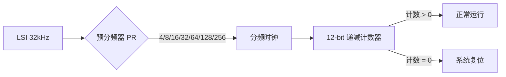
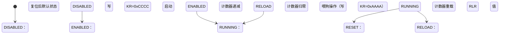

# 第四章 IWDG介绍及应用

## 1. IWDG简介

IWDG（Independent Watchdog，独立看门狗）是 STM32H750VBT6 的**硬件级系统保护机制**，用于在程序跑飞、死循环或系统卡死时**强制复位 MCU**，确保嵌入式系统长期运行的可靠性。其核心特点是**独立于主时钟系统**（由专用低速 LSI 时钟驱动），即使主时钟失效或 CPU 锁死仍能工作，是工业控制、汽车电子等关键场景的必备安全外设。

> 🔍 **关键区别**：
> 
> - **IWDG** = 独立看门狗（LSI 时钟驱动，不可停止，简单可靠）
> - **WWDG** = 窗口看门狗（APB 时钟驱动，有窗口期限制，更精确）  
>   *IWDG 适用于基础看护，WWDG 适用于对喂狗时机有严格要求的场景*

---

### 1.1 IWDG 核心特性（STM32H750VBT6）

| **特性**   | **参数**                                                   | **说明**                                        | **安全价值**               |
| -------- | -------------------------------------------------------- | --------------------------------------------- | ---------------------- |
| **时钟源**  | **LSI (32 kHz)**                                         | 内部低速时钟（独立于 HSE/HSI），典型频率 32 kHz（实际 30–34 kHz） | 主时钟失效时仍可触发复位           |
| **计数器**  | **12-bit 递减计数器**                                         | 从 `IWDG_RLR` 值递减至 0 触发复位                      | 计数范围 0x000–0xFFF（4095） |
| **预分频器** | **4-bit (6 个分频系数)**                                      | 分频系数：`4, 8, 16, 32, 64, 128, 256`             | 灵活配置超时时间（ms 级到秒级）      |
| **复位时间** | **T<sub>out</sub> = (4×2<sup>PR</sup> / LSI) × (RLR+1)** | 最长超时：`PR=6 (256), RLR=4095 → ≈ 32.7 秒`        | 适应不同系统恢复需求             |
| **写保护**  | **关键寄存器锁**                                               | 配置需先写 `IWDG_KR = 0x5555` 解锁                   | 防止误操作导致看门狗失效           |
| **启动机制** | **硬件/软件启动**                                              | 复位后默认关闭，需软件显式启动                               | 避免调试时意外复位              |

📌 **STM32H750VBT6 安全设计**：

- **不可停止性**：一旦启动，**只能通过系统复位关闭**（即使 CPU 锁死）
- **低电压容错**：在 VDD > 1.65V 时仍可工作（符合功能安全标准）
- **双阶段保护**：  
  1️⃣ **计数器溢出** → 触发 `IWDG_PR` 错误中断（可记录故障）  
  2️⃣ **计数器归零** → 产生系统复位（强制恢复）

### 1.2 工作原理详解

#### 1.2.1 时钟与计数逻辑



- **分频计算**：
  
  - `PR = 0` → 分频系数 = 4 → 时钟 = 32kHz / 4 = 8 kHz
  - `PR = 32` → 分频系数 = 32 → 时钟 = 32kHz / 32 = 1 kHz

- **超时时间公式**：  
  **T<sub>out</sub> = (4 × 2<sup>PR</sup> × (RLR + 1)) / LSI_Freq**  
  *示例：PR=32 (32分频), RLR=999, LSI=32kHz → T<sub>out</sub> = (32 × 1000) / 32000 = 1 秒*

#### 1.2.2 关键状态转换



⚠️ **硬件强制规则**：

- 启动后**必须在计数归零前喂狗**，否则触发复位
- 喂狗操作有**最小间隔限制**（需 > 4 个 LSI 周期 ≈ 125 μs）
- **LSI 频率偏差**（±10%）导致超时时间波动，需留安全裕量

---

### 1.3 关键寄存器操作

#### 1.3.1 核心寄存器与配置步骤

| **寄存器**               | **关键位/值**     | **功能**         | **操作顺序**       |
| --------------------- | ------------- | -------------- | -------------- |
| **KR** (Key Register) | `0x5555`      | 解锁 PR/RLR 配置   | **第一步**：解锁寄存器  |
|                       | `0xAAAA`      | 喂狗（重载计数器）      | **周期性操作**      |
|                       | `0xCCCC`      | 启动 IWDG        | **最后一步**：启动看门狗 |
| **PR** (Prescaler)    | `0x0-0x6`     | 设置分频系数 (4→256) | 1. 解锁后配置       |
| **RLR** (Reload)      | `0x000-0xFFF` | 设置重载值（计数初值）    | 2. 配置重载值       |
| **SR** (Status)       | `PVU=1`       | 预分频器更新中        | 检查是否可写 PR      |
|                       | `RVU=1`       | 重载值更新中         | 检查是否可写 RLR     |
|                       | `WVU=1`       | 窗口值更新中         | (IWDG 无窗口功能)   |

#### 1.3.2 配置流程（寄存器级）

```c
// 1. 解锁关键寄存器 (必须先解锁)
IWDG->KR = 0x5555;  

// 2. 配置预分频器 (PR) - 选择分频系数 32 (PR=3)
while (IWDG->SR & IWDG_SR_PVU); // 等待 PR 更新完成
IWDG->PR = 3;                   // 0b011 = 32 分频

// 3. 配置重载值 (RLR) - 1秒超时 (LSI=32kHz)
while (IWDG->SR & IWDG_SR_RVU); // 等待 RLR 更新完成
IWDG->RLR = 999;                // (32 * 1000) / 32 = 1000 → 1秒

// 4. 启动 IWDG (最后一步!)
IWDG->KR = 0xCCCC;  

// 5. 喂狗操作 (在计数归零前重复执行)
IWDG->KR = 0xAAAA;  // 重载计数值
```

## 2. IWDG使用示例-STM32IDE

### 2.1 STM32Cube配置

#### 2.1.1 RCC配置

只在第一章中展示，因为后续内容一样

#### 2.1.2 IWDG配置


### 2.2 用户代码

#### 2.2.1 IWDG初始化

```c
#include "iwdg.h"

/* USER CODE BEGIN 0 */

/* USER CODE END 0 */

IWDG_HandleTypeDef hiwdg1;

/* IWDG1 init function */
void MX_IWDG1_Init(void)
{

  /* USER CODE BEGIN IWDG1_Init 0 */

  /* USER CODE END IWDG1_Init 0 */

  /* USER CODE BEGIN IWDG1_Init 1 */

  /* USER CODE END IWDG1_Init 1 */
  hiwdg1.Instance = IWDG1;
  hiwdg1.Init.Prescaler = IWDG_PRESCALER_64;
  hiwdg1.Init.Window = 499;
  hiwdg1.Init.Reload = 499;
  if (HAL_IWDG_Init(&hiwdg1) != HAL_OK)
  {
    Error_Handler();
  }
  /* USER CODE BEGIN IWDG1_Init 2 */

  /* USER CODE END IWDG1_Init 2 */

}
```

#### 2.2.2 喂狗函数

```c
/* USER CODE BEGIN 1 */
void iwdg_feed(void)
{
	HAL_IWDG_Refresh(&hiwdg1);
}
/* USER CODE END 1 */
```

#### 2.2.3 主函数测试

```c
/* USER CODE BEGIN Header */
/**
  ******************************************************************************
  * @file           : main.c
  * @brief          : Main program body
  ******************************************************************************
  * @attention
  *
  * Copyright (c) 2025 STMicroelectronics.
  * All rights reserved.
  *
  * This software is licensed under terms that can be found in the LICENSE file
  * in the root directory of this software component.
  * If no LICENSE file comes with this software, it is provided AS-IS.
  *
  ******************************************************************************
  */
/* USER CODE END Header */
/* Includes ------------------------------------------------------------------*/
#include "main.h"
#include "iwdg.h"

/* Private includes ----------------------------------------------------------*/
/* USER CODE BEGIN Includes */
#include "bsp_init.h"
#include "stdio.h" // For printf function
/* USER CODE END Includes */

/* Private typedef -----------------------------------------------------------*/
/* USER CODE BEGIN PTD */

/* USER CODE END PTD */

/* Private define ------------------------------------------------------------*/
/* USER CODE BEGIN PD */

/* USER CODE END PD */

/* Private macro -------------------------------------------------------------*/
/* USER CODE BEGIN PM */

/* USER CODE END PM */

/* Private variables ---------------------------------------------------------*/

/* USER CODE BEGIN PV */

/* USER CODE END PV */

/* Private function prototypes -----------------------------------------------*/
void SystemClock_Config(void);
static void MPU_Config(void);
/* USER CODE BEGIN PFP */

/* USER CODE END PFP */

/* Private user code ---------------------------------------------------------*/
/* USER CODE BEGIN 0 */

/* USER CODE END 0 */

/**
  * @brief  The application entry point.
  * @retval int
  */
int main(void)
{

  /* USER CODE BEGIN 1 */

  /* USER CODE END 1 */

  /* MPU Configuration--------------------------------------------------------*/
  MPU_Config();

  /* MCU Configuration--------------------------------------------------------*/

  /* Reset of all peripherals, Initializes the Flash interface and the Systick. */
  HAL_Init();

  /* USER CODE BEGIN Init */

  /* USER CODE END Init */

  /* Configure the system clock */
  SystemClock_Config();

  /* USER CODE BEGIN SysInit */

  /* USER CODE END SysInit */

  /* Initialize all configured peripherals */
  /* USER CODE BEGIN 2 */
  bsp_init();
  /* USER CODE END 2 */
  HAL_GPIO_WritePin(LED_BLUE_Port, LED_BLUE_Pin, RESET); // 不喂狗会熄灭，然后重新初始化
  printf("IWDG Reset Example\r\n");
  /* Infinite loop */
  /* USER CODE BEGIN WHILE */
  while (1)
  {
	  iwdg_feed();
	  HAL_Delay(500); // 喂狗间隔500ms
    /* USER CODE END WHILE */
    /* USER CODE BEGIN 3 */
  }
  /* USER CODE END 3 */
}

/**
  * @brief System Clock Configuration
  * @retval None
  */
void SystemClock_Config(void)
{
  RCC_OscInitTypeDef RCC_OscInitStruct = {0};
  RCC_ClkInitTypeDef RCC_ClkInitStruct = {0};

  /** Supply configuration update enable
  */
  HAL_PWREx_ConfigSupply(PWR_LDO_SUPPLY);

  /** Configure the main internal regulator output voltage
  */
  __HAL_PWR_VOLTAGESCALING_CONFIG(PWR_REGULATOR_VOLTAGE_SCALE0);

  while(!__HAL_PWR_GET_FLAG(PWR_FLAG_VOSRDY)) {}

  /** Initializes the RCC Oscillators according to the specified parameters
  * in the RCC_OscInitTypeDef structure.
  */
  RCC_OscInitStruct.OscillatorType = RCC_OSCILLATORTYPE_LSI|RCC_OSCILLATORTYPE_HSE;
  RCC_OscInitStruct.HSEState = RCC_HSE_ON;
  RCC_OscInitStruct.LSIState = RCC_LSI_ON;
  RCC_OscInitStruct.PLL.PLLState = RCC_PLL_ON;
  RCC_OscInitStruct.PLL.PLLSource = RCC_PLLSOURCE_HSE;
  RCC_OscInitStruct.PLL.PLLM = 2;
  RCC_OscInitStruct.PLL.PLLN = 240;
  RCC_OscInitStruct.PLL.PLLP = 2;
  RCC_OscInitStruct.PLL.PLLQ = 2;
  RCC_OscInitStruct.PLL.PLLR = 2;
  RCC_OscInitStruct.PLL.PLLRGE = RCC_PLL1VCIRANGE_2;
  RCC_OscInitStruct.PLL.PLLVCOSEL = RCC_PLL1VCOWIDE;
  RCC_OscInitStruct.PLL.PLLFRACN = 0;
  if (HAL_RCC_OscConfig(&RCC_OscInitStruct) != HAL_OK)
  {
    Error_Handler();
  }

  /** Initializes the CPU, AHB and APB buses clocks
  */
  RCC_ClkInitStruct.ClockType = RCC_CLOCKTYPE_HCLK|RCC_CLOCKTYPE_SYSCLK
                              |RCC_CLOCKTYPE_PCLK1|RCC_CLOCKTYPE_PCLK2
                              |RCC_CLOCKTYPE_D3PCLK1|RCC_CLOCKTYPE_D1PCLK1;
  RCC_ClkInitStruct.SYSCLKSource = RCC_SYSCLKSOURCE_PLLCLK;
  RCC_ClkInitStruct.SYSCLKDivider = RCC_SYSCLK_DIV1;
  RCC_ClkInitStruct.AHBCLKDivider = RCC_HCLK_DIV2;
  RCC_ClkInitStruct.APB3CLKDivider = RCC_APB3_DIV2;
  RCC_ClkInitStruct.APB1CLKDivider = RCC_APB1_DIV2;
  RCC_ClkInitStruct.APB2CLKDivider = RCC_APB2_DIV2;
  RCC_ClkInitStruct.APB4CLKDivider = RCC_APB4_DIV2;

  if (HAL_RCC_ClockConfig(&RCC_ClkInitStruct, FLASH_LATENCY_4) != HAL_OK)
  {
    Error_Handler();
  }
}

/* USER CODE BEGIN 4 */

/* USER CODE END 4 */

 /* MPU Configuration */

void MPU_Config(void)
{
  MPU_Region_InitTypeDef MPU_InitStruct = {0};

  /* Disables the MPU */
  HAL_MPU_Disable();

  /** Initializes and configures the Region and the memory to be protected
  */
  MPU_InitStruct.Enable = MPU_REGION_ENABLE;
  MPU_InitStruct.Number = MPU_REGION_NUMBER0;
  MPU_InitStruct.BaseAddress = 0x0;
  MPU_InitStruct.Size = MPU_REGION_SIZE_4GB;
  MPU_InitStruct.SubRegionDisable = 0x87;
  MPU_InitStruct.TypeExtField = MPU_TEX_LEVEL0;
  MPU_InitStruct.AccessPermission = MPU_REGION_NO_ACCESS;
  MPU_InitStruct.DisableExec = MPU_INSTRUCTION_ACCESS_DISABLE;
  MPU_InitStruct.IsShareable = MPU_ACCESS_SHAREABLE;
  MPU_InitStruct.IsCacheable = MPU_ACCESS_NOT_CACHEABLE;
  MPU_InitStruct.IsBufferable = MPU_ACCESS_NOT_BUFFERABLE;

  HAL_MPU_ConfigRegion(&MPU_InitStruct);
  /* Enables the MPU */
  HAL_MPU_Enable(MPU_PRIVILEGED_DEFAULT);

}

/**
  * @brief  This function is executed in case of error occurrence.
  * @retval None
  */
void Error_Handler(void)
{
  /* USER CODE BEGIN Error_Handler_Debug */
  /* User can add his own implementation to report the HAL error return state */
  __disable_irq();
  while (1)
  {
  }
  /* USER CODE END Error_Handler_Debug */
}
#ifdef USE_FULL_ASSERT
/**
  * @brief  Reports the name of the source file and the source line number
  *         where the assert_param error has occurred.
  * @param  file: pointer to the source file name
  * @param  line: assert_param error line source number
  * @retval None
  */
void assert_failed(uint8_t *file, uint32_t line)
{
  /* USER CODE BEGIN 6 */
  /* User can add his own implementation to report the file name and line number,
     ex: printf("Wrong parameters value: file %s on line %d\r\n", file, line) */
  /* USER CODE END 6 */
}
#endif /* USE_FULL_ASSERT */

```

## 3. IWDG相关函数总结（HAL库）

### 3.1 初始化与配置

- `HAL_IWDG_Init(IWDG_HandleTypeDef *hiwdg)`  
  初始化独立看门狗（IWDG），**关键前提**：
  
  - **无需使能时钟**（IWDG由LSI自动驱动）
  - **仅需配置一次**，启动后不可停止（除非系统复位）

- **`IWDG_InitTypeDef` 结构体成员说明**：
  
  | **成员**      | **说明**       | **有效范围**                                  | **H750特殊值**           |
  | ----------- | ------------ | ----------------------------------------- | --------------------- |
  | `Prescaler` | LSI时钟预分频系数   | `IWDG_PRESCALER_4` 到 `IWDG_PRESCALER_256` | 推荐`IWDG_PRESCALER_32` |
  | `Reload`    | 计数器重载值       | 0x000-0xFFF                               | 常用0xFFF(4095)         |
  | `Window`    | 窗口值（IWDG不使用） | 0x000-0xFFF                               | 固定`0x0000`            |

- **超时时间计算公式**（核心！）：
  
  ```c
  超时时间 = (Prescaler × (Reload + 1)) / LSI频率
  ```
  
  **H750典型配置**：
  
  ```c
  // LSI ≈ 32kHz (实际26-34kHz，需校准)
  hiwdg.Instance = IWDG;
  hiwdg.Init.Prescaler = IWDG_PRESCALER_32;  // 32分频 → 1kHz计数时钟
  hiwdg.Init.Reload = 4095;                  // 4096计数 → 超时4.096秒
  HAL_IWDG_Init(&hiwdg);                     // 实际超时≈3.5-4.5秒
  ```

- **预分频系数对照表**：
  
  | **宏定义**              | **分频值** | **适用场景**   |
  | -------------------- | ------- | ---------- |
  | `IWDG_PRESCALER_4`   | 4       | 超短超时(毫秒级)  |
  | `IWDG_PRESCALER_8`   | 8       |            |
  | `IWDG_PRESCALER_16`  | 16      |            |
  | `IWDG_PRESCALER_32`  | 32      | **推荐默认值**  |
  | `IWDG_PRESCALER_64`  | 64      |            |
  | `IWDG_PRESCALER_128` | 128     |            |
  | `IWDG_PRESCALER_256` | 256     | 最长超时(约30秒) |

### **3.2 看门狗操作核心函数**

- `HAL_IWDG_Refresh(IWDG_HandleTypeDef *hiwdg)`  
  **喂狗操作**（必须定期调用）：
  
  ```c
  HAL_IWDG_Refresh(&hiwdg);  // 重置计数器为Reload值
  ```
  
  > ✅ **最佳实践**：在主循环关键位置调用，避免任务阻塞导致漏喂

- **状态与错误检测**：
  
  ```c
  HAL_IWDG_GetState(&hiwdg);  // 返回值：HAL_IWDG_STATE_BUSY等
  HAL_IWDG_GetError(&hiwdg);  // 获取错误代码（如HAL_IWDG_ERROR_TIMEOUT）
  ```

- **底层寄存器操作宏**（调试用）：
  
  ```c
  __HAL_IWDG_START(&hiwdg);           // 手动启动IWDG（通常不需要）
  __HAL_IWDG_RELOAD_COUNTER(&hiwdg);  // 等效于Refresh()
  __HAL_IWDG_GET_COUNTER(&hiwdg);     // 读取当前计数值
  ```

### 3.3 高级功能与特性

- **低功耗模式行为**：
  
  | **模式**      | **IWDG状态** | **注意事项**  |
  | ----------- | ---------- | --------- |
  | RUN         | 正常计数       |           |
  | SLEEP       | 继续计数       | 无影响       |
  | STOP0/STOP1 | **暂停计数**   | 需在唤醒后立即喂狗 |
  | STOP2       | **暂停计数**   | 唤醒后需重载计数器 |
  | STANDBY     | **完全关闭**   | 复位后需重新配置  |

- **硬件复位特性**：
  
  - IWDG超时触发**系统复位**（非CPU复位）
  - 可通过`__HAL_RCC_GET_FLAG(RCC_FLAG_IWDGRST)`检测复位源
  
  ```c
  if (__HAL_RCC_GET_FLAG(RCC_FLAG_IWDGRST)) {
      // IWDG导致的复位
      __HAL_RCC_CLEAR_RESET_FLAGS(); // 清除标志
  }
  ```

- **调试模式冻结**：
  
  ```c
  __HAL_DBGMCU_FREEZE_IWDG();  // 调试时暂停IWDG（JTAG连接时）
  __HAL_DBGMCU_UNFREEZE_IWDG(); // 恢复计数
  ```
  
  > ✅ **开发建议**：调试阶段启用冻结，避免频繁复位

### 3.4 使用示例（完整流程）

```c
IWDG_HandleTypeDef hiwdg = {0};

// 1. 配置IWDG参数（超时≈4.1秒）
hiwdg.Instance = IWDG;
hiwdg.Init.Prescaler = IWDG_PRESCALER_32;  // LSI/32 ≈ 1kHz
hiwdg.Init.Reload = 4095;                  // 4096计数
hiwdg.Init.Window = 0x0000;                // IWDG不使用窗口

// 2. 初始化并启动IWDG
if (HAL_IWDG_Init(&hiwdg) != HAL_OK) {
    Error_Handler();  // 初始化失败（通常因IWDG已启动）
}

// 3. 主循环中定期喂狗（示例：每2秒喂一次）
while (1) {
    // ... 业务逻辑代码 ...
    
    // 安全喂狗条件：关键任务完成且无错误
    if (critical_task_completed && !system_error) {
        HAL_IWDG_Refresh(&hiwdg);
    }
    
    HAL_Delay(2000);  // 间隔必须<超时时间
}
```

## 4. 关键注意事项

1. **不可逆启动特性**：
   
   - 一旦调用`HAL_IWDG_Init()`，IWDG将**永久运行**直至系统复位
   - **错误示例**：在复位后多次调用Init() → 导致第二次初始化失败

2. **LSI时钟精度问题**（H750关键）：
   
   | **LSI典型值** | **实际范围** | **对超时影响**  |
   | ---------- | -------- | ---------- |
   | 32kHz      | 26-34kHz | 超时时间偏差±15% |
   | **建议方案**：  |          |            |
   
   - 生产环境使用`IWDG_PRESCALER_32` + `Reload=1024`（目标1秒超时）
   - 通过RTC校准LSI：`__HAL_RCC_CALCULATE_HSI48CLK_FREQ()`

3. **低功耗模式陷阱**：
   
   - **STOP2模式唤醒后必须立即喂狗**：
     
     ```c
     HAL_PWREx_EnableInternalWakeUpLine(); // 使能内部唤醒
     HAL_SuspendTick();                    // 暂停SysTick
     HAL_PWR_EnterSTOP2Mode(PWR_STOPENTRY_WFE);
     
     // 唤醒后关键操作
     SystemClock_Config();                 // 重配时钟
     HAL_IWDG_Refresh(&hiwdg);             // 立即喂狗！
     HAL_ResumeTick();                     // 恢复SysTick
     ```

4. **多任务系统喂狗策略**：
   
   ```c
   // 任务1监护标志
   static volatile uint8_t task1_alive = 0; 
   
   // 任务1执行时置位
   void Task1(void) {
       task1_alive = 1;
       // ... 任务逻辑 ...
   }
   
   // 主循环综合判断
   if(task1_alive && task2_status_ok) {
       HAL_IWDG_Refresh(&hiwdg);
       task1_alive = 0;  // 清除标志
   }
   ```

> ✅ **安全设计**：只有所有关键任务正常运行才喂狗

5. **复位源分析技巧**：
   
   ```c
   void Check_Reset_Source(void)
   {
       if (__HAL_RCC_GET_FLAG(RCC_FLAG_IWDGRST)) {
           log_error("IWDG Reset! Last task: %d", last_active_task);
       }
       __HAL_RCC_CLEAR_RESET_FLAGS();
   }
   ```

---

### 4.1 H750特有优化技巧

| **场景**      | **解决方案**           | **优势**   | **实现代码**                                                    |
| ----------- | ------------------ | -------- | ----------------------------------------------------------- |
| **精确超时**    | LSI校准 + 动态调整Reload | 超时误差<5%  | `RCC->CSR                                                   |
| **STOP2唤醒** | 唤醒后立即喂狗            | 避免虚假复位   | `HAL_PWREx_EnableInternalWakeUpLine(); HAL_IWDG_Refresh();` |
| **多级看门狗**   | IWDG(WWDG配合)       | 捕获不同层级故障 | WWDG监控实时任务，IWDG监控整体系统                                       |
| **调试安全**    | JTAG连接时冻结IWDG      | 避免调试中断复位 | `__HAL_DBGMCU_FREEZE_IWDG();`                               |

> **避坑指南**：
> 
> 1. **禁止在中断中喂狗**：
>    
>    - 中断可能永远不退出导致系统假死
>    - **正确做法**：设置全局标志，主循环检查后喂狗
> 
> 2. **超时时间选择原则**：
>    
>    - 必须 > 最大任务执行时间 × 1.5
>    - 示例：系统最长任务2秒 → 超时至少设为3秒
> 
> 3. **H750复位电路特殊性**：
>    
>    - IWDG复位会清除备份寄存器（但RTC可保留）
>    - 需通过`__HAL_RCC_GET_FLAG(RCC_FLAG_BORRST)`区分电源复位

### 4.2 WDG工作流程图解

```c
┌──────────────┐    ┌─────────────┐    ┌─────────────┐
│  LSI 32kHz   │→   │ 预分频器      │→  │ 计数器递减    │
└──────────────┘    └─────────────┘    └─────────────┘
       │                   │                   │
       ↓                   ↓                   ↓
┌──────────────┐    ┌─────────────┐    ┌─────────────┐
│ 时钟校准模块   │    │ 分频配置     │    │  超时比较     │
└──────────────┘    └─────────────┘    └─────────────┘
                                           │
                                           ▼
                                    ┌─────────────┐
                                    │ 系统复位      │←──(计数器=0)
                                    └─────────────┘
```

---


