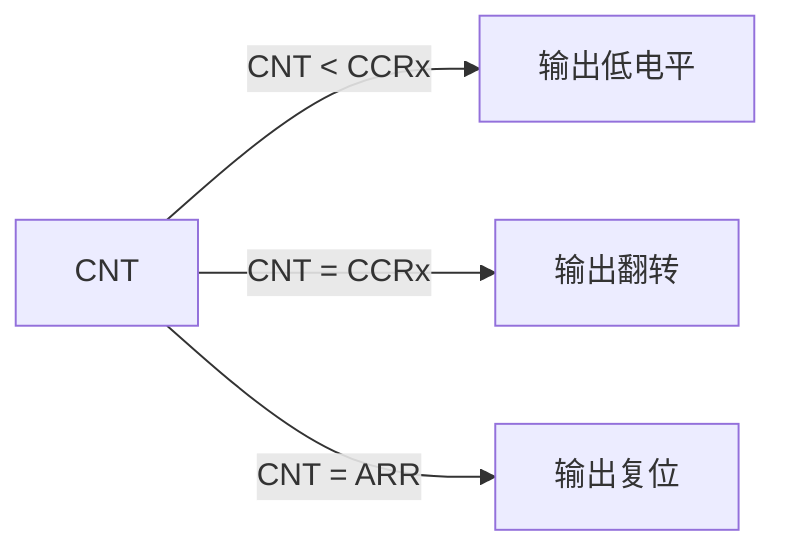

# 第七章 通用定时器介绍及应用

## 1. 通用定时器简介

通用定时器（General-Purpose Timers）是 STM32H750VBT6 中**功能最丰富、应用最广泛**的定时器家族，包含 **TIM2-5（32位）** 和 **TIM9-14（16位）** 共 10 个定时器。它们支持**向上/向下/中央对齐计数**、**输入捕获**、**输出比较**、**PWM 生成**、**编码器接口**等高级功能，是电机控制、信号测量、精确时序控制的核心外设。与基本定时器（TIM6/7）相比，通用定时器具备**完整的通道逻辑**，但设计复杂度显著提高。

> 🔍 **核心定位**：
> 
> - **TIM2/TIM5** = 32-bit 通用定时器（最高 4.29s 计时范围）
> - **TIM3/TIM4** = 高通道数定时器（TIM3 有 4 通道，TIM4 有 3 通道）
> - **TIM9-14** = 精简版通用定时器（2 通道，资源占用小）  
>   *全部位于 APB1_D2（低速）或 APB2（高速）总线，最高时钟 100MHz/200MHz*

---

### 1.1 核心特性对比（STM32H750VBT6）

| **特性**     | **TIM2/TIM5 (32-bit)** | **TIM3/TIM4 (16-bit)** | **TIM9-14 (16-bit)** | **典型应用场景**     |
| ---------- | ---------------------- | ---------------------- | -------------------- | -------------- |
| **计数范围**   | 0xFFFFFFFF (4.29G)     | 0xFFFF (65535)         | 0xFFFF (65535)       | TIM2：超长时延时测量   |
| **时钟源**    | APB1_D2 (100MHz)       | APB1_D2 (100MHz)       | APB2 (200MHz)        | TIM9-14：高速 PWM |
| **计数模式**   | 向上/下/中央对齐              | 向上/下/中央对齐              | 向上/下（无中央对齐）          | 电机控制需中央对齐      |
| **通道数**    | 4                      | TIM3:4, TIM4:3         | 2                    | 多路 PWM 需 TIM3  |
| **特殊功能**   | BKIN 刹车输入              | 编码器接口                  | 简易 PWM               | TIM3：增量式编码器    |
| **DMA 请求** | 8 个通道                  | 8 个通道                  | 4 个通道                | 高速数据采集         |
| **中断源**    | 10+ 个标志位               | 10+ 个标志位               | 6 个标志位               | 复杂时序控制         |
| **典型精度**   | 5 ns @ 200MHz          | 10 ns @ 100MHz         | 5 ns @ 200MHz        | 高速信号生成         |

📌 **STM32H750VBT6 独家优势**：

- **双时钟域支持**：TIM2/5 可配置为 **APB1_D2**（低功耗）或 **APB2**（高性能）
- **硬件级联**：支持定时器主从模式（`MMS` 信号触发其他外设）
- **死区时间插入**（DTG）：高级功能（需配合 BDTR 寄存器）
- **Q1/Q2 编码器接口**：4 倍频模式（最高 50 MHz 计数频率）

---

### 1.2 核心功能原理详解

#### 1.2.1 计数模式与时基生成

- **关键公式**：  
  **T<sub>period</sub> = (ARR + 1) × (PSC + 1) / f<sub>clk</sub>**  
  *示例：TIM2 @ 200MHz, PSC=199, ARR=999 → T<sub>period</sub> = 1000 × 200 / 200,000,000 = 1 μs*

- **32-bit 优势**（TIM2/TIM5）：
  
  - 最大计时范围：**4.29 秒**（ARR=0xFFFFFFFF, PSC=0, f<sub>clk</sub>=100MHz）
  - 避免 16-bit 定时器的**溢出修正问题**（测量长脉冲时无需软件干预）

#### 1.2.2 输入捕获（Input Capture）

🔹 **工作原理**：

1. 外部信号触发 **TIxFPx** 引脚
2. 捕获单元锁存 **CNT** 值到 **CCR**
3. 通过 **CCER/CCMR** 配置边沿检测（上升/下降/双边沿）

🔹 **脉宽测量公式**：

```c
// 假设上升沿捕获值 = CCR1_up, 下降沿捕获值 = CCR1_down
pulse_width = (CCR1_down - CCR1_up) * T_tick; 
period = (CCR1_next_up - CCR1_up) * T_tick;
```

⚠️ **关键限制**：

- 最高捕获频率 ≤ **f<sub>clk</sub>/4**（抗抖动滤波影响）
- 长脉冲测量需启用 **溢出计数器**（软件维护 32-bit 时间戳）

#### 1.2.3 输出比较（Output Compare）

🔹 **PWM 生成模式**：



- **关键寄存器**：
  
  - `CCMRx.OCxM` = PWM 模式选择（110=模式1, 111=模式2）
  - `CCRx` = 占空比设置（`Duty = CCRx / ARR`）

- **死区时间配置**（高级功能）：

```c
TIM1->BDTR = (0x3F << 0)   // DTG[7:0] = 63 → 死区时间 79.375ns @ 200MHz
           | TIM_BDTR_MOE; // 主输出使能
```

---

### 1.3 关键寄存器操作

#### 1.3.1 核心寄存器与配置流程

| **寄存器**   | **关键位域**            | **功能**        | **配置要点**                      |
| --------- | ------------------- | ------------- | ----------------------------- |
| **CR1**   | CEN, DIR, CMS, ARPE | 计数使能、方向、对齐模式  | `CMS=01` = 中央对齐               |
| **PSC**   | PSC[15:0]           | 16-bit 预分频值   | TIM2/PSC[31:0] 可配 32-bit      |
| **ARR**   | ARR[15:0]           | 自动重载值         | `ARPE=1` 时需 `EGR.UG` 更新       |
| **CCMRx** | CCxS, OCxM, ICxF    | 通道配置（输入/输出模式） | 输入：`CCxS=01`<br>输出：`OCxM=110` |
| **CCER**  | CCxP, CCxE          | 通道极性/使能       | `CCxE=1` 启用通道                 |
| **DIER**  | CCxIE, UIE, TDE     | 中断/DMA 使能     | `TDE=1` 使能触发 DMA              |
| **EGR**   | UG, CCxG            | 软件触发事件        | `UG=1` 强制更新                   |

#### 1.3.2 PWM 生成配置步骤（TIM3_CH1）

```c
// 1. 使能时钟 (RCC)
RCC->APB1LENR |= RCC_APB1LENR_TIM3EN;
RCC->AHB4ENR  |= RCC_AHB4ENR_GPIOCEN; // PC6 = TIM3_CH1

// 2. GPIO 配置 (复用推挽)
GPIOC->MODER  |= GPIO_MODER_MODE6_1;  // [13:12]=10 → AF
GPIOC->OTYPER &= ~GPIO_OTYPER_OT6;   // 推挽
GPIOC->OSPEEDR|= GPIO_OSPEEDER_OSPEED6; // 高速
GPIOC->AFR[0] |= 2 << 24;            // PC6 = AF2 (TIM3)

// 3. TIM3 基础配置 (1kHz PWM @ 100MHz)
TIM3->PSC = 99;                      // 100分频 → 1MHz
TIM3->ARR = 999;                     // 1000计数 → 1kHz
TIM3->CCMR1 = TIM_CCMR1_OC1M_2 | TIM_CCMR1_OC1M_1; // PWM模式1
TIM3->CCER = TIM_CCER_CC1E;          // 使能通道1
TIM3->CCR1 = 500;                    // 50% 占空比
TIM3->CR1 = TIM_CR1_CEN;             // 启动计数
```

#### 1.3.3 HAL 库简化操作

```c
TIM_HandleTypeDef htim;
htim.Instance = TIM3;
htim.Init.Prescaler = 99;
htim.Init.Period = 999;
htim.Init.CounterMode = TIM_COUNTERMODE_UP;
htim.Init.ClockDivision = TIM_CLOCKDIVISION_DIV1;
HAL_TIM_PWM_Init(&htim);

TIM_OC_InitTypeDef sConfig;
sConfig.OCMode = TIM_OCMODE_PWM1;
sConfig.Pulse = 500;                 // 占空比
sConfig.OCPolarity = TIM_OCPOLARITY_HIGH;
HAL_TIM_PWM_ConfigChannel(&htim, &sConfig, TIM_CHANNEL_1);
HAL_TIM_PWM_Start(&htim, TIM_CHANNEL_1);
```

## 2. 通用定时器使用示例-STM32IDE

### 2.1 TIM3中断测试

#### 2.1.1 STM32Cube配置


#### 2.1.2 用户代码

```c
/* USER CODE BEGIN Header */
/**
  ******************************************************************************
  * @file    tim.c
  * @brief   This file provides code for the configuration
  *          of the TIM instances.
  ******************************************************************************
  * @attention
  *
  * Copyright (c) 2025 STMicroelectronics.
  * All rights reserved.
  *
  * This software is licensed under terms that can be found in the LICENSE file
  * in the root directory of this software component.
  * If no LICENSE file comes with this software, it is provided AS-IS.
  *
  ******************************************************************************
  */
/* USER CODE END Header */
/* Includes ------------------------------------------------------------------*/
#include "tim.h"

/* USER CODE BEGIN 0 */

/* USER CODE END 0 */

TIM_HandleTypeDef htim3;
TIM_HandleTypeDef htim6;

/* TIM3 init function */
void MX_TIM3_Init(void)
{

  /* USER CODE BEGIN TIM3_Init 0 */

  /* USER CODE END TIM3_Init 0 */

  TIM_ClockConfigTypeDef sClockSourceConfig = {0};
  TIM_MasterConfigTypeDef sMasterConfig = {0};

  /* USER CODE BEGIN TIM3_Init 1 */

  /* USER CODE END TIM3_Init 1 */
  htim3.Instance = TIM3;
  htim3.Init.Prescaler = 9999;
  htim3.Init.CounterMode = TIM_COUNTERMODE_UP;
  htim3.Init.Period = 11999;
  htim3.Init.ClockDivision = TIM_CLOCKDIVISION_DIV1;
  htim3.Init.AutoReloadPreload = TIM_AUTORELOAD_PRELOAD_DISABLE;
  if (HAL_TIM_Base_Init(&htim3) != HAL_OK)
  {
    Error_Handler();
  }
  sClockSourceConfig.ClockSource = TIM_CLOCKSOURCE_INTERNAL;
  if (HAL_TIM_ConfigClockSource(&htim3, &sClockSourceConfig) != HAL_OK)
  {
    Error_Handler();
  }
  sMasterConfig.MasterOutputTrigger = TIM_TRGO_RESET;
  sMasterConfig.MasterSlaveMode = TIM_MASTERSLAVEMODE_DISABLE;
  if (HAL_TIMEx_MasterConfigSynchronization(&htim3, &sMasterConfig) != HAL_OK)
  {
    Error_Handler();
  }
  /* USER CODE BEGIN TIM3_Init 2 */
  HAL_TIM_Base_Start_IT(&htim3); // 启动定时器3及其中断
  /* USER CODE END TIM3_Init 2 */

}
/* TIM6 init function */
void MX_TIM6_Init(void)
{

  /* USER CODE BEGIN TIM6_Init 0 */

  /* USER CODE END TIM6_Init 0 */

  TIM_MasterConfigTypeDef sMasterConfig = {0};

  /* USER CODE BEGIN TIM6_Init 1 */

  /* USER CODE END TIM6_Init 1 */
  htim6.Instance = TIM6;
  htim6.Init.Prescaler = 9999;
  htim6.Init.CounterMode = TIM_COUNTERMODE_UP;
  htim6.Init.Period = 11999;
  htim6.Init.AutoReloadPreload = TIM_AUTORELOAD_PRELOAD_DISABLE;
  if (HAL_TIM_Base_Init(&htim6) != HAL_OK)
  {
    Error_Handler();
  }
  sMasterConfig.MasterOutputTrigger = TIM_TRGO_RESET;
  sMasterConfig.MasterSlaveMode = TIM_MASTERSLAVEMODE_DISABLE;
  if (HAL_TIMEx_MasterConfigSynchronization(&htim6, &sMasterConfig) != HAL_OK)
  {
    Error_Handler();
  }
  /* USER CODE BEGIN TIM6_Init 2 */
  HAL_TIM_Base_Start_IT(&htim6); // 启动定时器6及其中断
  /* USER CODE END TIM6_Init 2 */

}

void HAL_TIM_Base_MspInit(TIM_HandleTypeDef* tim_baseHandle)
{

  if(tim_baseHandle->Instance==TIM3)
  {
  /* USER CODE BEGIN TIM3_MspInit 0 */

  /* USER CODE END TIM3_MspInit 0 */
    /* TIM3 clock enable */
    __HAL_RCC_TIM3_CLK_ENABLE();

    /* TIM3 interrupt Init */
    HAL_NVIC_SetPriority(TIM3_IRQn, 3, 1);
    HAL_NVIC_EnableIRQ(TIM3_IRQn);
  /* USER CODE BEGIN TIM3_MspInit 1 */

  /* USER CODE END TIM3_MspInit 1 */
  }
  else if(tim_baseHandle->Instance==TIM6)
  {
  /* USER CODE BEGIN TIM6_MspInit 0 */

  /* USER CODE END TIM6_MspInit 0 */
    /* TIM6 clock enable */
    __HAL_RCC_TIM6_CLK_ENABLE();

    /* TIM6 interrupt Init */
    HAL_NVIC_SetPriority(TIM6_DAC_IRQn, 1, 3);
    HAL_NVIC_EnableIRQ(TIM6_DAC_IRQn);
  /* USER CODE BEGIN TIM6_MspInit 1 */
  /* USER CODE END TIM6_MspInit 1 */
  }
}

void HAL_TIM_Base_MspDeInit(TIM_HandleTypeDef* tim_baseHandle)
{

  if(tim_baseHandle->Instance==TIM3)
  {
  /* USER CODE BEGIN TIM3_MspDeInit 0 */

  /* USER CODE END TIM3_MspDeInit 0 */
    /* Peripheral clock disable */
    __HAL_RCC_TIM3_CLK_DISABLE();

    /* TIM3 interrupt Deinit */
    HAL_NVIC_DisableIRQ(TIM3_IRQn);
  /* USER CODE BEGIN TIM3_MspDeInit 1 */

  /* USER CODE END TIM3_MspDeInit 1 */
  }
  else if(tim_baseHandle->Instance==TIM6)
  {
  /* USER CODE BEGIN TIM6_MspDeInit 0 */

  /* USER CODE END TIM6_MspDeInit 0 */
    /* Peripheral clock disable */
    __HAL_RCC_TIM6_CLK_DISABLE();

    /* TIM6 interrupt Deinit */
    HAL_NVIC_DisableIRQ(TIM6_DAC_IRQn);
  /* USER CODE BEGIN TIM6_MspDeInit 1 */

  /* USER CODE END TIM6_MspDeInit 1 */
  }
}

/* USER CODE BEGIN 1 */

/* USER CODE END 1 */

```

```c
/* USER CODE BEGIN Header */
/**
  ******************************************************************************
  * @file    stm32h7xx_it.c
  * @brief   Interrupt Service Routines.
  ******************************************************************************
  * @attention
  *
  * Copyright (c) 2025 STMicroelectronics.
  * All rights reserved.
  *
  * This software is licensed under terms that can be found in the LICENSE file
  * in the root directory of this software component.
  * If no LICENSE file comes with this software, it is provided AS-IS.
  *
  ******************************************************************************
  */
/* USER CODE END Header */

/* Includes ------------------------------------------------------------------*/
#include "main.h"
#include "stm32h7xx_it.h"
/* Private includes ----------------------------------------------------------*/
/* USER CODE BEGIN Includes */
#include "usart.h"
#include "exti.h"
#include "led.h"
#include "tim.h"
#include "stdio.h" // For printf function
/* USER CODE END Includes */

/* Private typedef -----------------------------------------------------------*/
/* USER CODE BEGIN TD */
// 定义全局变量
RingBuffer rx_buffer = { .head = 0, .tail = 0 };
uint8_t received_byte;
/* USER CODE END TD */

/* Private define ------------------------------------------------------------*/
/* USER CODE BEGIN PD */

/* USER CODE END PD */

/* Private macro -------------------------------------------------------------*/
/* USER CODE BEGIN PM */

/* USER CODE END PM */

/* Private variables ---------------------------------------------------------*/
/* USER CODE BEGIN PV */

/* USER CODE END PV */

/* Private function prototypes -----------------------------------------------*/
/* USER CODE BEGIN PFP */

/* USER CODE END PFP */

/* Private user code ---------------------------------------------------------*/
/* USER CODE BEGIN 0 */

/* USER CODE END 0 */

/* External variables --------------------------------------------------------*/
extern TIM_HandleTypeDef htim3;
extern TIM_HandleTypeDef htim6;
extern UART_HandleTypeDef huart1;
extern WWDG_HandleTypeDef hwwdg1;
/* USER CODE BEGIN EV */

/* USER CODE END EV */

/******************************************************************************/
/*           Cortex Processor Interruption and Exception Handlers          */
/******************************************************************************/
/**
  * @brief This function handles Non maskable interrupt.
  */
void NMI_Handler(void)
{
  /* USER CODE BEGIN NonMaskableInt_IRQn 0 */

  /* USER CODE END NonMaskableInt_IRQn 0 */
  /* USER CODE BEGIN NonMaskableInt_IRQn 1 */
   while (1)
  {
  }
  /* USER CODE END NonMaskableInt_IRQn 1 */
}

/**
  * @brief This function handles Hard fault interrupt.
  */
void HardFault_Handler(void)
{
  /* USER CODE BEGIN HardFault_IRQn 0 */

  /* USER CODE END HardFault_IRQn 0 */
  while (1)
  {
    /* USER CODE BEGIN W1_HardFault_IRQn 0 */
    /* USER CODE END W1_HardFault_IRQn 0 */
  }
}

/**
  * @brief This function handles Memory management fault.
  */
void MemManage_Handler(void)
{
  /* USER CODE BEGIN MemoryManagement_IRQn 0 */

  /* USER CODE END MemoryManagement_IRQn 0 */
  while (1)
  {
    /* USER CODE BEGIN W1_MemoryManagement_IRQn 0 */
    /* USER CODE END W1_MemoryManagement_IRQn 0 */
  }
}

/**
  * @brief This function handles Pre-fetch fault, memory access fault.
  */
void BusFault_Handler(void)
{
  /* USER CODE BEGIN BusFault_IRQn 0 */

  /* USER CODE END BusFault_IRQn 0 */
  while (1)
  {
    /* USER CODE BEGIN W1_BusFault_IRQn 0 */
    /* USER CODE END W1_BusFault_IRQn 0 */
  }
}

/**
  * @brief This function handles Undefined instruction or illegal state.
  */
void UsageFault_Handler(void)
{
  /* USER CODE BEGIN UsageFault_IRQn 0 */

  /* USER CODE END UsageFault_IRQn 0 */
  while (1)
  {
    /* USER CODE BEGIN W1_UsageFault_IRQn 0 */
    /* USER CODE END W1_UsageFault_IRQn 0 */
  }
}

/**
  * @brief This function handles System service call via SWI instruction.
  */
void SVC_Handler(void)
{
  /* USER CODE BEGIN SVCall_IRQn 0 */

  /* USER CODE END SVCall_IRQn 0 */
  /* USER CODE BEGIN SVCall_IRQn 1 */

  /* USER CODE END SVCall_IRQn 1 */
}

/**
  * @brief This function handles Debug monitor.
  */
void DebugMon_Handler(void)
{
  /* USER CODE BEGIN DebugMonitor_IRQn 0 */

  /* USER CODE END DebugMonitor_IRQn 0 */
  /* USER CODE BEGIN DebugMonitor_IRQn 1 */

  /* USER CODE END DebugMonitor_IRQn 1 */
}

/**
  * @brief This function handles Pendable request for system service.
  */
void PendSV_Handler(void)
{
  /* USER CODE BEGIN PendSV_IRQn 0 */

  /* USER CODE END PendSV_IRQn 0 */
  /* USER CODE BEGIN PendSV_IRQn 1 */

  /* USER CODE END PendSV_IRQn 1 */
}

/**
  * @brief This function handles System tick timer.
  */
void SysTick_Handler(void)
{
  /* USER CODE BEGIN SysTick_IRQn 0 */

  /* USER CODE END SysTick_IRQn 0 */
  HAL_IncTick();
  /* USER CODE BEGIN SysTick_IRQn 1 */

  /* USER CODE END SysTick_IRQn 1 */
}

/******************************************************************************/
/* STM32H7xx Peripheral Interrupt Handlers                                    */
/* Add here the Interrupt Handlers for the used peripherals.                  */
/* For the available peripheral interrupt handler names,                      */
/* please refer to the startup file (startup_stm32h7xx.s).                    */
/******************************************************************************/

/**
  * @brief This function handles Window watchdog interrupt.
  */
void WWDG_IRQHandler(void)
{
  /* USER CODE BEGIN WWDG_IRQn 0 */

  /* USER CODE END WWDG_IRQn 0 */
  HAL_WWDG_IRQHandler(&hwwdg1);
  /* USER CODE BEGIN WWDG_IRQn 1 */
  /* USER CODE END WWDG_IRQn 1 */
}

/**
  * @brief This function handles EXTI line1 interrupt.
  */
void EXTI1_IRQHandler(void)
{
  /* USER CODE BEGIN EXTI1_IRQn 0 */

  /* USER CODE END EXTI1_IRQn 0 */
  HAL_GPIO_EXTI_IRQHandler(EXTI_KEY1_Pin);
  /* USER CODE BEGIN EXTI1_IRQn 1 */

  /* USER CODE END EXTI1_IRQn 1 */
}

/**
  * @brief This function handles TIM3 global interrupt.
  */
void TIM3_IRQHandler(void)
{
  /* USER CODE BEGIN TIM3_IRQn 0 */

  /* USER CODE END TIM3_IRQn 0 */
  HAL_TIM_IRQHandler(&htim3);
  HAL_GPIO_TogglePin(LED_RED_Port, LED_RED_Pin);
  printf("TIM6 Interrupt Triggered!\n");
  /* USER CODE BEGIN TIM3_IRQn 1 */
  /* USER CODE END TIM3_IRQn 1 */
}

/**
  * @brief This function handles USART1 global interrupt.
  */
void USART1_IRQHandler(void)
{
  /* USER CODE BEGIN USART1_IRQn 0 */

  /* USER CODE END USART1_IRQn 0 */
  HAL_UART_IRQHandler(&huart1);
  /* USER CODE BEGIN USART1_IRQn 1 */

  /* USER CODE END USART1_IRQn 1 */
}

/**
  * @brief This function handles TIM6 global interrupt, DAC1_CH1 and DAC1_CH2 underrun error interrupts.
  */
void TIM6_DAC_IRQHandler(void)
{
  /* USER CODE BEGIN TIM6_DAC_IRQn 0 */

  /* USER CODE END TIM6_DAC_IRQn 0 */
  HAL_TIM_IRQHandler(&htim6);
  /* USER CODE BEGIN TIM6_DAC_IRQn 1 */
  /* USER CODE END TIM6_DAC_IRQn 1 */
}

/* USER CODE BEGIN 1 */
#if USE_UART_RX_IT
void HAL_UART_RxCpltCallback(UART_HandleTypeDef *huart)
{
  if (huart->Instance == USART1)
  {
    // 计算下一个写入位置
    uint16_t next_head = (rx_buffer.head + 1) % BUFFER_SIZE;

    // 仅当缓冲区未满时存储数据
    if (next_head != rx_buffer.tail)
    {
      rx_buffer.data[rx_buffer.head] = received_byte;
      rx_buffer.head = next_head;
    }

    // 重新启用接收中断
    HAL_UART_Receive_IT(&huart1, &received_byte, 1);
  }
}
#endif
/* USER CODE END 1 */

```

```c
/* USER CODE BEGIN Header */
/**
  ******************************************************************************
  * @file           : main.c
  * @brief          : Main program body
  ******************************************************************************
  * @attention
  *
  * Copyright (c) 2025 STMicroelectronics.
  * All rights reserved.
  *
  * This software is licensed under terms that can be found in the LICENSE file
  * in the root directory of this software component.
  * If no LICENSE file comes with this software, it is provided AS-IS.
  *
  ******************************************************************************
  */
/* USER CODE END Header */
/* Includes ------------------------------------------------------------------*/
#include "main.h"
#include "tim.h"
/* Private includes ----------------------------------------------------------*/
/* USER CODE BEGIN Includes */
#include "bsp_init.h"
#include "stdio.h" // For printf function
/* USER CODE END Includes */

/* Private typedef -----------------------------------------------------------*/
/* USER CODE BEGIN PTD */

/* USER CODE END PTD */

/* Private define ------------------------------------------------------------*/
/* USER CODE BEGIN PD */

/* USER CODE END PD */

/* Private macro -------------------------------------------------------------*/
/* USER CODE BEGIN PM */

/* USER CODE END PM */

/* Private variables ---------------------------------------------------------*/

/* USER CODE BEGIN PV */

/* USER CODE END PV */

/* Private function prototypes -----------------------------------------------*/
void SystemClock_Config(void);
static void MPU_Config(void);
/* USER CODE BEGIN PFP */

/* USER CODE END PFP */

/* Private user code ---------------------------------------------------------*/
/* USER CODE BEGIN 0 */

/* USER CODE END 0 */

/**
  * @brief  The application entry point.
  * @retval int
  */
int main(void)
{

  /* USER CODE BEGIN 1 */

  /* USER CODE END 1 */

  /* MPU Configuration--------------------------------------------------------*/
  MPU_Config();

  /* MCU Configuration--------------------------------------------------------*/

  /* Reset of all peripherals, Initializes the Flash interface and the Systick. */
  HAL_Init();

  /* USER CODE BEGIN Init */

  /* USER CODE END Init */

  /* Configure the system clock */
  SystemClock_Config();

  /* USER CODE BEGIN SysInit */

  /* USER CODE END SysInit */

  /* Initialize all configured peripherals */
  /* USER CODE BEGIN 2 */
  bsp_init();
  printf("GTIM Interrupt Test\r\n");
  MX_TIM3_Init(); // 溢出时间约500ms
  /* USER CODE END 2 */
  /* Infinite loop */
  /* USER CODE BEGIN WHILE */
  while (1)
  {
    /* USER CODE END WHILE */

    /* USER CODE BEGIN 3 */
  }
  /* USER CODE END 3 */
}

/**
  * @brief System Clock Configuration
  * @retval None
  */
void SystemClock_Config(void)
{
  RCC_OscInitTypeDef RCC_OscInitStruct = {0};
  RCC_ClkInitTypeDef RCC_ClkInitStruct = {0};

  /** Supply configuration update enable
  */
  HAL_PWREx_ConfigSupply(PWR_LDO_SUPPLY);

  /** Configure the main internal regulator output voltage
  */
  __HAL_PWR_VOLTAGESCALING_CONFIG(PWR_REGULATOR_VOLTAGE_SCALE0);

  while(!__HAL_PWR_GET_FLAG(PWR_FLAG_VOSRDY)) {}

  /** Initializes the RCC Oscillators according to the specified parameters
  * in the RCC_OscInitTypeDef structure.
  */
  RCC_OscInitStruct.OscillatorType = RCC_OSCILLATORTYPE_LSI|RCC_OSCILLATORTYPE_HSE;
  RCC_OscInitStruct.HSEState = RCC_HSE_ON;
  RCC_OscInitStruct.LSIState = RCC_LSI_ON;
  RCC_OscInitStruct.PLL.PLLState = RCC_PLL_ON;
  RCC_OscInitStruct.PLL.PLLSource = RCC_PLLSOURCE_HSE;
  RCC_OscInitStruct.PLL.PLLM = 2;
  RCC_OscInitStruct.PLL.PLLN = 240;
  RCC_OscInitStruct.PLL.PLLP = 2;
  RCC_OscInitStruct.PLL.PLLQ = 2;
  RCC_OscInitStruct.PLL.PLLR = 2;
  RCC_OscInitStruct.PLL.PLLRGE = RCC_PLL1VCIRANGE_2;
  RCC_OscInitStruct.PLL.PLLVCOSEL = RCC_PLL1VCOWIDE;
  RCC_OscInitStruct.PLL.PLLFRACN = 0;
  if (HAL_RCC_OscConfig(&RCC_OscInitStruct) != HAL_OK)
  {
    Error_Handler();
  }

  /** Initializes the CPU, AHB and APB buses clocks
  */
  RCC_ClkInitStruct.ClockType = RCC_CLOCKTYPE_HCLK|RCC_CLOCKTYPE_SYSCLK
                              |RCC_CLOCKTYPE_PCLK1|RCC_CLOCKTYPE_PCLK2
                              |RCC_CLOCKTYPE_D3PCLK1|RCC_CLOCKTYPE_D1PCLK1;
  RCC_ClkInitStruct.SYSCLKSource = RCC_SYSCLKSOURCE_PLLCLK;
  RCC_ClkInitStruct.SYSCLKDivider = RCC_SYSCLK_DIV1;
  RCC_ClkInitStruct.AHBCLKDivider = RCC_HCLK_DIV2;
  RCC_ClkInitStruct.APB3CLKDivider = RCC_APB3_DIV2;
  RCC_ClkInitStruct.APB1CLKDivider = RCC_APB1_DIV2;
  RCC_ClkInitStruct.APB2CLKDivider = RCC_APB2_DIV2;
  RCC_ClkInitStruct.APB4CLKDivider = RCC_APB4_DIV2;

  if (HAL_RCC_ClockConfig(&RCC_ClkInitStruct, FLASH_LATENCY_4) != HAL_OK)
  {
    Error_Handler();
  }
}

/* USER CODE BEGIN 4 */

/* USER CODE END 4 */

 /* MPU Configuration */

void MPU_Config(void)
{
  MPU_Region_InitTypeDef MPU_InitStruct = {0};

  /* Disables the MPU */
  HAL_MPU_Disable();

  /** Initializes and configures the Region and the memory to be protected
  */
  MPU_InitStruct.Enable = MPU_REGION_ENABLE;
  MPU_InitStruct.Number = MPU_REGION_NUMBER0;
  MPU_InitStruct.BaseAddress = 0x0;
  MPU_InitStruct.Size = MPU_REGION_SIZE_4GB;
  MPU_InitStruct.SubRegionDisable = 0x87;
  MPU_InitStruct.TypeExtField = MPU_TEX_LEVEL0;
  MPU_InitStruct.AccessPermission = MPU_REGION_NO_ACCESS;
  MPU_InitStruct.DisableExec = MPU_INSTRUCTION_ACCESS_DISABLE;
  MPU_InitStruct.IsShareable = MPU_ACCESS_SHAREABLE;
  MPU_InitStruct.IsCacheable = MPU_ACCESS_NOT_CACHEABLE;
  MPU_InitStruct.IsBufferable = MPU_ACCESS_NOT_BUFFERABLE;

  HAL_MPU_ConfigRegion(&MPU_InitStruct);
  /* Enables the MPU */
  HAL_MPU_Enable(MPU_PRIVILEGED_DEFAULT);

}

/**
  * @brief  This function is executed in case of error occurrence.
  * @retval None
  */
void Error_Handler(void)
{
  /* USER CODE BEGIN Error_Handler_Debug */
  /* User can add his own implementation to report the HAL error return state */
  __disable_irq();
  while (1)
  {
  }
  /* USER CODE END Error_Handler_Debug */
}
#ifdef USE_FULL_ASSERT
/**
  * @brief  Reports the name of the source file and the source line number
  *         where the assert_param error has occurred.
  * @param  file: pointer to the source file name
  * @param  line: assert_param error line source number
  * @retval None
  */
void assert_failed(uint8_t *file, uint32_t line)
{
  /* USER CODE BEGIN 6 */
  /* User can add his own implementation to report the file name and line number,
     ex: printf("Wrong parameters value: file %s on line %d\r\n", file, line) */
  /* USER CODE END 6 */
}
#endif /* USE_FULL_ASSERT */

```

### 2.2 TIM3_CH1输出PWM

#### 2.2.1 STM32Cube配置


#### 2.2.2 用户代码

```c
/* USER CODE BEGIN Header */
/**
  ******************************************************************************
  * @file    tim.c
  * @brief   This file provides code for the configuration
  *          of the TIM instances.
  ******************************************************************************
  * @attention
  *
  * Copyright (c) 2025 STMicroelectronics.
  * All rights reserved.
  *
  * This software is licensed under terms that can be found in the LICENSE file
  * in the root directory of this software component.
  * If no LICENSE file comes with this software, it is provided AS-IS.
  *
  ******************************************************************************
  */
/* USER CODE END Header */
/* Includes ------------------------------------------------------------------*/
#include "tim.h"

/* USER CODE BEGIN 0 */

/* USER CODE END 0 */

TIM_HandleTypeDef htim3;
TIM_HandleTypeDef htim6;

/* TIM3 init function */
void MX_TIM3_Init(void)
{

  /* USER CODE BEGIN TIM3_Init 0 */

  /* USER CODE END TIM3_Init 0 */

  TIM_ClockConfigTypeDef sClockSourceConfig = {0};
  TIM_MasterConfigTypeDef sMasterConfig = {0};
  TIM_OC_InitTypeDef sConfigOC = {0};

  /* USER CODE BEGIN TIM3_Init 1 */

  /* USER CODE END TIM3_Init 1 */
  htim3.Instance = TIM3;
  htim3.Init.Prescaler = 239;
  htim3.Init.CounterMode = TIM_COUNTERMODE_UP;
  htim3.Init.Period = 999;
  htim3.Init.ClockDivision = TIM_CLOCKDIVISION_DIV1;
  htim3.Init.AutoReloadPreload = TIM_AUTORELOAD_PRELOAD_DISABLE;
  if (HAL_TIM_Base_Init(&htim3) != HAL_OK)
  {
    Error_Handler();
  }
  sClockSourceConfig.ClockSource = TIM_CLOCKSOURCE_INTERNAL;
  if (HAL_TIM_ConfigClockSource(&htim3, &sClockSourceConfig) != HAL_OK)
  {
    Error_Handler();
  }
  if (HAL_TIM_PWM_Init(&htim3) != HAL_OK)
  {
    Error_Handler();
  }
  sMasterConfig.MasterOutputTrigger = TIM_TRGO_RESET;
  sMasterConfig.MasterSlaveMode = TIM_MASTERSLAVEMODE_DISABLE;
  if (HAL_TIMEx_MasterConfigSynchronization(&htim3, &sMasterConfig) != HAL_OK)
  {
    Error_Handler();
  }
  sConfigOC.OCMode = TIM_OCMODE_PWM1;
  sConfigOC.Pulse = 0;
  sConfigOC.OCPolarity = TIM_OCPOLARITY_LOW;
  sConfigOC.OCFastMode = TIM_OCFAST_DISABLE;
  if (HAL_TIM_PWM_ConfigChannel(&htim3, &sConfigOC, TIM_CHANNEL_1) != HAL_OK)
  {
    Error_Handler();
  }
  /* USER CODE BEGIN TIM3_Init 2 */
  // HAL_TIM_Base_Start_IT(&htim3); // 启动定时器3及其中断
  /* USER CODE END TIM3_Init 2 */
  HAL_TIM_MspPostInit(&htim3);
  HAL_TIM_PWM_Start(&htim3, TIM_CHANNEL_1); // 启动PWM通道1

}
/* TIM6 init function */
void MX_TIM6_Init(void)
{

  /* USER CODE BEGIN TIM6_Init 0 */

  /* USER CODE END TIM6_Init 0 */

  TIM_MasterConfigTypeDef sMasterConfig = {0};

  /* USER CODE BEGIN TIM6_Init 1 */

  /* USER CODE END TIM6_Init 1 */
  htim6.Instance = TIM6;
  htim6.Init.Prescaler = 9999;
  htim6.Init.CounterMode = TIM_COUNTERMODE_UP;
  htim6.Init.Period = 11999;
  htim6.Init.AutoReloadPreload = TIM_AUTORELOAD_PRELOAD_DISABLE;
  if (HAL_TIM_Base_Init(&htim6) != HAL_OK)
  {
    Error_Handler();
  }
  sMasterConfig.MasterOutputTrigger = TIM_TRGO_RESET;
  sMasterConfig.MasterSlaveMode = TIM_MASTERSLAVEMODE_DISABLE;
  if (HAL_TIMEx_MasterConfigSynchronization(&htim6, &sMasterConfig) != HAL_OK)
  {
    Error_Handler();
  }
  /* USER CODE BEGIN TIM6_Init 2 */
  HAL_TIM_Base_Start_IT(&htim6); // 启动定时器6及其中断
  /* USER CODE END TIM6_Init 2 */

}

void HAL_TIM_Base_MspInit(TIM_HandleTypeDef* tim_baseHandle)
{

  if(tim_baseHandle->Instance==TIM3)
  {
  /* USER CODE BEGIN TIM3_MspInit 0 */

  /* USER CODE END TIM3_MspInit 0 */
    /* TIM3 clock enable */
    __HAL_RCC_TIM3_CLK_ENABLE();

    /* TIM3 interrupt Init */
    HAL_NVIC_SetPriority(TIM3_IRQn, 3, 1);
    HAL_NVIC_EnableIRQ(TIM3_IRQn);
  /* USER CODE BEGIN TIM3_MspInit 1 */

  /* USER CODE END TIM3_MspInit 1 */
  }
  else if(tim_baseHandle->Instance==TIM6)
  {
  /* USER CODE BEGIN TIM6_MspInit 0 */

  /* USER CODE END TIM6_MspInit 0 */
    /* TIM6 clock enable */
    __HAL_RCC_TIM6_CLK_ENABLE();

    /* TIM6 interrupt Init */
    HAL_NVIC_SetPriority(TIM6_DAC_IRQn, 1, 0);
    HAL_NVIC_EnableIRQ(TIM6_DAC_IRQn);
  /* USER CODE BEGIN TIM6_MspInit 1 */
  /* USER CODE END TIM6_MspInit 1 */
  }
}
void HAL_TIM_MspPostInit(TIM_HandleTypeDef* timHandle)
{

  GPIO_InitTypeDef GPIO_InitStruct = {0};
  if(timHandle->Instance==TIM3)
  {
  /* USER CODE BEGIN TIM3_MspPostInit 0 */

  /* USER CODE END TIM3_MspPostInit 0 */

    __HAL_RCC_GPIOB_CLK_ENABLE();
    /**TIM3 GPIO Configuration
    PB4 (NJTRST)     ------> TIM3_CH1
    */
    GPIO_InitStruct.Pin = TIM_LED_Pin;
    GPIO_InitStruct.Mode = GPIO_MODE_AF_PP;
    GPIO_InitStruct.Pull = GPIO_NOPULL;
    GPIO_InitStruct.Speed = GPIO_SPEED_FREQ_LOW;
    GPIO_InitStruct.Alternate = GPIO_AF2_TIM3;
    HAL_GPIO_Init(TIM_LED_GPIO_Port, &GPIO_InitStruct);

  /* USER CODE BEGIN TIM3_MspPostInit 1 */

  /* USER CODE END TIM3_MspPostInit 1 */
  }

}

void HAL_TIM_Base_MspDeInit(TIM_HandleTypeDef* tim_baseHandle)
{

  if(tim_baseHandle->Instance==TIM3)
  {
  /* USER CODE BEGIN TIM3_MspDeInit 0 */

  /* USER CODE END TIM3_MspDeInit 0 */
    /* Peripheral clock disable */
    __HAL_RCC_TIM3_CLK_DISABLE();

    /* TIM3 interrupt Deinit */
    HAL_NVIC_DisableIRQ(TIM3_IRQn);
  /* USER CODE BEGIN TIM3_MspDeInit 1 */

  /* USER CODE END TIM3_MspDeInit 1 */
  }
  else if(tim_baseHandle->Instance==TIM6)
  {
  /* USER CODE BEGIN TIM6_MspDeInit 0 */

  /* USER CODE END TIM6_MspDeInit 0 */
    /* Peripheral clock disable */
    __HAL_RCC_TIM6_CLK_DISABLE();

    /* TIM6 interrupt Deinit */
    HAL_NVIC_DisableIRQ(TIM6_DAC_IRQn);
  /* USER CODE BEGIN TIM6_MspDeInit 1 */

  /* USER CODE END TIM6_MspDeInit 1 */
  }
}

/* USER CODE BEGIN 1 */

/* USER CODE END 1 */

```

```c
/* USER CODE BEGIN Header */
/**
  ******************************************************************************
  * @file           : main.c
  * @brief          : Main program body
  ******************************************************************************
  * @attention
  *
  * Copyright (c) 2025 STMicroelectronics.
  * All rights reserved.
  *
  * This software is licensed under terms that can be found in the LICENSE file
  * in the root directory of this software component.
  * If no LICENSE file comes with this software, it is provided AS-IS.
  *
  ******************************************************************************
  */
/* USER CODE END Header */
/* Includes ------------------------------------------------------------------*/
#include "main.h"
#include "tim.h"
/* Private includes ----------------------------------------------------------*/
/* USER CODE BEGIN Includes */
#include "bsp_init.h"
#include "stdio.h" // For printf function
/* USER CODE END Includes */

/* Private typedef -----------------------------------------------------------*/
/* USER CODE BEGIN PTD */

/* USER CODE END PTD */

/* Private define ------------------------------------------------------------*/
/* USER CODE BEGIN PD */

/* USER CODE END PD */

/* Private macro -------------------------------------------------------------*/
/* USER CODE BEGIN PM */

/* USER CODE END PM */

/* Private variables ---------------------------------------------------------*/

/* USER CODE BEGIN PV */

/* USER CODE END PV */

/* Private function prototypes -----------------------------------------------*/
void SystemClock_Config(void);
static void MPU_Config(void);
extern TIM_HandleTypeDef htim3;
/* USER CODE BEGIN PFP */

/* USER CODE END PFP */

/* Private user code ---------------------------------------------------------*/
/* USER CODE BEGIN 0 */

/* USER CODE END 0 */

/**
  * @brief  The application entry point.
  * @retval int
  */
int main(void)
{
  uint16_t pwm_val = 0; // PWM占空比变量
  uint8_t dir = 1; // 方向变量，1表示增加，0表示减少
  /* USER CODE BEGIN 1 */

  /* USER CODE END 1 */

  /* MPU Configuration--------------------------------------------------------*/
  MPU_Config();

  /* MCU Configuration--------------------------------------------------------*/

  /* Reset of all peripherals, Initializes the Flash interface and the Systick. */
  HAL_Init();

  /* USER CODE BEGIN Init */

  /* USER CODE END Init */

  /* Configure the system clock */
  SystemClock_Config();

  /* USER CODE BEGIN SysInit */

  /* USER CODE END SysInit */

  /* Initialize all configured peripherals */

  /* USER CODE BEGIN 2 */
  bsp_init();
  printf("GTIM PWM Test\r\n");
  MX_TIM3_Init();
  /* USER CODE END 2 */

  /* Infinite loop */
  /* USER CODE BEGIN WHILE */
  while (1)
  {
	  HAL_Delay(5);
	  if(dir)
	  {
		  pwm_val++;
	  }
	  else
	  {
		  pwm_val--;
	  }
	  if(pwm_val >= 500)
	  {
		  dir = 0;
	  }
	  if(pwm_val == 0)
	  {
		  dir = 1;
	  }
	  __HAL_TIM_SET_COMPARE(&htim3, TIM_CHANNEL_1, pwm_val); // 设置PWM占空比
    /* USER CODE END WHILE */
    /* USER CODE BEGIN 3 */
  }
  /* USER CODE END 3 */
}

/**
  * @brief System Clock Configuration
  * @retval None
  */
void SystemClock_Config(void)
{
  RCC_OscInitTypeDef RCC_OscInitStruct = {0};
  RCC_ClkInitTypeDef RCC_ClkInitStruct = {0};

  /** Supply configuration update enable
  */
  HAL_PWREx_ConfigSupply(PWR_LDO_SUPPLY);

  /** Configure the main internal regulator output voltage
  */
  __HAL_PWR_VOLTAGESCALING_CONFIG(PWR_REGULATOR_VOLTAGE_SCALE0);

  while(!__HAL_PWR_GET_FLAG(PWR_FLAG_VOSRDY)) {}

  /** Initializes the RCC Oscillators according to the specified parameters
  * in the RCC_OscInitTypeDef structure.
  */
  RCC_OscInitStruct.OscillatorType = RCC_OSCILLATORTYPE_LSI|RCC_OSCILLATORTYPE_HSE;
  RCC_OscInitStruct.HSEState = RCC_HSE_ON;
  RCC_OscInitStruct.LSIState = RCC_LSI_ON;
  RCC_OscInitStruct.PLL.PLLState = RCC_PLL_ON;
  RCC_OscInitStruct.PLL.PLLSource = RCC_PLLSOURCE_HSE;
  RCC_OscInitStruct.PLL.PLLM = 2;
  RCC_OscInitStruct.PLL.PLLN = 240;
  RCC_OscInitStruct.PLL.PLLP = 2;
  RCC_OscInitStruct.PLL.PLLQ = 2;
  RCC_OscInitStruct.PLL.PLLR = 2;
  RCC_OscInitStruct.PLL.PLLRGE = RCC_PLL1VCIRANGE_2;
  RCC_OscInitStruct.PLL.PLLVCOSEL = RCC_PLL1VCOWIDE;
  RCC_OscInitStruct.PLL.PLLFRACN = 0;
  if (HAL_RCC_OscConfig(&RCC_OscInitStruct) != HAL_OK)
  {
    Error_Handler();
  }

  /** Initializes the CPU, AHB and APB buses clocks
  */
  RCC_ClkInitStruct.ClockType = RCC_CLOCKTYPE_HCLK|RCC_CLOCKTYPE_SYSCLK
                              |RCC_CLOCKTYPE_PCLK1|RCC_CLOCKTYPE_PCLK2
                              |RCC_CLOCKTYPE_D3PCLK1|RCC_CLOCKTYPE_D1PCLK1;
  RCC_ClkInitStruct.SYSCLKSource = RCC_SYSCLKSOURCE_PLLCLK;
  RCC_ClkInitStruct.SYSCLKDivider = RCC_SYSCLK_DIV1;
  RCC_ClkInitStruct.AHBCLKDivider = RCC_HCLK_DIV2;
  RCC_ClkInitStruct.APB3CLKDivider = RCC_APB3_DIV2;
  RCC_ClkInitStruct.APB1CLKDivider = RCC_APB1_DIV2;
  RCC_ClkInitStruct.APB2CLKDivider = RCC_APB2_DIV2;
  RCC_ClkInitStruct.APB4CLKDivider = RCC_APB4_DIV2;

  if (HAL_RCC_ClockConfig(&RCC_ClkInitStruct, FLASH_LATENCY_4) != HAL_OK)
  {
    Error_Handler();
  }
}

/* USER CODE BEGIN 4 */

/* USER CODE END 4 */

 /* MPU Configuration */

void MPU_Config(void)
{
  MPU_Region_InitTypeDef MPU_InitStruct = {0};

  /* Disables the MPU */
  HAL_MPU_Disable();

  /** Initializes and configures the Region and the memory to be protected
  */
  MPU_InitStruct.Enable = MPU_REGION_ENABLE;
  MPU_InitStruct.Number = MPU_REGION_NUMBER0;
  MPU_InitStruct.BaseAddress = 0x0;
  MPU_InitStruct.Size = MPU_REGION_SIZE_4GB;
  MPU_InitStruct.SubRegionDisable = 0x87;
  MPU_InitStruct.TypeExtField = MPU_TEX_LEVEL0;
  MPU_InitStruct.AccessPermission = MPU_REGION_NO_ACCESS;
  MPU_InitStruct.DisableExec = MPU_INSTRUCTION_ACCESS_DISABLE;
  MPU_InitStruct.IsShareable = MPU_ACCESS_SHAREABLE;
  MPU_InitStruct.IsCacheable = MPU_ACCESS_NOT_CACHEABLE;
  MPU_InitStruct.IsBufferable = MPU_ACCESS_NOT_BUFFERABLE;

  HAL_MPU_ConfigRegion(&MPU_InitStruct);
  /* Enables the MPU */
  HAL_MPU_Enable(MPU_PRIVILEGED_DEFAULT);

}

/**
  * @brief  This function is executed in case of error occurrence.
  * @retval None
  */
void Error_Handler(void)
{
  /* USER CODE BEGIN Error_Handler_Debug */
  /* User can add his own implementation to report the HAL error return state */
  __disable_irq();
  while (1)
  {
  }
  /* USER CODE END Error_Handler_Debug */
}
#ifdef USE_FULL_ASSERT
/**
  * @brief  Reports the name of the source file and the source line number
  *         where the assert_param error has occurred.
  * @param  file: pointer to the source file name
  * @param  line: assert_param error line source number
  * @retval None
  */
void assert_failed(uint8_t *file, uint32_t line)
{
  /* USER CODE BEGIN 6 */
  /* User can add his own implementation to report the file name and line number,
     ex: printf("Wrong parameters value: file %s on line %d\r\n", file, line) */
  /* USER CODE END 6 */
}
#endif /* USE_FULL_ASSERT */

```

### 2.3 TIM5_CH1输入捕获

#### 2.3.1 STM32Cube配置


#### 2.3.2 用户代码

```c
/* USER CODE BEGIN Header */
/**
  ******************************************************************************
  * @file    tim.c
  * @brief   This file provides code for the configuration
  *          of the TIM instances.
  ******************************************************************************
  * @attention
  *
  * Copyright (c) 2025 STMicroelectronics.
  * All rights reserved.
  *
  * This software is licensed under terms that can be found in the LICENSE file
  * in the root directory of this software component.
  * If no LICENSE file comes with this software, it is provided AS-IS.
  *
  ******************************************************************************
  */
/* USER CODE END Header */
/* Includes ------------------------------------------------------------------*/
#include "tim.h"

/* USER CODE BEGIN 0 */

/* USER CODE END 0 */

TIM_HandleTypeDef htim3;
TIM_HandleTypeDef htim5;
TIM_HandleTypeDef htim6;

/* TIM3 init function */
void MX_TIM3_Init(void)
{

  /* USER CODE BEGIN TIM3_Init 0 */

  /* USER CODE END TIM3_Init 0 */

  TIM_ClockConfigTypeDef sClockSourceConfig = {0};
  TIM_MasterConfigTypeDef sMasterConfig = {0};
  TIM_OC_InitTypeDef sConfigOC = {0};

  /* USER CODE BEGIN TIM3_Init 1 */

  /* USER CODE END TIM3_Init 1 */
  htim3.Instance = TIM3;
  htim3.Init.Prescaler = 239;
  htim3.Init.CounterMode = TIM_COUNTERMODE_UP;
  htim3.Init.Period = 999;
  htim3.Init.ClockDivision = TIM_CLOCKDIVISION_DIV1;
  htim3.Init.AutoReloadPreload = TIM_AUTORELOAD_PRELOAD_DISABLE;
  if (HAL_TIM_Base_Init(&htim3) != HAL_OK)
  {
    Error_Handler();
  }
  sClockSourceConfig.ClockSource = TIM_CLOCKSOURCE_INTERNAL;
  if (HAL_TIM_ConfigClockSource(&htim3, &sClockSourceConfig) != HAL_OK)
  {
    Error_Handler();
  }
  if (HAL_TIM_PWM_Init(&htim3) != HAL_OK)
  {
    Error_Handler();
  }
  sMasterConfig.MasterOutputTrigger = TIM_TRGO_RESET;
  sMasterConfig.MasterSlaveMode = TIM_MASTERSLAVEMODE_DISABLE;
  if (HAL_TIMEx_MasterConfigSynchronization(&htim3, &sMasterConfig) != HAL_OK)
  {
    Error_Handler();
  }
  sConfigOC.OCMode = TIM_OCMODE_PWM1;
  sConfigOC.Pulse = 0;
  sConfigOC.OCPolarity = TIM_OCPOLARITY_HIGH;
  sConfigOC.OCFastMode = TIM_OCFAST_DISABLE;
  if (HAL_TIM_PWM_ConfigChannel(&htim3, &sConfigOC, TIM_CHANNEL_1) != HAL_OK)
  {
    Error_Handler();
  }
  /* USER CODE BEGIN TIM3_Init 2 */
  // HAL_TIM_Base_Start_IT(&htim3); // 启动定时器3及其中断
  /* USER CODE END TIM3_Init 2 */
  HAL_TIM_MspPostInit(&htim3);

}
/* TIM5 init function */
void MX_TIM5_Init(void)
{

  /* USER CODE BEGIN TIM5_Init 0 */

  /* USER CODE END TIM5_Init 0 */

  TIM_ClockConfigTypeDef sClockSourceConfig = {0};
  TIM_MasterConfigTypeDef sMasterConfig = {0};
  TIM_IC_InitTypeDef sConfigIC = {0};

  /* USER CODE BEGIN TIM5_Init 1 */

  /* USER CODE END TIM5_Init 1 */
  htim5.Instance = TIM5;
  htim5.Init.Prescaler = 479;
  htim5.Init.CounterMode = TIM_COUNTERMODE_UP;
  htim5.Init.Period = 0xFFFFFFFF;
  htim5.Init.ClockDivision = TIM_CLOCKDIVISION_DIV1;
  htim5.Init.AutoReloadPreload = TIM_AUTORELOAD_PRELOAD_DISABLE;
  if (HAL_TIM_Base_Init(&htim5) != HAL_OK)
  {
    Error_Handler();
  }
  sClockSourceConfig.ClockSource = TIM_CLOCKSOURCE_INTERNAL;
  if (HAL_TIM_ConfigClockSource(&htim5, &sClockSourceConfig) != HAL_OK)
  {
    Error_Handler();
  }
  if (HAL_TIM_IC_Init(&htim5) != HAL_OK)
  {
    Error_Handler();
  }
  sMasterConfig.MasterOutputTrigger = TIM_TRGO_RESET;
  sMasterConfig.MasterSlaveMode = TIM_MASTERSLAVEMODE_DISABLE;
  if (HAL_TIMEx_MasterConfigSynchronization(&htim5, &sMasterConfig) != HAL_OK)
  {
    Error_Handler();
  }
  sConfigIC.ICPolarity = TIM_INPUTCHANNELPOLARITY_RISING;
  sConfigIC.ICSelection = TIM_ICSELECTION_DIRECTTI;
  sConfigIC.ICPrescaler = TIM_ICPSC_DIV1;
  sConfigIC.ICFilter = 10;
  if (HAL_TIM_IC_ConfigChannel(&htim5, &sConfigIC, TIM_CHANNEL_1) != HAL_OK)
  {
    Error_Handler();
  }
  /* USER CODE BEGIN TIM5_Init 2 */
  __HAL_TIM_ENABLE_IT(&htim5, TIM_IT_UPDATE); // 使能更新中断
  HAL_TIM_IC_Start_IT(&htim5, TIM_CHANNEL_1); // 启动输入捕获及其中断
  /* USER CODE END TIM5_Init 2 */

}
/* TIM6 init function */
void MX_TIM6_Init(void)
{

  /* USER CODE BEGIN TIM6_Init 0 */

  /* USER CODE END TIM6_Init 0 */

  TIM_MasterConfigTypeDef sMasterConfig = {0};

  /* USER CODE BEGIN TIM6_Init 1 */

  /* USER CODE END TIM6_Init 1 */
  htim6.Instance = TIM6;
  htim6.Init.Prescaler = 9999;
  htim6.Init.CounterMode = TIM_COUNTERMODE_UP;
  htim6.Init.Period = 11999;
  htim6.Init.AutoReloadPreload = TIM_AUTORELOAD_PRELOAD_DISABLE;
  if (HAL_TIM_Base_Init(&htim6) != HAL_OK)
  {
    Error_Handler();
  }
  sMasterConfig.MasterOutputTrigger = TIM_TRGO_RESET;
  sMasterConfig.MasterSlaveMode = TIM_MASTERSLAVEMODE_DISABLE;
  if (HAL_TIMEx_MasterConfigSynchronization(&htim6, &sMasterConfig) != HAL_OK)
  {
    Error_Handler();
  }
  /* USER CODE BEGIN TIM6_Init 2 */
  HAL_TIM_Base_Start_IT(&htim6); // 启动定时器6及其中断
  /* USER CODE END TIM6_Init 2 */

}

void HAL_TIM_Base_MspInit(TIM_HandleTypeDef* tim_baseHandle)
{

  GPIO_InitTypeDef GPIO_InitStruct = {0};
  if(tim_baseHandle->Instance==TIM3)
  {
  /* USER CODE BEGIN TIM3_MspInit 0 */

  /* USER CODE END TIM3_MspInit 0 */
    /* TIM3 clock enable */
    __HAL_RCC_TIM3_CLK_ENABLE();

    /* TIM3 interrupt Init */
    HAL_NVIC_SetPriority(TIM3_IRQn, 0, 0);
    HAL_NVIC_EnableIRQ(TIM3_IRQn);
  /* USER CODE BEGIN TIM3_MspInit 1 */

  /* USER CODE END TIM3_MspInit 1 */
  }
  else if(tim_baseHandle->Instance==TIM5)
  {
  /* USER CODE BEGIN TIM5_MspInit 0 */
  /* USER CODE END TIM5_MspInit 0 */
    /* TIM5 clock enable */
    __HAL_RCC_TIM5_CLK_ENABLE();
    __HAL_RCC_GPIOA_CLK_ENABLE();
    /**TIM5 GPIO Configuration
    PA0     ------> TIM5_CH1
    */
    GPIO_InitStruct.Pin = TIM5_IN_Pin;
    GPIO_InitStruct.Mode = GPIO_MODE_AF_PP;
    GPIO_InitStruct.Pull = GPIO_PULLDOWN;
    GPIO_InitStruct.Speed = GPIO_SPEED_FREQ_LOW;
    GPIO_InitStruct.Alternate = GPIO_AF2_TIM5;
    HAL_GPIO_Init(TIM5_IN_GPIO_Port, &GPIO_InitStruct);
    /* TIM5 interrupt Init */
    HAL_NVIC_SetPriority(TIM5_IRQn, 2, 3);
    HAL_NVIC_EnableIRQ(TIM5_IRQn);
  /* USER CODE BEGIN TIM5_MspInit 1 */
  /* USER CODE END TIM5_MspInit 1 */
  }
  else if(tim_baseHandle->Instance==TIM6)
  {
  /* USER CODE BEGIN TIM6_MspInit 0 */

  /* USER CODE END TIM6_MspInit 0 */
    /* TIM6 clock enable */
    __HAL_RCC_TIM6_CLK_ENABLE();

    /* TIM6 interrupt Init */
    HAL_NVIC_SetPriority(TIM6_DAC_IRQn, 1, 0);
    HAL_NVIC_EnableIRQ(TIM6_DAC_IRQn);
  /* USER CODE BEGIN TIM6_MspInit 1 */
  /* USER CODE END TIM6_MspInit 1 */
  }
}
void HAL_TIM_MspPostInit(TIM_HandleTypeDef* timHandle)
{

  GPIO_InitTypeDef GPIO_InitStruct = {0};
  if(timHandle->Instance==TIM3)
  {
  /* USER CODE BEGIN TIM3_MspPostInit 0 */

  /* USER CODE END TIM3_MspPostInit 0 */

    __HAL_RCC_GPIOB_CLK_ENABLE();
    /**TIM3 GPIO Configuration
    PB4 (NJTRST)     ------> TIM3_CH1
    */
    GPIO_InitStruct.Pin = TIM_LED_Pin;
    GPIO_InitStruct.Mode = GPIO_MODE_AF_PP;
    GPIO_InitStruct.Pull = GPIO_NOPULL;
    GPIO_InitStruct.Speed = GPIO_SPEED_FREQ_LOW;
    GPIO_InitStruct.Alternate = GPIO_AF2_TIM3;
    HAL_GPIO_Init(TIM_LED_GPIO_Port, &GPIO_InitStruct);

  /* USER CODE BEGIN TIM3_MspPostInit 1 */

  /* USER CODE END TIM3_MspPostInit 1 */
  }

}

void HAL_TIM_Base_MspDeInit(TIM_HandleTypeDef* tim_baseHandle)
{

  if(tim_baseHandle->Instance==TIM3)
  {
  /* USER CODE BEGIN TIM3_MspDeInit 0 */

  /* USER CODE END TIM3_MspDeInit 0 */
    /* Peripheral clock disable */
    __HAL_RCC_TIM3_CLK_DISABLE();

    /* TIM3 interrupt Deinit */
    HAL_NVIC_DisableIRQ(TIM3_IRQn);
  /* USER CODE BEGIN TIM3_MspDeInit 1 */

  /* USER CODE END TIM3_MspDeInit 1 */
  }
  else if(tim_baseHandle->Instance==TIM5)
  {
  /* USER CODE BEGIN TIM5_MspDeInit 0 */

  /* USER CODE END TIM5_MspDeInit 0 */
    /* Peripheral clock disable */
    __HAL_RCC_TIM5_CLK_DISABLE();

    /**TIM5 GPIO Configuration
    PA0     ------> TIM5_CH1
    */
    HAL_GPIO_DeInit(TIM5_IN_GPIO_Port, TIM5_IN_Pin);

    /* TIM5 interrupt Deinit */
    HAL_NVIC_DisableIRQ(TIM5_IRQn);
  /* USER CODE BEGIN TIM5_MspDeInit 1 */

  /* USER CODE END TIM5_MspDeInit 1 */
  }
  else if(tim_baseHandle->Instance==TIM6)
  {
  /* USER CODE BEGIN TIM6_MspDeInit 0 */

  /* USER CODE END TIM6_MspDeInit 0 */
    /* Peripheral clock disable */
    __HAL_RCC_TIM6_CLK_DISABLE();

    /* TIM6 interrupt Deinit */
    HAL_NVIC_DisableIRQ(TIM6_DAC_IRQn);
  /* USER CODE BEGIN TIM6_MspDeInit 1 */

  /* USER CODE END TIM6_MspDeInit 1 */
  }
}

/* USER CODE BEGIN 1 */

/* USER CODE END 1 */

```

```c
/* USER CODE BEGIN Header */
/**
  ******************************************************************************
  * @file    stm32h7xx_it.c
  * @brief   Interrupt Service Routines.
  ******************************************************************************
  * @attention
  *
  * Copyright (c) 2025 STMicroelectronics.
  * All rights reserved.
  *
  * This software is licensed under terms that can be found in the LICENSE file
  * in the root directory of this software component.
  * If no LICENSE file comes with this software, it is provided AS-IS.
  *
  ******************************************************************************
  */
/* USER CODE END Header */

/* Includes ------------------------------------------------------------------*/
#include "main.h"
#include "stm32h7xx_it.h"
/* Private includes ----------------------------------------------------------*/
/* USER CODE BEGIN Includes */
#include "usart.h"
#include "exti.h"
#include "led.h"
#include "tim.h"
#include "stdio.h" // For printf function
/* USER CODE END Includes */

/* Private typedef -----------------------------------------------------------*/
/* USER CODE BEGIN TD */
// 定义全局变量
RingBuffer rx_buffer = { .head = 0, .tail = 0 };
uint8_t received_byte;
volatile uint8_t cap_sta = 0; // 捕获状态
volatile uint32_t cap_val = 0; // 捕获值
/* USER CODE END TD */

/* Private define ------------------------------------------------------------*/
/* USER CODE BEGIN PD */

/* USER CODE END PD */

/* Private macro -------------------------------------------------------------*/
/* USER CODE BEGIN PM */

/* USER CODE END PM */

/* Private variables ---------------------------------------------------------*/
/* USER CODE BEGIN PV */

/* USER CODE END PV */

/* Private function prototypes -----------------------------------------------*/
/* USER CODE BEGIN PFP */

/* USER CODE END PFP */

/* Private user code ---------------------------------------------------------*/
/* USER CODE BEGIN 0 */

/* USER CODE END 0 */

/* External variables --------------------------------------------------------*/
extern TIM_HandleTypeDef htim3;
extern TIM_HandleTypeDef htim5;
extern TIM_HandleTypeDef htim6;
extern UART_HandleTypeDef huart1;
extern WWDG_HandleTypeDef hwwdg1;
/* USER CODE BEGIN EV */

/* USER CODE END EV */

/******************************************************************************/
/*           Cortex Processor Interruption and Exception Handlers          */
/******************************************************************************/
/**
  * @brief This function handles Non maskable interrupt.
  */
void NMI_Handler(void)
{
  /* USER CODE BEGIN NonMaskableInt_IRQn 0 */

  /* USER CODE END NonMaskableInt_IRQn 0 */
  /* USER CODE BEGIN NonMaskableInt_IRQn 1 */
   while (1)
  {
  }
  /* USER CODE END NonMaskableInt_IRQn 1 */
}

/**
  * @brief This function handles Hard fault interrupt.
  */
void HardFault_Handler(void)
{
  /* USER CODE BEGIN HardFault_IRQn 0 */

  /* USER CODE END HardFault_IRQn 0 */
  while (1)
  {
    /* USER CODE BEGIN W1_HardFault_IRQn 0 */
    /* USER CODE END W1_HardFault_IRQn 0 */
  }
}

/**
  * @brief This function handles Memory management fault.
  */
void MemManage_Handler(void)
{
  /* USER CODE BEGIN MemoryManagement_IRQn 0 */

  /* USER CODE END MemoryManagement_IRQn 0 */
  while (1)
  {
    /* USER CODE BEGIN W1_MemoryManagement_IRQn 0 */
    /* USER CODE END W1_MemoryManagement_IRQn 0 */
  }
}

/**
  * @brief This function handles Pre-fetch fault, memory access fault.
  */
void BusFault_Handler(void)
{
  /* USER CODE BEGIN BusFault_IRQn 0 */

  /* USER CODE END BusFault_IRQn 0 */
  while (1)
  {
    /* USER CODE BEGIN W1_BusFault_IRQn 0 */
    /* USER CODE END W1_BusFault_IRQn 0 */
  }
}

/**
  * @brief This function handles Undefined instruction or illegal state.
  */
void UsageFault_Handler(void)
{
  /* USER CODE BEGIN UsageFault_IRQn 0 */

  /* USER CODE END UsageFault_IRQn 0 */
  while (1)
  {
    /* USER CODE BEGIN W1_UsageFault_IRQn 0 */
    /* USER CODE END W1_UsageFault_IRQn 0 */
  }
}

/**
  * @brief This function handles System service call via SWI instruction.
  */
void SVC_Handler(void)
{
  /* USER CODE BEGIN SVCall_IRQn 0 */

  /* USER CODE END SVCall_IRQn 0 */
  /* USER CODE BEGIN SVCall_IRQn 1 */

  /* USER CODE END SVCall_IRQn 1 */
}

/**
  * @brief This function handles Debug monitor.
  */
void DebugMon_Handler(void)
{
  /* USER CODE BEGIN DebugMonitor_IRQn 0 */

  /* USER CODE END DebugMonitor_IRQn 0 */
  /* USER CODE BEGIN DebugMonitor_IRQn 1 */

  /* USER CODE END DebugMonitor_IRQn 1 */
}

/**
  * @brief This function handles Pendable request for system service.
  */
void PendSV_Handler(void)
{
  /* USER CODE BEGIN PendSV_IRQn 0 */

  /* USER CODE END PendSV_IRQn 0 */
  /* USER CODE BEGIN PendSV_IRQn 1 */

  /* USER CODE END PendSV_IRQn 1 */
}

/**
  * @brief This function handles System tick timer.
  */
void SysTick_Handler(void)
{
  /* USER CODE BEGIN SysTick_IRQn 0 */

  /* USER CODE END SysTick_IRQn 0 */
  HAL_IncTick();
  /* USER CODE BEGIN SysTick_IRQn 1 */

  /* USER CODE END SysTick_IRQn 1 */
}

/******************************************************************************/
/* STM32H7xx Peripheral Interrupt Handlers                                    */
/* Add here the Interrupt Handlers for the used peripherals.                  */
/* For the available peripheral interrupt handler names,                      */
/* please refer to the startup file (startup_stm32h7xx.s).                    */
/******************************************************************************/

/**
  * @brief This function handles Window watchdog interrupt.
  */
void WWDG_IRQHandler(void)
{
  /* USER CODE BEGIN WWDG_IRQn 0 */

  /* USER CODE END WWDG_IRQn 0 */
  HAL_WWDG_IRQHandler(&hwwdg1);
  /* USER CODE BEGIN WWDG_IRQn 1 */
  /* USER CODE END WWDG_IRQn 1 */
}

/**
  * @brief This function handles EXTI line1 interrupt.
  */
void EXTI1_IRQHandler(void)
{
  /* USER CODE BEGIN EXTI1_IRQn 0 */

  /* USER CODE END EXTI1_IRQn 0 */
  HAL_GPIO_EXTI_IRQHandler(EXTI_KEY1_Pin);
  /* USER CODE BEGIN EXTI1_IRQn 1 */

  /* USER CODE END EXTI1_IRQn 1 */
}

/**
  * @brief This function handles TIM3 global interrupt.
  */
void TIM3_IRQHandler(void)
{
  /* USER CODE BEGIN TIM3_IRQn 0 */

  /* USER CODE END TIM3_IRQn 0 */
  HAL_TIM_IRQHandler(&htim3);
  /* USER CODE BEGIN TIM3_IRQn 1 */
  /* USER CODE END TIM3_IRQn 1 */
}

/**
  * @brief This function handles USART1 global interrupt.
  */
void USART1_IRQHandler(void)
{
  /* USER CODE BEGIN USART1_IRQn 0 */

  /* USER CODE END USART1_IRQn 0 */
  HAL_UART_IRQHandler(&huart1);
  /* USER CODE BEGIN USART1_IRQn 1 */

  /* USER CODE END USART1_IRQn 1 */
}

/**
  * @brief This function handles TIM5 global interrupt.
  */
void TIM5_IRQHandler(void)
{
  /* USER CODE BEGIN TIM5_IRQn 0 */

  /* USER CODE END TIM5_IRQn 0 */
  HAL_TIM_IRQHandler(&htim5);
  /* USER CODE BEGIN TIM5_IRQn 1 */

  /* USER CODE END TIM5_IRQn 1 */
}

// 输入捕获中断回调
void HAL_TIM_IC_CaptureCallback(TIM_HandleTypeDef *htim)
{
	static uint32_t last_capture_time = 0;
	uint32_t current_time = HAL_GetTick();
	// 简单的去抖动：忽略在短时间内连续发生的捕获事件
	if (current_time - last_capture_time < 50) // 50ms去抖动时间
	{
		return;
	}
	last_capture_time = current_time;
    if(htim->Instance == TIM5 && htim->Channel == HAL_TIM_ACTIVE_CHANNEL_1)
    {
        if((cap_sta & 0x80) == 0)
        {
            if(cap_sta & 0x40) // 已经捕获到上升沿
            {
                cap_sta |= 0x80; // 标记捕获完成
                cap_val = HAL_TIM_ReadCapturedValue(htim, TIM_CHANNEL_1);
                // 重置为上升沿捕获，准备下一次测量
                TIM_RESET_CAPTUREPOLARITY(htim, TIM_CHANNEL_1);
                TIM_SET_CAPTUREPOLARITY(htim, TIM_CHANNEL_1, TIM_INPUTCHANNELPOLARITY_RISING);
            }
            else // 首次捕获到上升沿
            {
                cap_sta = 0;
                cap_val = 0;
                cap_sta |= 0x40; // 标记已捕获到上升沿
                __HAL_TIM_DISABLE(htim);
                __HAL_TIM_SET_COUNTER(htim, 0);
                // 设置为下降沿捕获
                TIM_RESET_CAPTUREPOLARITY(htim, TIM_CHANNEL_1);
                TIM_SET_CAPTUREPOLARITY(htim, TIM_CHANNEL_1, TIM_INPUTCHANNELPOLARITY_FALLING);
                __HAL_TIM_ENABLE(htim);
            }
        }
    }
}

// 更新中断回调
void HAL_TIM_PeriodElapsedCallback(TIM_HandleTypeDef *htim)
{
    if(htim->Instance == TIM5)
    {
        if((cap_sta & 0x80) == 0) // 捕获未完成
        {
            if(cap_sta & 0x40) // 已经捕获到上升沿
            {
                if((cap_sta & 0x3F) == 0x3F) // 溢出次数达到最大值
                {
                    // 重置为上升沿捕获
                    TIM_RESET_CAPTUREPOLARITY(htim, TIM_CHANNEL_1);
                    TIM_SET_CAPTUREPOLARITY(htim, TIM_CHANNEL_1, TIM_INPUTCHANNELPOLARITY_RISING);
                    cap_sta = 0;
                    cap_val = 0xFFFF;
                }
                else
                {
                    cap_sta++; // 增加溢出计数
                }
            }
        }
    }
}

/**
  * @brief This function handles TIM6 global interrupt, DAC1_CH1 and DAC1_CH2 underrun error interrupts.
  */
void TIM6_DAC_IRQHandler(void)
{
  /* USER CODE BEGIN TIM6_DAC_IRQn 0 */

  /* USER CODE END TIM6_DAC_IRQn 0 */
  HAL_TIM_IRQHandler(&htim6);
  /* USER CODE BEGIN TIM6_DAC_IRQn 1 */
  /* USER CODE END TIM6_DAC_IRQn 1 */
}

/* USER CODE BEGIN 1 */
#if USE_UART_RX_IT
void HAL_UART_RxCpltCallback(UART_HandleTypeDef *huart)
{
  if (huart->Instance == USART1)
  {
    // 计算下一个写入位置
    uint16_t next_head = (rx_buffer.head + 1) % BUFFER_SIZE;

    // 仅当缓冲区未满时存储数据
    if (next_head != rx_buffer.tail)
    {
      rx_buffer.data[rx_buffer.head] = received_byte;
      rx_buffer.head = next_head;
    }

    // 重新启用接收中断
    HAL_UART_Receive_IT(&huart1, &received_byte, 1);
  }
}
#endif
/* USER CODE END 1 */

```

```c
/* USER CODE BEGIN Header */
/**
  ******************************************************************************
  * @file           : main.c
  * @brief          : Main program body
  ******************************************************************************
  * @attention
  *
  * Copyright (c) 2025 STMicroelectronics.
  * All rights reserved.
  *
  * This software is licensed under terms that can be found in the LICENSE file
  * in the root directory of this software component.
  * If no LICENSE file comes with this software, it is provided AS-IS.
  *
  ******************************************************************************
  */
/* USER CODE END Header */
/* Includes ------------------------------------------------------------------*/
#include "main.h"
#include "tim.h"
#include "stm32h7xx_it.h"
/* Private includes ----------------------------------------------------------*/
/* USER CODE BEGIN Includes */
#include "bsp_init.h"
#include "stdio.h" // For printf function
/* USER CODE END Includes */

/* Private typedef -----------------------------------------------------------*/
/* USER CODE BEGIN PTD */

/* USER CODE END PTD */

/* Private define ------------------------------------------------------------*/
/* USER CODE BEGIN PD */

/* USER CODE END PD */

/* Private macro -------------------------------------------------------------*/
/* USER CODE BEGIN PM */

/* USER CODE END PM */

/* Private variables ---------------------------------------------------------*/

/* USER CODE BEGIN PV */

/* USER CODE END PV */

/* Private function prototypes -----------------------------------------------*/
void SystemClock_Config(void);
static void MPU_Config(void);
/* USER CODE BEGIN PFP */

/* USER CODE END PFP */

/* Private user code ---------------------------------------------------------*/
/* USER CODE BEGIN 0 */

/* USER CODE END 0 */

/**
  * @brief  The application entry point.
  * @retval int
  */
int main(void)
{

  /* USER CODE BEGIN 1 */
  /* USER CODE END 1 */

  /* MPU Configuration--------------------------------------------------------*/
  MPU_Config();

  /* MCU Configuration--------------------------------------------------------*/

  /* Reset of all peripherals, Initializes the Flash interface and the Systick. */
  HAL_Init();

  /* USER CODE BEGIN Init */

  /* USER CODE END Init */

  /* Configure the system clock */
  SystemClock_Config();

  /* USER CODE BEGIN SysInit */

  /* USER CODE END SysInit */

  /* Initialize all configured peripherals */
  /* USER CODE BEGIN 2 */
  bsp_init();
  printf("GTIM In Test\r\n");
  MX_TIM5_Init();
  /* USER CODE END 2 */

  /* Infinite loop */
  /* USER CODE BEGIN WHILE */
  while (1)
  {
    /* USER CODE END WHILE */
	  if(cap_sta & 0x80) // 捕获完成
	  {
	      // 计算高电平时间（微秒）
	      // 定时器时钟 = 480MHz / (479 + 1) = 1MHz，所以每个计数代表1微秒
	      uint32_t overflow_count = cap_sta & 0x3F;
	      uint32_t total_time = overflow_count * 0xFFFF + cap_val;
	      printf("High Time:%lu us\r\n", total_time);
	      cap_sta = 0; // 重置捕获状态
	  }
    /* USER CODE BEGIN 3 */
  }
  /* USER CODE END 3 */
}

/**
  * @brief System Clock Configuration
  * @retval None
  */
void SystemClock_Config(void)
{
  RCC_OscInitTypeDef RCC_OscInitStruct = {0};
  RCC_ClkInitTypeDef RCC_ClkInitStruct = {0};

  /** Supply configuration update enable
  */
  HAL_PWREx_ConfigSupply(PWR_LDO_SUPPLY);

  /** Configure the main internal regulator output voltage
  */
  __HAL_PWR_VOLTAGESCALING_CONFIG(PWR_REGULATOR_VOLTAGE_SCALE0);

  while(!__HAL_PWR_GET_FLAG(PWR_FLAG_VOSRDY)) {}

  /** Initializes the RCC Oscillators according to the specified parameters
  * in the RCC_OscInitTypeDef structure.
  */
  RCC_OscInitStruct.OscillatorType = RCC_OSCILLATORTYPE_LSI|RCC_OSCILLATORTYPE_HSE;
  RCC_OscInitStruct.HSEState = RCC_HSE_ON;
  RCC_OscInitStruct.LSIState = RCC_LSI_ON;
  RCC_OscInitStruct.PLL.PLLState = RCC_PLL_ON;
  RCC_OscInitStruct.PLL.PLLSource = RCC_PLLSOURCE_HSE;
  RCC_OscInitStruct.PLL.PLLM = 2;
  RCC_OscInitStruct.PLL.PLLN = 240;
  RCC_OscInitStruct.PLL.PLLP = 2;
  RCC_OscInitStruct.PLL.PLLQ = 2;
  RCC_OscInitStruct.PLL.PLLR = 2;
  RCC_OscInitStruct.PLL.PLLRGE = RCC_PLL1VCIRANGE_2;
  RCC_OscInitStruct.PLL.PLLVCOSEL = RCC_PLL1VCOWIDE;
  RCC_OscInitStruct.PLL.PLLFRACN = 0;
  if (HAL_RCC_OscConfig(&RCC_OscInitStruct) != HAL_OK)
  {
    Error_Handler();
  }
  /** Initializes the CPU, AHB and APB buses clocks
  */
  RCC_ClkInitStruct.ClockType = RCC_CLOCKTYPE_HCLK|RCC_CLOCKTYPE_SYSCLK
                              |RCC_CLOCKTYPE_PCLK1|RCC_CLOCKTYPE_PCLK2
                              |RCC_CLOCKTYPE_D3PCLK1|RCC_CLOCKTYPE_D1PCLK1;
  RCC_ClkInitStruct.SYSCLKSource = RCC_SYSCLKSOURCE_PLLCLK;
  RCC_ClkInitStruct.SYSCLKDivider = RCC_SYSCLK_DIV1;
  RCC_ClkInitStruct.AHBCLKDivider = RCC_HCLK_DIV2;
  RCC_ClkInitStruct.APB3CLKDivider = RCC_APB3_DIV2;
  RCC_ClkInitStruct.APB1CLKDivider = RCC_APB1_DIV2;
  RCC_ClkInitStruct.APB2CLKDivider = RCC_APB2_DIV2;
  RCC_ClkInitStruct.APB4CLKDivider = RCC_APB4_DIV2;
  if (HAL_RCC_ClockConfig(&RCC_ClkInitStruct, FLASH_LATENCY_4) != HAL_OK)
  {
    Error_Handler();
  }
}
/* USER CODE BEGIN 4 */

/* USER CODE END 4 */

 /* MPU Configuration */

void MPU_Config(void)
{
  MPU_Region_InitTypeDef MPU_InitStruct = {0};

  /* Disables the MPU */
  HAL_MPU_Disable();

  /** Initializes and configures the Region and the memory to be protected
  */
  MPU_InitStruct.Enable = MPU_REGION_ENABLE;
  MPU_InitStruct.Number = MPU_REGION_NUMBER0;
  MPU_InitStruct.BaseAddress = 0x0;
  MPU_InitStruct.Size = MPU_REGION_SIZE_4GB;
  MPU_InitStruct.SubRegionDisable = 0x87;
  MPU_InitStruct.TypeExtField = MPU_TEX_LEVEL0;
  MPU_InitStruct.AccessPermission = MPU_REGION_NO_ACCESS;
  MPU_InitStruct.DisableExec = MPU_INSTRUCTION_ACCESS_DISABLE;
  MPU_InitStruct.IsShareable = MPU_ACCESS_SHAREABLE;
  MPU_InitStruct.IsCacheable = MPU_ACCESS_NOT_CACHEABLE;
  MPU_InitStruct.IsBufferable = MPU_ACCESS_NOT_BUFFERABLE;

  HAL_MPU_ConfigRegion(&MPU_InitStruct);
  /* Enables the MPU */
  HAL_MPU_Enable(MPU_PRIVILEGED_DEFAULT);

}

/**
  * @brief  This function is executed in case of error occurrence.
  * @retval None
  */
void Error_Handler(void)
{
  /* USER CODE BEGIN Error_Handler_Debug */
  /* User can add his own implementation to report the HAL error return state */
  __disable_irq();
  while (1)
  {
  }
  /* USER CODE END Error_Handler_Debug */
}
#ifdef USE_FULL_ASSERT
/**
  * @brief  Reports the name of the source file and the source line number
  *         where the assert_param error has occurred.
  * @param  file: pointer to the source file name
  * @param  line: assert_param error line source number
  * @retval None
  */
void assert_failed(uint8_t *file, uint32_t line)
{
  /* USER CODE BEGIN 6 */
  /* User can add his own implementation to report the file name and line number,
     ex: printf("Wrong parameters value: file %s on line %d\r\n", file, line) */
  /* USER CODE END 6 */
}
#endif /* USE_FULL_ASSERT */

```

### 2.4 TIM2_CH1脉冲计数

#### 2.4.1 STM32Cube配置


#### 2.4.2 用户代码

```c
/* USER CODE BEGIN Header */
/**
  ******************************************************************************
  * @file    tim.c
  * @brief   This file provides code for the configuration
  *          of the TIM instances.
  ******************************************************************************
  * @attention
  *
  * Copyright (c) 2025 STMicroelectronics.
  * All rights reserved.
  *
  * This software is licensed under terms that can be found in the LICENSE file
  * in the root directory of this software component.
  * If no LICENSE file comes with this software, it is provided AS-IS.
  *
  ******************************************************************************
  */
/* USER CODE END Header */
/* Includes ------------------------------------------------------------------*/
#include "tim.h"

/* USER CODE BEGIN 0 */

/* USER CODE END 0 */

TIM_HandleTypeDef htim2;
TIM_HandleTypeDef htim3;
TIM_HandleTypeDef htim5;
TIM_HandleTypeDef htim6;

/* TIM2 init function */
void MX_TIM2_Init(void)
{

  /* USER CODE BEGIN TIM2_Init 0 */

  /* USER CODE END TIM2_Init 0 */

  TIM_SlaveConfigTypeDef sSlaveConfig = {0};
  TIM_MasterConfigTypeDef sMasterConfig = {0};

  /* USER CODE BEGIN TIM2_Init 1 */

  /* USER CODE END TIM2_Init 1 */
  htim2.Instance = TIM2;
  htim2.Init.Prescaler = 0;
  htim2.Init.CounterMode = TIM_COUNTERMODE_UP;
  htim2.Init.Period = 65535;
  htim2.Init.ClockDivision = TIM_CLOCKDIVISION_DIV1;
  htim2.Init.AutoReloadPreload = TIM_AUTORELOAD_PRELOAD_DISABLE;
  if (HAL_TIM_Base_Init(&htim2) != HAL_OK)
  {
    Error_Handler();
  }
  sSlaveConfig.SlaveMode = TIM_SLAVEMODE_EXTERNAL1;
  sSlaveConfig.InputTrigger = TIM_TS_TI1FP1;
  sSlaveConfig.TriggerPolarity = TIM_TRIGGERPOLARITY_RISING;
  sSlaveConfig.TriggerPrescaler = TIM_TRIGGERPRESCALER_DIV1;
  sSlaveConfig.TriggerFilter = 4;
  if (HAL_TIM_SlaveConfigSynchro(&htim2, &sSlaveConfig) != HAL_OK)
  {
    Error_Handler();
  }
  sMasterConfig.MasterOutputTrigger = TIM_TRGO_RESET;
  sMasterConfig.MasterSlaveMode = TIM_MASTERSLAVEMODE_DISABLE;
  if (HAL_TIMEx_MasterConfigSynchronization(&htim2, &sMasterConfig) != HAL_OK)
  {
    Error_Handler();
  }
  /* USER CODE BEGIN TIM2_Init 2 */
  __HAL_TIM_ENABLE_IT(&htim2, TIM_IT_UPDATE); // 使能更新中断
  HAL_TIM_IC_Start_IT(&htim2, TIM_CHANNEL_1); // 启动输入捕获及其中断
  /* USER CODE END TIM2_Init 2 */
}
/* TIM3 init function */
void MX_TIM3_Init(void)
{

  /* USER CODE BEGIN TIM3_Init 0 */

  /* USER CODE END TIM3_Init 0 */

  TIM_ClockConfigTypeDef sClockSourceConfig = {0};
  TIM_MasterConfigTypeDef sMasterConfig = {0};
  TIM_OC_InitTypeDef sConfigOC = {0};

  /* USER CODE BEGIN TIM3_Init 1 */

  /* USER CODE END TIM3_Init 1 */
  htim3.Instance = TIM3;
  htim3.Init.Prescaler = 239;
  htim3.Init.CounterMode = TIM_COUNTERMODE_UP;
  htim3.Init.Period = 999;
  htim3.Init.ClockDivision = TIM_CLOCKDIVISION_DIV1;
  htim3.Init.AutoReloadPreload = TIM_AUTORELOAD_PRELOAD_DISABLE;
  if (HAL_TIM_Base_Init(&htim3) != HAL_OK)
  {
    Error_Handler();
  }
  sClockSourceConfig.ClockSource = TIM_CLOCKSOURCE_INTERNAL;
  if (HAL_TIM_ConfigClockSource(&htim3, &sClockSourceConfig) != HAL_OK)
  {
    Error_Handler();
  }
  if (HAL_TIM_PWM_Init(&htim3) != HAL_OK)
  {
    Error_Handler();
  }
  sMasterConfig.MasterOutputTrigger = TIM_TRGO_RESET;
  sMasterConfig.MasterSlaveMode = TIM_MASTERSLAVEMODE_DISABLE;
  if (HAL_TIMEx_MasterConfigSynchronization(&htim3, &sMasterConfig) != HAL_OK)
  {
    Error_Handler();
  }
  sConfigOC.OCMode = TIM_OCMODE_PWM1;
  sConfigOC.Pulse = 0;
  sConfigOC.OCPolarity = TIM_OCPOLARITY_HIGH;
  sConfigOC.OCFastMode = TIM_OCFAST_DISABLE;
  if (HAL_TIM_PWM_ConfigChannel(&htim3, &sConfigOC, TIM_CHANNEL_1) != HAL_OK)
  {
    Error_Handler();
  }
  /* USER CODE BEGIN TIM3_Init 2 */
  // HAL_TIM_Base_Start_IT(&htim3); // 启动定时器3及其中断
  /* USER CODE END TIM3_Init 2 */
  HAL_TIM_MspPostInit(&htim3);

}
/* TIM5 init function */
void MX_TIM5_Init(void)
{

  /* USER CODE BEGIN TIM5_Init 0 */

  /* USER CODE END TIM5_Init 0 */

  TIM_ClockConfigTypeDef sClockSourceConfig = {0};
  TIM_MasterConfigTypeDef sMasterConfig = {0};

  /* USER CODE BEGIN TIM5_Init 1 */

  /* USER CODE END TIM5_Init 1 */
  htim5.Instance = TIM5;
  htim5.Init.Prescaler = 479;
  htim5.Init.CounterMode = TIM_COUNTERMODE_UP;
  htim5.Init.Period = 0xFFFFFFFF;
  htim5.Init.ClockDivision = TIM_CLOCKDIVISION_DIV1;
  htim5.Init.AutoReloadPreload = TIM_AUTORELOAD_PRELOAD_DISABLE;
  if (HAL_TIM_Base_Init(&htim5) != HAL_OK)
  {
    Error_Handler();
  }
  sClockSourceConfig.ClockSource = TIM_CLOCKSOURCE_INTERNAL;
  if (HAL_TIM_ConfigClockSource(&htim5, &sClockSourceConfig) != HAL_OK)
  {
    Error_Handler();
  }
  sMasterConfig.MasterOutputTrigger = TIM_TRGO_RESET;
  sMasterConfig.MasterSlaveMode = TIM_MASTERSLAVEMODE_DISABLE;
  if (HAL_TIMEx_MasterConfigSynchronization(&htim5, &sMasterConfig) != HAL_OK)
  {
    Error_Handler();
  }
  /* USER CODE BEGIN TIM5_Init 2 */
  __HAL_TIM_ENABLE_IT(&htim5, TIM_IT_UPDATE); // 使能更新中断
  HAL_TIM_IC_Start_IT(&htim5, TIM_CHANNEL_1); // 启动输入捕获及其中断
  /* USER CODE END TIM5_Init 2 */

}
/* TIM6 init function */
void MX_TIM6_Init(void)
{

  /* USER CODE BEGIN TIM6_Init 0 */

  /* USER CODE END TIM6_Init 0 */

  TIM_MasterConfigTypeDef sMasterConfig = {0};

  /* USER CODE BEGIN TIM6_Init 1 */

  /* USER CODE END TIM6_Init 1 */
  htim6.Instance = TIM6;
  htim6.Init.Prescaler = 9999;
  htim6.Init.CounterMode = TIM_COUNTERMODE_UP;
  htim6.Init.Period = 11999;
  htim6.Init.AutoReloadPreload = TIM_AUTORELOAD_PRELOAD_DISABLE;
  if (HAL_TIM_Base_Init(&htim6) != HAL_OK)
  {
    Error_Handler();
  }
  sMasterConfig.MasterOutputTrigger = TIM_TRGO_RESET;
  sMasterConfig.MasterSlaveMode = TIM_MASTERSLAVEMODE_DISABLE;
  if (HAL_TIMEx_MasterConfigSynchronization(&htim6, &sMasterConfig) != HAL_OK)
  {
    Error_Handler();
  }
  /* USER CODE BEGIN TIM6_Init 2 */
  HAL_TIM_Base_Start_IT(&htim6); // 启动定时器6及其中断
  /* USER CODE END TIM6_Init 2 */

}

void HAL_TIM_Base_MspInit(TIM_HandleTypeDef* tim_baseHandle)
{

  GPIO_InitTypeDef GPIO_InitStruct = {0};
  if(tim_baseHandle->Instance==TIM2)
  {
  /* USER CODE BEGIN TIM2_MspInit 0 */

  /* USER CODE END TIM2_MspInit 0 */
    /* TIM2 clock enable */
    __HAL_RCC_TIM2_CLK_ENABLE();

    __HAL_RCC_GPIOA_CLK_ENABLE();
    /**TIM2 GPIO Configuration
    PA0     ------> TIM2_CH1
    */
    GPIO_InitStruct.Pin = TIM2_KEY_Pin;
    GPIO_InitStruct.Mode = GPIO_MODE_AF_PP;
    GPIO_InitStruct.Pull = GPIO_PULLDOWN;
    GPIO_InitStruct.Speed = GPIO_SPEED_FREQ_HIGH;
    GPIO_InitStruct.Alternate = GPIO_AF1_TIM2;
    HAL_GPIO_Init(TIM2_KEY_GPIO_Port, &GPIO_InitStruct);

    /* TIM2 interrupt Init */
    HAL_NVIC_SetPriority(TIM2_IRQn, 2, 2);
    HAL_NVIC_EnableIRQ(TIM2_IRQn);
  /* USER CODE BEGIN TIM2_MspInit 1 */

  /* USER CODE END TIM2_MspInit 1 */
  }
  else if(tim_baseHandle->Instance==TIM3)
  {
  /* USER CODE BEGIN TIM3_MspInit 0 */

  /* USER CODE END TIM3_MspInit 0 */
    /* TIM3 clock enable */
    __HAL_RCC_TIM3_CLK_ENABLE();

    /* TIM3 interrupt Init */
    HAL_NVIC_SetPriority(TIM3_IRQn, 0, 0);
    HAL_NVIC_EnableIRQ(TIM3_IRQn);
  /* USER CODE BEGIN TIM3_MspInit 1 */

  /* USER CODE END TIM3_MspInit 1 */
  }
  else if(tim_baseHandle->Instance==TIM5)
  {
  /* USER CODE BEGIN TIM5_MspInit 0 */
  /* USER CODE END TIM5_MspInit 0 */
    /* TIM5 clock enable */
    __HAL_RCC_TIM5_CLK_ENABLE();

    /* TIM5 interrupt Init */
    HAL_NVIC_SetPriority(TIM5_IRQn, 0, 0);
    HAL_NVIC_EnableIRQ(TIM5_IRQn);
  /* USER CODE BEGIN TIM5_MspInit 1 */
  /* USER CODE END TIM5_MspInit 1 */
  }
  else if(tim_baseHandle->Instance==TIM6)
  {
  /* USER CODE BEGIN TIM6_MspInit 0 */

  /* USER CODE END TIM6_MspInit 0 */
    /* TIM6 clock enable */
    __HAL_RCC_TIM6_CLK_ENABLE();

    /* TIM6 interrupt Init */
    HAL_NVIC_SetPriority(TIM6_DAC_IRQn, 1, 0);
    HAL_NVIC_EnableIRQ(TIM6_DAC_IRQn);
  /* USER CODE BEGIN TIM6_MspInit 1 */
  /* USER CODE END TIM6_MspInit 1 */
  }
}
void HAL_TIM_MspPostInit(TIM_HandleTypeDef* timHandle)
{

  GPIO_InitTypeDef GPIO_InitStruct = {0};
  if(timHandle->Instance==TIM3)
  {
  /* USER CODE BEGIN TIM3_MspPostInit 0 */

  /* USER CODE END TIM3_MspPostInit 0 */

    __HAL_RCC_GPIOB_CLK_ENABLE();
    /**TIM3 GPIO Configuration
    PB4 (NJTRST)     ------> TIM3_CH1
    */
    GPIO_InitStruct.Pin = TIM_LED_Pin;
    GPIO_InitStruct.Mode = GPIO_MODE_AF_PP;
    GPIO_InitStruct.Pull = GPIO_NOPULL;
    GPIO_InitStruct.Speed = GPIO_SPEED_FREQ_LOW;
    GPIO_InitStruct.Alternate = GPIO_AF2_TIM3;
    HAL_GPIO_Init(TIM_LED_GPIO_Port, &GPIO_InitStruct);

  /* USER CODE BEGIN TIM3_MspPostInit 1 */

  /* USER CODE END TIM3_MspPostInit 1 */
  }

}

void HAL_TIM_Base_MspDeInit(TIM_HandleTypeDef* tim_baseHandle)
{

  if(tim_baseHandle->Instance==TIM2)
  {
  /* USER CODE BEGIN TIM2_MspDeInit 0 */

  /* USER CODE END TIM2_MspDeInit 0 */
    /* Peripheral clock disable */
    __HAL_RCC_TIM2_CLK_DISABLE();

    /**TIM2 GPIO Configuration
    PA0     ------> TIM2_CH1
    */
    HAL_GPIO_DeInit(TIM2_KEY_GPIO_Port, TIM2_KEY_Pin);

    /* TIM2 interrupt Deinit */
    HAL_NVIC_DisableIRQ(TIM2_IRQn);
  /* USER CODE BEGIN TIM2_MspDeInit 1 */

  /* USER CODE END TIM2_MspDeInit 1 */
  }
  else if(tim_baseHandle->Instance==TIM3)
  {
  /* USER CODE BEGIN TIM3_MspDeInit 0 */

  /* USER CODE END TIM3_MspDeInit 0 */
    /* Peripheral clock disable */
    __HAL_RCC_TIM3_CLK_DISABLE();

    /* TIM3 interrupt Deinit */
    HAL_NVIC_DisableIRQ(TIM3_IRQn);
  /* USER CODE BEGIN TIM3_MspDeInit 1 */

  /* USER CODE END TIM3_MspDeInit 1 */
  }
  else if(tim_baseHandle->Instance==TIM5)
  {
  /* USER CODE BEGIN TIM5_MspDeInit 0 */

  /* USER CODE END TIM5_MspDeInit 0 */
    /* Peripheral clock disable */
    __HAL_RCC_TIM5_CLK_DISABLE();

    /* TIM5 interrupt Deinit */
    HAL_NVIC_DisableIRQ(TIM5_IRQn);
  /* USER CODE BEGIN TIM5_MspDeInit 1 */

  /* USER CODE END TIM5_MspDeInit 1 */
  }
  else if(tim_baseHandle->Instance==TIM6)
  {
  /* USER CODE BEGIN TIM6_MspDeInit 0 */

  /* USER CODE END TIM6_MspDeInit 0 */
    /* Peripheral clock disable */
    __HAL_RCC_TIM6_CLK_DISABLE();

    /* TIM6 interrupt Deinit */
    HAL_NVIC_DisableIRQ(TIM6_DAC_IRQn);
  /* USER CODE BEGIN TIM6_MspDeInit 1 */

  /* USER CODE END TIM6_MspDeInit 1 */
  }
}

/* USER CODE BEGIN 1 */

// 记录TIM2溢出次数，求总脉冲个数
uint32_t tim2_overflow_count = 0;

// 获取当前计数值
uint32_t tim2_get_count(void)
{
	uint32_t count = 0;
	count = tim2_overflow_count * 65536 + __HAL_TIM_GET_COUNTER(&htim2);
	return count;
}

// 重启计数器
void tim2_restart_count(void)
{
	__HAL_TIM_DISABLE(&htim2);
	tim2_overflow_count = 0;
	__HAL_TIM_SET_COUNTER(&htim2, 0);
	__HAL_TIM_ENABLE(&htim2);
}


/**
  * @brief This function handles TIM2 global interrupt.
  */
void TIM2_IRQHandler(void)
{
  /* USER CODE BEGIN TIM2_IRQn 0 */
  if(__HAL_TIM_GET_FLAG(&htim2, TIM_FLAG_UPDATE) != RESET) // 检查更新中断标志
  {
	tim2_overflow_count++; // 增加溢出计数
  }
  __HAL_TIM_CLEAR_FLAG(&htim2, TIM_FLAG_UPDATE); // 清除中断标志
  /* USER CODE END TIM2_IRQn 0 */
  HAL_TIM_IRQHandler(&htim2);
  /* USER CODE BEGIN TIM2_IRQn 1 */

  /* USER CODE END TIM2_IRQn 1 */
}
/* USER CODE END 1 */

```

```c
/* USER CODE BEGIN Header */
/**
  ******************************************************************************
  * @file    stm32h7xx_it.c
  * @brief   Interrupt Service Routines.
  ******************************************************************************
  * @attention
  *
  * Copyright (c) 2025 STMicroelectronics.
  * All rights reserved.
  *
  * This software is licensed under terms that can be found in the LICENSE file
  * in the root directory of this software component.
  * If no LICENSE file comes with this software, it is provided AS-IS.
  *
  ******************************************************************************
  */
/* USER CODE END Header */

/* Includes ------------------------------------------------------------------*/
#include "main.h"
#include "stm32h7xx_it.h"
/* Private includes ----------------------------------------------------------*/
/* USER CODE BEGIN Includes */
#include "usart.h"
#include "exti.h"
#include "led.h"
#include "tim.h"
#include "stdio.h" // For printf function
/* USER CODE END Includes */

/* Private typedef -----------------------------------------------------------*/
/* USER CODE BEGIN TD */
// 定义全局变量
RingBuffer rx_buffer = { .head = 0, .tail = 0 };
uint8_t received_byte;
/* USER CODE END TD */

/* Private define ------------------------------------------------------------*/
/* USER CODE BEGIN PD */

/* USER CODE END PD */

/* Private macro -------------------------------------------------------------*/
/* USER CODE BEGIN PM */

/* USER CODE END PM */

/* Private variables ---------------------------------------------------------*/
/* USER CODE BEGIN PV */

/* USER CODE END PV */

/* Private function prototypes -----------------------------------------------*/
/* USER CODE BEGIN PFP */

/* USER CODE END PFP */

/* Private user code ---------------------------------------------------------*/
/* USER CODE BEGIN 0 */

/* USER CODE END 0 */

/* External variables --------------------------------------------------------*/
extern TIM_HandleTypeDef htim2;
extern TIM_HandleTypeDef htim3;
extern TIM_HandleTypeDef htim5;
extern TIM_HandleTypeDef htim6;
extern UART_HandleTypeDef huart1;
extern WWDG_HandleTypeDef hwwdg1;
/* USER CODE BEGIN EV */

/* USER CODE END EV */

/******************************************************************************/
/*           Cortex Processor Interruption and Exception Handlers          */
/******************************************************************************/
/**
  * @brief This function handles Non maskable interrupt.
  */
void NMI_Handler(void)
{
  /* USER CODE BEGIN NonMaskableInt_IRQn 0 */

  /* USER CODE END NonMaskableInt_IRQn 0 */
  /* USER CODE BEGIN NonMaskableInt_IRQn 1 */
   while (1)
  {
  }
  /* USER CODE END NonMaskableInt_IRQn 1 */
}

/**
  * @brief This function handles Hard fault interrupt.
  */
void HardFault_Handler(void)
{
  /* USER CODE BEGIN HardFault_IRQn 0 */

  /* USER CODE END HardFault_IRQn 0 */
  while (1)
  {
    /* USER CODE BEGIN W1_HardFault_IRQn 0 */
    /* USER CODE END W1_HardFault_IRQn 0 */
  }
}

/**
  * @brief This function handles Memory management fault.
  */
void MemManage_Handler(void)
{
  /* USER CODE BEGIN MemoryManagement_IRQn 0 */

  /* USER CODE END MemoryManagement_IRQn 0 */
  while (1)
  {
    /* USER CODE BEGIN W1_MemoryManagement_IRQn 0 */
    /* USER CODE END W1_MemoryManagement_IRQn 0 */
  }
}

/**
  * @brief This function handles Pre-fetch fault, memory access fault.
  */
void BusFault_Handler(void)
{
  /* USER CODE BEGIN BusFault_IRQn 0 */

  /* USER CODE END BusFault_IRQn 0 */
  while (1)
  {
    /* USER CODE BEGIN W1_BusFault_IRQn 0 */
    /* USER CODE END W1_BusFault_IRQn 0 */
  }
}

/**
  * @brief This function handles Undefined instruction or illegal state.
  */
void UsageFault_Handler(void)
{
  /* USER CODE BEGIN UsageFault_IRQn 0 */

  /* USER CODE END UsageFault_IRQn 0 */
  while (1)
  {
    /* USER CODE BEGIN W1_UsageFault_IRQn 0 */
    /* USER CODE END W1_UsageFault_IRQn 0 */
  }
}

/**
  * @brief This function handles System service call via SWI instruction.
  */
void SVC_Handler(void)
{
  /* USER CODE BEGIN SVCall_IRQn 0 */

  /* USER CODE END SVCall_IRQn 0 */
  /* USER CODE BEGIN SVCall_IRQn 1 */

  /* USER CODE END SVCall_IRQn 1 */
}

/**
  * @brief This function handles Debug monitor.
  */
void DebugMon_Handler(void)
{
  /* USER CODE BEGIN DebugMonitor_IRQn 0 */

  /* USER CODE END DebugMonitor_IRQn 0 */
  /* USER CODE BEGIN DebugMonitor_IRQn 1 */

  /* USER CODE END DebugMonitor_IRQn 1 */
}

/**
  * @brief This function handles Pendable request for system service.
  */
void PendSV_Handler(void)
{
  /* USER CODE BEGIN PendSV_IRQn 0 */

  /* USER CODE END PendSV_IRQn 0 */
  /* USER CODE BEGIN PendSV_IRQn 1 */

  /* USER CODE END PendSV_IRQn 1 */
}

/**
  * @brief This function handles System tick timer.
  */
void SysTick_Handler(void)
{
  /* USER CODE BEGIN SysTick_IRQn 0 */

  /* USER CODE END SysTick_IRQn 0 */
  HAL_IncTick();
  /* USER CODE BEGIN SysTick_IRQn 1 */

  /* USER CODE END SysTick_IRQn 1 */
}

/******************************************************************************/
/* STM32H7xx Peripheral Interrupt Handlers                                    */
/* Add here the Interrupt Handlers for the used peripherals.                  */
/* For the available peripheral interrupt handler names,                      */
/* please refer to the startup file (startup_stm32h7xx.s).                    */
/******************************************************************************/

/**
  * @brief This function handles Window watchdog interrupt.
  */
void WWDG_IRQHandler(void)
{
  /* USER CODE BEGIN WWDG_IRQn 0 */

  /* USER CODE END WWDG_IRQn 0 */
  HAL_WWDG_IRQHandler(&hwwdg1);
  /* USER CODE BEGIN WWDG_IRQn 1 */
  /* USER CODE END WWDG_IRQn 1 */
}

/**
  * @brief This function handles EXTI line1 interrupt.
  */
void EXTI1_IRQHandler(void)
{
  /* USER CODE BEGIN EXTI1_IRQn 0 */

  /* USER CODE END EXTI1_IRQn 0 */
  HAL_GPIO_EXTI_IRQHandler(EXTI_KEY1_Pin);
  /* USER CODE BEGIN EXTI1_IRQn 1 */

  /* USER CODE END EXTI1_IRQn 1 */
}


/**
  * @brief This function handles TIM3 global interrupt.
  */
void TIM3_IRQHandler(void)
{
  /* USER CODE BEGIN TIM3_IRQn 0 */

  /* USER CODE END TIM3_IRQn 0 */
  HAL_TIM_IRQHandler(&htim3);
  /* USER CODE BEGIN TIM3_IRQn 1 */
  /* USER CODE END TIM3_IRQn 1 */
}

/**
  * @brief This function handles USART1 global interrupt.
  */
void USART1_IRQHandler(void)
{
  /* USER CODE BEGIN USART1_IRQn 0 */

  /* USER CODE END USART1_IRQn 0 */
  HAL_UART_IRQHandler(&huart1);
  /* USER CODE BEGIN USART1_IRQn 1 */

  /* USER CODE END USART1_IRQn 1 */
}

/**
  * @brief This function handles TIM5 global interrupt.
  */
void TIM5_IRQHandler(void)
{
  /* USER CODE BEGIN TIM5_IRQn 0 */

  /* USER CODE END TIM5_IRQn 0 */
  HAL_TIM_IRQHandler(&htim5);
  /* USER CODE BEGIN TIM5_IRQn 1 */

  /* USER CODE END TIM5_IRQn 1 */
}

/**
  * @brief This function handles TIM6 global interrupt, DAC1_CH1 and DAC1_CH2 underrun error interrupts.
  */
void TIM6_DAC_IRQHandler(void)
{
  /* USER CODE BEGIN TIM6_DAC_IRQn 0 */

  /* USER CODE END TIM6_DAC_IRQn 0 */
  HAL_TIM_IRQHandler(&htim6);
  /* USER CODE BEGIN TIM6_DAC_IRQn 1 */
  /* USER CODE END TIM6_DAC_IRQn 1 */
}

/* USER CODE BEGIN 1 */
#if USE_UART_RX_IT
void HAL_UART_RxCpltCallback(UART_HandleTypeDef *huart)
{
  if (huart->Instance == USART1)
  {
    // 计算下一个写入位置
    uint16_t next_head = (rx_buffer.head + 1) % BUFFER_SIZE;

    // 仅当缓冲区未满时存储数据
    if (next_head != rx_buffer.tail)
    {
      rx_buffer.data[rx_buffer.head] = received_byte;
      rx_buffer.head = next_head;
    }

    // 重新启用接收中断
    HAL_UART_Receive_IT(&huart1, &received_byte, 1);
  }
}
#endif
/* USER CODE END 1 */

```

```c
/* USER CODE BEGIN Header */
/**
  ******************************************************************************
  * @file           : main.c
  * @brief          : Main program body
  ******************************************************************************
  * @attention
  *
  * Copyright (c) 2025 STMicroelectronics.
  * All rights reserved.
  *
  * This software is licensed under terms that can be found in the LICENSE file
  * in the root directory of this software component.
  * If no LICENSE file comes with this software, it is provided AS-IS.
  *
  ******************************************************************************
  */
/* USER CODE END Header */
/* Includes ------------------------------------------------------------------*/
#include "main.h"
#include "tim.h"

/* Private includes ----------------------------------------------------------*/
/* USER CODE BEGIN Includes */
#include "bsp_init.h"
#include "stdio.h" // For printf function
/* USER CODE END Includes */

/* Private typedef -----------------------------------------------------------*/
/* USER CODE BEGIN PTD */

/* USER CODE END PTD */

/* Private define ------------------------------------------------------------*/
/* USER CODE BEGIN PD */

/* USER CODE END PD */

/* Private macro -------------------------------------------------------------*/
/* USER CODE BEGIN PM */

/* USER CODE END PM */

/* Private variables ---------------------------------------------------------*/

/* USER CODE BEGIN PV */

/* USER CODE END PV */

/* Private function prototypes -----------------------------------------------*/
void SystemClock_Config(void);
static void MPU_Config(void);
/* USER CODE BEGIN PFP */

/* USER CODE END PFP */

/* Private user code ---------------------------------------------------------*/
/* USER CODE BEGIN 0 */

/* USER CODE END 0 */

/**
  * @brief  The application entry point.
  * @retval int
  */
int main(void)
{
  uint32_t now_cnt = 0;
  uint32_t last_cnt = 0;
  uint8_t key_value = 0;
  uint8_t i = 0;
  /* USER CODE BEGIN 1 */
  /* USER CODE END 1 */

  /* MPU Configuration--------------------------------------------------------*/
  MPU_Config();

  /* MCU Configuration--------------------------------------------------------*/

  /* Reset of all peripherals, Initializes the Flash interface and the Systick. */
  HAL_Init();

  /* USER CODE BEGIN Init */

  /* USER CODE END Init */

  /* Configure the system clock */
  SystemClock_Config();

  /* USER CODE BEGIN SysInit */

  /* USER CODE END SysInit */

  /* Initialize all configured peripherals */
  /* USER CODE BEGIN 2 */
  bsp_init();
  printf("GTIM Pluse Test\r\n");
  MX_TIM2_Init();
  tim2_restart_count(); // 重启计数器
  /* USER CODE END 2 */

  /* Infinite loop */
  /* USER CODE BEGIN WHILE */
  while (1)
  {
    /* USER CODE END WHILE */
	  key_value = key_scan(0);
	  if(key_value == KEY0_PRES)
	  {
		  tim2_restart_count(); // 重启计数器
		  printf("TIM2 Count Restart\r\n");
	  }
	  now_cnt = tim2_get_count();
	  if(now_cnt != last_cnt)
	  {
		  last_cnt = now_cnt;
		  printf("TIM2 Count: %lu\r\n", now_cnt);
	  }
	  i++;
	  if(i >= 20)
	  {
		  i = 0;
		  HAL_GPIO_TogglePin(LED_RED_Port, LED_RED_Pin);
	  }
	  HAL_Delay(10);
    /* USER CODE BEGIN 3 */
  }
  /* USER CODE END 3 */
}

/**
  * @brief System Clock Configuration
  * @retval None
  */
void SystemClock_Config(void)
{
  RCC_OscInitTypeDef RCC_OscInitStruct = {0};
  RCC_ClkInitTypeDef RCC_ClkInitStruct = {0};

  /** Supply configuration update enable
  */
  HAL_PWREx_ConfigSupply(PWR_LDO_SUPPLY);

  /** Configure the main internal regulator output voltage
  */
  __HAL_PWR_VOLTAGESCALING_CONFIG(PWR_REGULATOR_VOLTAGE_SCALE0);

  while(!__HAL_PWR_GET_FLAG(PWR_FLAG_VOSRDY)) {}

  /** Initializes the RCC Oscillators according to the specified parameters
  * in the RCC_OscInitTypeDef structure.
  */
  RCC_OscInitStruct.OscillatorType = RCC_OSCILLATORTYPE_LSI|RCC_OSCILLATORTYPE_HSE;
  RCC_OscInitStruct.HSEState = RCC_HSE_ON;
  RCC_OscInitStruct.LSIState = RCC_LSI_ON;
  RCC_OscInitStruct.PLL.PLLState = RCC_PLL_ON;
  RCC_OscInitStruct.PLL.PLLSource = RCC_PLLSOURCE_HSE;
  RCC_OscInitStruct.PLL.PLLM = 2;
  RCC_OscInitStruct.PLL.PLLN = 240;
  RCC_OscInitStruct.PLL.PLLP = 2;
  RCC_OscInitStruct.PLL.PLLQ = 2;
  RCC_OscInitStruct.PLL.PLLR = 2;
  RCC_OscInitStruct.PLL.PLLRGE = RCC_PLL1VCIRANGE_2;
  RCC_OscInitStruct.PLL.PLLVCOSEL = RCC_PLL1VCOWIDE;
  RCC_OscInitStruct.PLL.PLLFRACN = 0;
  if (HAL_RCC_OscConfig(&RCC_OscInitStruct) != HAL_OK)
  {
    Error_Handler();
  }

  /** Initializes the CPU, AHB and APB buses clocks
  */
  RCC_ClkInitStruct.ClockType = RCC_CLOCKTYPE_HCLK|RCC_CLOCKTYPE_SYSCLK
                              |RCC_CLOCKTYPE_PCLK1|RCC_CLOCKTYPE_PCLK2
                              |RCC_CLOCKTYPE_D3PCLK1|RCC_CLOCKTYPE_D1PCLK1;
  RCC_ClkInitStruct.SYSCLKSource = RCC_SYSCLKSOURCE_PLLCLK;
  RCC_ClkInitStruct.SYSCLKDivider = RCC_SYSCLK_DIV1;
  RCC_ClkInitStruct.AHBCLKDivider = RCC_HCLK_DIV2;
  RCC_ClkInitStruct.APB3CLKDivider = RCC_APB3_DIV2;
  RCC_ClkInitStruct.APB1CLKDivider = RCC_APB1_DIV2;
  RCC_ClkInitStruct.APB2CLKDivider = RCC_APB2_DIV2;
  RCC_ClkInitStruct.APB4CLKDivider = RCC_APB4_DIV2;

  if (HAL_RCC_ClockConfig(&RCC_ClkInitStruct, FLASH_LATENCY_4) != HAL_OK)
  {
    Error_Handler();
  }
}

/* USER CODE BEGIN 4 */

/* USER CODE END 4 */

 /* MPU Configuration */

void MPU_Config(void)
{
  MPU_Region_InitTypeDef MPU_InitStruct = {0};

  /* Disables the MPU */
  HAL_MPU_Disable();

  /** Initializes and configures the Region and the memory to be protected
  */
  MPU_InitStruct.Enable = MPU_REGION_ENABLE;
  MPU_InitStruct.Number = MPU_REGION_NUMBER0;
  MPU_InitStruct.BaseAddress = 0x0;
  MPU_InitStruct.Size = MPU_REGION_SIZE_4GB;
  MPU_InitStruct.SubRegionDisable = 0x87;
  MPU_InitStruct.TypeExtField = MPU_TEX_LEVEL0;
  MPU_InitStruct.AccessPermission = MPU_REGION_NO_ACCESS;
  MPU_InitStruct.DisableExec = MPU_INSTRUCTION_ACCESS_DISABLE;
  MPU_InitStruct.IsShareable = MPU_ACCESS_SHAREABLE;
  MPU_InitStruct.IsCacheable = MPU_ACCESS_NOT_CACHEABLE;
  MPU_InitStruct.IsBufferable = MPU_ACCESS_NOT_BUFFERABLE;

  HAL_MPU_ConfigRegion(&MPU_InitStruct);
  /* Enables the MPU */
  HAL_MPU_Enable(MPU_PRIVILEGED_DEFAULT);

}

/**
  * @brief  This function is executed in case of error occurrence.
  * @retval None
  */
void Error_Handler(void)
{
  /* USER CODE BEGIN Error_Handler_Debug */
  /* User can add his own implementation to report the HAL error return state */
  __disable_irq();
  while (1)
  {
  }
  /* USER CODE END Error_Handler_Debug */
}
#ifdef USE_FULL_ASSERT
/**
  * @brief  Reports the name of the source file and the source line number
  *         where the assert_param error has occurred.
  * @param  file: pointer to the source file name
  * @param  line: assert_param error line source number
  * @retval None
  */
void assert_failed(uint8_t *file, uint32_t line)
{
  /* USER CODE BEGIN 6 */
  /* User can add his own implementation to report the file name and line number,
     ex: printf("Wrong parameters value: file %s on line %d\r\n", file, line) */
  /* USER CODE END 6 */
}
#endif /* USE_FULL_ASSERT */

```

## 3. 基本定时器相关函数总结（HAL库）

### 3.1 初始化与配置

- **核心配置流程**（四步关键操作）：
  
  1. **使能时钟**（TIM2/3/4/5挂载不同总线）
  2. **配置GPIO复用功能**
  3. **初始化定时器参数**
  4. **配置NVIC中断**

- `HAL_TIM_Base_Init(TIM_HandleTypeDef *htim)`  
  **基础配置示例**（TIM2作为基本定时器）：

```c
// 1. 使能时钟 (TIM2挂载APB1L)
__HAL_RCC_TIM2_CLK_ENABLE();

// 2. 配置定时器参数
htim2.Instance = TIM2;
htim2.Init.Prescaler = 8399;        // 84MHz/(8399+1)=10kHz
htim2.Init.CounterMode = TIM_COUNTERMODE_UP;
htim2.Init.Period = 9999;           // 10kHz/10000=1Hz (1秒)
htim2.Init.ClockDivision = TIM_CLOCKDIVISION_DIV1;
htim2.Init.AutoReloadPreload = TIM_AUTORELOAD_PRELOAD_ENABLE;

// 3. 初始化定时器
HAL_TIM_Base_Init(&htim2);
```

- **`TIM_OC_InitTypeDef` PWM配置**：
  
  | **成员**        | **说明** | **典型值**               | **H750特殊说明** |
  | ------------- | ------ | --------------------- | ------------ |
  | `OCMode`      | 输出模式   | `TIM_OCMODE_PWM1`     | 支持6种PWM模式    |
  | `Pulse`       | 比较值    | 0-65535               | 决定占空比        |
  | `OCPolarity`  | 输出极性   | `TIM_OCPOLARITY_HIGH` | 低电平有效时选LOW   |
  | `OCNPolarity` | 互补极性   | N/A（通用定时器无互补）         | 仅高级定时器支持     |
  | `OCFastMode`  | 快速模式   | `TIM_OCFAST_DISABLE`  | 适用于特殊场景      |

- **时钟源与频率计算**（核心！）：

```c
定时周期 = ((Prescaler+1) × (Period+1)) / TIMx_CLK
PWM频率 = TIMx_CLK / ((Prescaler+1) × (Period+1))
占空比(%) = (Pulse / (Period+1)) × 100
```

**H750时钟树特点**：

| **定时器** | **挂载总线** | **最大时钟** | **时钟计算公式**                                     |
| ------- | -------- | -------- | ---------------------------------------------- |
| TIM2    | APB1L    | 84MHz    | `TIMx_CLK = APB1_CLK × (APB1_PRESC≠1 ? 2 : 1)` |
| TIM3    | APB1L    | 84MHz    | 同上                                             |
| TIM4    | APB1L    | 84MHz    | 同上                                             |
| TIM5    | APB1L    | 84MHz    | 同上                                             |

✅ **验证方法**：

```c
uint32_t tim_clk = HAL_RCC_GetPCLK1Freq();
if (READ_BIT(RCC->D2PPRE1, RCC_D2PPRE1_D2PPRE1) != 0) {
    tim_clk *= 2;  // APB预分频≠1时自动×2
}
```

### 3.2 定时器操作核心函数

- **基础启停控制**：
  
  | **函数**                     | **原型**                | **特点**  | **应用场景** |
  | -------------------------- | --------------------- | ------- | -------- |
  | `HAL_TIM_Base_Start()`     | `(htim)`              | 启动计数    | 通用定时     |
  | `HAL_TIM_Base_Start_IT()`  | `(htim)`              | 启动+更新中断 | 周期任务     |
  | `HAL_TIM_Base_Start_DMA()` | `(htim, Src, Length)` | 启动+DMA  | 波形生成     |
  | `HAL_TIM_Base_Stop()`      | `(htim)`              | 停止计数    | 暂停定时     |
  | `HAL_TIM_Base_Stop_IT()`   | `(htim)`              | 停止+中断   |          |

- **PWM输出控制**：

```c
// 1. 启动PWM通道
HAL_TIM_PWM_Start(&htim3, TIM_CHANNEL_1);

// 2. 动态修改占空比（50% → 75%）
__HAL_TIM_SET_COMPARE(&htim3, TIM_CHANNEL_1, 15000); // Period=20000

// 3. 停止PWM输出
HAL_TIM_PWM_Stop(&htim3, TIM_CHANNEL_1);
```

- **输入捕获控制**：

```c
// 1. 启动输入捕获
HAL_TIM_IC_Start(&htim4, TIM_CHANNEL_2);

// 2. 获取捕获值
uint32_t pulse = HAL_TIM_ReadCapturedValue(&htim4, TIM_CHANNEL_2);

// 3. 计算频率（假设Period=65535）
float freq = tim_clk / ((pulse_high - pulse_low) * (Prescaler+1));
```

- **计数器操作**：

```c
__HAL_TIM_SET_COUNTER(&htim2, 0);      // 设置当前计数值
uint32_t cnt = __HAL_TIM_GET_COUNTER(&htim2); // 读取计数值
__HAL_TIM_SET_AUTORELOAD(&htim2, 4999); // 动态修改周期
```

### 3.3 中断处理机制

- **中断类型与标志位**：
  
  | **中断类型** | **标志位宏**          | **触发条件**  | **回调函数**                            |
  | -------- | ----------------- | --------- | ----------------------------------- |
  | 更新中断     | `TIM_FLAG_UPDATE` | 计数器溢出/初始化 | `HAL_TIM_PeriodElapsedCallback()`   |
  | 捕获中断     | `TIM_FLAG_CC1`    | 通道1捕获事件   | `HAL_TIM_IC_CaptureCallback()`      |
  | 比较中断     | `TIM_FLAG_CC1`    | 通道1比较匹配   | `HAL_TIM_OC_DelayElapsedCallback()` |
  | 触发中断     | `TIM_FLAG_TRIG`   | 从模式触发     | `HAL_TIM_TriggerCallback()`         |

- **中断服务函数**：

```c
void TIM2_IRQHandler(void)
{
    HAL_TIM_IRQHandler(&htim2);  // 通用处理函数
}

void TIM3_IRQHandler(void)
{
    HAL_TIM_IRQHandler(&htim3);
}
```

- **中断回调机制**：

```c
// 更新中断回调
void HAL_TIM_PeriodElapsedCallback(TIM_HandleTypeDef *htim)
{
    if(htim->Instance == TIM2) {
        HAL_GPIO_TogglePin(GPIOA, GPIO_PIN_5); // 1秒翻转LED
    }
}

// 输入捕获回调
void HAL_TIM_IC_CaptureCallback(TIM_HandleTypeDef *htim)
{
    if(htim->Channel == HAL_TIM_ACTIVE_CHANNEL_1) {
        uint32_t rising = HAL_TIM_ReadCapturedValue(htim, TIM_CHANNEL_1);
        // 计算脉冲宽度...
    }
}
```

- **中断优先级配置**：

```c
HAL_NVIC_SetPriority(TIM2_IRQn, 1, 0);    // 抢占优先级1
HAL_NVIC_EnableIRQ(TIM2_IRQn);           // 使能中断
```

### 3.4 高级功能与特性

- **编码器接口模式**：

```c
// 配置TIM3为编码器模式（CH1=TIM3_CH1, CH2=TIM3_CH2）
htim3.Instance = TIM3;
htim3.Init.Prescaler = 0;
htim3.Init.CounterMode = TIM_COUNTERMODE_UP;
htim3.Init.Period = 0xFFFF;  // 16位计数器
htim3.EncoderMode = TIM_ENCODERMODE_TI12; // 两相计数
HAL_TIM_Encoder_Init(&htim3, &sEncoderConfig);

// 读取当前编码器位置
int16_t position = __HAL_TIM_GET_COUNTER(&htim3);
```

✅ **H750优势**：支持四倍频（`TIM_ENCODERMODE_TI12`）

- **从模式控制**（复杂时序同步）：
  
  | **从模式** | **配置方式**  | **应用场景**  |
  | ------- | --------- | --------- |
  | 门控模式    | `SMS=010` | 外部信号控制计数  |
  | 触发模式    | `SMS=011` | 同步启动其他定时器 |
  | 外部时钟1   | `SMS=111` | 外部信号作为时钟  |

```c
// 配置TIM4作为TIM2的从机（触发模式）
TIM4->SMCR |= TIM_SMCR_SMS_0 | TIM_SMCR_SMS_1;  // 触发模式
TIM4->SMCR |= TIM_SMCR_TS_2;                   // 触发源：ITR1 (TIM2)
HAL_TIM_Base_Start(&htim4);                    // TIM4将由TIM2触发
```

- **DMA触发控制**：

```c
// 配置更新事件触发DMA
__HAL_TIM_ENABLE_DMA(&htim2, TIM_DMA_UPDATE);

// 配置比较匹配触发DMA
__HAL_TIM_ENABLE_DMA(&htim3, TIM_DMA_CC1);

// 启动DMA传输
HAL_TIM_Base_Start_DMA(&htim2, TIM_DMA_UPDATE, 
                      (uint32_t*)buffer, BUFFER_SIZE);
```

- **单脉冲模式（OPM）**：

```c
// 配置TIM5为单脉冲模式
htim5.Instance = TIM5;
htim5.Init.CounterMode = TIM_COUNTERMODE_UP;
htim5.Init.Period = 1000;
HAL_TIM_OnePulse_Init(&htim5, TIM_OPMODE_SINGLE);

// 启动单脉冲输出
HAL_TIM_OnePulse_Start(&htim5, TIM_CHANNEL_1);

// 自动停止（计数器到达Period后）
```

### **3.5 使用示例（完整流程）**

#### 3.5.1 示例1：TIM3输出PWM控制LED亮度

```c
TIM_HandleTypeDef htim3 = {0};
GPIO_InitTypeDef GPIO_InitStruct = {0};

// 1. 使能时钟
__HAL_RCC_TIM3_CLK_ENABLE();
__HAL_RCC_GPIOB_CLK_ENABLE();  // TIM3_CH2 = PB5

// 2. 配置GPIO (复用推挽)
GPIO_InitStruct.Pin = GPIO_PIN_5;
GPIO_InitStruct.Mode = GPIO_MODE_AF_PP;
GPIO_InitStruct.Pull = GPIO_NOPULL;
GPIO_InitStruct.Speed = GPIO_SPEED_FREQ_VERY_HIGH;
GPIO_InitStruct.Alternate = GPIO_AF2_TIM3;
HAL_GPIO_Init(GPIOB, &GPIO_InitStruct);

// 3. 配置TIM3参数 (1kHz PWM, 50%初始占空比)
htim3.Instance = TIM3;
htim3.Init.Prescaler = 8399;    // 84MHz/8400=10kHz
htim3.Init.CounterMode = TIM_COUNTERMODE_UP;
htim3.Init.Period = 9999;       // 10kHz/10000=1kHz
htim3.Init.ClockDivision = TIM_CLOCKDIVISION_DIV1;
HAL_TIM_PWM_Init(&htim3);

// 4. 配置PWM通道
TIM_OC_InitTypeDef sConfigOC = {0};
sConfigOC.OCMode = TIM_OCMODE_PWM1;
sConfigOC.Pulse = 5000;         // 50%占空比
sConfigOC.OCPolarity = TIM_OCPOLARITY_HIGH;
sConfigOC.OCFastMode = TIM_OCFAST_DISABLE;
HAL_TIM_PWM_ConfigChannel(&htim3, &sConfigOC, TIM_CHANNEL_2);

// 5. 启动PWM输出
HAL_TIM_PWM_Start(&htim3, TIM_CHANNEL_2);

// 6. 动态调整亮度（主循环中）
while(1) {
    for(uint16_t i=0; i<=10000; i+=100) {
        __HAL_TIM_SET_COMPARE(&htim3, TIM_CHANNEL_2, i);
        HAL_Delay(10);
    }
}
```

#### 3.5.2 示例2：TIM4输入捕获测量脉冲频率

```c
TIM_HandleTypeDef htim3 = {0};
GPIO_InitTypeDef GPIO_InitStruct = {0};

// 1. 使能时钟
__HAL_RCC_TIM3_CLK_ENABLE();
__HAL_RCC_GPIOB_CLK_ENABLE();  // TIM3_CH2 = PB5

// 2. 配置GPIO (复用推挽)
GPIO_InitStruct.Pin = GPIO_PIN_5;
GPIO_InitStruct.Mode = GPIO_MODE_AF_PP;
GPIO_InitStruct.Pull = GPIO_NOPULL;
GPIO_InitStruct.Speed = GPIO_SPEED_FREQ_VERY_HIGH;
GPIO_InitStruct.Alternate = GPIO_AF2_TIM3;
HAL_GPIO_Init(GPIOB, &GPIO_InitStruct);

// 3. 配置TIM3参数 (1kHz PWM, 50%初始占空比)
htim3.Instance = TIM3;
htim3.Init.Prescaler = 8399;    // 84MHz/8400=10kHz
htim3.Init.CounterMode = TIM_COUNTERMODE_UP;
htim3.Init.Period = 9999;       // 10kHz/10000=1kHz
htim3.Init.ClockDivision = TIM_CLOCKDIVISION_DIV1;
HAL_TIM_PWM_Init(&htim3);

// 4. 配置PWM通道
TIM_OC_InitTypeDef sConfigOC = {0};
sConfigOC.OCMode = TIM_OCMODE_PWM1;
sConfigOC.Pulse = 5000;         // 50%占空比
sConfigOC.OCPolarity = TIM_OCPOLARITY_HIGH;
sConfigOC.OCFastMode = TIM_OCFAST_DISABLE;
HAL_TIM_PWM_ConfigChannel(&htim3, &sConfigOC, TIM_CHANNEL_2);

// 5. 启动PWM输出
HAL_TIM_PWM_Start(&htim3, TIM_CHANNEL_2);

// 6. 动态调整亮度（主循环中）
while(1) {
    for(uint16_t i=0; i<=10000; i+=100) {
        __HAL_TIM_SET_COMPARE(&htim3, TIM_CHANNEL_2, i);
        HAL_Delay(10);
    }
}
```

## 4. 关键注意事项

1. **时钟树陷阱**：
   
   - **H750特殊性**：
     
     - APB1分频器设置会影响定时器时钟：
       
       ```c
       // 实际时钟 = APB1_CLK × (D2PPRE1≠1 ? 2 : 1)
       uint32_t apb1_clk = HAL_RCC_GetPCLK1Freq();
       uint32_t tim_clk = (RCC->D2PPRE1 & 0x07) ? apb1_clk * 2 : apb1_clk;
       ```
     
     - **错误配置**：在CubeMX中未勾选"TIMxCLK = 2×APBx" → 实际频率翻倍

2. **PWM占空比精度**：
   
   - **分辨率公式**：`Resolution = 1 / (Period + 1)`
   
   - **H750优化方案**：
     
     | **需求** | **Period值** | **分辨率** | **适用场景** |
     | ------ | ----------- | ------- | -------- |
     | 8位精度   | 255         | 0.39%   | LED调光    |
     | 10位精度  | 1023        | 0.098%  | 电机控制     |
     | 12位精度  | 4095        | 0.024%  | 精密电源     |

3. **输入捕获抖动问题**：
   
   - **硬件滤波**：配置`ICFilter`（0-15可选）
     
     ```c
     sConfigIC.ICFilter = 0x07;  // 8个时钟周期滤波
     ```
   
   - **软件滤波**：
     
     ```c
     // 丢弃异常值（示例：10%波动范围）
     if(abs(new_width - last_width) > (last_width * 0.1)) {
         return;  // 无效数据
     }
     ```

4. **低功耗模式影响**：
   
   | **模式**  | **行为**   | **恢复操作** | **H750注意事项**                        |
   | ------- | -------- | -------- | ----------------------------------- |
   | SLEEP   | 继续运行     | 无        |                                     |
   | STOP0   | **暂停计数** | 重置计数器+重启 | 需冻结定时器：`__HAL_DBGMCU_FREEZE_TIMx()` |
   | STOP1/2 | **停止计数** | 重新配置时钟   | 无法用于唤醒                              |
   | STANDBY | **关闭**   | 完全重新初始化  |                                     |

5. **多定时器同步陷阱**：
   
   - **主从配置顺序**：必须先启动主定时器
   
   - **错误示例**：
     
     ```c
     HAL_TIM_Base_Start(&htim4);  // 从机先启动
     HAL_TIM_Base_Start(&htim2);  // 主机后启动 → 同步失败
     ```
   
   - **正确做法**：
     
     ```c
     HAL_TIM_Base_Start(&htim2);  // 先启动主
     HAL_TIM_Base_Start(&htim4);  // 再启动从
     ```

---

### 4.1 H750特有优化技巧

| **场景**       | **解决方案**          | **性能提升**  | **实现要点**                                                      |
| ------------ | ----------------- | --------- | ------------------------------------------------------------- |
| **高精度PWM**   | TIMx + DMA动态更新ARR | 分辨率↑10倍   | `HAL_TIMEx_DMAxx_Start(&htim, TIM_DMA_UPDATE, arr_buf, size)` |
| **多通道同步**    | 主定时器触发从定时器        | 相位误差<50ns | `TIMx->SMCR                                                   |
| **STOP模式滴答** | STOP0 + LSE时钟     | 功耗↓90%    | 切换TIM2时钟源至LSE (32.768kHz)                                     |
| **编码器零点校准**  | ETR引脚触发复位         | 位置精度=1计数  | `TIMx->SMCR                                                   |

> **避坑指南**：
> 
> 1. **自动重载预装载陷阱**：
>    
>    - `TIM_AUTORELOAD_PRELOAD_ENABLE`时修改`ARR`：
>      
>      ```c
>      __HAL_TIM_SET_AUTORELOAD(&htim3, 20000); // 不会立即生效
>      __HAL_TIM_GENERATE_EVENT(&htim3, TIM_EVENTSOURCE_UPDATE); // 强制更新
>      ```
> 
> 2. **GPIO复用冲突**：
>    
>    - TIM3_CH1可接PA6/PB4/PC6，**必须确认AF编号**
>    - H750部分引脚AF编号与F4系列不同（查Table 12）
> 
> 3. **中断优先级倒置**：
>    
>    - PWM中断优先级 **必须高于** 任务调度器
>    - 推荐：抢占优先级=1，子优先级=0
> 
> 4. **编码器方向判断**：
>    
>    ```c
>    // 读取编码器方向
>    if (__HAL_TIM_IS_TIM_COUNTING_DOWN(&htim3)) {
>        direction = -1;  // 逆时针
>    } else {
>        direction = 1;   // 顺时针
>    }
>    ```

---

### 4.2 通用定时器功能对比表

```c
┌───────────────┬───────────┬───────────┬───────────┬───────────┐
│    功能       │   TIM2    │   TIM3    │   TIM4    │   TIM5    │
├───────────────┼───────────┼───────────┼───────────┼───────────┤
│ 位宽          │ 32位      │ 16位      │ 16位      │ 32位      │
│ 通道数        │ 4         │ 4         │ 4         │ 4         │
│ 最大频率      │ 84MHz     │ 84MHz     │ 84MHz     │ 84MHz     │
│ 编码器支持    │ 支持      │ 支持      │ 支持      │ 支持      │
│ DMA支持       │ 7请求     │ 7请求     │ 7请求     │ 7请求     │
│ 特殊功能      │ 32位计数  │ -         │ -         │ 32位计数  │
│               │ 外部时钟2 │           │           │ 外部时钟2 │
└───────────────┴───────────┴───────────┴───────────┴───────────┘
```

**重要提示**：

- **TIM2/TIM5**：32位计数器，适合长周期定时或高精度测量
- **TIM3/TIM4**：16位计数器，资源更节省，适合常规PWM控制
- 编码器接口**仅支持CH1/CH2**，需配置为输入模式
- 通用定时器**无互补输出**，复杂电机控制需用高级定时器

---


