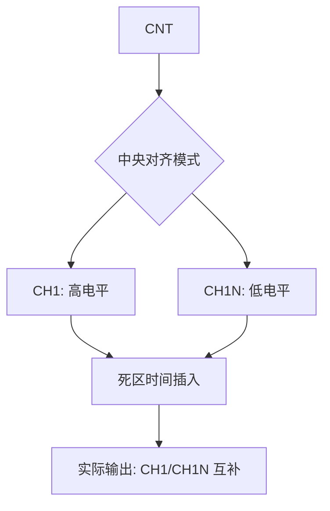
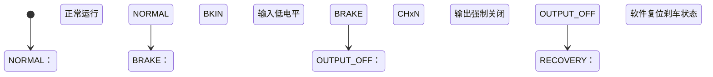

# 第八章 高级定时器介绍及应用

## 1. 高级定时器简介

高级定时器（Advanced-Control Timers）是 STM32H750VBT6 中**功能最复杂、性能最强**的定时器，包含 **TIM1** 和 **TIM8**。它们专为**三相电机控制**、**数字电源**、**高速 PWM 逆变**等高可靠性场景设计，具备**6 个独立通道**、**互补输出**、**可编程死区时间**、**紧急刹车（BKIN）** 等独特功能。与通用定时器（TIM2-5）相比，高级定时器通过**硬件级安全机制**防止功率器件（如 MOSFET）的“直通”故障，是工业自动化、新能源（逆变器、充电桩）的核心控制单元。

> 🔍 **核心定位**：
> 
> - **TIM1**：连接 APB2（200 MHz），用于高速控制
> - **TIM8**：连接 APB1（100 MHz），低功耗场景  
>   *两者均支持 16-bit 计数，但通过 ETR 可扩展为 32-bit*

---

### **1.1 核心特性对比（STM32H750VBT6）**

| **特性**    | **参数**                    | **说明**                              | **工业价值**          |
| --------- | ------------------------- | ----------------------------------- | ----------------- |
| **通道数**   | 6 通道（CH1-CH4 + CH1N-CH4N） | 支持互补输出（N 通道）                        | 三相桥驱动（3 路互补 PWM）  |
| **死区时间**  | 8-bit DTG 寄存器             | 可编程 1–256 个时钟周期                     | 防止上下管 MOSFET 同时导通 |
| **刹车功能**  | BKIN 输入引脚                 | 硬件级紧急停机（响应 < 50 ns）                 | 电机过流/过温保护         |
| **编码器接口** | Q1/Q2/Q3 输入               | 支持增量式编码器（4 倍频）                      | 电机转速/位置反馈         |
| **同步机制**  | 主从模式（MMS）                 | 可触发 ADC/DAC/其他定时器                   | 多轴运动控制同步          |
| **时钟源**   | TIMxCLK（最高 200 MHz）       | 支持内部/外部时钟（ETR）                      | 高速 PWM 生成         |
| **分辨率**   | 最高 5 ns @ 200 MHz         | `T<sub>tick</sub> = 1/200MHz = 5ns` | 精密电源控制            |
| **中断能力**  | 10+ 个标志位 + 重复计数器          | 支持复杂时序中断                            | 实时任务调度            |

📌 **STM32H750VBT6 独家优势**：

- **双通道冗余**：CH5/CH6 独立于 CH1-4，可实现双电机控制
- **可编程刹车滤波**：`BKIN` 信号支持数字滤波（防误触发）
- **重复计数器（RCR）**：实现 N 周期中断（如每 10 个 PWM 周期触发 ADC）
- **硬件级联**：TIM1 可作为主定时器同步 TIM2-8 |

---

### 1.2 核心功能原理详解

#### 1.2.1 三相 PWM 生成（互补输出）



- **关键寄存器**：
  
  - `CCMRx.OCxM`：PWM 模式选择（如 `110` = PWM1）
  - `CCRx`：占空比设置（`Duty = CCRx / ARR`）
  - `BDTR.DTG`：死区时间值（单位：时钟周期）

- **死区时间计算**：  
  **T<sub>dead</sub> = DTG × T<sub>tick</sub>**  
  *示例：DTG=10, T<sub>tick</sub>=5ns → T<sub>dead</sub>=50ns*

> ⚠️ **死区必要性**：  
> 若上下管 MOSFET 无死区时间，导通切换时可能短暂“直通”，导致**电源短路**（电流 > 100A，损坏器件）。

#### 1.2.2 紧急刹车（BKIN）机制



- **刹车动作**：
  
  1. `BKIN` 引脚检测到有效电平（可配置高/低有效）
  2. 硬件自动关闭所有互补通道（`CH1N-CH4N`）
  3. 设置 `SR.BIF` 标志位（可触发中断）
  4. **必须软件复位** `BDTR.MOE=0→1` 才能恢复输出

- **刹车源配置**：
  
  - `AF1`：`BKIN` 引脚（PA6/TIM1_BKIN）
  - `AF2`：`BKIN2` 引脚（PB7/TIM1_BKIN2）
  - `AF3`：软件刹车（通过寄存器触发）

#### 1.2.3 重复计数器（RCR）与同步

- **RCR 功能**：
  
  - 每 `RCR+1` 个更新事件（UEV）才触发中断/DMA
  - 用于**降低中断频率**（如每 10 个 PWM 周期采样一次电流）

- **同步机制**：
  
  | **主定时器** | **从定时器** | **同步信号**               | **应用场景**       |
  | -------- | -------- | ---------------------- | -------------- |
  | TIM1     | TIM2     | `TIM1_TRGO → TIM2_ITR` | 电机控制与 ADC 采样同步 |
  | TIM8     | DAC      | `TIM8_TRGO → DAC_TRIG` | 数字电源波形生成       |

---

### 1.3 关键寄存器操作

#### 1.3.1 核心寄存器与配置流程

| **寄存器**   | **关键位域**           | **功能**         | **配置要点**             |
| --------- | ------------------ | -------------- | -------------------- |
| **CR1**   | CEN, DIR, CMS, CKD | 计数使能、对齐模式、时钟分频 | `CMS=10` = 中央对齐模式2   |
| **BDTR**  | DTG[7:0], MOE, AOE | 死区时间、主输出使能     | `MOE=1` 必须最后置位       |
| **RCR**   | REP[7:0]           | 重复计数器          | `REP=9` → 每 10 个周期中断 |
| **CCMRx** | OCxM, OCxPE        | 输出比较模式         | `OCxPE=1` 启用预装载      |
| **CCER**  | CCxP, CCxE, CCxNP  | 通道极性/使能        | `CCxNP=1` 使能 N 通道    |
| **DIER**  | TDE, UDE, CCxDE    | DMA 使能         | `TDE=1` 触发 ADC       |

#### 1.3.2 三相电机 PWM 配置（TIM1）

```c
// 1. 使能时钟 (RCC)
RCC->APB2ENR |= RCC_APB2ENR_TIM1EN;
RCC->AHB4ENR |= RCC_AHB4ENR_GPIOAEN | RCC_AHB4ENR_GPIOBEN;

// 2. GPIO 配置 (复用推挽 + 互补输出)
// PA8/9/10 = CH1/2/3, PA7/14/15 = CH1N/2N/3N
GPIOA->MODER  |= 0x00002AAA; // PA7,8,9,10,14,15 = AF
GPIOA->OTYPER &= ~(0x00004F80); // 推挽
GPIOA->OSPEEDR|= 0x0000FFFF; // 超高速
GPIOA->AFR[1] |= 0x00111111; // AF1 = TIM1

// 3. TIM1 基础配置 (16kHz PWM, 中央对齐)
TIM1->PSC = 0;                     // 无预分频
TIM1->ARR = 6249;                  // 200MHz / 6250 = 32kHz → 16kHz 中央对齐
TIM1->CR1 = TIM_CR1_CMS_1;         // 中央对齐模式2

// 4. 通道配置 (PWM1 模式)
TIM1->CCMR1 = TIM_CCMR1_OC1M_2 | TIM_CCMR1_OC1M_1; // CH1 PWM1
TIM1->CCMR2 = TIM_CCMR2_OC3M_2 | TIM_CCMR2_OC3M_1; // CH3 PWM1
TIM1->CCER = TIM_CCER_CC1E | TIM_CCER_CC1NE |       // CH1/CH1N 使能
           TIM_CCER_CC2E | TIM_CCER_CC2NE |
           TIM_CCER_CC3E | TIM_CCER_CC3NE;

// 5. 死区时间设置 (50ns @ 200MHz → DTG=10)
TIM1->BDTR = 10 << 0;              // DTG[7:0]=10
TIM1->BDTR |= TIM_BDTR_MOE;        // 主输出使能 (最后一步!)

// 6. 启动计数器
TIM1->CR1 |= TIM_CR1_CEN;
```

#### 1.3.3 HAL 库简化操作

```c
TIM_HandleTypeDef htim;
htim.Instance = TIM1;
htim.Init.Prescaler = 0;
htim.Init.Period = 6249;
htim.Init.CounterMode = TIM_COUNTERMODE_CENTERALIGNED2;
htim.Init.ClockDivision = TIM_CLOCKDIVISION_DIV1;
HAL_TIM_PWM_Init(&htim);

TIM_OC_InitTypeDef sConfig;
sConfig.OCMode = TIM_OCMODE_PWM1;
sConfig.Pulse = 3125;               // 50% 占空比
sConfig.OCPolarity = TIM_OCPOLARITY_HIGH;
sConfig.OCNPolarity = TIM_OCNPOLARITY_LOW;
sConfig.OCFastMode = TIM_OCFAST_DISABLE;
sConfig.OCIdleState = TIM_OCIDLESTATE_RESET;
sConfig.OCNIdleState = TIM_OCNIDLESTATE_SET;
HAL_TIM_PWM_ConfigChannel(&htim, &sConfig, TIM_CHANNEL_1);

// 死区时间 (50ns)
TIM_BreakDeadTimeConfigTypeDef sBreakDeadTime;
sBreakDeadTime.DeadTime = 10;
sBreakDeadTime.OffStateRunMode = TIM_OSSR_ENABLE;
sBreakDeadTime.OffStateIDLEMode = TIM_OSSI_ENABLE;
sBreakDeadTime.LockLevel = TIM_LOCKLEVEL_OFF;
sBreakDeadTime.BreakState = TIM_BREAK_ENABLE;
sBreakDeadTime.BreakPolarity = TIM_BREAKPOLARITY_LOW;
sBreakDeadTime.BreakFilter = 0;
sBreakDeadTime.Break2State = TIM_BREAK2_DISABLE;
sBreakDeadTime.Break2Polarity = TIM_BREAK2POLARITY_HIGH;
sBreakDeadTime.Break2Filter = 0;
sBreakDeadTime.AutomaticOutput = TIM_AUTOMATICOUTPUT_ENABLE;
HAL_TIMEx_ConfigBreakDeadTime(&htim, &sBreakDeadTime);

HAL_TIM_PWM_Start(&htim, TIM_CHANNEL_1);
HAL_TIMEx_StartBreakInput(&htim, TIM_BREAKINPUT_BKIN); // 使能刹车
```

## 2. 高级定时器使用示例-STM32IDE

### 2.1 高级定时器输出指定个数PWM

#### 2.1.1 STM32Cube配置


#### 2.1.2 用户代码

```c
/* USER CODE BEGIN Header */
/**
  ******************************************************************************
  * @file    tim.c
  * @brief   This file provides code for the configuration
  *          of the TIM instances.
  ******************************************************************************
  * @attention
  *
  * Copyright (c) 2025 STMicroelectronics.
  * All rights reserved.
  *
  * This software is licensed under terms that can be found in the LICENSE file
  * in the root directory of this software component.
  * If no LICENSE file comes with this software, it is provided AS-IS.
  *
  ******************************************************************************
  */
/* USER CODE END Header */
/* Includes ------------------------------------------------------------------*/
#include "tim.h"

/* USER CODE BEGIN 0 */

/* USER CODE END 0 */

TIM_HandleTypeDef htim2;
TIM_HandleTypeDef htim3;
TIM_HandleTypeDef htim5;
TIM_HandleTypeDef htim6;
TIM_HandleTypeDef htim15;

/* TIM2 init function */
void MX_TIM2_Init(void)
{

  /* USER CODE BEGIN TIM2_Init 0 */

  /* USER CODE END TIM2_Init 0 */

  TIM_SlaveConfigTypeDef sSlaveConfig = {0};
  TIM_MasterConfigTypeDef sMasterConfig = {0};

  /* USER CODE BEGIN TIM2_Init 1 */

  /* USER CODE END TIM2_Init 1 */
  htim2.Instance = TIM2;
  htim2.Init.Prescaler = 0;
  htim2.Init.CounterMode = TIM_COUNTERMODE_UP;
  htim2.Init.Period = 65535;
  htim2.Init.ClockDivision = TIM_CLOCKDIVISION_DIV1;
  htim2.Init.AutoReloadPreload = TIM_AUTORELOAD_PRELOAD_DISABLE;
  if (HAL_TIM_Base_Init(&htim2) != HAL_OK)
  {
    Error_Handler();
  }
  sSlaveConfig.SlaveMode = TIM_SLAVEMODE_EXTERNAL1;
  sSlaveConfig.InputTrigger = TIM_TS_TI1FP1;
  sSlaveConfig.TriggerPolarity = TIM_TRIGGERPOLARITY_RISING;
  sSlaveConfig.TriggerFilter = 4;
  if (HAL_TIM_SlaveConfigSynchro(&htim2, &sSlaveConfig) != HAL_OK)
  {
    Error_Handler();
  }
  sMasterConfig.MasterOutputTrigger = TIM_TRGO_RESET;
  sMasterConfig.MasterSlaveMode = TIM_MASTERSLAVEMODE_DISABLE;
  if (HAL_TIMEx_MasterConfigSynchronization(&htim2, &sMasterConfig) != HAL_OK)
  {
    Error_Handler();
  }
  /* USER CODE BEGIN TIM2_Init 2 */
  __HAL_TIM_ENABLE_IT(&htim2, TIM_IT_UPDATE); // 使能更新中断
  HAL_TIM_IC_Start_IT(&htim2, TIM_CHANNEL_1); // 启动输入捕获及其中断
  /* USER CODE END TIM2_Init 2 */

}
/* TIM3 init function */
void MX_TIM3_Init(void)
{

  /* USER CODE BEGIN TIM3_Init 0 */

  /* USER CODE END TIM3_Init 0 */

  TIM_ClockConfigTypeDef sClockSourceConfig = {0};
  TIM_MasterConfigTypeDef sMasterConfig = {0};
  TIM_OC_InitTypeDef sConfigOC = {0};

  /* USER CODE BEGIN TIM3_Init 1 */

  /* USER CODE END TIM3_Init 1 */
  htim3.Instance = TIM3;
  htim3.Init.Prescaler = 239;
  htim3.Init.CounterMode = TIM_COUNTERMODE_UP;
  htim3.Init.Period = 999;
  htim3.Init.ClockDivision = TIM_CLOCKDIVISION_DIV1;
  htim3.Init.AutoReloadPreload = TIM_AUTORELOAD_PRELOAD_DISABLE;
  if (HAL_TIM_Base_Init(&htim3) != HAL_OK)
  {
    Error_Handler();
  }
  sClockSourceConfig.ClockSource = TIM_CLOCKSOURCE_INTERNAL;
  if (HAL_TIM_ConfigClockSource(&htim3, &sClockSourceConfig) != HAL_OK)
  {
    Error_Handler();
  }
  if (HAL_TIM_PWM_Init(&htim3) != HAL_OK)
  {
    Error_Handler();
  }
  sMasterConfig.MasterOutputTrigger = TIM_TRGO_RESET;
  sMasterConfig.MasterSlaveMode = TIM_MASTERSLAVEMODE_DISABLE;
  if (HAL_TIMEx_MasterConfigSynchronization(&htim3, &sMasterConfig) != HAL_OK)
  {
    Error_Handler();
  }
  sConfigOC.OCMode = TIM_OCMODE_PWM1;
  sConfigOC.Pulse = 0;
  sConfigOC.OCPolarity = TIM_OCPOLARITY_HIGH;
  sConfigOC.OCFastMode = TIM_OCFAST_DISABLE;
  if (HAL_TIM_PWM_ConfigChannel(&htim3, &sConfigOC, TIM_CHANNEL_1) != HAL_OK)
  {
    Error_Handler();
  }
  /* USER CODE BEGIN TIM3_Init 2 */
  // HAL_TIM_Base_Start_IT(&htim3); // 启动定时器3及其中断
  /* USER CODE END TIM3_Init 2 */
  HAL_TIM_MspPostInit(&htim3);

}
/* TIM5 init function */
void MX_TIM5_Init(void)
{

  /* USER CODE BEGIN TIM5_Init 0 */

  /* USER CODE END TIM5_Init 0 */

  TIM_ClockConfigTypeDef sClockSourceConfig = {0};
  TIM_MasterConfigTypeDef sMasterConfig = {0};

  /* USER CODE BEGIN TIM5_Init 1 */

  /* USER CODE END TIM5_Init 1 */
  htim5.Instance = TIM5;
  htim5.Init.Prescaler = 479;
  htim5.Init.CounterMode = TIM_COUNTERMODE_UP;
  htim5.Init.Period = 0xFFFFFFFF;
  htim5.Init.ClockDivision = TIM_CLOCKDIVISION_DIV1;
  htim5.Init.AutoReloadPreload = TIM_AUTORELOAD_PRELOAD_DISABLE;
  if (HAL_TIM_Base_Init(&htim5) != HAL_OK)
  {
    Error_Handler();
  }
  sClockSourceConfig.ClockSource = TIM_CLOCKSOURCE_INTERNAL;
  if (HAL_TIM_ConfigClockSource(&htim5, &sClockSourceConfig) != HAL_OK)
  {
    Error_Handler();
  }
  sMasterConfig.MasterOutputTrigger = TIM_TRGO_RESET;
  sMasterConfig.MasterSlaveMode = TIM_MASTERSLAVEMODE_DISABLE;
  if (HAL_TIMEx_MasterConfigSynchronization(&htim5, &sMasterConfig) != HAL_OK)
  {
    Error_Handler();
  }
  /* USER CODE BEGIN TIM5_Init 2 */
  __HAL_TIM_ENABLE_IT(&htim5, TIM_IT_UPDATE); // 使能更新中断
  HAL_TIM_IC_Start_IT(&htim5, TIM_CHANNEL_1); // 启动输入捕获及其中断
  /* USER CODE END TIM5_Init 2 */

}
/* TIM6 init function */
void MX_TIM6_Init(void)
{

  /* USER CODE BEGIN TIM6_Init 0 */

  /* USER CODE END TIM6_Init 0 */

  TIM_MasterConfigTypeDef sMasterConfig = {0};

  /* USER CODE BEGIN TIM6_Init 1 */

  /* USER CODE END TIM6_Init 1 */
  htim6.Instance = TIM6;
  htim6.Init.Prescaler = 9999;
  htim6.Init.CounterMode = TIM_COUNTERMODE_UP;
  htim6.Init.Period = 11999;
  htim6.Init.AutoReloadPreload = TIM_AUTORELOAD_PRELOAD_DISABLE;
  if (HAL_TIM_Base_Init(&htim6) != HAL_OK)
  {
    Error_Handler();
  }
  sMasterConfig.MasterOutputTrigger = TIM_TRGO_RESET;
  sMasterConfig.MasterSlaveMode = TIM_MASTERSLAVEMODE_DISABLE;
  if (HAL_TIMEx_MasterConfigSynchronization(&htim6, &sMasterConfig) != HAL_OK)
  {
    Error_Handler();
  }
  /* USER CODE BEGIN TIM6_Init 2 */
  HAL_TIM_Base_Start_IT(&htim6); // 启动定时器6及其中断
  /* USER CODE END TIM6_Init 2 */

}
/* TIM15 init function */
void MX_TIM15_Init(void)
{

  /* USER CODE BEGIN TIM15_Init 0 */

  /* USER CODE END TIM15_Init 0 */

  TIM_ClockConfigTypeDef sClockSourceConfig = {0};
  TIM_MasterConfigTypeDef sMasterConfig = {0};
  TIM_OC_InitTypeDef sConfigOC = {0};
  TIM_BreakDeadTimeConfigTypeDef sBreakDeadTimeConfig = {0};

  /* USER CODE BEGIN TIM15_Init 1 */

  /* USER CODE END TIM15_Init 1 */
  htim15.Instance = TIM15;
  htim15.Init.Prescaler = 4799;
  htim15.Init.CounterMode = TIM_COUNTERMODE_UP;
  htim15.Init.Period = 9999;
  htim15.Init.ClockDivision = TIM_CLOCKDIVISION_DIV1;
  htim15.Init.RepetitionCounter = 0;
  htim15.Init.AutoReloadPreload = TIM_AUTORELOAD_PRELOAD_ENABLE;
  if (HAL_TIM_Base_Init(&htim15) != HAL_OK)
  {
    Error_Handler();
  }
  sClockSourceConfig.ClockSource = TIM_CLOCKSOURCE_INTERNAL;
  if (HAL_TIM_ConfigClockSource(&htim15, &sClockSourceConfig) != HAL_OK)
  {
    Error_Handler();
  }
  if (HAL_TIM_PWM_Init(&htim15) != HAL_OK)
  {
    Error_Handler();
  }
  sMasterConfig.MasterOutputTrigger = TIM_TRGO_RESET;
  sMasterConfig.MasterSlaveMode = TIM_MASTERSLAVEMODE_DISABLE;
  if (HAL_TIMEx_MasterConfigSynchronization(&htim15, &sMasterConfig) != HAL_OK)
  {
    Error_Handler();
  }
  sConfigOC.OCMode = TIM_OCMODE_PWM1;
  sConfigOC.Pulse = 4999;
  sConfigOC.OCPolarity = TIM_OCPOLARITY_HIGH;
  sConfigOC.OCNPolarity = TIM_OCNPOLARITY_LOW;
  sConfigOC.OCFastMode = TIM_OCFAST_DISABLE;
  sConfigOC.OCIdleState = TIM_OCIDLESTATE_SET;
  sConfigOC.OCNIdleState = TIM_OCNIDLESTATE_RESET;
  if (HAL_TIM_PWM_ConfigChannel(&htim15, &sConfigOC, TIM_CHANNEL_1) != HAL_OK)
  {
    Error_Handler();
  }
  sBreakDeadTimeConfig.OffStateRunMode = TIM_OSSR_DISABLE;
  sBreakDeadTimeConfig.OffStateIDLEMode = TIM_OSSI_DISABLE;
  sBreakDeadTimeConfig.LockLevel = TIM_LOCKLEVEL_OFF;
  sBreakDeadTimeConfig.DeadTime = 0;
  sBreakDeadTimeConfig.BreakState = TIM_BREAK_DISABLE;
  sBreakDeadTimeConfig.BreakPolarity = TIM_BREAKPOLARITY_HIGH;
  sBreakDeadTimeConfig.BreakFilter = 0;
  sBreakDeadTimeConfig.AutomaticOutput = TIM_AUTOMATICOUTPUT_DISABLE;
  if (HAL_TIMEx_ConfigBreakDeadTime(&htim15, &sBreakDeadTimeConfig) != HAL_OK)
  {
    Error_Handler();
  }
  /* USER CODE BEGIN TIM15_Init 2 */
  /* USER CODE END TIM15_Init 2 */
  HAL_TIM_MspPostInit(&htim15);
  __HAL_TIM_ENABLE_IT(&htim15, TIM_IT_UPDATE); // 使能更新中断
  HAL_TIM_PWM_Start(&htim15, TIM_CHANNEL_1); // 启动PWM
}

void HAL_TIM_Base_MspInit(TIM_HandleTypeDef* tim_baseHandle)
{

  GPIO_InitTypeDef GPIO_InitStruct = {0};
  if(tim_baseHandle->Instance==TIM2)
  {
  /* USER CODE BEGIN TIM2_MspInit 0 */

  /* USER CODE END TIM2_MspInit 0 */
    /* TIM2 clock enable */
    __HAL_RCC_TIM2_CLK_ENABLE();

    __HAL_RCC_GPIOA_CLK_ENABLE();
    /**TIM2 GPIO Configuration
    PA0     ------> TIM2_CH1
    */
    GPIO_InitStruct.Pin = TIM2_KEY_Pin;
    GPIO_InitStruct.Mode = GPIO_MODE_AF_PP;
    GPIO_InitStruct.Pull = GPIO_PULLDOWN;
    GPIO_InitStruct.Speed = GPIO_SPEED_FREQ_HIGH;
    GPIO_InitStruct.Alternate = GPIO_AF1_TIM2;
    HAL_GPIO_Init(TIM2_KEY_GPIO_Port, &GPIO_InitStruct);

    /* TIM2 interrupt Init */
    HAL_NVIC_SetPriority(TIM2_IRQn, 0, 0);
    HAL_NVIC_EnableIRQ(TIM2_IRQn);
  /* USER CODE BEGIN TIM2_MspInit 1 */

  /* USER CODE END TIM2_MspInit 1 */
  }
  else if(tim_baseHandle->Instance==TIM3)
  {
  /* USER CODE BEGIN TIM3_MspInit 0 */

  /* USER CODE END TIM3_MspInit 0 */
    /* TIM3 clock enable */
    __HAL_RCC_TIM3_CLK_ENABLE();

    /* TIM3 interrupt Init */
    HAL_NVIC_SetPriority(TIM3_IRQn, 0, 0);
    HAL_NVIC_EnableIRQ(TIM3_IRQn);
  /* USER CODE BEGIN TIM3_MspInit 1 */

  /* USER CODE END TIM3_MspInit 1 */
  }
  else if(tim_baseHandle->Instance==TIM5)
  {
  /* USER CODE BEGIN TIM5_MspInit 0 */
  /* USER CODE END TIM5_MspInit 0 */
    /* TIM5 clock enable */
    __HAL_RCC_TIM5_CLK_ENABLE();

    /* TIM5 interrupt Init */
    HAL_NVIC_SetPriority(TIM5_IRQn, 0, 0);
    HAL_NVIC_EnableIRQ(TIM5_IRQn);
  /* USER CODE BEGIN TIM5_MspInit 1 */
  /* USER CODE END TIM5_MspInit 1 */
  }
  else if(tim_baseHandle->Instance==TIM6)
  {
  /* USER CODE BEGIN TIM6_MspInit 0 */

  /* USER CODE END TIM6_MspInit 0 */
    /* TIM6 clock enable */
    __HAL_RCC_TIM6_CLK_ENABLE();

    /* TIM6 interrupt Init */
    HAL_NVIC_SetPriority(TIM6_DAC_IRQn, 1, 0);
    HAL_NVIC_EnableIRQ(TIM6_DAC_IRQn);
  /* USER CODE BEGIN TIM6_MspInit 1 */
  /* USER CODE END TIM6_MspInit 1 */
  }
  else if(tim_baseHandle->Instance==TIM15)
  {
  /* USER CODE BEGIN TIM15_MspInit 0 */

  /* USER CODE END TIM15_MspInit 0 */
    /* TIM15 clock enable */
    __HAL_RCC_TIM15_CLK_ENABLE();

    /* TIM15 interrupt Init */
    HAL_NVIC_SetPriority(TIM15_IRQn, 2, 2);
    HAL_NVIC_EnableIRQ(TIM15_IRQn);
  /* USER CODE BEGIN TIM15_MspInit 1 */

  /* USER CODE END TIM15_MspInit 1 */
  }
}
void HAL_TIM_MspPostInit(TIM_HandleTypeDef* timHandle)
{

  GPIO_InitTypeDef GPIO_InitStruct = {0};
  if(timHandle->Instance==TIM3)
  {
  /* USER CODE BEGIN TIM3_MspPostInit 0 */

  /* USER CODE END TIM3_MspPostInit 0 */
    __HAL_RCC_GPIOB_CLK_ENABLE();
    /**TIM3 GPIO Configuration
    PB4 (NJTRST)     ------> TIM3_CH1
    */
    GPIO_InitStruct.Pin = TIM_LED_Pin;
    GPIO_InitStruct.Mode = GPIO_MODE_AF_PP;
    GPIO_InitStruct.Pull = GPIO_NOPULL;
    GPIO_InitStruct.Speed = GPIO_SPEED_FREQ_LOW;
    GPIO_InitStruct.Alternate = GPIO_AF2_TIM3;
    HAL_GPIO_Init(TIM_LED_GPIO_Port, &GPIO_InitStruct);

  /* USER CODE BEGIN TIM3_MspPostInit 1 */

  /* USER CODE END TIM3_MspPostInit 1 */
  }
  else if(timHandle->Instance==TIM15)
  {
  /* USER CODE BEGIN TIM15_MspPostInit 0 */

  /* USER CODE END TIM15_MspPostInit 0 */

    __HAL_RCC_GPIOE_CLK_ENABLE();
    /**TIM15 GPIO Configuration
    PE5     ------> TIM15_CH1
    */
    GPIO_InitStruct.Pin = TIM15_LED_Pin;
    GPIO_InitStruct.Mode = GPIO_MODE_AF_PP;
    GPIO_InitStruct.Pull = GPIO_NOPULL;
    GPIO_InitStruct.Speed = GPIO_SPEED_FREQ_HIGH;
    GPIO_InitStruct.Alternate = GPIO_AF4_TIM15;
    HAL_GPIO_Init(TIM15_LED_GPIO_Port, &GPIO_InitStruct);

  /* USER CODE BEGIN TIM15_MspPostInit 1 */

  /* USER CODE END TIM15_MspPostInit 1 */
  }

}

void HAL_TIM_Base_MspDeInit(TIM_HandleTypeDef* tim_baseHandle)
{

  if(tim_baseHandle->Instance==TIM2)
  {
  /* USER CODE BEGIN TIM2_MspDeInit 0 */

  /* USER CODE END TIM2_MspDeInit 0 */
    /* Peripheral clock disable */
    __HAL_RCC_TIM2_CLK_DISABLE();

    /**TIM2 GPIO Configuration
    PA0     ------> TIM2_CH1
    */
    HAL_GPIO_DeInit(TIM2_KEY_GPIO_Port, TIM2_KEY_Pin);

    /* TIM2 interrupt Deinit */
    HAL_NVIC_DisableIRQ(TIM2_IRQn);
  /* USER CODE BEGIN TIM2_MspDeInit 1 */

  /* USER CODE END TIM2_MspDeInit 1 */
  }
  else if(tim_baseHandle->Instance==TIM3)
  {
  /* USER CODE BEGIN TIM3_MspDeInit 0 */

  /* USER CODE END TIM3_MspDeInit 0 */
    /* Peripheral clock disable */
    __HAL_RCC_TIM3_CLK_DISABLE();

    /* TIM3 interrupt Deinit */
    HAL_NVIC_DisableIRQ(TIM3_IRQn);
  /* USER CODE BEGIN TIM3_MspDeInit 1 */

  /* USER CODE END TIM3_MspDeInit 1 */
  }
  else if(tim_baseHandle->Instance==TIM5)
  {
  /* USER CODE BEGIN TIM5_MspDeInit 0 */

  /* USER CODE END TIM5_MspDeInit 0 */
    /* Peripheral clock disable */
    __HAL_RCC_TIM5_CLK_DISABLE();

    /* TIM5 interrupt Deinit */
    HAL_NVIC_DisableIRQ(TIM5_IRQn);
  /* USER CODE BEGIN TIM5_MspDeInit 1 */

  /* USER CODE END TIM5_MspDeInit 1 */
  }
  else if(tim_baseHandle->Instance==TIM6)
  {
  /* USER CODE BEGIN TIM6_MspDeInit 0 */

  /* USER CODE END TIM6_MspDeInit 0 */
    /* Peripheral clock disable */
    __HAL_RCC_TIM6_CLK_DISABLE();

    /* TIM6 interrupt Deinit */
    HAL_NVIC_DisableIRQ(TIM6_DAC_IRQn);
  /* USER CODE BEGIN TIM6_MspDeInit 1 */

  /* USER CODE END TIM6_MspDeInit 1 */
  }
  else if(tim_baseHandle->Instance==TIM15)
  {
  /* USER CODE BEGIN TIM15_MspDeInit 0 */

  /* USER CODE END TIM15_MspDeInit 0 */
    /* Peripheral clock disable */
    __HAL_RCC_TIM15_CLK_DISABLE();

    /* TIM15 interrupt Deinit */
    HAL_NVIC_DisableIRQ(TIM15_IRQn);
  /* USER CODE BEGIN TIM15_MspDeInit 1 */

  /* USER CODE END TIM15_MspDeInit 1 */
  }
}

/* USER CODE BEGIN 1 */

static uint32_t pwm_num = 0;

void tim15_set_pwm(uint32_t num)
{
	if(num == 0) return; // 如果设置为0，直接返回
	pwm_num = num; // 保存需要的PWM脉冲个数
	HAL_TIM_GenerateEvent(&htim15, TIM_EVENTSOURCE_UPDATE); // 触发一次更新事件，立即生效
	__HAL_TIM_ENABLE(&htim15); // 使能定时器15
}

void TIM15_IRQHandler(void)
{
	uint16_t npwm = 0;
	if(__HAL_TIM_GET_FLAG(&htim15, TIM_FLAG_UPDATE) != RESET) // 产生了更新中断
	{
		if(pwm_num >= 256)
		{
			pwm_num = pwm_num - 256;
			npwm = 256;
		}
		else if(pwm_num % 256)
		{
			npwm = pwm_num % 256;
			pwm_num = 0;
		}
		if(npwm)
		{
			TIM15->RCR = npwm - 1; // 设置重复计数器
			HAL_TIM_GenerateEvent(&htim15, TIM_EVENTSOURCE_UPDATE); // 触发一次更新事件，立即生效
			__HAL_TIM_ENABLE(&htim15); // 使能定时器15
		}
		else
		{
			TIM15->CR1 &= ~(1<<0); // 关闭定时器15
		}
		__HAL_TIM_CLEAR_FLAG(&htim15, TIM_FLAG_UPDATE); // 清除更新中断标志
	}
}
/* USER CODE END 1 */

```

```c
/* USER CODE BEGIN Header */
/**
  ******************************************************************************
  * @file           : main.c
  * @brief          : Main program body
  ******************************************************************************
  * @attention
  *
  * Copyright (c) 2025 STMicroelectronics.
  * All rights reserved.
  *
  * This software is licensed under terms that can be found in the LICENSE file
  * in the root directory of this software component.
  * If no LICENSE file comes with this software, it is provided AS-IS.
  *
  ******************************************************************************
  */
/* USER CODE END Header */
/* Includes ------------------------------------------------------------------*/
#include "main.h"
#include "tim.h"

/* Private includes ----------------------------------------------------------*/
/* USER CODE BEGIN Includes */
#include "bsp_init.h"
#include "stdio.h" // For printf function
/* USER CODE END Includes */

/* Private typedef -----------------------------------------------------------*/
/* USER CODE BEGIN PTD */

/* USER CODE END PTD */

/* Private define ------------------------------------------------------------*/
/* USER CODE BEGIN PD */

/* USER CODE END PD */

/* Private macro -------------------------------------------------------------*/
/* USER CODE BEGIN PM */

/* USER CODE END PM */

/* Private variables ---------------------------------------------------------*/

/* USER CODE BEGIN PV */

/* USER CODE END PV */

/* Private function prototypes -----------------------------------------------*/
void SystemClock_Config(void);
static void MPU_Config(void);
/* USER CODE BEGIN PFP */

/* USER CODE END PFP */

/* Private user code ---------------------------------------------------------*/
/* USER CODE BEGIN 0 */
/* USER CODE END 0 */

/**
  * @brief  The application entry point.
  * @retval int
  */
int main(void)
{

  /* USER CODE BEGIN 1 */
  /* USER CODE END 1 */

  /* MPU Configuration--------------------------------------------------------*/
  MPU_Config();

  /* MCU Configuration--------------------------------------------------------*/

  /* Reset of all peripherals, Initializes the Flash interface and the Systick. */
  HAL_Init();

  /* USER CODE BEGIN Init */

  /* USER CODE END Init */

  /* Configure the system clock */
  SystemClock_Config();

  /* USER CODE BEGIN SysInit */

  /* USER CODE END SysInit */

  /* Initialize all configured peripherals */
  /* USER CODE BEGIN 2 */
  bsp_init();
  printf("ATIM PWM Test\r\n");
  MX_TIM15_Init();
  /* USER CODE END 2 */
  uint8_t key_val = 0;
  //tim15_set_pwm(5);
  uint8_t count = 0;
  while (1)
  {
	count = 10;
    key_val = key_scan(0);
    if(key_val == KEY0_PRES)
    {
    	tim15_set_pwm(count);
    	printf("%d PWM pulses will be generated.\r\n", count);
    }
    HAL_Delay(10);
  }
}

/**
  * @brief System Clock Configuration
  * @retval None
  */
void SystemClock_Config(void)
{
  RCC_OscInitTypeDef RCC_OscInitStruct = {0};
  RCC_ClkInitTypeDef RCC_ClkInitStruct = {0};

  /** Supply configuration update enable
  */
  HAL_PWREx_ConfigSupply(PWR_LDO_SUPPLY);

  /** Configure the main internal regulator output voltage
  */
  __HAL_PWR_VOLTAGESCALING_CONFIG(PWR_REGULATOR_VOLTAGE_SCALE0);

  while(!__HAL_PWR_GET_FLAG(PWR_FLAG_VOSRDY)) {}

  /** Initializes the RCC Oscillators according to the specified parameters
  * in the RCC_OscInitTypeDef structure.
  */
  RCC_OscInitStruct.OscillatorType = RCC_OSCILLATORTYPE_LSI|RCC_OSCILLATORTYPE_HSE;
  RCC_OscInitStruct.HSEState = RCC_HSE_ON;
  RCC_OscInitStruct.LSIState = RCC_LSI_ON;
  RCC_OscInitStruct.PLL.PLLState = RCC_PLL_ON;
  RCC_OscInitStruct.PLL.PLLSource = RCC_PLLSOURCE_HSE;
  RCC_OscInitStruct.PLL.PLLM = 2;
  RCC_OscInitStruct.PLL.PLLN = 240;
  RCC_OscInitStruct.PLL.PLLP = 2;
  RCC_OscInitStruct.PLL.PLLQ = 2;
  RCC_OscInitStruct.PLL.PLLR = 2;
  RCC_OscInitStruct.PLL.PLLRGE = RCC_PLL1VCIRANGE_2;
  RCC_OscInitStruct.PLL.PLLVCOSEL = RCC_PLL1VCOWIDE;
  RCC_OscInitStruct.PLL.PLLFRACN = 0;
  if (HAL_RCC_OscConfig(&RCC_OscInitStruct) != HAL_OK)
  {
    Error_Handler();
  }

  /** Initializes the CPU, AHB and APB buses clocks
  */
  RCC_ClkInitStruct.ClockType = RCC_CLOCKTYPE_HCLK|RCC_CLOCKTYPE_SYSCLK
                              |RCC_CLOCKTYPE_PCLK1|RCC_CLOCKTYPE_PCLK2
                              |RCC_CLOCKTYPE_D3PCLK1|RCC_CLOCKTYPE_D1PCLK1;
  RCC_ClkInitStruct.SYSCLKSource = RCC_SYSCLKSOURCE_PLLCLK;
  RCC_ClkInitStruct.SYSCLKDivider = RCC_SYSCLK_DIV1;
  RCC_ClkInitStruct.AHBCLKDivider = RCC_HCLK_DIV2;
  RCC_ClkInitStruct.APB3CLKDivider = RCC_APB3_DIV2;
  RCC_ClkInitStruct.APB1CLKDivider = RCC_APB1_DIV2;
  RCC_ClkInitStruct.APB2CLKDivider = RCC_APB2_DIV2;
  RCC_ClkInitStruct.APB4CLKDivider = RCC_APB4_DIV2;

  if (HAL_RCC_ClockConfig(&RCC_ClkInitStruct, FLASH_LATENCY_4) != HAL_OK)
  {
    Error_Handler();
  }
}

/* USER CODE BEGIN 4 */

/* USER CODE END 4 */

 /* MPU Configuration */

void MPU_Config(void)
{
  MPU_Region_InitTypeDef MPU_InitStruct = {0};

  /* Disables the MPU */
  HAL_MPU_Disable();

  /** Initializes and configures the Region and the memory to be protected
  */
  MPU_InitStruct.Enable = MPU_REGION_ENABLE;
  MPU_InitStruct.Number = MPU_REGION_NUMBER0;
  MPU_InitStruct.BaseAddress = 0x0;
  MPU_InitStruct.Size = MPU_REGION_SIZE_4GB;
  MPU_InitStruct.SubRegionDisable = 0x87;
  MPU_InitStruct.TypeExtField = MPU_TEX_LEVEL0;
  MPU_InitStruct.AccessPermission = MPU_REGION_NO_ACCESS;
  MPU_InitStruct.DisableExec = MPU_INSTRUCTION_ACCESS_DISABLE;
  MPU_InitStruct.IsShareable = MPU_ACCESS_SHAREABLE;
  MPU_InitStruct.IsCacheable = MPU_ACCESS_NOT_CACHEABLE;
  MPU_InitStruct.IsBufferable = MPU_ACCESS_NOT_BUFFERABLE;

  HAL_MPU_ConfigRegion(&MPU_InitStruct);
  /* Enables the MPU */
  HAL_MPU_Enable(MPU_PRIVILEGED_DEFAULT);

}

/**
  * @brief  This function is executed in case of error occurrence.
  * @retval None
  */
void Error_Handler(void)
{
  /* USER CODE BEGIN Error_Handler_Debug */
  /* User can add his own implementation to report the HAL error return state */
  __disable_irq();
  while (1)
  {
  }
  /* USER CODE END Error_Handler_Debug */
}
#ifdef USE_FULL_ASSERT
/**
  * @brief  Reports the name of the source file and the source line number
  *         where the assert_param error has occurred.
  * @param  file: pointer to the source file name
  * @param  line: assert_param error line source number
  * @retval None
  */
void assert_failed(uint8_t *file, uint32_t line)
{
  /* USER CODE BEGIN 6 */
  /* User can add his own implementation to report the file name and line number,
     ex: printf("Wrong parameters value: file %s on line %d\r\n", file, line) */
  /* USER CODE END 6 */
}
#endif /* USE_FULL_ASSERT */

```

### 2.2 高级定时器输出比较

#### 2.2.1 STM32Cube配置


#### 2.2.2 用户代码

```c
/* USER CODE BEGIN Header */
/**
  ******************************************************************************
  * @file    tim.c
  * @brief   This file provides code for the configuration
  *          of the TIM instances.
  ******************************************************************************
  * @attention
  *
  * Copyright (c) 2025 STMicroelectronics.
  * All rights reserved.
  *
  * This software is licensed under terms that can be found in the LICENSE file
  * in the root directory of this software component.
  * If no LICENSE file comes with this software, it is provided AS-IS.
  *
  ******************************************************************************
  */
/* USER CODE END Header */
/* Includes ------------------------------------------------------------------*/
#include "tim.h"

/* USER CODE BEGIN 0 */

/* USER CODE END 0 */

TIM_HandleTypeDef htim1;
TIM_HandleTypeDef htim2;
TIM_HandleTypeDef htim3;
TIM_HandleTypeDef htim5;
TIM_HandleTypeDef htim6;
TIM_HandleTypeDef htim15;

/* TIM1 init function */
void MX_TIM1_Init(void)
{

  /* USER CODE BEGIN TIM1_Init 0 */

  /* USER CODE END TIM1_Init 0 */

  TIM_ClockConfigTypeDef sClockSourceConfig = {0};
  TIM_MasterConfigTypeDef sMasterConfig = {0};
  TIM_OC_InitTypeDef sConfigOC = {0};
  TIM_BreakDeadTimeConfigTypeDef sBreakDeadTimeConfig = {0};

  /* USER CODE BEGIN TIM1_Init 1 */

  /* USER CODE END TIM1_Init 1 */
  htim1.Instance = TIM1;
  htim1.Init.Prescaler = 479;
  htim1.Init.CounterMode = TIM_COUNTERMODE_UP;
  htim1.Init.Period = 499;
  htim1.Init.ClockDivision = TIM_CLOCKDIVISION_DIV1;
  htim1.Init.RepetitionCounter = 0;
  htim1.Init.AutoReloadPreload = TIM_AUTORELOAD_PRELOAD_ENABLE;
  if (HAL_TIM_Base_Init(&htim1) != HAL_OK)
  {
    Error_Handler();
  }
  sClockSourceConfig.ClockSource = TIM_CLOCKSOURCE_INTERNAL;
  if (HAL_TIM_ConfigClockSource(&htim1, &sClockSourceConfig) != HAL_OK)
  {
    Error_Handler();
  }
  if (HAL_TIM_OC_Init(&htim1) != HAL_OK)
  {
    Error_Handler();
  }
  sMasterConfig.MasterOutputTrigger = TIM_TRGO_RESET;
  sMasterConfig.MasterOutputTrigger2 = TIM_TRGO2_RESET;
  sMasterConfig.MasterSlaveMode = TIM_MASTERSLAVEMODE_DISABLE;
  if (HAL_TIMEx_MasterConfigSynchronization(&htim1, &sMasterConfig) != HAL_OK)
  {
    Error_Handler();
  }
  sConfigOC.OCMode = TIM_OCMODE_TOGGLE;
  sConfigOC.Pulse = 125;
  sConfigOC.OCPolarity = TIM_OCPOLARITY_HIGH;
  sConfigOC.OCNPolarity = TIM_OCNPOLARITY_HIGH;
  sConfigOC.OCFastMode = TIM_OCFAST_DISABLE;
  sConfigOC.OCIdleState = TIM_OCIDLESTATE_RESET;
  sConfigOC.OCNIdleState = TIM_OCNIDLESTATE_RESET;
  if (HAL_TIM_OC_ConfigChannel(&htim1, &sConfigOC, TIM_CHANNEL_1) != HAL_OK)
  {
    Error_Handler();
  }
  __HAL_TIM_ENABLE_OCxPRELOAD(&htim1, TIM_CHANNEL_1);
  sConfigOC.Pulse = 250;
  if (HAL_TIM_OC_ConfigChannel(&htim1, &sConfigOC, TIM_CHANNEL_2) != HAL_OK)
  {
    Error_Handler();
  }
  __HAL_TIM_ENABLE_OCxPRELOAD(&htim1, TIM_CHANNEL_2);
  sConfigOC.Pulse = 375;
  if (HAL_TIM_OC_ConfigChannel(&htim1, &sConfigOC, TIM_CHANNEL_3) != HAL_OK)
  {
    Error_Handler();
  }
  __HAL_TIM_ENABLE_OCxPRELOAD(&htim1, TIM_CHANNEL_3);
  sConfigOC.Pulse = 0;
  if (HAL_TIM_OC_ConfigChannel(&htim1, &sConfigOC, TIM_CHANNEL_4) != HAL_OK)
  {
    Error_Handler();
  }
  __HAL_TIM_ENABLE_OCxPRELOAD(&htim1, TIM_CHANNEL_4);
  sBreakDeadTimeConfig.OffStateRunMode = TIM_OSSR_DISABLE;
  sBreakDeadTimeConfig.OffStateIDLEMode = TIM_OSSI_DISABLE;
  sBreakDeadTimeConfig.LockLevel = TIM_LOCKLEVEL_OFF;
  sBreakDeadTimeConfig.DeadTime = 0;
  sBreakDeadTimeConfig.BreakState = TIM_BREAK_DISABLE;
  sBreakDeadTimeConfig.BreakPolarity = TIM_BREAKPOLARITY_HIGH;
  sBreakDeadTimeConfig.BreakFilter = 0;
  sBreakDeadTimeConfig.Break2State = TIM_BREAK2_DISABLE;
  sBreakDeadTimeConfig.Break2Polarity = TIM_BREAK2POLARITY_HIGH;
  sBreakDeadTimeConfig.Break2Filter = 0;
  sBreakDeadTimeConfig.AutomaticOutput = TIM_AUTOMATICOUTPUT_DISABLE;
  if (HAL_TIMEx_ConfigBreakDeadTime(&htim1, &sBreakDeadTimeConfig) != HAL_OK)
  {
    Error_Handler();
  }
  /* USER CODE BEGIN TIM1_Init 2 */

  /* USER CODE END TIM1_Init 2 */
  HAL_TIM_MspPostInit(&htim1);
  HAL_TIM_OC_Start(&htim1, TIM_CHANNEL_1);
  HAL_TIM_OC_Start(&htim1, TIM_CHANNEL_2);
  HAL_TIM_OC_Start(&htim1, TIM_CHANNEL_3);
  HAL_TIM_OC_Start(&htim1, TIM_CHANNEL_4);
}
/* TIM2 init function */
void MX_TIM2_Init(void)
{

  /* USER CODE BEGIN TIM2_Init 0 */

  /* USER CODE END TIM2_Init 0 */

  TIM_SlaveConfigTypeDef sSlaveConfig = {0};
  TIM_MasterConfigTypeDef sMasterConfig = {0};

  /* USER CODE BEGIN TIM2_Init 1 */

  /* USER CODE END TIM2_Init 1 */
  htim2.Instance = TIM2;
  htim2.Init.Prescaler = 0;
  htim2.Init.CounterMode = TIM_COUNTERMODE_UP;
  htim2.Init.Period = 65535;
  htim2.Init.ClockDivision = TIM_CLOCKDIVISION_DIV1;
  htim2.Init.AutoReloadPreload = TIM_AUTORELOAD_PRELOAD_DISABLE;
  if (HAL_TIM_Base_Init(&htim2) != HAL_OK)
  {
    Error_Handler();
  }
  sSlaveConfig.SlaveMode = TIM_SLAVEMODE_EXTERNAL1;
  sSlaveConfig.InputTrigger = TIM_TS_TI1FP1;
  sSlaveConfig.TriggerPolarity = TIM_TRIGGERPOLARITY_RISING;
  sSlaveConfig.TriggerFilter = 4;
  if (HAL_TIM_SlaveConfigSynchro(&htim2, &sSlaveConfig) != HAL_OK)
  {
    Error_Handler();
  }
  sMasterConfig.MasterOutputTrigger = TIM_TRGO_RESET;
  sMasterConfig.MasterSlaveMode = TIM_MASTERSLAVEMODE_DISABLE;
  if (HAL_TIMEx_MasterConfigSynchronization(&htim2, &sMasterConfig) != HAL_OK)
  {
    Error_Handler();
  }
  /* USER CODE BEGIN TIM2_Init 2 */
  __HAL_TIM_ENABLE_IT(&htim2, TIM_IT_UPDATE); // 使能更新中断
  HAL_TIM_IC_Start_IT(&htim2, TIM_CHANNEL_1); // 启动输入捕获及其中断
  /* USER CODE END TIM2_Init 2 */

}
/* TIM3 init function */
void MX_TIM3_Init(void)
{

  /* USER CODE BEGIN TIM3_Init 0 */

  /* USER CODE END TIM3_Init 0 */

  TIM_ClockConfigTypeDef sClockSourceConfig = {0};
  TIM_MasterConfigTypeDef sMasterConfig = {0};
  TIM_OC_InitTypeDef sConfigOC = {0};

  /* USER CODE BEGIN TIM3_Init 1 */

  /* USER CODE END TIM3_Init 1 */
  htim3.Instance = TIM3;
  htim3.Init.Prescaler = 239;
  htim3.Init.CounterMode = TIM_COUNTERMODE_UP;
  htim3.Init.Period = 999;
  htim3.Init.ClockDivision = TIM_CLOCKDIVISION_DIV1;
  htim3.Init.AutoReloadPreload = TIM_AUTORELOAD_PRELOAD_DISABLE;
  if (HAL_TIM_Base_Init(&htim3) != HAL_OK)
  {
    Error_Handler();
  }
  sClockSourceConfig.ClockSource = TIM_CLOCKSOURCE_INTERNAL;
  if (HAL_TIM_ConfigClockSource(&htim3, &sClockSourceConfig) != HAL_OK)
  {
    Error_Handler();
  }
  if (HAL_TIM_PWM_Init(&htim3) != HAL_OK)
  {
    Error_Handler();
  }
  sMasterConfig.MasterOutputTrigger = TIM_TRGO_RESET;
  sMasterConfig.MasterSlaveMode = TIM_MASTERSLAVEMODE_DISABLE;
  if (HAL_TIMEx_MasterConfigSynchronization(&htim3, &sMasterConfig) != HAL_OK)
  {
    Error_Handler();
  }
  sConfigOC.OCMode = TIM_OCMODE_PWM1;
  sConfigOC.Pulse = 0;
  sConfigOC.OCPolarity = TIM_OCPOLARITY_HIGH;
  sConfigOC.OCFastMode = TIM_OCFAST_DISABLE;
  if (HAL_TIM_PWM_ConfigChannel(&htim3, &sConfigOC, TIM_CHANNEL_1) != HAL_OK)
  {
    Error_Handler();
  }
  /* USER CODE BEGIN TIM3_Init 2 */
  // HAL_TIM_Base_Start_IT(&htim3); // 启动定时器3及其中断
  /* USER CODE END TIM3_Init 2 */
  HAL_TIM_MspPostInit(&htim3);

}
/* TIM5 init function */
void MX_TIM5_Init(void)
{

  /* USER CODE BEGIN TIM5_Init 0 */

  /* USER CODE END TIM5_Init 0 */

  TIM_ClockConfigTypeDef sClockSourceConfig = {0};
  TIM_MasterConfigTypeDef sMasterConfig = {0};

  /* USER CODE BEGIN TIM5_Init 1 */

  /* USER CODE END TIM5_Init 1 */
  htim5.Instance = TIM5;
  htim5.Init.Prescaler = 479;
  htim5.Init.CounterMode = TIM_COUNTERMODE_UP;
  htim5.Init.Period = 0xFFFFFFFF;
  htim5.Init.ClockDivision = TIM_CLOCKDIVISION_DIV1;
  htim5.Init.AutoReloadPreload = TIM_AUTORELOAD_PRELOAD_DISABLE;
  if (HAL_TIM_Base_Init(&htim5) != HAL_OK)
  {
    Error_Handler();
  }
  sClockSourceConfig.ClockSource = TIM_CLOCKSOURCE_INTERNAL;
  if (HAL_TIM_ConfigClockSource(&htim5, &sClockSourceConfig) != HAL_OK)
  {
    Error_Handler();
  }
  sMasterConfig.MasterOutputTrigger = TIM_TRGO_RESET;
  sMasterConfig.MasterSlaveMode = TIM_MASTERSLAVEMODE_DISABLE;
  if (HAL_TIMEx_MasterConfigSynchronization(&htim5, &sMasterConfig) != HAL_OK)
  {
    Error_Handler();
  }
  /* USER CODE BEGIN TIM5_Init 2 */
  __HAL_TIM_ENABLE_IT(&htim5, TIM_IT_UPDATE); // 使能更新中断
  HAL_TIM_IC_Start_IT(&htim5, TIM_CHANNEL_1); // 启动输入捕获及其中断
  /* USER CODE END TIM5_Init 2 */

}
/* TIM6 init function */
void MX_TIM6_Init(void)
{

  /* USER CODE BEGIN TIM6_Init 0 */

  /* USER CODE END TIM6_Init 0 */

  TIM_MasterConfigTypeDef sMasterConfig = {0};

  /* USER CODE BEGIN TIM6_Init 1 */

  /* USER CODE END TIM6_Init 1 */
  htim6.Instance = TIM6;
  htim6.Init.Prescaler = 9999;
  htim6.Init.CounterMode = TIM_COUNTERMODE_UP;
  htim6.Init.Period = 11999;
  htim6.Init.AutoReloadPreload = TIM_AUTORELOAD_PRELOAD_DISABLE;
  if (HAL_TIM_Base_Init(&htim6) != HAL_OK)
  {
    Error_Handler();
  }
  sMasterConfig.MasterOutputTrigger = TIM_TRGO_RESET;
  sMasterConfig.MasterSlaveMode = TIM_MASTERSLAVEMODE_DISABLE;
  if (HAL_TIMEx_MasterConfigSynchronization(&htim6, &sMasterConfig) != HAL_OK)
  {
    Error_Handler();
  }
  /* USER CODE BEGIN TIM6_Init 2 */
  HAL_TIM_Base_Start_IT(&htim6); // 启动定时器6及其中断
  /* USER CODE END TIM6_Init 2 */

}
/* TIM15 init function */
void MX_TIM15_Init(void)
{

  /* USER CODE BEGIN TIM15_Init 0 */

  /* USER CODE END TIM15_Init 0 */

  TIM_ClockConfigTypeDef sClockSourceConfig = {0};
  TIM_MasterConfigTypeDef sMasterConfig = {0};
  TIM_OC_InitTypeDef sConfigOC = {0};
  TIM_BreakDeadTimeConfigTypeDef sBreakDeadTimeConfig = {0};

  /* USER CODE BEGIN TIM15_Init 1 */

  /* USER CODE END TIM15_Init 1 */
  htim15.Instance = TIM15;
  htim15.Init.Prescaler = 479;
  htim15.Init.CounterMode = TIM_COUNTERMODE_UP;
  htim15.Init.Period = 999;
  htim15.Init.ClockDivision = TIM_CLOCKDIVISION_DIV1;
  htim15.Init.RepetitionCounter = 4;
  htim15.Init.AutoReloadPreload = TIM_AUTORELOAD_PRELOAD_ENABLE;
  if (HAL_TIM_Base_Init(&htim15) != HAL_OK)
  {
    Error_Handler();
  }
  sClockSourceConfig.ClockSource = TIM_CLOCKSOURCE_INTERNAL;
  if (HAL_TIM_ConfigClockSource(&htim15, &sClockSourceConfig) != HAL_OK)
  {
    Error_Handler();
  }
  if (HAL_TIM_PWM_Init(&htim15) != HAL_OK)
  {
    Error_Handler();
  }
  sMasterConfig.MasterOutputTrigger = TIM_TRGO_RESET;
  sMasterConfig.MasterSlaveMode = TIM_MASTERSLAVEMODE_DISABLE;
  if (HAL_TIMEx_MasterConfigSynchronization(&htim15, &sMasterConfig) != HAL_OK)
  {
    Error_Handler();
  }
  sConfigOC.OCMode = TIM_OCMODE_PWM1;
  sConfigOC.Pulse = 499;
  sConfigOC.OCPolarity = TIM_OCPOLARITY_LOW;
  sConfigOC.OCNPolarity = TIM_OCNPOLARITY_HIGH;
  sConfigOC.OCFastMode = TIM_OCFAST_DISABLE;
  sConfigOC.OCIdleState = TIM_OCIDLESTATE_SET;
  sConfigOC.OCNIdleState = TIM_OCNIDLESTATE_RESET;
  if (HAL_TIM_PWM_ConfigChannel(&htim15, &sConfigOC, TIM_CHANNEL_1) != HAL_OK)
  {
    Error_Handler();
  }
  sBreakDeadTimeConfig.OffStateRunMode = TIM_OSSR_DISABLE;
  sBreakDeadTimeConfig.OffStateIDLEMode = TIM_OSSI_DISABLE;
  sBreakDeadTimeConfig.LockLevel = TIM_LOCKLEVEL_OFF;
  sBreakDeadTimeConfig.DeadTime = 0;
  sBreakDeadTimeConfig.BreakState = TIM_BREAK_DISABLE;
  sBreakDeadTimeConfig.BreakPolarity = TIM_BREAKPOLARITY_HIGH;
  sBreakDeadTimeConfig.BreakFilter = 0;
  sBreakDeadTimeConfig.AutomaticOutput = TIM_AUTOMATICOUTPUT_DISABLE;
  if (HAL_TIMEx_ConfigBreakDeadTime(&htim15, &sBreakDeadTimeConfig) != HAL_OK)
  {
    Error_Handler();
  }
  /* USER CODE BEGIN TIM15_Init 2 */
  /* USER CODE END TIM15_Init 2 */
  HAL_TIM_MspPostInit(&htim15);

}

void HAL_TIM_Base_MspInit(TIM_HandleTypeDef* tim_baseHandle)
{

  GPIO_InitTypeDef GPIO_InitStruct = {0};
  if(tim_baseHandle->Instance==TIM1)
  {
  /* USER CODE BEGIN TIM1_MspInit 0 */

  /* USER CODE END TIM1_MspInit 0 */
    /* TIM1 clock enable */
    __HAL_RCC_TIM1_CLK_ENABLE();
  /* USER CODE BEGIN TIM1_MspInit 1 */

  /* USER CODE END TIM1_MspInit 1 */
  }
  else if(tim_baseHandle->Instance==TIM2)
  {
  /* USER CODE BEGIN TIM2_MspInit 0 */

  /* USER CODE END TIM2_MspInit 0 */
    /* TIM2 clock enable */
    __HAL_RCC_TIM2_CLK_ENABLE();

    __HAL_RCC_GPIOA_CLK_ENABLE();
    /**TIM2 GPIO Configuration
    PA0     ------> TIM2_CH1
    */
    GPIO_InitStruct.Pin = TIM2_KEY_Pin;
    GPIO_InitStruct.Mode = GPIO_MODE_AF_PP;
    GPIO_InitStruct.Pull = GPIO_PULLDOWN;
    GPIO_InitStruct.Speed = GPIO_SPEED_FREQ_HIGH;
    GPIO_InitStruct.Alternate = GPIO_AF1_TIM2;
    HAL_GPIO_Init(TIM2_KEY_GPIO_Port, &GPIO_InitStruct);

    /* TIM2 interrupt Init */
    HAL_NVIC_SetPriority(TIM2_IRQn, 0, 0);
    HAL_NVIC_EnableIRQ(TIM2_IRQn);
  /* USER CODE BEGIN TIM2_MspInit 1 */

  /* USER CODE END TIM2_MspInit 1 */
  }
  else if(tim_baseHandle->Instance==TIM3)
  {
  /* USER CODE BEGIN TIM3_MspInit 0 */

  /* USER CODE END TIM3_MspInit 0 */
    /* TIM3 clock enable */
    __HAL_RCC_TIM3_CLK_ENABLE();

    /* TIM3 interrupt Init */
    HAL_NVIC_SetPriority(TIM3_IRQn, 0, 0);
    HAL_NVIC_EnableIRQ(TIM3_IRQn);
  /* USER CODE BEGIN TIM3_MspInit 1 */

  /* USER CODE END TIM3_MspInit 1 */
  }
  else if(tim_baseHandle->Instance==TIM5)
  {
  /* USER CODE BEGIN TIM5_MspInit 0 */
  /* USER CODE END TIM5_MspInit 0 */
    /* TIM5 clock enable */
    __HAL_RCC_TIM5_CLK_ENABLE();

    /* TIM5 interrupt Init */
    HAL_NVIC_SetPriority(TIM5_IRQn, 0, 0);
    HAL_NVIC_EnableIRQ(TIM5_IRQn);
  /* USER CODE BEGIN TIM5_MspInit 1 */
  /* USER CODE END TIM5_MspInit 1 */
  }
  else if(tim_baseHandle->Instance==TIM6)
  {
  /* USER CODE BEGIN TIM6_MspInit 0 */

  /* USER CODE END TIM6_MspInit 0 */
    /* TIM6 clock enable */
    __HAL_RCC_TIM6_CLK_ENABLE();

    /* TIM6 interrupt Init */
    HAL_NVIC_SetPriority(TIM6_DAC_IRQn, 1, 0);
    HAL_NVIC_EnableIRQ(TIM6_DAC_IRQn);
  /* USER CODE BEGIN TIM6_MspInit 1 */
  /* USER CODE END TIM6_MspInit 1 */
  }
  else if(tim_baseHandle->Instance==TIM15)
  {
  /* USER CODE BEGIN TIM15_MspInit 0 */

  /* USER CODE END TIM15_MspInit 0 */
    /* TIM15 clock enable */
    __HAL_RCC_TIM15_CLK_ENABLE();

    /* TIM15 interrupt Init */
    HAL_NVIC_SetPriority(TIM15_IRQn, 0, 0);
    HAL_NVIC_EnableIRQ(TIM15_IRQn);
  /* USER CODE BEGIN TIM15_MspInit 1 */

  /* USER CODE END TIM15_MspInit 1 */
  }
}
void HAL_TIM_MspPostInit(TIM_HandleTypeDef* timHandle)
{

  GPIO_InitTypeDef GPIO_InitStruct = {0};
  if(timHandle->Instance==TIM1)
  {
  /* USER CODE BEGIN TIM1_MspPostInit 0 */

  /* USER CODE END TIM1_MspPostInit 0 */
    __HAL_RCC_GPIOE_CLK_ENABLE();
    /**TIM1 GPIO Configuration
    PE9     ------> TIM1_CH1
    PE11     ------> TIM1_CH2
    PE13     ------> TIM1_CH3
    PE14     ------> TIM1_CH4
    */
    GPIO_InitStruct.Pin = PWM_CH1_Pin|PWM_CH2_Pin|PWM_CH3_Pin|PWM_CH4_Pin;
    GPIO_InitStruct.Mode = GPIO_MODE_AF_PP;
    GPIO_InitStruct.Pull = GPIO_NOPULL;
    GPIO_InitStruct.Speed = GPIO_SPEED_FREQ_HIGH;
    GPIO_InitStruct.Alternate = GPIO_AF1_TIM1;
    HAL_GPIO_Init(GPIOE, &GPIO_InitStruct);

  /* USER CODE BEGIN TIM1_MspPostInit 1 */

  /* USER CODE END TIM1_MspPostInit 1 */
  }
  else if(timHandle->Instance==TIM3)
  {
  /* USER CODE BEGIN TIM3_MspPostInit 0 */

  /* USER CODE END TIM3_MspPostInit 0 */

    __HAL_RCC_GPIOB_CLK_ENABLE();
    /**TIM3 GPIO Configuration
    PB4 (NJTRST)     ------> TIM3_CH1
    */
    GPIO_InitStruct.Pin = TIM_LED_Pin;
    GPIO_InitStruct.Mode = GPIO_MODE_AF_PP;
    GPIO_InitStruct.Pull = GPIO_NOPULL;
    GPIO_InitStruct.Speed = GPIO_SPEED_FREQ_LOW;
    GPIO_InitStruct.Alternate = GPIO_AF2_TIM3;
    HAL_GPIO_Init(TIM_LED_GPIO_Port, &GPIO_InitStruct);

  /* USER CODE BEGIN TIM3_MspPostInit 1 */

  /* USER CODE END TIM3_MspPostInit 1 */
  }
  else if(timHandle->Instance==TIM15)
  {
  /* USER CODE BEGIN TIM15_MspPostInit 0 */

  /* USER CODE END TIM15_MspPostInit 0 */

    __HAL_RCC_GPIOE_CLK_ENABLE();
    /**TIM15 GPIO Configuration
    PE5     ------> TIM15_CH1
    */
    GPIO_InitStruct.Pin = TIM15_LED_Pin;
    GPIO_InitStruct.Mode = GPIO_MODE_AF_PP;
    GPIO_InitStruct.Pull = GPIO_PULLUP;
    GPIO_InitStruct.Speed = GPIO_SPEED_FREQ_HIGH;
    GPIO_InitStruct.Alternate = GPIO_AF4_TIM15;
    HAL_GPIO_Init(TIM15_LED_GPIO_Port, &GPIO_InitStruct);

  /* USER CODE BEGIN TIM15_MspPostInit 1 */

  /* USER CODE END TIM15_MspPostInit 1 */
  }

}

void HAL_TIM_Base_MspDeInit(TIM_HandleTypeDef* tim_baseHandle)
{

  if(tim_baseHandle->Instance==TIM1)
  {
  /* USER CODE BEGIN TIM1_MspDeInit 0 */

  /* USER CODE END TIM1_MspDeInit 0 */
    /* Peripheral clock disable */
    __HAL_RCC_TIM1_CLK_DISABLE();
  /* USER CODE BEGIN TIM1_MspDeInit 1 */

  /* USER CODE END TIM1_MspDeInit 1 */
  }
  else if(tim_baseHandle->Instance==TIM2)
  {
  /* USER CODE BEGIN TIM2_MspDeInit 0 */

  /* USER CODE END TIM2_MspDeInit 0 */
    /* Peripheral clock disable */
    __HAL_RCC_TIM2_CLK_DISABLE();

    /**TIM2 GPIO Configuration
    PA0     ------> TIM2_CH1
    */
    HAL_GPIO_DeInit(TIM2_KEY_GPIO_Port, TIM2_KEY_Pin);

    /* TIM2 interrupt Deinit */
    HAL_NVIC_DisableIRQ(TIM2_IRQn);
  /* USER CODE BEGIN TIM2_MspDeInit 1 */

  /* USER CODE END TIM2_MspDeInit 1 */
  }
  else if(tim_baseHandle->Instance==TIM3)
  {
  /* USER CODE BEGIN TIM3_MspDeInit 0 */

  /* USER CODE END TIM3_MspDeInit 0 */
    /* Peripheral clock disable */
    __HAL_RCC_TIM3_CLK_DISABLE();

    /* TIM3 interrupt Deinit */
    HAL_NVIC_DisableIRQ(TIM3_IRQn);
  /* USER CODE BEGIN TIM3_MspDeInit 1 */

  /* USER CODE END TIM3_MspDeInit 1 */
  }
  else if(tim_baseHandle->Instance==TIM5)
  {
  /* USER CODE BEGIN TIM5_MspDeInit 0 */

  /* USER CODE END TIM5_MspDeInit 0 */
    /* Peripheral clock disable */
    __HAL_RCC_TIM5_CLK_DISABLE();

    /* TIM5 interrupt Deinit */
    HAL_NVIC_DisableIRQ(TIM5_IRQn);
  /* USER CODE BEGIN TIM5_MspDeInit 1 */

  /* USER CODE END TIM5_MspDeInit 1 */
  }
  else if(tim_baseHandle->Instance==TIM6)
  {
  /* USER CODE BEGIN TIM6_MspDeInit 0 */

  /* USER CODE END TIM6_MspDeInit 0 */
    /* Peripheral clock disable */
    __HAL_RCC_TIM6_CLK_DISABLE();

    /* TIM6 interrupt Deinit */
    HAL_NVIC_DisableIRQ(TIM6_DAC_IRQn);
  /* USER CODE BEGIN TIM6_MspDeInit 1 */

  /* USER CODE END TIM6_MspDeInit 1 */
  }
  else if(tim_baseHandle->Instance==TIM15)
  {
  /* USER CODE BEGIN TIM15_MspDeInit 0 */

  /* USER CODE END TIM15_MspDeInit 0 */
    /* Peripheral clock disable */
    __HAL_RCC_TIM15_CLK_DISABLE();

    /* TIM15 interrupt Deinit */
    HAL_NVIC_DisableIRQ(TIM15_IRQn);
  /* USER CODE BEGIN TIM15_MspDeInit 1 */

  /* USER CODE END TIM15_MspDeInit 1 */
  }
}

/* USER CODE BEGIN 1 */
/* USER CODE END 1 */

```

```c
/* USER CODE BEGIN Header */
/**
  ******************************************************************************
  * @file           : main.c
  * @brief          : Main program body
  ******************************************************************************
  * @attention
  *
  * Copyright (c) 2025 STMicroelectronics.
  * All rights reserved.
  *
  * This software is licensed under terms that can be found in the LICENSE file
  * in the root directory of this software component.
  * If no LICENSE file comes with this software, it is provided AS-IS.
  *
  ******************************************************************************
  */
/* USER CODE END Header */
/* Includes ------------------------------------------------------------------*/
#include "main.h"
#include "tim.h"

/* Private includes ----------------------------------------------------------*/
/* USER CODE BEGIN Includes */
#include "bsp_init.h"
#include "stdio.h" // For printf function
/* USER CODE END Includes */

/* Private typedef -----------------------------------------------------------*/
/* USER CODE BEGIN PTD */

/* USER CODE END PTD */

/* Private define ------------------------------------------------------------*/
/* USER CODE BEGIN PD */

/* USER CODE END PD */

/* Private macro -------------------------------------------------------------*/
/* USER CODE BEGIN PM */

/* USER CODE END PM */

/* Private variables ---------------------------------------------------------*/

/* USER CODE BEGIN PV */

/* USER CODE END PV */

/* Private function prototypes -----------------------------------------------*/
void SystemClock_Config(void);
static void MPU_Config(void);
/* USER CODE BEGIN PFP */

/* USER CODE END PFP */

/* Private user code ---------------------------------------------------------*/
/* USER CODE BEGIN 0 */
/* USER CODE END 0 */

/**
  * @brief  The application entry point.
  * @retval int
  */
int main(void)
{

  /* USER CODE BEGIN 1 */
  /* USER CODE END 1 */

  /* MPU Configuration--------------------------------------------------------*/
  MPU_Config();

  /* MCU Configuration--------------------------------------------------------*/

  /* Reset of all peripherals, Initializes the Flash interface and the Systick. */
  HAL_Init();

  /* USER CODE BEGIN Init */

  /* USER CODE END Init */

  /* Configure the system clock */
  SystemClock_Config();

  /* USER CODE BEGIN SysInit */

  /* USER CODE END SysInit */

  /* Initialize all configured peripherals */

  /* USER CODE BEGIN 2 */
  bsp_init();
  printf("ATIM Four PWM Test\r\n");
  MX_TIM1_Init();
  /* USER CODE END 2 */

  /* Infinite loop */
  /* USER CODE BEGIN WHILE */
  while (1)
  {
	HAL_GPIO_TogglePin(LED_RED_Port, LED_RED_Pin);
    HAL_Delay(1000);
    /* USER CODE END WHILE */
    /* USER CODE BEGIN 3 */
  }
  /* USER CODE END 3 */
}

/**
  * @brief System Clock Configuration
  * @retval None
  */
void SystemClock_Config(void)
{
  RCC_OscInitTypeDef RCC_OscInitStruct = {0};
  RCC_ClkInitTypeDef RCC_ClkInitStruct = {0};

  /** Supply configuration update enable
  */
  HAL_PWREx_ConfigSupply(PWR_LDO_SUPPLY);

  /** Configure the main internal regulator output voltage
  */
  __HAL_PWR_VOLTAGESCALING_CONFIG(PWR_REGULATOR_VOLTAGE_SCALE0);

  while(!__HAL_PWR_GET_FLAG(PWR_FLAG_VOSRDY)) {}

  /** Initializes the RCC Oscillators according to the specified parameters
  * in the RCC_OscInitTypeDef structure.
  */
  RCC_OscInitStruct.OscillatorType = RCC_OSCILLATORTYPE_LSI|RCC_OSCILLATORTYPE_HSE;
  RCC_OscInitStruct.HSEState = RCC_HSE_ON;
  RCC_OscInitStruct.LSIState = RCC_LSI_ON;
  RCC_OscInitStruct.PLL.PLLState = RCC_PLL_ON;
  RCC_OscInitStruct.PLL.PLLSource = RCC_PLLSOURCE_HSE;
  RCC_OscInitStruct.PLL.PLLM = 2;
  RCC_OscInitStruct.PLL.PLLN = 240;
  RCC_OscInitStruct.PLL.PLLP = 2;
  RCC_OscInitStruct.PLL.PLLQ = 2;
  RCC_OscInitStruct.PLL.PLLR = 2;
  RCC_OscInitStruct.PLL.PLLRGE = RCC_PLL1VCIRANGE_2;
  RCC_OscInitStruct.PLL.PLLVCOSEL = RCC_PLL1VCOWIDE;
  RCC_OscInitStruct.PLL.PLLFRACN = 0;
  if (HAL_RCC_OscConfig(&RCC_OscInitStruct) != HAL_OK)
  {
    Error_Handler();
  }

  /** Initializes the CPU, AHB and APB buses clocks
  */
  RCC_ClkInitStruct.ClockType = RCC_CLOCKTYPE_HCLK|RCC_CLOCKTYPE_SYSCLK
                              |RCC_CLOCKTYPE_PCLK1|RCC_CLOCKTYPE_PCLK2
                              |RCC_CLOCKTYPE_D3PCLK1|RCC_CLOCKTYPE_D1PCLK1;
  RCC_ClkInitStruct.SYSCLKSource = RCC_SYSCLKSOURCE_PLLCLK;
  RCC_ClkInitStruct.SYSCLKDivider = RCC_SYSCLK_DIV1;
  RCC_ClkInitStruct.AHBCLKDivider = RCC_HCLK_DIV2;
  RCC_ClkInitStruct.APB3CLKDivider = RCC_APB3_DIV2;
  RCC_ClkInitStruct.APB1CLKDivider = RCC_APB1_DIV2;
  RCC_ClkInitStruct.APB2CLKDivider = RCC_APB2_DIV2;
  RCC_ClkInitStruct.APB4CLKDivider = RCC_APB4_DIV2;

  if (HAL_RCC_ClockConfig(&RCC_ClkInitStruct, FLASH_LATENCY_4) != HAL_OK)
  {
    Error_Handler();
  }
}

/* USER CODE BEGIN 4 */

/* USER CODE END 4 */

 /* MPU Configuration */

void MPU_Config(void)
{
  MPU_Region_InitTypeDef MPU_InitStruct = {0};

  /* Disables the MPU */
  HAL_MPU_Disable();

  /** Initializes and configures the Region and the memory to be protected
  */
  MPU_InitStruct.Enable = MPU_REGION_ENABLE;
  MPU_InitStruct.Number = MPU_REGION_NUMBER0;
  MPU_InitStruct.BaseAddress = 0x0;
  MPU_InitStruct.Size = MPU_REGION_SIZE_4GB;
  MPU_InitStruct.SubRegionDisable = 0x87;
  MPU_InitStruct.TypeExtField = MPU_TEX_LEVEL0;
  MPU_InitStruct.AccessPermission = MPU_REGION_NO_ACCESS;
  MPU_InitStruct.DisableExec = MPU_INSTRUCTION_ACCESS_DISABLE;
  MPU_InitStruct.IsShareable = MPU_ACCESS_SHAREABLE;
  MPU_InitStruct.IsCacheable = MPU_ACCESS_NOT_CACHEABLE;
  MPU_InitStruct.IsBufferable = MPU_ACCESS_NOT_BUFFERABLE;

  HAL_MPU_ConfigRegion(&MPU_InitStruct);
  /* Enables the MPU */
  HAL_MPU_Enable(MPU_PRIVILEGED_DEFAULT);

}

/**
  * @brief  This function is executed in case of error occurrence.
  * @retval None
  */
void Error_Handler(void)
{
  /* USER CODE BEGIN Error_Handler_Debug */
  /* User can add his own implementation to report the HAL error return state */
  __disable_irq();
  while (1)
  {
  }
  /* USER CODE END Error_Handler_Debug */
}
#ifdef USE_FULL_ASSERT
/**
  * @brief  Reports the name of the source file and the source line number
  *         where the assert_param error has occurred.
  * @param  file: pointer to the source file name
  * @param  line: assert_param error line source number
  * @retval None
  */
void assert_failed(uint8_t *file, uint32_t line)
{
  /* USER CODE BEGIN 6 */
  /* User can add his own implementation to report the file name and line number,
     ex: printf("Wrong parameters value: file %s on line %d\r\n", file, line) */
  /* USER CODE END 6 */
}
#endif /* USE_FULL_ASSERT */

```

### 2.3 高级定时器输出带刹车的PWM互补

#### 2.3.1 STM32Cube配置


#### 2.3.2 用户代码

```c
/* USER CODE BEGIN Header */
/**
  ******************************************************************************
  * @file    tim.c
  * @brief   This file provides code for the configuration
  *          of the TIM instances.
  ******************************************************************************
  * @attention
  *
  * Copyright (c) 2025 STMicroelectronics.
  * All rights reserved.
  *
  * This software is licensed under terms that can be found in the LICENSE file
  * in the root directory of this software component.
  * If no LICENSE file comes with this software, it is provided AS-IS.
  *
  ******************************************************************************
  */
/* USER CODE END Header */
/* Includes ------------------------------------------------------------------*/
#include "tim.h"

/* USER CODE BEGIN 0 */

/* USER CODE END 0 */

TIM_HandleTypeDef htim1;
TIM_ClockConfigTypeDef sClockSourceConfig = {0};
TIM_MasterConfigTypeDef sMasterConfig = {0};
TIMEx_BreakInputConfigTypeDef sBreakInputConfig = {0};
TIM_OC_InitTypeDef sConfigOC = {0};
TIM_BreakDeadTimeConfigTypeDef sBreakDeadTimeConfig = {0};

/* TIM1 init function */
void MX_TIM1_Init(void)
{

  /* USER CODE BEGIN TIM1_Init 0 */

  /* USER CODE END TIM1_Init 0 */

  /* USER CODE BEGIN TIM1_Init 1 */

  /* USER CODE END TIM1_Init 1 */
  htim1.Instance = TIM1;
  htim1.Init.Prescaler = 479;
  htim1.Init.CounterMode = TIM_COUNTERMODE_UP;
  htim1.Init.Period = 99;
  htim1.Init.ClockDivision = TIM_CLOCKDIVISION_DIV1;
  htim1.Init.RepetitionCounter = 0;
  htim1.Init.AutoReloadPreload = TIM_AUTORELOAD_PRELOAD_ENABLE;
  if (HAL_TIM_Base_Init(&htim1) != HAL_OK)
  {
    Error_Handler();
  }
  sClockSourceConfig.ClockSource = TIM_CLOCKSOURCE_INTERNAL;
  if (HAL_TIM_ConfigClockSource(&htim1, &sClockSourceConfig) != HAL_OK)
  {
    Error_Handler();
  }
  if (HAL_TIM_PWM_Init(&htim1) != HAL_OK)
  {
    Error_Handler();
  }
  sMasterConfig.MasterOutputTrigger = TIM_TRGO_RESET;
  sMasterConfig.MasterOutputTrigger2 = TIM_TRGO2_RESET;
  sMasterConfig.MasterSlaveMode = TIM_MASTERSLAVEMODE_DISABLE;
  if (HAL_TIMEx_MasterConfigSynchronization(&htim1, &sMasterConfig) != HAL_OK)
  {
    Error_Handler();
  }
  sBreakInputConfig.Source = TIM_BREAKINPUTSOURCE_BKIN;
  sBreakInputConfig.Enable = TIM_BREAKINPUTSOURCE_ENABLE;
  sBreakInputConfig.Polarity = TIM_BREAKINPUTSOURCE_POLARITY_HIGH;
  if (HAL_TIMEx_ConfigBreakInput(&htim1, TIM_BREAKINPUT_BRK, &sBreakInputConfig) != HAL_OK)
  {
    Error_Handler();
  }
  sConfigOC.OCMode = TIM_OCMODE_PWM1;
  sConfigOC.Pulse = 70;
  sConfigOC.OCPolarity = TIM_OCPOLARITY_LOW;
  sConfigOC.OCNPolarity = TIM_OCNPOLARITY_LOW;
  sConfigOC.OCFastMode = TIM_OCFAST_DISABLE;
  sConfigOC.OCIdleState = TIM_OCIDLESTATE_SET;
  sConfigOC.OCNIdleState = TIM_OCNIDLESTATE_SET;
  if (HAL_TIM_PWM_ConfigChannel(&htim1, &sConfigOC, TIM_CHANNEL_1) != HAL_OK)
  {
    Error_Handler();
  }
  sBreakDeadTimeConfig.OffStateRunMode = TIM_OSSR_DISABLE;
  sBreakDeadTimeConfig.OffStateIDLEMode = TIM_OSSI_DISABLE;
  sBreakDeadTimeConfig.LockLevel = TIM_LOCKLEVEL_OFF;
  sBreakDeadTimeConfig.DeadTime = 48;
  sBreakDeadTimeConfig.BreakState = TIM_BREAK_ENABLE;
  sBreakDeadTimeConfig.BreakPolarity = TIM_BREAKPOLARITY_LOW;
  sBreakDeadTimeConfig.BreakFilter = 4;
  sBreakDeadTimeConfig.Break2State = TIM_BREAK2_DISABLE;
  sBreakDeadTimeConfig.Break2Polarity = TIM_BREAK2POLARITY_HIGH;
  sBreakDeadTimeConfig.Break2Filter = 0;
  sBreakDeadTimeConfig.AutomaticOutput = TIM_AUTOMATICOUTPUT_DISABLE;
  if (HAL_TIMEx_ConfigBreakDeadTime(&htim1, &sBreakDeadTimeConfig) != HAL_OK)
  {
    Error_Handler();
  }
  /* USER CODE BEGIN TIM1_Init 2 */

  /* USER CODE END TIM1_Init 2 */
  HAL_TIM_MspPostInit(&htim1);
  HAL_TIM_PWM_Start(&htim1, TIM_CHANNEL_1);   // Start PWM signal generation on TIM1 Channel 1
  HAL_TIMEx_PWMN_Start(&htim1, TIM_CHANNEL_1);// Start PWM signal generation on TIM1 Channel 1N (complementary output)
}

void HAL_TIM_Base_MspInit(TIM_HandleTypeDef* tim_baseHandle)
{

  GPIO_InitTypeDef GPIO_InitStruct = {0};
  if(tim_baseHandle->Instance==TIM1)
  {
  /* USER CODE BEGIN TIM1_MspInit 0 */

  /* USER CODE END TIM1_MspInit 0 */
    /* TIM1 clock enable */
    __HAL_RCC_TIM1_CLK_ENABLE();

    __HAL_RCC_GPIOE_CLK_ENABLE();
    /**TIM1 GPIO Configuration
    PE15     ------> TIM1_BKIN
    */
    GPIO_InitStruct.Pin = PWM_BKIN_Pin;
    GPIO_InitStruct.Mode = GPIO_MODE_AF_PP;
    GPIO_InitStruct.Pull = GPIO_PULLUP;
    GPIO_InitStruct.Speed = GPIO_SPEED_FREQ_HIGH;
    GPIO_InitStruct.Alternate = GPIO_AF1_TIM1;
    HAL_GPIO_Init(PWM_BKIN_GPIO_Port, &GPIO_InitStruct);

  /* USER CODE BEGIN TIM1_MspInit 1 */

  /* USER CODE END TIM1_MspInit 1 */
  }
}
void HAL_TIM_MspPostInit(TIM_HandleTypeDef* timHandle)
{

  GPIO_InitTypeDef GPIO_InitStruct = {0};
  if(timHandle->Instance==TIM1)
  {
  /* USER CODE BEGIN TIM1_MspPostInit 0 */

  /* USER CODE END TIM1_MspPostInit 0 */

    __HAL_RCC_GPIOE_CLK_ENABLE();
    /**TIM1 GPIO Configuration
    PE8     ------> TIM1_CH1N
    PE9     ------> TIM1_CH1
    */
    GPIO_InitStruct.Pin = PWM_CH1N_Pin|PWM_CH1_Pin;
    GPIO_InitStruct.Mode = GPIO_MODE_AF_PP;
    GPIO_InitStruct.Pull = GPIO_NOPULL;
    GPIO_InitStruct.Speed = GPIO_SPEED_FREQ_HIGH;
    GPIO_InitStruct.Alternate = GPIO_AF1_TIM1;
    HAL_GPIO_Init(GPIOE, &GPIO_InitStruct);

  /* USER CODE BEGIN TIM1_MspPostInit 1 */

  /* USER CODE END TIM1_MspPostInit 1 */
  }

}

void HAL_TIM_Base_MspDeInit(TIM_HandleTypeDef* tim_baseHandle)
{

  if(tim_baseHandle->Instance==TIM1)
  {
  /* USER CODE BEGIN TIM1_MspDeInit 0 */

  /* USER CODE END TIM1_MspDeInit 0 */
    /* Peripheral clock disable */
    __HAL_RCC_TIM1_CLK_DISABLE();

    /**TIM1 GPIO Configuration
    PE8     ------> TIM1_CH1N
    PE9     ------> TIM1_CH1
    PE15     ------> TIM1_BKIN
    */
    HAL_GPIO_DeInit(GPIOE, PWM_CH1N_Pin|PWM_CH1_Pin|PWM_BKIN_Pin);

  /* USER CODE BEGIN TIM1_MspDeInit 1 */

  /* USER CODE END TIM1_MspDeInit 1 */
  }
}

/* USER CODE BEGIN 1 */

// 动态修改死区时间
/**
 * @brief       定时器TIMX 设置输出比较值 & 死区时间
 * @param       ccr: 输出比较值
 * @param       dtg: 死区时间
 *   @arg       dtg[7:5]=0xx时, 死区时间 = dtg[7:0] * tDTS
 *   @arg       dtg[7:5]=10x时, 死区时间 = (64 + dtg[5:0]) * 2  * tDTS
 *   @arg       dtg[7:5]=110时, 死区时间 = (32 + dtg[4:0]) * 8  * tDTS
 *   @arg       dtg[7:5]=111时, 死区时间 = (32 + dtg[4:0]) * 16 * tDTS
 *   @note      tDTS = 1 / (Ft /  CKD[1:0]) = 1 / 60M = 16.67ns
 * @retval      无
 */
void tim1_set_deadtime(uint16_t ccr, uint8_t dtg)
{
	// 重新配置死区时间
	sBreakDeadTimeConfig.DeadTime = dtg; /* 死区时间设置 */
	HAL_TIMEx_ConfigBreakDeadTime(&htim1, &sBreakDeadTimeConfig);  /* 重设死区时间 */
	// 设置比较寄存器 (CCR)
	__HAL_TIM_SET_COMPARE(&htim1, TIM_CHANNEL_1, ccr);
	__HAL_TIM_MOE_ENABLE(&htim1);
}
/* USER CODE END 1 */

```

```c
/* USER CODE BEGIN Header */
/**
  ******************************************************************************
  * @file           : main.c
  * @brief          : Main program body
  ******************************************************************************
  * @attention
  *
  * Copyright (c) 2025 STMicroelectronics.
  * All rights reserved.
  *
  * This software is licensed under terms that can be found in the LICENSE file
  * in the root directory of this software component.
  * If no LICENSE file comes with this software, it is provided AS-IS.
  *
  ******************************************************************************
  */
/* USER CODE END Header */
/* Includes ------------------------------------------------------------------*/
#include "main.h"
#include "tim.h"

/* Private includes ----------------------------------------------------------*/
/* USER CODE BEGIN Includes */
#include "bsp_init.h"
#include "stdio.h" // For printf function
/* USER CODE END Includes */

/* Private typedef -----------------------------------------------------------*/
/* USER CODE BEGIN PTD */

/* USER CODE END PTD */

/* Private define ------------------------------------------------------------*/
/* USER CODE BEGIN PD */

/* USER CODE END PD */

/* Private macro -------------------------------------------------------------*/
/* USER CODE BEGIN PM */

/* USER CODE END PM */

/* Private variables ---------------------------------------------------------*/

/* USER CODE BEGIN PV */

/* USER CODE END PV */

/* Private function prototypes -----------------------------------------------*/
void SystemClock_Config(void);
static void MPU_Config(void);
/* USER CODE BEGIN PFP */

/* USER CODE END PFP */

/* Private user code ---------------------------------------------------------*/
/* USER CODE BEGIN 0 */
/* USER CODE END 0 */

/**
  * @brief  The application entry point.
  * @retval int
  */
int main(void)
{

  /* USER CODE BEGIN 1 */
  /* USER CODE END 1 */

  /* MPU Configuration--------------------------------------------------------*/
  MPU_Config();

  /* MCU Configuration--------------------------------------------------------*/

  /* Reset of all peripherals, Initializes the Flash interface and the Systick. */
  HAL_Init();

  /* USER CODE BEGIN Init */

  /* USER CODE END Init */

  /* Configure the system clock */
  SystemClock_Config();

  /* USER CODE BEGIN SysInit */

  /* USER CODE END SysInit */

  /* Initialize all configured peripherals */
  /* USER CODE BEGIN 2 */
  bsp_init();
  printf("ATIM BKIN Test\r\n");
  MX_TIM1_Init();
  /* USER CODE END 2 */

  /* Infinite loop */
  /* USER CODE BEGIN WHILE */
  while (1)
  {
	HAL_GPIO_TogglePin(LED_RED_Port, LED_RED_Pin);
    HAL_Delay(1000);
    /* USER CODE END WHILE */

    /* USER CODE BEGIN 3 */
  }
  /* USER CODE END 3 */
}

/**
  * @brief System Clock Configuration
  * @retval None
  */
void SystemClock_Config(void)
{
  RCC_OscInitTypeDef RCC_OscInitStruct = {0};
  RCC_ClkInitTypeDef RCC_ClkInitStruct = {0};

  /** Supply configuration update enable
  */
  HAL_PWREx_ConfigSupply(PWR_LDO_SUPPLY);

  /** Configure the main internal regulator output voltage
  */
  __HAL_PWR_VOLTAGESCALING_CONFIG(PWR_REGULATOR_VOLTAGE_SCALE0);

  while(!__HAL_PWR_GET_FLAG(PWR_FLAG_VOSRDY)) {}

  /** Initializes the RCC Oscillators according to the specified parameters
  * in the RCC_OscInitTypeDef structure.
  */
  RCC_OscInitStruct.OscillatorType = RCC_OSCILLATORTYPE_LSI|RCC_OSCILLATORTYPE_HSE;
  RCC_OscInitStruct.HSEState = RCC_HSE_ON;
  RCC_OscInitStruct.LSIState = RCC_LSI_ON;
  RCC_OscInitStruct.PLL.PLLState = RCC_PLL_ON;
  RCC_OscInitStruct.PLL.PLLSource = RCC_PLLSOURCE_HSE;
  RCC_OscInitStruct.PLL.PLLM = 2;
  RCC_OscInitStruct.PLL.PLLN = 240;
  RCC_OscInitStruct.PLL.PLLP = 2;
  RCC_OscInitStruct.PLL.PLLQ = 2;
  RCC_OscInitStruct.PLL.PLLR = 2;
  RCC_OscInitStruct.PLL.PLLRGE = RCC_PLL1VCIRANGE_2;
  RCC_OscInitStruct.PLL.PLLVCOSEL = RCC_PLL1VCOWIDE;
  RCC_OscInitStruct.PLL.PLLFRACN = 0;
  if (HAL_RCC_OscConfig(&RCC_OscInitStruct) != HAL_OK)
  {
    Error_Handler();
  }

  /** Initializes the CPU, AHB and APB buses clocks
  */
  RCC_ClkInitStruct.ClockType = RCC_CLOCKTYPE_HCLK|RCC_CLOCKTYPE_SYSCLK
                              |RCC_CLOCKTYPE_PCLK1|RCC_CLOCKTYPE_PCLK2
                              |RCC_CLOCKTYPE_D3PCLK1|RCC_CLOCKTYPE_D1PCLK1;
  RCC_ClkInitStruct.SYSCLKSource = RCC_SYSCLKSOURCE_PLLCLK;
  RCC_ClkInitStruct.SYSCLKDivider = RCC_SYSCLK_DIV1;
  RCC_ClkInitStruct.AHBCLKDivider = RCC_HCLK_DIV2;
  RCC_ClkInitStruct.APB3CLKDivider = RCC_APB3_DIV2;
  RCC_ClkInitStruct.APB1CLKDivider = RCC_APB1_DIV2;
  RCC_ClkInitStruct.APB2CLKDivider = RCC_APB2_DIV2;
  RCC_ClkInitStruct.APB4CLKDivider = RCC_APB4_DIV2;

  if (HAL_RCC_ClockConfig(&RCC_ClkInitStruct, FLASH_LATENCY_4) != HAL_OK)
  {
    Error_Handler();
  }
}

/* USER CODE BEGIN 4 */

/* USER CODE END 4 */

 /* MPU Configuration */

void MPU_Config(void)
{
  MPU_Region_InitTypeDef MPU_InitStruct = {0};

  /* Disables the MPU */
  HAL_MPU_Disable();

  /** Initializes and configures the Region and the memory to be protected
  */
  MPU_InitStruct.Enable = MPU_REGION_ENABLE;
  MPU_InitStruct.Number = MPU_REGION_NUMBER0;
  MPU_InitStruct.BaseAddress = 0x0;
  MPU_InitStruct.Size = MPU_REGION_SIZE_4GB;
  MPU_InitStruct.SubRegionDisable = 0x87;
  MPU_InitStruct.TypeExtField = MPU_TEX_LEVEL0;
  MPU_InitStruct.AccessPermission = MPU_REGION_NO_ACCESS;
  MPU_InitStruct.DisableExec = MPU_INSTRUCTION_ACCESS_DISABLE;
  MPU_InitStruct.IsShareable = MPU_ACCESS_SHAREABLE;
  MPU_InitStruct.IsCacheable = MPU_ACCESS_NOT_CACHEABLE;
  MPU_InitStruct.IsBufferable = MPU_ACCESS_NOT_BUFFERABLE;

  HAL_MPU_ConfigRegion(&MPU_InitStruct);
  /* Enables the MPU */
  HAL_MPU_Enable(MPU_PRIVILEGED_DEFAULT);

}

/**
  * @brief  This function is executed in case of error occurrence.
  * @retval None
  */
void Error_Handler(void)
{
  /* USER CODE BEGIN Error_Handler_Debug */
  /* User can add his own implementation to report the HAL error return state */
  __disable_irq();
  while (1)
  {
  }
  /* USER CODE END Error_Handler_Debug */
}
#ifdef USE_FULL_ASSERT
/**
  * @brief  Reports the name of the source file and the source line number
  *         where the assert_param error has occurred.
  * @param  file: pointer to the source file name
  * @param  line: assert_param error line source number
  * @retval None
  */
void assert_failed(uint8_t *file, uint32_t line)
{
  /* USER CODE BEGIN 6 */
  /* User can add his own implementation to report the file name and line number,
     ex: printf("Wrong parameters value: file %s on line %d\r\n", file, line) */
  /* USER CODE END 6 */
}
#endif /* USE_FULL_ASSERT */

```

### 2.4 高级定时器PWM输入

#### 2.4.1 STM32Cube配置


#### 2.4.2 用户代码

```c
#include "tim.h"
#include "stdio.h"
#include "usart.h"

// 定义全局变量用于PWM测量
volatile uint32_t IC_Value1 = 0;
volatile uint32_t IC_Value2 = 0;
volatile uint32_t IC_Value3 = 0;
volatile uint32_t DutyCycle = 0;
volatile uint32_t Frequency = 0;
volatile uint8_t capture_state = 0;  // 0:等待上升沿, 1:等待下降沿, 2:等待第二个上升沿

// 添加调试计数器
volatile uint32_t capture_count = 0;

TIM_HandleTypeDef htim1;
TIM_HandleTypeDef htim12;

/* TIM1 init function */
void MX_TIM1_Init(void)
{
  TIM_ClockConfigTypeDef sClockSourceConfig = {0};
  TIM_MasterConfigTypeDef sMasterConfig = {0};
  TIM_IC_InitTypeDef sConfigIC = {0};

  htim1.Instance = TIM1;
  htim1.Init.Prescaler = 479; // 480MHz / (479+1) = 1MHz
  htim1.Init.CounterMode = TIM_COUNTERMODE_UP;
  htim1.Init.Period = 0xFFFF; // 最大计数值
  htim1.Init.ClockDivision = TIM_CLOCKDIVISION_DIV1;
  htim1.Init.RepetitionCounter = 0;
  htim1.Init.AutoReloadPreload = TIM_AUTORELOAD_PRELOAD_ENABLE;

  if (HAL_TIM_Base_Init(&htim1) != HAL_OK)
  {
    Error_Handler();
  }

  sClockSourceConfig.ClockSource = TIM_CLOCKSOURCE_INTERNAL;
  if (HAL_TIM_ConfigClockSource(&htim1, &sClockSourceConfig) != HAL_OK)
  {
    Error_Handler();
  }

  if (HAL_TIM_IC_Init(&htim1) != HAL_OK)
  {
    Error_Handler();
  }

  sMasterConfig.MasterOutputTrigger = TIM_TRGO_RESET;
  sMasterConfig.MasterOutputTrigger2 = TIM_TRGO2_RESET;
  sMasterConfig.MasterSlaveMode = TIM_MASTERSLAVEMODE_DISABLE;
  if (HAL_TIMEx_MasterConfigSynchronization(&htim1, &sMasterConfig) != HAL_OK)
  {
    Error_Handler();
  }

  sConfigIC.ICPolarity = TIM_INPUTCHANNELPOLARITY_RISING;
  sConfigIC.ICSelection = TIM_ICSELECTION_DIRECTTI;
  sConfigIC.ICPrescaler = TIM_ICPSC_DIV1;
  sConfigIC.ICFilter = 0; // 减少滤波，提高响应速度
  if (HAL_TIM_IC_ConfigChannel(&htim1, &sConfigIC, TIM_CHANNEL_1) != HAL_OK)
  {
    Error_Handler();
  }
}

/* TIM12 init function */
void MX_TIM12_Init(void)
{
  TIM_ClockConfigTypeDef sClockSourceConfig = {0};
  TIM_MasterConfigTypeDef sMasterConfig = {0};
  TIM_OC_InitTypeDef sConfigOC = {0};

  htim12.Instance = TIM12;
  htim12.Init.Prescaler = 479; // 480MHz / (479+1) = 1MHz
  htim12.Init.CounterMode = TIM_COUNTERMODE_UP;
  htim12.Init.Period = 99;     // 1MHz / 100 = 10kHz
  htim12.Init.ClockDivision = TIM_CLOCKDIVISION_DIV1;
  // htim12.Init.AutoReloadPreload = TIM_AUTORELOAD_PRELOAD_ENABLE;

  if (HAL_TIM_Base_Init(&htim12) != HAL_OK)
  {
    Error_Handler();
  }

  sClockSourceConfig.ClockSource = TIM_CLOCKSOURCE_INTERNAL;
  if (HAL_TIM_ConfigClockSource(&htim12, &sClockSourceConfig) != HAL_OK)
  {
    Error_Handler();
  }

  if (HAL_TIM_PWM_Init(&htim12) != HAL_OK)
  {
    Error_Handler();
  }

  sMasterConfig.MasterOutputTrigger = TIM_TRGO_RESET;
  sMasterConfig.MasterSlaveMode = TIM_MASTERSLAVEMODE_DISABLE;
  if (HAL_TIMEx_MasterConfigSynchronization(&htim12, &sMasterConfig) != HAL_OK)
  {
    Error_Handler();
  }

  sConfigOC.OCMode = TIM_OCMODE_PWM1;
  sConfigOC.Pulse = 50; // 50% 占空比
  sConfigOC.OCPolarity = TIM_OCPOLARITY_HIGH;
  sConfigOC.OCFastMode = TIM_OCFAST_DISABLE; // 禁用快速模式
  if (HAL_TIM_PWM_ConfigChannel(&htim12, &sConfigOC, TIM_CHANNEL_1) != HAL_OK)
  {
    Error_Handler();
  }

  HAL_TIM_MspPostInit(&htim12);
}

// 简化后的回调函数
void HAL_TIM_IC_CaptureCallback(TIM_HandleTypeDef *htim)
{
  if (htim->Instance == TIM1)
  {
    capture_count++;

    switch(capture_state)
    {
      case 0: // 第一个上升沿
        IC_Value1 = HAL_TIM_ReadCapturedValue(htim, TIM_CHANNEL_1);
        capture_state = 1;
        // 改变极性为下降沿捕获
        __HAL_TIM_SET_CAPTUREPOLARITY(htim, TIM_CHANNEL_1, TIM_INPUTCHANNELPOLARITY_FALLING);
        break;

      case 1: // 下降沿
        IC_Value2 = HAL_TIM_ReadCapturedValue(htim, TIM_CHANNEL_1);
        capture_state = 2;
        // 改变极性为上升沿捕获
        __HAL_TIM_SET_CAPTUREPOLARITY(htim, TIM_CHANNEL_1, TIM_INPUTCHANNELPOLARITY_RISING);
        break;

      case 2: // 第二个上升沿
        IC_Value3 = HAL_TIM_ReadCapturedValue(htim, TIM_CHANNEL_1);

        // 计算周期和占空比
        uint32_t period, high_time;

        if (IC_Value3 > IC_Value1)
        {
          period = IC_Value3 - IC_Value1;
        }
        else
        {
          period = (0xFFFF - IC_Value1) + IC_Value3;
        }

        if (IC_Value2 > IC_Value1)
        {
          high_time = IC_Value2 - IC_Value1;
        }
        else
        {
          high_time = (0xFFFF - IC_Value1) + IC_Value2;
        }

        // 计算频率 (定时器时钟为1MHz)
        if (period > 0)
        {
          Frequency = 1000000 / period;
          // 计算占空比百分比
          float duty_cycle_percent = (float)high_time / period * 100;

          // 打印PWM信息
          printf("Capture #%lu: Freq=%lu Hz, Duty=%.2f%%\r\n",
                 capture_count, Frequency, duty_cycle_percent);
        }

        capture_state = 0; // 重置状态
        break;
    }
  }
}

// 启动PWM输入捕获
void Start_PWM_Input_Capture(void)
{
  // 先停止可能正在运行的捕获
  HAL_TIM_IC_Stop_IT(&htim1, TIM_CHANNEL_1);

  // 重置状态
  capture_state = 0;
  capture_count = 0;
  IC_Value1 = 0;
  IC_Value2 = 0;
  IC_Value3 = 0;

  // 设置为上升沿捕获
  __HAL_TIM_SET_CAPTUREPOLARITY(&htim1, TIM_CHANNEL_1, TIM_INPUTCHANNELPOLARITY_RISING);

  // 清除可能挂起的中断标志
  __HAL_TIM_CLEAR_FLAG(&htim1, TIM_FLAG_CC1);

  // 启动输入捕获中断
  HAL_TIM_IC_Start_IT(&htim1, TIM_CHANNEL_1);

  printf("PWM Input Capture Started\r\n");
}

// 启动PWM输出
void Start_PWM_Output(void)
{
  HAL_TIM_PWM_Start(&htim12, TIM_CHANNEL_1);
  printf("PWM Output Started: 10kHz, 50%% duty\r\n");
}

// 停止PWM输出
void Stop_PWM_Output(void)
{
  HAL_TIM_PWM_Stop(&htim12, TIM_CHANNEL_1);
}

// 设置PWM输出频率和占空比
void Set_PWM_Output(uint32_t frequency, float duty_cycle)
{
  // 停止PWM输出
  Stop_PWM_Output();

  // 计算新的ARR和CCR值
  // 定时器时钟为1MHz (480MHz/(479+1))
  uint32_t arr_value = 1000000 / frequency - 1;
  uint32_t ccr_value = (arr_value + 1) * duty_cycle / 100;

  // 设置新的ARR和CCR值
  __HAL_TIM_SET_AUTORELOAD(&htim12, arr_value);
  __HAL_TIM_SET_COMPARE(&htim12, TIM_CHANNEL_1, ccr_value);

  // 重新启动PWM输出
  HAL_TIM_PWM_Start(&htim12, TIM_CHANNEL_1);

  printf("PWM Output Set: %lu Hz, %.1f%% duty\r\n", frequency, duty_cycle);
}

// 添加定时器更新中断处理
void TIM1_UP_IRQHandler(void)
{
  HAL_TIM_IRQHandler(&htim1);

  // 检查是否发生溢出
  if (__HAL_TIM_GET_FLAG(&htim1, TIM_FLAG_UPDATE) != RESET)
  {
    __HAL_TIM_CLEAR_FLAG(&htim1, TIM_FLAG_UPDATE);

    // 如果发生溢出，重置捕获状态
    if (capture_state != 0)
    {
      capture_state = 0;
      __HAL_TIM_SET_CAPTUREPOLARITY(&htim1, TIM_CHANNEL_1, TIM_INPUTCHANNELPOLARITY_RISING);
      printf("Timer overflow detected, resetting capture state\r\n");
    }
  }
}

void HAL_TIM_Base_MspInit(TIM_HandleTypeDef* tim_baseHandle)
{
	GPIO_InitTypeDef GPIO_InitStruct = {0};
	if(tim_baseHandle->Instance==TIM1)
	{
		__HAL_RCC_TIM1_CLK_ENABLE();
		__HAL_RCC_GPIOE_CLK_ENABLE();
		GPIO_InitStruct.Pin = PWM_CH1IN_Pin;
		GPIO_InitStruct.Mode = GPIO_MODE_AF_PP;
		GPIO_InitStruct.Pull = GPIO_NOPULL;
		GPIO_InitStruct.Speed = GPIO_SPEED_FREQ_HIGH;
		GPIO_InitStruct.Alternate = GPIO_AF1_TIM1;
		HAL_GPIO_Init(PWM_CH1IN_GPIO_Port, &GPIO_InitStruct);
		HAL_NVIC_SetPriority(TIM1_UP_IRQn, 1, 3);
		HAL_NVIC_EnableIRQ(TIM1_UP_IRQn);
		HAL_NVIC_SetPriority(TIM1_CC_IRQn, 1, 3);
		HAL_NVIC_EnableIRQ(TIM1_CC_IRQn);
	}
	else if(tim_baseHandle->Instance==TIM12)
	{
		__HAL_RCC_TIM12_CLK_ENABLE();
	}
}

void HAL_TIM_MspPostInit(TIM_HandleTypeDef* timHandle)
{
	GPIO_InitTypeDef GPIO_InitStruct = {0};
	if(timHandle->Instance==TIM12)
	{
		__HAL_RCC_GPIOB_CLK_ENABLE();
		GPIO_InitStruct.Pin = PWM_CH1_Pin;
		GPIO_InitStruct.Mode = GPIO_MODE_AF_PP;
		GPIO_InitStruct.Pull = GPIO_NOPULL;
		GPIO_InitStruct.Speed = GPIO_SPEED_FREQ_HIGH;
		GPIO_InitStruct.Alternate = GPIO_AF2_TIM12;
		HAL_GPIO_Init(PWM_CH1_GPIO_Port, &GPIO_InitStruct);
	}
}

void HAL_TIM_Base_MspDeInit(TIM_HandleTypeDef* tim_baseHandle)
{
	if(tim_baseHandle->Instance==TIM1)
	{
		__HAL_RCC_TIM1_CLK_DISABLE();
		HAL_GPIO_DeInit(PWM_CH1IN_GPIO_Port, PWM_CH1IN_Pin);
		HAL_NVIC_DisableIRQ(TIM1_UP_IRQn);
		HAL_NVIC_DisableIRQ(TIM1_CC_IRQn);
	}
	else if(tim_baseHandle->Instance==TIM12)
	{
		__HAL_RCC_TIM12_CLK_DISABLE();
	}
}

```

```c
/* USER CODE BEGIN Header */
/**
  ******************************************************************************
  * @file           : main.c
  * @brief          : Main program body
  ******************************************************************************
  * @attention
  *
  * Copyright (c) 2025 STMicroelectronics.
  * All rights reserved.
  *
  * This software is licensed under terms that can be found in the LICENSE file
  * in the root directory of this software component.
  * If no LICENSE file comes with this software, it is provided AS-IS.
  *
  ******************************************************************************
  */
/* USER CODE END Header */
/* Includes ------------------------------------------------------------------*/
#include "main.h"
#include "tim.h"

/* Private includes ----------------------------------------------------------*/
/* USER CODE BEGIN Includes */
#include "bsp_init.h"
#include "stdio.h" // For printf function
/* USER CODE END Includes */

/* Private typedef -----------------------------------------------------------*/
/* USER CODE BEGIN PTD */

/* USER CODE END PTD */

/* Private define ------------------------------------------------------------*/
/* USER CODE BEGIN PD */

/* USER CODE END PD */

/* Private macro -------------------------------------------------------------*/
/* USER CODE BEGIN PM */

/* USER CODE END PM */

/* Private variables ---------------------------------------------------------*/

/* USER CODE BEGIN PV */

/* USER CODE END PV */

/* Private function prototypes -----------------------------------------------*/
void SystemClock_Config(void);
static void MPU_Config(void);
/* USER CODE BEGIN PFP */

/* USER CODE END PFP */

/* Private user code ---------------------------------------------------------*/
/* USER CODE BEGIN 0 */
/* USER CODE END 0 */

int main(void)
{
  MPU_Config();
  HAL_Init();
  SystemClock_Config();
  bsp_init();
  printf("ATIM PWM-IN Test\r\n");
  // 打印时钟信息
  printf("SystemCoreClock: %lu Hz\r\n", SystemCoreClock);
  printf("HCLK Frequency: %lu Hz\r\n", HAL_RCC_GetHCLKFreq());
  printf("PCLK1 Frequency: %lu Hz\r\n", HAL_RCC_GetPCLK1Freq());
  printf("PCLK2 Frequency: %lu Hz\r\n", HAL_RCC_GetPCLK2Freq());
  MX_TIM12_Init(); // PWM Output
  MX_TIM1_Init();  // PWM Input
  // 设置PWM输出为10kHz，50%占空比
  Set_PWM_Output(10000, 50.0);
  // 启动PWM输入捕获
  Start_PWM_Input_Capture();
  while (1)
  {
    HAL_GPIO_TogglePin(LED_RED_Port, LED_RED_Pin);
    HAL_Delay(500);
  }
}

/**
  * @brief System Clock Configuration
  * @retval None
  */
void SystemClock_Config(void)
{
  RCC_OscInitTypeDef RCC_OscInitStruct = {0};
  RCC_ClkInitTypeDef RCC_ClkInitStruct = {0};

  /** Supply configuration update enable
  */
  HAL_PWREx_ConfigSupply(PWR_LDO_SUPPLY);

  /** Configure the main internal regulator output voltage
  */
  __HAL_PWR_VOLTAGESCALING_CONFIG(PWR_REGULATOR_VOLTAGE_SCALE0);

  while(!__HAL_PWR_GET_FLAG(PWR_FLAG_VOSRDY)) {}

  /** Initializes the RCC Oscillators according to the specified parameters
  * in the RCC_OscInitTypeDef structure.
  */
  RCC_OscInitStruct.OscillatorType = RCC_OSCILLATORTYPE_LSI|RCC_OSCILLATORTYPE_HSE;
  RCC_OscInitStruct.HSEState = RCC_HSE_ON;
  RCC_OscInitStruct.LSIState = RCC_LSI_ON;
  RCC_OscInitStruct.PLL.PLLState = RCC_PLL_ON;
  RCC_OscInitStruct.PLL.PLLSource = RCC_PLLSOURCE_HSE;
  RCC_OscInitStruct.PLL.PLLM = 2;
  RCC_OscInitStruct.PLL.PLLN = 240;
  RCC_OscInitStruct.PLL.PLLP = 2;
  RCC_OscInitStruct.PLL.PLLQ = 2;
  RCC_OscInitStruct.PLL.PLLR = 2;
  RCC_OscInitStruct.PLL.PLLRGE = RCC_PLL1VCIRANGE_2;
  RCC_OscInitStruct.PLL.PLLVCOSEL = RCC_PLL1VCOWIDE;
  RCC_OscInitStruct.PLL.PLLFRACN = 0;
  if (HAL_RCC_OscConfig(&RCC_OscInitStruct) != HAL_OK)
  {
    Error_Handler();
  }

  /** Initializes the CPU, AHB and APB buses clocks
  */
  RCC_ClkInitStruct.ClockType = RCC_CLOCKTYPE_HCLK|RCC_CLOCKTYPE_SYSCLK
                              |RCC_CLOCKTYPE_PCLK1|RCC_CLOCKTYPE_PCLK2
                              |RCC_CLOCKTYPE_D3PCLK1|RCC_CLOCKTYPE_D1PCLK1;
  RCC_ClkInitStruct.SYSCLKSource = RCC_SYSCLKSOURCE_PLLCLK;
  RCC_ClkInitStruct.SYSCLKDivider = RCC_SYSCLK_DIV1;
  RCC_ClkInitStruct.AHBCLKDivider = RCC_HCLK_DIV2;
  RCC_ClkInitStruct.APB3CLKDivider = RCC_APB3_DIV2;
  RCC_ClkInitStruct.APB1CLKDivider = RCC_APB1_DIV2;
  RCC_ClkInitStruct.APB2CLKDivider = RCC_APB2_DIV2;
  RCC_ClkInitStruct.APB4CLKDivider = RCC_APB4_DIV2;

  if (HAL_RCC_ClockConfig(&RCC_ClkInitStruct, FLASH_LATENCY_4) != HAL_OK)
  {
    Error_Handler();
  }
}

/* USER CODE BEGIN 4 */

/* USER CODE END 4 */

 /* MPU Configuration */

void MPU_Config(void)
{
  MPU_Region_InitTypeDef MPU_InitStruct = {0};

  /* Disables the MPU */
  HAL_MPU_Disable();

  /** Initializes and configures the Region and the memory to be protected
  */
  MPU_InitStruct.Enable = MPU_REGION_ENABLE;
  MPU_InitStruct.Number = MPU_REGION_NUMBER0;
  MPU_InitStruct.BaseAddress = 0x0;
  MPU_InitStruct.Size = MPU_REGION_SIZE_4GB;
  MPU_InitStruct.SubRegionDisable = 0x87;
  MPU_InitStruct.TypeExtField = MPU_TEX_LEVEL0;
  MPU_InitStruct.AccessPermission = MPU_REGION_NO_ACCESS;
  MPU_InitStruct.DisableExec = MPU_INSTRUCTION_ACCESS_DISABLE;
  MPU_InitStruct.IsShareable = MPU_ACCESS_SHAREABLE;
  MPU_InitStruct.IsCacheable = MPU_ACCESS_NOT_CACHEABLE;
  MPU_InitStruct.IsBufferable = MPU_ACCESS_NOT_BUFFERABLE;

  HAL_MPU_ConfigRegion(&MPU_InitStruct);
  /* Enables the MPU */
  HAL_MPU_Enable(MPU_PRIVILEGED_DEFAULT);

}

/**
  * @brief  This function is executed in case of error occurrence.
  * @retval None
  */
void Error_Handler(void)
{
  /* USER CODE BEGIN Error_Handler_Debug */
  /* User can add his own implementation to report the HAL error return state */
  __disable_irq();
  while (1)
  {
  }
  /* USER CODE END Error_Handler_Debug */
}
#ifdef USE_FULL_ASSERT
/**
  * @brief  Reports the name of the source file and the source line number
  *         where the assert_param error has occurred.
  * @param  file: pointer to the source file name
  * @param  line: assert_param error line source number
  * @retval None
  */
void assert_failed(uint8_t *file, uint32_t line)
{
  /* USER CODE BEGIN 6 */
  /* User can add his own implementation to report the file name and line number,
     ex: printf("Wrong parameters value: file %s on line %d\r\n", file, line) */
  /* USER CODE END 6 */
}
#endif /* USE_FULL_ASSERT */


```

## 3. 高级定时器相关函数总结（HAL库）

### 3.1 初始化与配置

- **核心配置流程**（五步关键操作）：
  
  1. **使能时钟**（TIM1挂载APB2, TIM8挂载APB2）
  2. **配置GPIO复用功能**（主/互补通道）
  3. **初始化定时器参数**
  4. **配置NVIC中断**
  5. **启动定时器与PWM输出**

- `HAL_TIM_PWM_Init(TIM_HandleTypeDef *htim)`  
  **基础配置示例**（TIM1输出互补PWM）：

```c
// 1. 使能时钟 (APB2最高160MHz)
__HAL_RCC_TIM1_CLK_ENABLE();
__HAL_RCC_GPIOE_CLK_ENABLE();  // CH1=PE9, CH1N=PE8

// 2. 配置GPIO (复用推挽+互补)
GPIO_InitTypeDef GPIO_InitStruct = {0};
GPIO_InitStruct.Pin = GPIO_PIN_9 | GPIO_PIN_8;
GPIO_InitStruct.Mode = GPIO_MODE_AF_PP;
GPIO_InitStruct.Pull = GPIO_NOPULL;
GPIO_InitStruct.Speed = GPIO_SPEED_FREQ_VERY_HIGH;
GPIO_InitStruct.Alternate = GPIO_AF1_TIM1;
HAL_GPIO_Init(GPIOE, &GPIO_InitStruct);

// 3. 配置TIM1参数 (16kHz PWM)
htim1.Instance = TIM1;
htim1.Init.Prescaler = 199;      // 160MHz/200=800kHz
htim1.Init.CounterMode = TIM_COUNTERMODE_UP;
htim1.Init.Period = 4999;        // 800kHz/5000=160Hz → PWM=16kHz
htim1.Init.ClockDivision = TIM_CLOCKDIVISION_DIV1;
htim1.Init.RepetitionCounter = 0;  // 重复计数器
htim1.Init.AutoReloadPreload = TIM_AUTORELOAD_PRELOAD_DISABLE;
HAL_TIM_PWM_Init(&htim1);
```

- **`TIM_BDTR_InitTypeDef` 死区与安全配置**：
  
  | **成员**            | **说明** | **有效范围**                                                    | **典型值**                      |
  | ----------------- | ------ | ----------------------------------------------------------- | ---------------------------- |
  | `DTG`             | 死区时间   | 0x00-0xFF                                                   | 0x30 (约375ns)                |
  | `LockLevel`       | 寄存器锁定  | `TIM_LOCKLEVEL_OFF` 到 `TIM_LOCKLEVEL_3`                     | `TIM_LOCKLEVEL_1`            |
  | `OSSIState`       | 空闲状态输出 | `TIM_OSSI_DISABLE`, `TIM_OSSI_ENABLE`                       | `TIM_OSSI_ENABLE`            |
  | `OSSRState`       | 运行状态输出 | `TIM_OSSR_DISABLE`, `TIM_OSSR_ENABLE`                       | `TIM_OSSR_ENABLE`            |
  | `BreakState`      | 断路功能   | `TIM_BREAK_DISABLE`, `TIM_BREAK_ENABLE`                     | `TIM_BREAK_ENABLE`           |
  | `BreakPolarity`   | 断路极性   | `TIM_BREAKPOLARITY_LOW`, `TIM_BREAKPOLARITY_HIGH`           | `TIM_BREAKPOLARITY_HIGH`     |
  | `AutomaticOutput` | 自动输出使能 | `TIM_AUTOMATICOUTPUT_DISABLE`, `TIM_AUTOMATICOUTPUT_ENABLE` | `TIM_AUTOMATICOUTPUT_ENABLE` |

- **时钟源与频率计算**（核心！）：

```c
PWM频率 = TIMx_CLK / ((Prescaler+1) × (Period+1))
占空比(%) = (Pulse / (Period+1)) × 100
死区时间(ns) = (DTG值 × 2) / (TIMx_CLK/1000000)  // H750计算公式
```

**H750时钟树特点**：

- TIM1/TIM8挂载**APB2总线**（最高160MHz）
- 若APB2预分频≠1，HAL库自动将时钟×2：  
  `TIMx_CLK = APB2_CLK × (APB2_PRESC≠1 ? 2 : 1)`

### 3.2 定时器操作核心函数

- **基础启停控制**：
  
  | **函数**                               | **原型**                            | **特点**   | **应用场景** |
  | ------------------------------------ | --------------------------------- | -------- | -------- |
  | `HAL_TIM_PWM_Start()`                | `(htim, Channel)`                 | 启动PWM    | 三相电机控制   |
  | `HAL_TIM_PWM_Start_DMA()`            | `(htim, Channel, *pData, Length)` | DMA驱动PWM | 波形生成     |
  | `HAL_TIMEx_PWMN_Start()`             | `(htim, Channel)`                 | 启动互补PWM  | 电机驱动桥    |
  | `HAL_TIMEx_BreakCallback()`          | `(htim)`                          | 断路中断回调   | 故障保护     |
  | `HAL_TIMEx_ConfigCommutationEvent()` | `(htim, Break_Input, Channel)`    | 配置换相事件   | 无刷电机     |

- **PWM输出控制**：

```c
// 1. 启动主通道+互补通道
HAL_TIM_PWM_Start(&htim1, TIM_CHANNEL_1);
HAL_TIMEx_PWMN_Start(&htim1, TIM_CHANNEL_1);

// 2. 动态修改占空比
__HAL_TIM_SET_COMPARE(&htim1, TIM_CHANNEL_1, 2500); // 50%占空比

// 3. 停止PWM输出
HAL_TIM_PWM_Stop(&htim1, TIM_CHANNEL_1);
HAL_TIMEx_PWMN_Stop(&htim1, TIM_CHANNEL_1);
```

- **断路功能控制**：

```c
// 配置断路输入（BKIN引脚）
htim1.Instance->BDTR |= TIM_BDTR_BKE;  // 使能BKIN引脚
htim1.Instance->BDTR |= TIM_BDTR_BKP;  // 断路高电平有效

// 启用断路功能
__HAL_TIM_ENABLE_IT(&htim1, TIM_IT_BREAK);
```

- **计数器操作**：

```c
__HAL_TIM_SET_COUNTER(&htim1, 0);      // 设置当前计数值
uint32_t cnt = __HAL_TIM_GET_COUNTER(&htim1); // 读取计数值
__HAL_TIM_SET_AUTORELOAD(&htim1, 4999); // 动态修改周期
```

### 3.3 中断处理机制

- **中断类型与标志位**：
  
  | **中断类型** | **标志位宏**          | **触发条件**  | **回调函数**                          |
  | -------- | ----------------- | --------- | --------------------------------- |
  | 更新中断     | `TIM_FLAG_UPDATE` | 计数器溢出/初始化 | `HAL_TIM_PeriodElapsedCallback()` |
  | 捕获中断     | `TIM_FLAG_CC1`    | 通道1捕获事件   | `HAL_TIM_IC_CaptureCallback()`    |
  | 断路中断     | `TIM_FLAG_BREAK`  | BKIN信号触发  | `HAL_TIMEx_BreakCallback()`       |
  | 换相中断     | `TIM_FLAG_CC6`    | 换相事件触发    | `HAL_TIMEx_CommutCallback()`      |
  | 触发中断     | `TIM_FLAG_TRIG`   | 从模式触发     | `HAL_TIM_TriggerCallback()`       |

- **中断服务函数**：

```c
void TIM1_BRK_TIM9_IRQHandler(void)
{
    HAL_TIM_IRQHandler(&htim1);  // 处理更新/捕获中断
    HAL_TIMEx_BreakCallback(&htim1); // 处理断路中断
}

void TIM1_UP_TIM10_IRQHandler(void)
{
    HAL_TIM_IRQHandler(&htim1);
}
```

- **中断回调机制**：

```c
// 断路中断回调（紧急保护）
void HAL_TIMEx_BreakCallback(TIM_HandleTypeDef *htim)
{
    if(htim->Instance == TIM1) {
        // 立即关断所有PWM输出
        HAL_TIM_PWM_Stop(&htim1, TIM_CHANNEL_ALL);
        // 触发故障保护逻辑
        fault_handler(Fault_Overcurrent);
    }
}

// 换相中断回调（无刷电机）
void HAL_TIMEx_CommutCallback(TIM_HandleTypeDef *htim)
{
    if(htim->Instance == TIM1) {
        // 执行六步换相逻辑
        BLDC_Commutation_Step();
    }
}
```

- **中断优先级配置**：

```c
// 断路中断必须最高优先级
HAL_NVIC_SetPriority(TIM1_BRK_TIM9_IRQn, 0, 0);  // 抢占优先级0
HAL_NVIC_EnableIRQ(TIM1_BRK_TIM9_IRQn);

// 更新中断次之
HAL_NVIC_SetPriority(TIM1_UP_TIM10_IRQn, 1, 0);
HAL_NVIC_EnableIRQ(TIM1_UP_TIM10_IRQn);
```

### 3.4 高级功能与特性

- **死区时间生成**（H桥驱动关键）：

```c
// 配置BDTR寄存器生成死区
htim1.Instance->BDTR |= (0x30 << TIM_BDTR_DTG_Pos); // DTG=0x30
```

- **死区时间计算**（H750特有）：
  
  | **DTG[7:0]** | **死区时间计算**                      | **适用场景** |
  | ------------ | ------------------------------- | -------- |
  | 0x00-0x1F    | `t_d = DTG × T_dtgck`           | 短死区(纳秒级) |
  | 0x20-0x3F    | `t_d = (64+DTG) × 2 × T_dtgck`  | 中等死区     |
  | 0x40-0x7F    | `t_d = (32+DTG) × 8 × T_dtgck`  | 长死区      |
  | 0x80-0xFF    | `t_d = (32+DTG) × 16 × T_dtgck` | 超长死区     |
  
  > ✅ **H750时钟**：`T_dtgck = 1/(TIMx_CLK)`

- **三相电机控制**（六步换相）：

```c
// 配置换相事件（使用CC6）
TIM_ClockConfigTypeDef sClockSourceConfig = {0};
sClockSourceConfig.ClockSource = TIM_CLOCKSOURCE_INTERNAL;
HAL_TIM_ConfigClockSource(&htim1, &sClockSourceConfig);

HAL_TIMEx_ConfigCommutationEvent(&htim1, TIM_COMMUTATION_TRGI, TIM_CHANNEL_6);
```

- **同步与级联**（多定时器协调）：

```c
// TIM1作为主定时器（MMS=100：更新事件)
htim1.Instance->CR2 |= TIM_CR2_MMS_2;

// TIM8作为从定时器（SMS=110：同步模式)
htim8.Instance->SMCR |= TIM_SMCR_SMS_1 | TIM_SMCR_SMS_2;
htim8.Instance->SMCR |= TIM_SMCR_TS_2;  // ITR1 = TIM1
```

- **编码器接口模式**：

```c
// 支持正交编码器输入
htim1.Instance->SMCR |= TIM_SMCR_SMS_0;  // 编码器模式1
HAL_TIM_Encoder_Start(&htim1, TIM_ENCODERMODE_TI1);
```

### 3.5 使用示例（完整流程）

#### 3.5.1 示例1：TIM1输出互补PWM（电机驱动）

```c
TIM_HandleTypeDef htim1 = {0};
TIM_OC_InitTypeDef sConfigOC = {0};
TIM_BDTR_InitTypeDef sBreakDeadTimeConfig = {0};

// 1. 使能时钟
__HAL_RCC_TIM1_CLK_ENABLE();
__HAL_RCC_GPIOE_CLK_ENABLE();  // CH1=PE9, CH1N=PE8

// 2. 配置GPIO
GPIO_InitTypeDef GPIO_InitStruct = {0};
GPIO_InitStruct.Pin = GPIO_PIN_9 | GPIO_PIN_8;
GPIO_InitStruct.Mode = GPIO_MODE_AF_PP;
GPIO_InitStruct.Pull = GPIO_NOPULL;
GPIO_InitStruct.Speed = GPIO_SPEED_FREQ_VERY_HIGH;
GPIO_InitStruct.Alternate = GPIO_AF1_TIM1;
HAL_GPIO_Init(GPIOE, &GPIO_InitStruct);

// 3. 配置TIM1参数 (16kHz PWM)
htim1.Instance = TIM1;
htim1.Init.Prescaler = 199;      // 160MHz/200=800kHz
htim1.Init.CounterMode = TIM_COUNTERMODE_UP;
htim1.Init.Period = 4999;        // 800kHz/5000=160Hz → PWM=16kHz
htim1.Init.ClockDivision = TIM_CLOCKDIVISION_DIV1;
htim1.Init.RepetitionCounter = 0;
HAL_TIM_PWM_Init(&htim1);

// 4. 配置PWM通道
sConfigOC.OCMode = TIM_OCMODE_PWM1;
sConfigOC.Pulse = 2500;          // 50%占空比
sConfigOC.OCPolarity = TIM_OCPOLARITY_HIGH;
sConfigOC.OCNPolarity = TIM_OCNPOLARITY_HIGH;
sConfigOC.OCFastMode = TIM_OCFAST_DISABLE;
sConfigOC.OCIdleState = TIM_OCIDLESTATE_RESET;
sConfigOC.OCNIdleState = TIM_OCNIDLESTATE_RESET;
HAL_TIM_PWM_ConfigChannel(&htim1, &sConfigOC, TIM_CHANNEL_1);

// 5. 配置死区与断路
sBreakDeadTimeConfig.OffStateRunMode = TIM_OSSR_ENABLE;
sBreakDeadTimeConfig.OffStateIDLEMode = TIM_OSSI_ENABLE;
sBreakDeadTimeConfig.LockLevel = TIM_LOCKLEVEL_1;
sBreakDeadTimeConfig.DeadTime = 0x30;        // 约375ns死区
sBreakDeadTimeConfig.BreakState = TIM_BREAK_ENABLE;
sBreakDeadTimeConfig.BreakPolarity = TIM_BREAKPOLARITY_HIGH;
sBreakDeadTimeConfig.AutomaticOutput = TIM_AUTOMATICOUTPUT_ENABLE;
HAL_TIMEx_ConfigBreakDeadTime(&htim1, &sBreakDeadTimeConfig);

// 6. 启动PWM输出
HAL_TIM_PWM_Start(&htim1, TIM_CHANNEL_1);
HAL_TIMEx_PWMN_Start(&htim1, TIM_CHANNEL_1);

// 7. 配置断路中断
HAL_NVIC_SetPriority(TIM1_BRK_TIM9_IRQn, 0, 0);
HAL_NVIC_EnableIRQ(TIM1_BRK_TIM9_IRQn);
```

#### 3.5.2 示例2：无刷电机六步换相

```c
// 换相表（6步）
uint16_t commutation_table[6][3] = {
    {TIM_CHANNEL_1, TIM_CHANNEL_3N, 0},  // Step1: U+ W-
    {TIM_CHANNEL_1, TIM_CHANNEL_2N, 0},  // Step2: U+ V-
    {TIM_CHANNEL_2, TIM_CHANNEL_1N, 0},  // Step3: V+ U-
    {TIM_CHANNEL_2, TIM_CHANNEL_3N, 0},  // Step4: V+ W-
    {TIM_CHANNEL_3, TIM_CHANNEL_1N, 0},  // Step5: W+ U-
    {TIM_CHANNEL_3, TIM_CHANNEL_2N, 0}   // Step6: W+ V-
};

void BLDC_Commutation_Step(void)
{
    static uint8_t step = 0;
    uint16_t channel = commutation_table[step][0];
    uint16_t channel_n = commutation_table[step][1];

    // 关闭所有通道
    HAL_TIM_PWM_Stop(&htim1, TIM_CHANNEL_1|TIM_CHANNEL_2|TIM_CHANNEL_3);
    HAL_TIMEx_PWMN_Stop(&htim1, TIM_CHANNEL_1|TIM_CHANNEL_2|TIM_CHANNEL_3);

    // 开启新通道
    HAL_TIM_PWM_Start(&htim1, channel);
    HAL_TIMEx_PWMN_Start(&htim1, channel_n);

    step = (step + 1) % 6;
}
```

## 4. 关键注意事项

1. **死区时间精确计算**：
   
   - **H750特殊性**：

```c
// 计算实际死区时间
float t_dtgck = 1.0f / tim_clk;  // 时钟周期
uint32_t dead_time_ns = 0;

if (DTG < 0x20) {
    dead_time_ns = DTG * t_dtgck * 1e9;
} else if (DTG < 0x40) {
    dead_time_ns = (64 + DTG) * 2 * t_dtgck * 1e9;
} else if (DTG < 0x80) {
    dead_time_ns = (32 + DTG) * 8 * t_dtgck * 1e9;
} else {
    dead_time_ns = (32 + DTG) * 16 * t_dtgck * 1e9;
}
```

✅ **典型值**：160MHz时钟下，DTG=0x30 → 死区≈750ns

2. **断路功能陷阱**：
- **必须配置**：

```c
__HAL_TIM_ENABLE_IT(&htim1, TIM_IT_BREAK);  // 使能中断
__HAL_TIM_MOE_ENABLE(&htim1);               // 主输出使能
```

- **断路后恢复**：

```c
void Fault_Reset(void) {
    __HAL_TIM_MOE_DISABLE(&htim1);           // 先关闭主输出
    __HAL_TIM_MOE_ENABLE(&htim1);            // 重新使能
    HAL_TIM_PWM_Start(&htim1, TIM_CHANNEL_1);
    HAL_TIMEx_PWMN_Start(&htim1, TIM_CHANNEL_1);
}
```

3. **PWM同步更新**：
- **问题**：直接修改`CCR`可能导致相位不一致

- **解决方案**：启用预装载+更新事件

```c
sConfigOC.OCFastMode = TIM_OCFAST_DISABLE;
sConfigOC.OCMode = TIM_OCMODE_PWM1 | TIM_OCMODE_PRELOAD;  // 预装载
```

5. **低功耗模式影响**：

| **模式**  | **行为** | **H750特殊处理** |
| ------- | ------ | ------------ |
| RUN     | 正常工作   |              |
| SLEEP   | 继续运行   |              |
| STOP0   | **暂停** | 需冻结定时器       |
| STOP1/2 | **停止** | 无法用于唤醒       |
| STANDBY | **关闭** |              |

6. **时钟源选择陷阱**：
- **外部时钟1**（ETR引脚）：

```c
htim1.Instance->SMCR |= TIM_SMCR_SMS_2 | TIM_SMCR_SMS_1 | TIM_SMCR_SMS_0; // SMS=111
htim1.Instance->SMCR |= TIM_SMCR_TS_3;  // 选择ETRF
```

- **错误示例**：未配置`TS`位 → 外部时钟无效

### 4.1 H750特有优化技巧

| **场景**      | **解决方案**          | **性能提升**  | **实现要点**                                  |
| ----------- | ----------------- | --------- | ----------------------------------------- |
| **精确死区控制**  | 动态调整BDTR.DTG      | 死区自适应     | `__HAL_TIM_SET_DEADTIME(&htim1, new_dtg)` |
| **多电机同步**   | TIM1主输出 → TIM8从输入 | 相位误差<10ns | `TIM1->CR2                                |
| **电流采样同步**  | ADC触发+PWM中心对齐     | 采样时机精确    | `OCMode=TIM_OCMODE_PWM2` (中心对齐)           |
| **编码器零点校准** | ETR引脚复位计数器        | 位置精度=1计数  | `SMCR=100` (复位模式) + `TS=ETRF`             |

> **避坑指南**：
> 
> 1. **主输出使能（MOE）陷阱**：
>    
>    - 未调用`__HAL_TIM_MOE_ENABLE()` → 互补PWM无输出
>    - 断路后必须重新使能
> 
> 2. **重复计数器使用**：
>    
>    - `RepetitionCounter=0` → 每次计数器溢出都更新
>    - `RepetitionCounter=2` → 每3次溢出更新一次
>    
>    ```c
>    // 用于降低换相频率
>    htim1.Init.RepetitionCounter = 2;  // 每3个PWM周期换相一次
>    ```
> 
> 3. **H750时钟树特殊性**：
>    
>    - APB2分频器设置影响TIM1_CLK：
>      
>      ```c
>      // 在CubeMX中必须勾选"TIMxCLK = 2×APBx"
>      // 否则实际频率翻倍导致PWM频率错误
>      ```
> 
> 4. **断路输入滤波**：
>    
>    ```c
>    // 配置BKIN引脚滤波（防止干扰误触发）
>    htim1.Instance->AF1 |= (0x0F << TIM1_AF1_BKINE_Pos); // 15个时钟滤波
>    ```

---

### 4.2 高级定时器功能对比表

```c
┌─────────────────┬─────────────────────────────────────────────────────┐
│     功能        │                     TIM1/TIM8                        │
├─────────────────┼─────────────────────────────────────────────────────┤
│ 位宽            │ 16位                                                  │
│ 通道数          │ 6通道（3主+3互补）                                   │
│ 最大频率        │ 160MHz (APB2)                                         │
│ 死区生成        │ 支持（DTG[7:0]可配置）                                │
│ 断路功能        │ 支持BKIN引脚（可滤波）                               │
│ 换相控制        │ 支持（CC6事件触发）                                  │
│ 重复计数器      │ 支持（0-255）                                        │
│ 同步功能        │ 主/从模式，支持ITR/OTR同步                           │
│ 特殊功能        │ 支持编码器接口、外部时钟2、刹车输入                  │
└─────────────────┴─────────────────────────────────────────────────────┘
```

---
