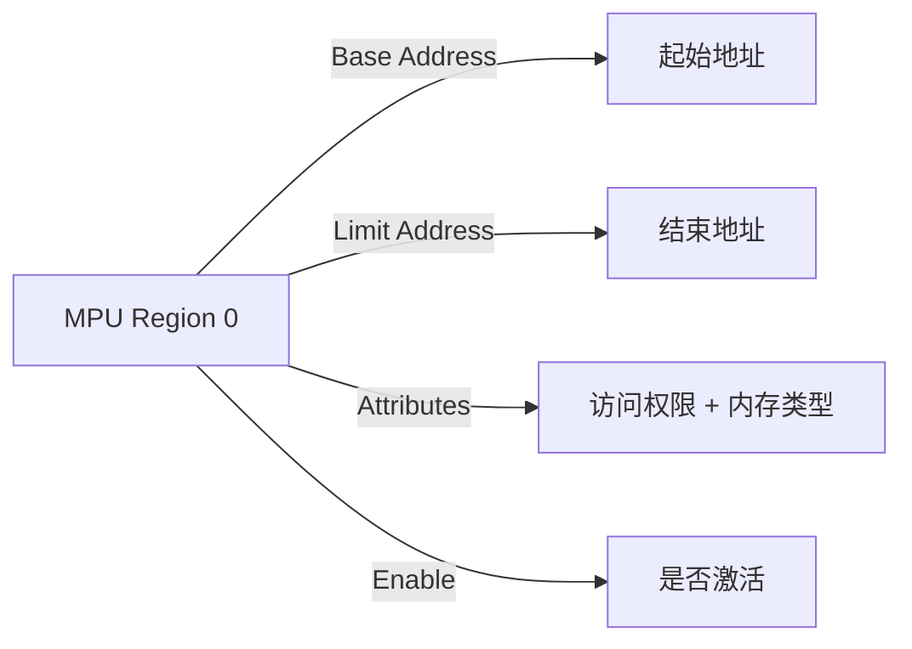

# 第九章 内存保护(MPU)介绍及应用

## 1. 内存保护（MPU）简介

内存保护单元（**Memory Protection Unit, MPU**）是 **ARM Cortex-M7** 内核提供的硬件安全机制，用于对 STM32H750VBT6 的内存区域进行**访问权限控制和属性配置**，防止软件错误（如指针越界、非法访问）或恶意代码破坏系统关键资源。MPU 是实现 **嵌入式系统可靠性、安全性和多任务隔离** 的核心技术，尤其在运行 RTOS（如 FreeRTOS）、执行安全固件更新或处理敏感数据时至关重要。

> 🔍 **核心定位**：
> 
> - **MPU ≠ 普通存储器**，而是 **内存访问的“守门人”**
> - 类似操作系统中的 **MMU（内存管理单元）**，但无虚拟地址映射功能（Cortex-M 系列为 MPU）
> - 可定义多个内存区域（Region），每个区域独立设置 **访问权限、缓存策略、执行权限**

---

### **1.1 MPU 核心特性（STM32H750VBT6）**

| **特性**    | **参数**                                 | **说明**                                  | **安全价值**      |
| --------- | -------------------------------------- | --------------------------------------- | ------------- |
| **区域数量**  | **8 个可编程区域 + 1 个默认内存映射**               | 支持重叠与优先级控制                              | 灵活划分代码/数据/外设区 |
| **区域大小**  | 32 B – 4 GB                            | 以 2^n 字节为单位（n ≥ 5）                      | 可精细控制小缓冲区     |
| **访问权限**  | 执行禁止（XN）、读写控制（PRIV/USER）               | 可设 `No Access`、`Read-Only`、`Read/Write` | 防止用户代码修改内核    |
| **内存属性**  | **Normal / Device / Strongly-ordered** | 控制缓存（Cache）、写合并（Write Combining）等行为     | 保证外设访问一致性     |
| **子区域划分** | 每个区域可分 8 个子区（Sub-region）               | 禁用部分子区实现非对齐区域                           | 节省 MPU 条目     |
| **默认映射**  | 未覆盖区域由 MPU 默认规则控制                      | 通常为 `Read/Write + XN=0`                 | 安全兜底策略        |
| **硬件触发**  | 访问违规产生 **MemManage Fault**             | 可定位非法访问地址（`MMFAR` 寄存器）                  | 调试与故障恢复       |

📌 **STM32H750VBT6 专属优势**：

- **支持 TrustZone**（部分型号），MPU 与安全状态协同工作
- **多级缓存（L1 Cache）兼容性**：MPU 可配置 `Write-back`、`Write-through` 等策略
- **高可靠性系统必备**：满足 **IEC 61508 SIL-3**、**ISO 26262 ASIL-D** 功能安全要求

---

### 1.2 MPU 工作原理详解

#### 1.2.1 内存区域（Region）结构



- **Region 配置寄存器**（共 4 个）：
  
  1. **RBAR**（Region Base Address Register）：设置起始地址
  2. **RLAR**（Region Limit Address Register）：设置区域大小与属性
  3. **RNR**（Region Number Register）：选择当前配置的 Region 编号
  4. **MAIR**（Memory Attribute Indirection Register）：定义内存类型（可选）

- **RLAR 关键位域**：
  
  - `LIMIT[31:8]`：区域上限地址（对齐到 size）
  - `ATTRS[7:0]`：属性索引 + `XN`（Execute Never）
  - `EN`：使能该区域

#### 1.2.2 访问权限模型

| **PRIV / USER** | **XN (Execute Never)** | **访问规则**          | **应用场景**      |
| --------------- | ---------------------- | ----------------- | ------------- |
| PRIV=1, USER=0  | XN=0                   | 内核可执行/读写，用户无权     | 保护内核代码        |
| PRIV=1, USER=1  | XN=0                   | 内核/用户均可执行/读写      | 共享库           |
| PRIV=1, USER=0  | XN=1                   | 内核可读写，**禁止执行**    | 堆/栈区（防代码注入）   |
| PRIV=1, USER=1  | XN=1                   | 内核/用户可读写，**禁止执行** | 外设寄存器、DMA 缓冲区 |

> ✅ **黄金规则**：
> 
> - **栈和堆必须设置 XN=1**（防缓冲区溢出执行 shellcode）
> - **只读 Flash 区设置 R/W=Read-Only**（防篡改）
> - **外设区域设置 Device 类型**（禁止缓存，确保写立即生效）

#### 1.2.3 内存类型（Memory Types）

| **类型**               | **缓存行为**                      | **典型用途**           | **性能影响** |
| -------------------- | ----------------------------- | ------------------ | -------- |
| **Normal**           | 可缓存（Write-back/Write-through） | Code, SRAM, Heap   | 高速访问     |
| **Device**           | 不可缓存，强序访问                     | 外设寄存器（如 GPIO）      | 写操作不排队   |
| **Strongly-ordered** | 严格顺序，不可缓存                     | 系统控制寄存器（NVIC, SCB） | 最高优先级    |

---

### 1.3 关键寄存器操作

#### 1.3.1 MPU 配置流程（寄存器级）

```c
// 1. 包含头文件 & 宏定义
#include "mpu_armv7.h"

// 2. 配置 MPU
void MPU_Config(void) {
    // 禁用 MPU（修改前必须先关闭）
    MPU->CTRL &= ~MPU_CTRL_ENABLE_Msk;

    // Region 0: 保护内核代码（Flash，只读执行）
    MPU->RNR  = 0;                                  // 选择 Region 0
    MPU->RBAR = (0x08000000U)                       // Flash 起始地址
             | MPU_RBAR_VALID_Msk                   // 有效标志
             | 0x0;                                 // Region Number = 0
    MPU->RLAR = (0x080FFFFFU)                       // Flash 上限（64KB）
             | MPU_RLAR_ATTRIndx(0)                 // 属性索引 0
             | MPU_RLAR_EN_Msk;                     // 使能 Region

    // Region 1: 栈区（SRAM，不可执行）
    MPU->RNR  = 1;
    MPU->RBAR = (0x20000000U)                       // SRAM 起始
             | MPU_RBAR_VALID_Msk | 1;
    MPU->RLAR = (0x20001FFFU)                       // 8KB SRAM
             | MPU_RLAR_ATTRIndx(1)
             | MPU_RLAR_EN_Msk;

    // Region 2: 外设区（禁止缓存，Device 类型）
    MPU->RNR  = 2;
    MPU->RBAR = (0x40000000U)
             | MPU_RBAR_VALID_Msk | 2;
    MPU->RLAR = (0x4FFFFFFFU)                       // AHB/APB 外设
             | MPU_RLAR_ATTRIndx(2)
             | MPU_RLAR_EN_Msk;

    // 3. 配置内存属性（MAIR，可选）
    // MAIR[0] = Normal Write-Back
    MPU->MAIR0 = (0x04 << 0) | (0x0F << 8);          // Attr0: WB, Attr1: Non-cacheable

    // 4. 使能 MPU（最后一步！）
    MPU->CTRL = MPU_CTRL_PRIVDEFENA_Msk             // 使能默认映射
             | MPU_CTRL_ENABLE_Msk;                 // 启动 MPU
}
```

#### 1.3.2 HAL 库兼容配置（使用 CMSIS）

```c
// 使用 CMSIS-MPU 封装函数（更安全）
void MPU_Config_Simplified(void) {
    MPU_Region_InitTypeDef MPU_InitStruct;

    // 禁用 MPU
    HAL_MPU_Disable();

    // Region 0: Flash (可执行，只读)
    MPU_InitStruct.Enable = MPU_REGION_ENABLE;
    MPU_InitStruct.BaseAddress = 0x08000000;
    MPU_InitStruct.Size = MPU_REGION_SIZE_64KB;
    MPU_InitStruct.AccessPermission = MPU_REGION_PRIV_RO;
    MPU_InitStruct.IsBufferable = MPU_ACCESS_NOT_BUFFERABLE;
    MPU_InitStruct.IsCacheable = MPU_ACCESS_CACHEABLE;
    MPU_InitStruct.IsShareable = MPU_ACCESS_NOT_SHAREABLE;
    MPU_InitStruct.Number = MPU_REGION_NUMBER0;
    MPU_InitStruct.TypeExtField = MPU_TEX_LEVEL1;
    MPU_InitStruct.SubRegionDisable = 0x00;
    MPU_InitStruct.DisableExec = MPU_INSTRUCTION_ACCESS_ENABLE;
    HAL_MPU_ConfigRegion(&MPU_InitStruct);

    // Region 1: SRAM (不可执行，读写)
    MPU_InitStruct.Enable = MPU_REGION_ENABLE;
    MPU_InitStruct.BaseAddress = 0x20000000;
    MPU_InitStruct.Size = MPU_REGION_SIZE_8KB;
    MPU_InitStruct.AccessPermission = MPU_REGION_FULL_ACCESS;
    MPU_InitStruct.DisableExec = MPU_INSTRUCTION_ACCESS_DISABLE; // XN=1
    MPU_InitStruct.Number = MPU_REGION_NUMBER1;
    HAL_MPU_ConfigRegion(&MPU_InitStruct);

    // Region 2: 外设 (Device 类型)
    MPU_InitStruct.Enable = MPU_REGION_ENABLE;
    MPU_InitStruct.BaseAddress = 0x40000000;
    MPU_InitStruct.Size = MPU_REGION_SIZE_256MB;
    MPU_InitStruct.AccessPermission = MPU_REGION_FULL_ACCESS;
    MPU_InitStruct.TypeExtField = MPU_TEX_LEVEL0;
    MPU_InitStruct.IsBufferable = MPU_ACCESS_BUFFERABLE;
    MPU_InitStruct.IsCacheable = MPU_ACCESS_NOT_CACHEABLE;
    MPU_InitStruct.Number = MPU_REGION_NUMBER2;
    HAL_MPU_ConfigRegion(&MPU_InitStruct);

    // 启用 MPU
    HAL_MPU_Enable(MPU_PRIVILEGED_DEFAULT);
}
```

## 2. MPU使用示例-STM32IDE

使用 STM32H7 自带的 MPU 功能，对一个特定的内存空间（数组，地址： 0X20002000）进行写访问保护。开机时，串口调试助手显示： MPU closed，表示默认是没有写保护的。按 KEY0可以往数组里面写数据，按 KEY1，可以读取数组里面的数据。按 KEY_UP 则开启 MPU 保护，此时，如果再按 KEY0 往数组写数据，就会引起 MemManage 错误，进入 MemManage_Handler中断服务函数，此时 LED1 点亮，同时打印错误信息，最后软件复位，系统重启。 LED0 用于提示程序正在运行，所有信息都是通过串口 1 输出，需要用串口调试助手查看。

### 2.1 STM32Cube配置

无需额外配置

### 2.2 用户代码

```c
#include "mpu.h"
#include "led.h"

/**
 * @brief       设置某个区域的MPU保护
 * @param       baseaddr: MPU保护区域的基址(首地址)
 * @param       size:MPU保护区域的大小(必须是32的倍数,单位为字节)
 * @param       rnum:MPU保护区编号,范围:0~7,最大支持8个保护区域
 * @param       de:禁止指令访问;0,允许指令访问;1,禁止指令访问
 * @param       ap:访问权限,访问关系如下:
 *   @arg       0,无访问（特权&用户都不可访问）
 *   @arg       1,仅支持特权读写访问
 *   @arg       2,禁止用户写访问（特权可读写访问）
 *   @arg       3,全访问（特权&用户都可访问）
 *   @arg       4,无法预测(禁止设置为4!!!)
 *   @arg       5,仅支持特权读访问
 *   @arg       6,只读（特权&用户都不可以写）
 *   @note      详见:STM32H7编程手册.pdf,4.6.6节,Table 91.
 * @param       sen:是否允许共用;0,不允许;1,允许
 * @param       cen:是否允许cache;0,不允许;1,允许
 * @param       ben:是否允许缓冲;0,不允许;1,允许
 * @retval      0, 成功; 1, 错误;
 */
uint8_t mpu_config(uint32_t baseaddr, uint32_t size, uint32_t rnum, uint8_t de, uint8_t ap, uint8_t sen, uint8_t cen, uint8_t ben)
{
	MPU_Region_InitTypeDef MPU_InitStruct = {0};
	HAL_MPU_Disable(); // 关闭MPU
	MPU_InitStruct.Enable = MPU_REGION_ENABLE;
	MPU_InitStruct.Number = rnum; // MPU保护区编号,范围:0~7,最大支持8个保护区域
	MPU_InitStruct.BaseAddress = baseaddr; // MPU保护区域的基址(首地址)
	MPU_InitStruct.Size = size; // MPU保护区域的大小(必须是32的倍数,单位为字节)
	MPU_InitStruct.SubRegionDisable = 0x00; // 子区域禁用,0x00,表示不禁用子区域
	MPU_InitStruct.TypeExtField = MPU_TEX_LEVEL0; // 内存类型,详见编程手册
	MPU_InitStruct.AccessPermission = ap; // 访问权限
	MPU_InitStruct.DisableExec = de; // 禁止指令访问;0,允许指令访问;1,禁止指令访问
	MPU_InitStruct.IsShareable = sen; // 是否允许共用;0,不允许;1,允许
	MPU_InitStruct.IsCacheable = cen; // 是否允许cache;0,不允许;1,允许
	MPU_InitStruct.IsBufferable = ben; // 是否允许缓冲;0,不允许;1,允许
	HAL_MPU_ConfigRegion(&MPU_InitStruct); // 配置MPU保护区域
	HAL_MPU_Enable(MPU_PRIVILEGED_DEFAULT); // 使能MPU
	return 0;
}

/**
 * @brief       设置需要保护的存储块
 * @note        必须对部分存储区域进行MPU保护,否则可能导致程序运行异常
 *              比如MCU屏不显示,摄像头采集数据出错等等问题
 * @param       无
 * @retval      nbytes以2为底的指数值
 */
void mpu_mem_init(void)
{
    /* 保护整个DTCM,共128K字节,允许指令访问,禁止共用,允许cache,允许缓冲 */
    mpu_config(0x20000000, MPU_REGION_SIZE_128KB, MPU_REGION_NUMBER1, MPU_INSTRUCTION_ACCESS_ENABLE,
                       MPU_REGION_FULL_ACCESS, MPU_ACCESS_NOT_SHAREABLE, MPU_ACCESS_CACHEABLE, MPU_ACCESS_BUFFERABLE);

    /* 保护整个AXI SRAM,共512K字节,允许指令访问,禁止共用,允许cache,允许缓冲 */
    mpu_config(0x24000000, MPU_REGION_SIZE_512KB,MPU_REGION_NUMBER2, MPU_INSTRUCTION_ACCESS_ENABLE,
                       MPU_REGION_FULL_ACCESS, MPU_ACCESS_NOT_SHAREABLE, MPU_ACCESS_CACHEABLE, MPU_ACCESS_BUFFERABLE);

    /* 保护整个SRAM1~SRAM3,共288K字节,允许指令访问,禁止共用,允许cache,允许缓冲 */
    mpu_config(0x30000000, MPU_REGION_SIZE_512KB,MPU_REGION_NUMBER3, MPU_INSTRUCTION_ACCESS_ENABLE,
                       MPU_REGION_FULL_ACCESS, MPU_ACCESS_NOT_SHAREABLE, MPU_ACCESS_CACHEABLE, MPU_ACCESS_BUFFERABLE);

    /* 保护整个SRAM4,共64K字节,允许指令访问,禁止共用,允许cache,允许缓冲 */
    mpu_config(0x38000000, MPU_REGION_SIZE_64KB, MPU_REGION_NUMBER4, MPU_INSTRUCTION_ACCESS_ENABLE,
                       MPU_REGION_FULL_ACCESS, MPU_ACCESS_NOT_SHAREABLE, MPU_ACCESS_CACHEABLE, MPU_ACCESS_BUFFERABLE);

    /* 保护MCU LCD屏所在的FMC区域,,共64M字节,允许指令访问,禁止共用,禁止cache,禁止缓冲 */
    mpu_config(0x60000000, MPU_REGION_SIZE_64MB, MPU_REGION_NUMBER5, MPU_INSTRUCTION_ACCESS_ENABLE,
                       MPU_REGION_FULL_ACCESS, MPU_ACCESS_NOT_SHAREABLE, MPU_ACCESS_NOT_CACHEABLE, MPU_ACCESS_NOT_BUFFERABLE);

    /* 保护SDRAM区域,共64M字节,允许指令访问,禁止共用,允许cache,允许缓冲 */
    mpu_config(0XC0000000, MPU_REGION_SIZE_64MB, MPU_REGION_NUMBER6, MPU_INSTRUCTION_ACCESS_ENABLE,
                       MPU_REGION_FULL_ACCESS, MPU_ACCESS_NOT_SHAREABLE, MPU_ACCESS_CACHEABLE, MPU_ACCESS_BUFFERABLE);

    /* 保护整个NAND FLASH区域,共256M字节,禁止指令访问,禁止共用,禁止cache,禁止缓冲 */
    mpu_config(0X80000000, MPU_REGION_SIZE_256MB, MPU_REGION_NUMBER7, MPU_INSTRUCTION_ACCESS_DISABLE,
                       MPU_REGION_FULL_ACCESS, MPU_ACCESS_NOT_SHAREABLE, MPU_ACCESS_NOT_CACHEABLE, MPU_ACCESS_NOT_BUFFERABLE);
}

/**
  * @brief This function handles Memory management fault.
  */
void MemManage_Handler(void)
{
	HAL_GPIO_WritePin(LED_RED_Port, LED_RED_Pin, RESET); //  MemManage错误处理中断
	HAL_Delay(1000);
	NVIC_SystemReset(); // 复位
}

```

```c
#include "main.h"
#include "bsp_init.h"
#include "mpu.h"
#include <stdio.h>

void SystemClock_Config(void);

// uint8_t mpudata[128] __attribute__((at(0x20002000))); // 定义一个数组,放在0x20002000地址
#define MPU_DATA_ADDR 0x20002000
uint8_t *mpudata = (uint8_t *)MPU_DATA_ADDR; // 直接将指针指向该地址

int main(void)
{
  uint8_t key_value = 0;
  uint8_t i = 0;

  HAL_Init();
  SystemClock_Config();
  bsp_init();
  while (1)
  {
	  key_value = key_scan(0);
	  if(key_value == WKUP_PRES)
	  {
		  mpu_config(0X20002000, MPU_REGION_SIZE_128B, MPU_REGION_NUMBER0, MPU_INSTRUCTION_ACCESS_ENABLE, MPU_REGION_PRIV_RO_URO,
              MPU_ACCESS_NOT_SHAREABLE, MPU_ACCESS_NOT_CACHEABLE, MPU_ACCESS_BUFFERABLE);  /* 只读,禁止共用,禁止catch,允许缓冲 */
	  }
	  else if(key_value == KEY0_PRES)
	  {
		  sprintf((char *)mpudata, "MPU test array %d", i);
	  }
	  else if(key_value == KEY1_PRES)
	  {
		  printf("mpudata = %s\r\n", mpudata);
	  }
	  else
	  {
		HAL_Delay(10);
	  }
	  i++;
	  HAL_Delay(10);
	  if(i > 20)
	  {
		  i = 0;
		  HAL_GPIO_TogglePin(LED_BLUE_Port, LED_BLUE_Pin);
	  }
  }
}

/**
  * @brief System Clock Configuration
  * @retval None
  */
void SystemClock_Config(void)
{
  RCC_OscInitTypeDef RCC_OscInitStruct = {0};
  RCC_ClkInitTypeDef RCC_ClkInitStruct = {0};

  /** Supply configuration update enable
  */
  HAL_PWREx_ConfigSupply(PWR_LDO_SUPPLY);

  /** Configure the main internal regulator output voltage
  */
  __HAL_PWR_VOLTAGESCALING_CONFIG(PWR_REGULATOR_VOLTAGE_SCALE0);

  while(!__HAL_PWR_GET_FLAG(PWR_FLAG_VOSRDY)) {}

  /** Initializes the RCC Oscillators according to the specified parameters
  * in the RCC_OscInitTypeDef structure.
  */
  RCC_OscInitStruct.OscillatorType = RCC_OSCILLATORTYPE_HSE;
  RCC_OscInitStruct.HSEState = RCC_HSE_ON;
  RCC_OscInitStruct.PLL.PLLState = RCC_PLL_ON;
  RCC_OscInitStruct.PLL.PLLSource = RCC_PLLSOURCE_HSE;
  RCC_OscInitStruct.PLL.PLLM = 2;
  RCC_OscInitStruct.PLL.PLLN = 240;
  RCC_OscInitStruct.PLL.PLLP = 2;
  RCC_OscInitStruct.PLL.PLLQ = 2;
  RCC_OscInitStruct.PLL.PLLR = 2;
  RCC_OscInitStruct.PLL.PLLRGE = RCC_PLL1VCIRANGE_2;
  RCC_OscInitStruct.PLL.PLLVCOSEL = RCC_PLL1VCOWIDE;
  RCC_OscInitStruct.PLL.PLLFRACN = 0;
  if (HAL_RCC_OscConfig(&RCC_OscInitStruct) != HAL_OK)
  {
    Error_Handler();
  }

  /** Initializes the CPU, AHB and APB buses clocks
  */
  RCC_ClkInitStruct.ClockType = RCC_CLOCKTYPE_HCLK|RCC_CLOCKTYPE_SYSCLK
                              |RCC_CLOCKTYPE_PCLK1|RCC_CLOCKTYPE_PCLK2
                              |RCC_CLOCKTYPE_D3PCLK1|RCC_CLOCKTYPE_D1PCLK1;
  RCC_ClkInitStruct.SYSCLKSource = RCC_SYSCLKSOURCE_PLLCLK;
  RCC_ClkInitStruct.SYSCLKDivider = RCC_SYSCLK_DIV1;
  RCC_ClkInitStruct.AHBCLKDivider = RCC_HCLK_DIV2;
  RCC_ClkInitStruct.APB3CLKDivider = RCC_APB3_DIV2;
  RCC_ClkInitStruct.APB1CLKDivider = RCC_APB1_DIV2;
  RCC_ClkInitStruct.APB2CLKDivider = RCC_APB2_DIV2;
  RCC_ClkInitStruct.APB4CLKDivider = RCC_APB4_DIV2;

  if (HAL_RCC_ClockConfig(&RCC_ClkInitStruct, FLASH_LATENCY_4) != HAL_OK)
  {
    Error_Handler();
  }
}


/**
  * @brief  This function is executed in case of error occurrence.
  * @retval None
  */
void Error_Handler(void)
{
  /* USER CODE BEGIN Error_Handler_Debug */
  /* User can add his own implementation to report the HAL error return state */
  __disable_irq();
  while (1)
  {
  }
  /* USER CODE END Error_Handler_Debug */
}
#ifdef USE_FULL_ASSERT
/**
  * @brief  Reports the name of the source file and the source line number
  *         where the assert_param error has occurred.
  * @param  file: pointer to the source file name
  * @param  line: assert_param error line source number
  * @retval None
  */
void assert_failed(uint8_t *file, uint32_t line)
{
  /* USER CODE BEGIN 6 */
  /* User can add his own implementation to report the file name and line number,
     ex: printf("Wrong parameters value: file %s on line %d\r\n", file, line) */
  /* USER CODE END 6 */
}
#endif /* USE_FULL_ASSERT */

```

## 3. 内存保护单元相关函数总结（HAL库）

### 3.1 初始化与配置

- `HAL_MPU_ConfigRegion(MPU_Region_InitTypeDef *MPU_Init)`  
  配置单个内存保护区域（需配合`HAL_MPU_Enable()`使用）  
  **关键前提**：
  
  - **必须在特权模式下执行**（User模式无权限）
  - **建议在系统初始化早期配置**（`main()`开头）
  - **MPU区域数量有限**（H750支持8/16个region，取决于配置）

- **`MPU_Region_InitTypeDef` 结构体成员说明**：
  
  | **成员**             | **说明** | **关键选项**                                                               | **H750特殊说明**           |
  | ------------------ | ------ | ---------------------------------------------------------------------- | ---------------------- |
  | `Enable`           | 区域使能   | `MPU_REGION_ENABLE`, `MPU_REGION_DISABLE`                              | 必须启用才生效                |
  | `Number`           | 区域编号   | `MPU_REGION_NUMBER0` 到 `MPU_REGION_NUMBER15`                           | H750最多16区域             |
  | `BaseAddress`      | 区域基地址  | 4KB对齐（低12位=0）                                                          | 如`0x20000000`          |
  | `Size`             | 区域大小   | `MPU_REGION_SIZE_4KB` 到 `MPU_REGION_SIZE_4GB`                          | `MPU_REGION_SIZE_1MB`等 |
  | `AccessPermission` | 访问权限   | `MPU_REGION_NO_ACCESS`, `MPU_REGION_PRIV_RW`, `MPU_REGION_FULL_ACCESS` | 严格权限控制                 |
  | `DisableExec`      | 指令执行   | `MPU_INSTRUCTION_ACCESS_ENABLE`, `MPU_INSTRUCTION_ACCESS_DISABLE`      | 防止代码注入                 |
  | `IsShareable`      | 可共享性   | `MPU_ACCESS_NOT_SHAREABLE`, `MPU_ACCESS_SHAREABLE`                     | 多核/外设访问                |
  | `IsCacheable`      | 可缓存    | `MPU_ACCESS_NOT_CACHEABLE`, `MPU_ACCESS_CACHEABLE`                     | 性能优化                   |
  | `IsBufferable`     | 可缓冲    | `MPU_ACCESS_NOT_BUFFERABLE`, `MPU_ACCESS_BUFFERABLE`                   | 写操作优化                  |
  | `SubRegionDisable` | 子区域禁用  | 位掩码（低8位）                                                               | 精细化分区                  |
  | `TypeExtField`     | 扩展类型   | `MPU_TEX_LEVEL0` 到 `MPU_TEX_LEVEL7`                                    | 内存类型控制                 |

- **区域大小配置**（`Size`成员）：
  
  | **宏定义**                 | **大小** | **对齐要求** | **适用场景** |
  | ----------------------- | ------ | -------- | -------- |
  | `MPU_REGION_SIZE_32B`   | 32字节   | 32B      | 精密外设寄存器  |
  | `MPU_REGION_SIZE_1KB`   | 1KB    | 1KB      | 堆栈保护     |
  | `MPU_REGION_SIZE_64KB`  | 64KB   | 64KB     | 外部SRAM   |
  | `MPU_REGION_SIZE_1MB`   | 1MB    | 1MB      | Flash代码区 |
  | `MPU_REGION_SIZE_256MB` | 256MB  | 256MB    | 外部SDRAM  |
  | `MPU_REGION_SIZE_4GB`   | 4GB    | 4GB      | 全地址空间    |

- **访问权限组合**（`AccessPermission`）：
  
  | **宏**                    | **特权模式** | **用户模式** | **安全场景** |
  | ------------------------ | -------- | -------- | -------- |
  | `MPU_REGION_NO_ACCESS`   | 无        | 无        | 禁用未使用内存  |
  | `MPU_REGION_PRIV_RW`     | R/W      | 无        | 内核数据区    |
  | `MPU_REGION_PRIV_RW_URO` | R/W      | 只读       | 共享配置数据   |
  | `MPU_REGION_FULL_ACCESS` | R/W      | R/W      | 通用内存区    |

### 3.2 MPU操作核心函数

- **基础控制函数**：
  
  | **函数**                   | **原型**                                            | **功能** | **应用场景** |
  | ------------------------ | ------------------------------------------------- | ------ | -------- |
  | `HAL_MPU_Enable()`       | `(uint32_t MPU_Control)`                          | 启用MPU  | 配置后启动    |
  | `HAL_MPU_Disable()`      | `void`                                            | 禁用MPU  | 调试阶段     |
  | `HAL_MPU_ConfigRegion()` | `(MPU_Region_InitTypeDef*)`                       | 配置单个区域 | 动态调整     |
  | `HAL_MPU_DeleteRegion()` | `(uint8_t RegionNumber)`                          | 删除区域   | 运行时修改    |
  | `HAL_MPU_GetConfig()`    | `(uint8_t RegionNumber, MPU_Region_InitTypeDef*)` | 读取配置   | 状态检查     |

- **MPU控制选项**（`HAL_MPU_Enable()`参数）：
  
  | **宏**                        | **功能**           | **H750建议** |
  | ---------------------------- | ---------------- | ---------- |
  | `MPU_PRIVILEGED_DEFAULT`     | 特权模式使用默认映射       | ✅ 推荐       |
  | `MPU_HFNMIENA`               | NMI/硬fault中启用MPU | 高可靠性系统     |
  | `MPU_PRIVILEGED_ACCESS_ONLY` | 仅特权模式可访问         | 严格安全系统     |

- **配置流程示例**：

```c
MPU_Region_InitTypeDef mpu_init = {0};

// 1. 配置SRAM区域（0x20000000, 64KB, 全访问）
mpu_init.Enable = MPU_REGION_ENABLE;
mpu_init.Number = MPU_REGION_NUMBER0;
mpu_init.BaseAddress = 0x20000000;
mpu_init.Size = MPU_REGION_SIZE_64KB;
mpu_init.AccessPermission = MPU_REGION_FULL_ACCESS;
mpu_init.IsCacheable = MPU_ACCESS_CACHEABLE;
mpu_init.IsBufferable = MPU_ACCESS_BUFFERABLE;
mpu_init.IsShareable = MPU_ACCESS_NOT_SHAREABLE;
mpu_init.DisableExec = MPU_INSTRUCTION_ACCESS_ENABLE;
HAL_MPU_ConfigRegion(&mpu_init);

// 2. 启用MPU
HAL_MPU_Enable(MPU_PRIVILEGED_DEFAULT);
```

### 3.3 高级功能与特性

- **内存类型模型**（Memory Type Model）：
  
  | **类型**               | **Cache策略** | **适用区域**    | **H750性能影响** |
  | -------------------- | ----------- | ----------- | ------------ |
  | **Normal**           | 可缓存/缓冲      | SRAM, SDRAM | 读写速度↑3-5倍    |
  | **Device**           | 强序访问        | 外设寄存器       | 防止重排序错误      |
  | **Strongly-ordered** | 绝对顺序        | 系统控制寄存器     | 必须严格顺序       |

- **子区域划分**（Sub-region Disable）：

```c
// 将1MB区域划分为8个128KB子区域
mpu_init.Size = MPU_REGION_SIZE_1MB;
mpu_init.SubRegionDisable = 0b00111111; // 禁用前6个子区域
// 实际生效：最后2个128KB区域（256KB）可访问
```

> ✅ **应用场景**：保护堆栈末尾不被越界访问

- **重叠区域优先级**：
  
  - 低编号区域优先级**高于**高编号区域
  - **配置建议**：

```c
// 区域0：外设寄存器（高优先级）
mpu_init.Number = MPU_REGION_NUMBER0;
mpu_init.BaseAddress = 0x40000000;
// ...
HAL_MPU_ConfigRegion(&mpu_init);

// 区域1：常规内存（低优先级）
mpu_init.Number = MPU_REGION_NUMBER1;
mpu_init.BaseAddress = 0x20000000;
// ...
HAL_MPU_ConfigRegion(&mpu_init);
```

- **运行时动态配置**：

```c
// 安全删除区域
HAL_MPU_DeleteRegion(MPU_REGION_NUMBER2);

// 重新配置新区域
mpu_init.Number = MPU_REGION_NUMBER2;
mpu_init.BaseAddress = 0x70000000;  // 外部SDRAM
mpu_init.Size = MPU_REGION_SIZE_256MB;
HAL_MPU_ConfigRegion(&mpu_init);
```

### 3.4 使用示例（完整流程）

#### 示例1：基础MPU配置（保护SRAM和外设）

```c
void MPU_Config(void)
{
    MPU_Region_InitTypeDef mpu_init = {0};

    // 1. 禁用MPU（安全配置前）
    HAL_MPU_Disable();

    // 2. 配置DTCM RAM（0x20000000, 64KB, 全访问）
    mpu_init.Enable = MPU_REGION_ENABLE;
    mpu_init.Number = MPU_REGION_NUMBER0;
    mpu_init.BaseAddress = 0x20000000;
    mpu_init.Size = MPU_REGION_SIZE_64KB;
    mpu_init.AccessPermission = MPU_REGION_FULL_ACCESS;
    mpu_init.IsCacheable = MPU_ACCESS_CACHEABLE;
    mpu_init.IsBufferable = MPU_ACCESS_BUFFERABLE;
    mpu_init.DisableExec = MPU_INSTRUCTION_ACCESS_ENABLE;
    HAL_MPU_ConfigRegion(&mpu_init);

    // 3. 配置外设区域（0x40000000, 1MB, 特权只写）
    mpu_init.Number = MPU_REGION_NUMBER1;
    mpu_init.BaseAddress = 0x40000000;
    mpu_init.Size = MPU_REGION_SIZE_1MB;
    mpu_init.AccessPermission = MPU_REGION_PRIV_RW;
    mpu_init.TypeExtField = MPU_TEX_LEVEL1;  // Device类型
    mpu_init.IsShareable = MPU_ACCESS_SHAREABLE;
    mpu_init.DisableExec = MPU_INSTRUCTION_ACCESS_DISABLE;
    HAL_MPU_ConfigRegion(&mpu_init);

    // 4. 配置Flash区域（0x08000000, 2MB, 特权只读）
    mpu_init.Number = MPU_REGION_NUMBER2;
    mpu_init.BaseAddress = 0x08000000;
    mpu_init.Size = MPU_REGION_SIZE_2MB;
    mpu_init.AccessPermission = MPU_REGION_PRIV_RO;
    mpu_init.IsCacheable = MPU_ACCESS_CACHEABLE;
    mpu_init.DisableExec = MPU_INSTRUCTION_ACCESS_ENABLE;
    HAL_MPU_ConfigRegion(&mpu_init);

    // 5. 启用MPU
    HAL_MPU_Enable(MPU_PRIVILEGED_DEFAULT);
}
```

#### 示例2：堆栈保护（防止溢出）

```c
#define STACK_START    0x20008000
#define STACK_SIZE     0x2000  // 8KB
#define GUARD_SIZE     0x100   // 256字节

void Configure_Stack_Protection(void)
{
    MPU_Region_InitTypeDef mpu_init = {0};

    // 1. 配置堆栈主区域（可读写）
    mpu_init.Enable = MPU_REGION_ENABLE;
    mpu_init.Number = MPU_REGION_NUMBER3;
    mpu_init.BaseAddress = STACK_START;
    mpu_init.Size = MPU_REGION_SIZE_8KB;
    mpu_init.AccessPermission = MPU_REGION_PRIV_RW;
    mpu_init.IsCacheable = MPU_ACCESS_CACHEABLE;
    HAL_MPU_ConfigRegion(&mpu_init);

    // 2. 配置堆栈保护页（无访问权限）
    mpu_init.Number = MPU_REGION_NUMBER4;
    mpu_init.BaseAddress = STACK_START + STACK_SIZE;
    mpu_init.Size = MPU_REGION_SIZE_256B;
    mpu_init.AccessPermission = MPU_REGION_NO_ACCESS;  // 关键：禁止访问
    mpu_init.TypeExtField = MPU_TEX_LEVEL0;
    HAL_MPU_ConfigRegion(&mpu_init);
}
```

## 4. 关键注意事项

1. **对齐要求严格**：
   
   - `BaseAddress`必须与`Size`对齐：
     
     - 4KB区域 → 地址低12位=0
     - 1MB区域 → 地址低20位=0
   
   - **错误示例**：
     
     ```c
     mpu_init.BaseAddress = 0x20000100;  // 未对齐
     mpu_init.Size = MPU_REGION_SIZE_4KB; // → 配置失败
     ```

2. **HardFault陷阱**：
   
   - MPU违规触发**MemManage Fault**（非普通HardFault）
   
   - 故障诊断：
     
     ```c
     void MemManage_Handler(void)
     {
         uint32_t mmfar = SCB->MMFAR;  // 故障地址
         uint32_t cfsr = SCB->CFSR;    // 故障状态
         if(cfsr & SCB_CFSR_MSTKERR_Msk) {
             // 堆栈访问错误
         }
         while(1);
     }
     ```

3. **Cache一致性问题**：
   
   - 启用Cache的区域需：  
     ✅ 在DMA传输前后调用`SCB_CleanInvalidateDCache()`  
     ✅ 外设寄存器区域禁用Cache
   - **H750数据Cache**：64KB，需考虑Cache行大小（32字节）

4. **多核系统考虑**（H750多核型号）：
   
   - MPU配置**独立于每个核心**
   - 共享内存需：
     - 配置为`MPU_ACCESS_SHAREABLE`
     - 使用`__DMB()`内存屏障保证顺序

5. **调试模式影响**：
   
   - JTAG调试器可能绕过MPU保护
   - 生产环境需：
   
   ```c
   // 检测调试状态
   if(__HAL_RCC_GET_FLAG(RCC_FLAG_DUALBANK) == RESET) {
       // 非调试模式，启用严格MPU
       Strict_MPU_Config();
   }
   ```

### 4.1 H750特有优化技巧

| **场景**      | **解决方案**                | **安全收益** | **实现要点**                                     |
| ----------- | ----------------------- | -------- | -------------------------------------------- |
| **DMA安全传输** | 外部RAM配置为`Write-Through` | 防止数据丢失   | `IsCacheable=1, IsBufferable=0`              |
| **代码保护**    | Flash区域禁用执行             | 防止代码注入   | `DisableExec=MPU_INSTRUCTION_ACCESS_DISABLE` |
| **实时性保证**   | 关键外设区域禁用Cache           | 访问延迟确定   | `IsCacheable=MPU_ACCESS_NOT_CACHEABLE`       |
| **内存加密**    | TCM区域配置为`No Access`用户模式 | 防止非法读取   | `AccessPermission=MPU_REGION_PRIV_RW`        |

> **避坑指南**：
> 
> 1. **启动顺序陷阱**：
>    
>    - 必须在`main()`早期配置MPU
>    - 在`SystemInit()`后但**任何动态内存分配前**
> 
> 2. **区域数量限制**：
>    
>    - H750的MPU通常支持8-16区域
>    - 优先保护：
>      1. 外设寄存器
>      2. 内核数据区
>      3. 堆栈保护页
>      4. 外部存储器
> 
> 3. **性能影响评估**：
>    
>    - 启用Cache：SRAM访问速度提升3-5倍
>    
>    - 禁用Buffer：写操作延迟增加，但一致性提高
>    
>    - **平衡策略**：
>      
>      ```c
>      // 高性能数据区
>      IsCacheable=1, IsBufferable=1  
>      // 安全关键区  
>      IsCacheable=0, IsBufferable=0  
>      ```
> 
> 4. **H750 TCM特殊性**：
>    
>    - ITCM（指令TCM）：0x00000000, 64KB
>    - DTCM（数据TCM）：0x20000000, 64KB
>    - **建议配置**:
>    
>    ```c
>    mpu_init.BaseAddress = 0x20000000;  // DTCM
>    mpu_init.Size = MPU_REGION_SIZE_64KB;
>    mpu_init.TypeExtField = MPU_TEX_LEVEL0; // Normal类型
>    ```

### 4.2 **MPU故障类型与处理**

| **故障类型**       | **CFSR位**            | **触发条件**    | **处理建议** |
| -------------- | -------------------- | ----------- | -------- |
| **Address**    | `MMFARVALID`         | 访问未映射地址     | 检查指针是否越界 |
| **Permission** | `MPU violation`      | 权限不足（如写只读区） | 检查访问模式   |
| **Exec**       | `Instruction access` | 执行禁止区域代码    | 检查跳转地址   |
| **Stack**      | `MSTKERR`            | 堆栈访问违规      | 增加堆栈大小   |

> **重要提示**：
> 
> - MPU是**最后一道内存安全防线**，不能替代软件边界检查
> - 配置后必须充分测试，避免合法访问被阻断
> - 安全系统建议启用`MPU_HFNMIENA`，确保故障处理不被绕过
> - **永远不要**在中断服务程序中修改MPU配置（可能引发不可预测行为）


---


